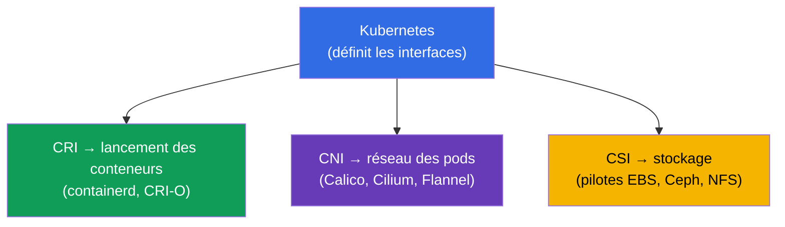
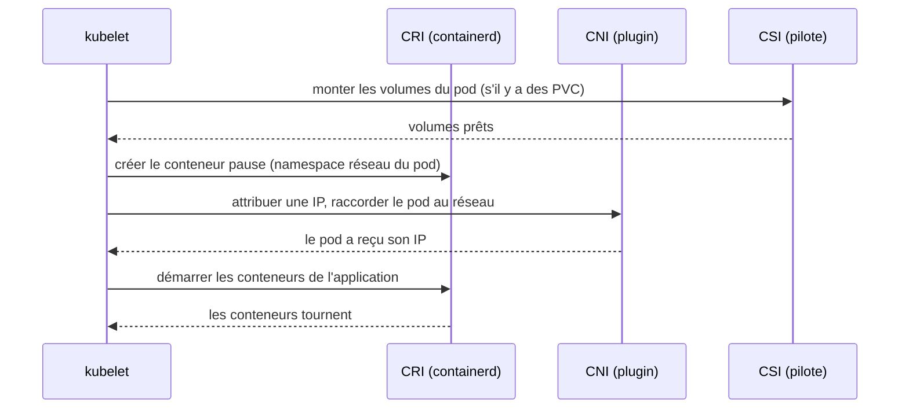
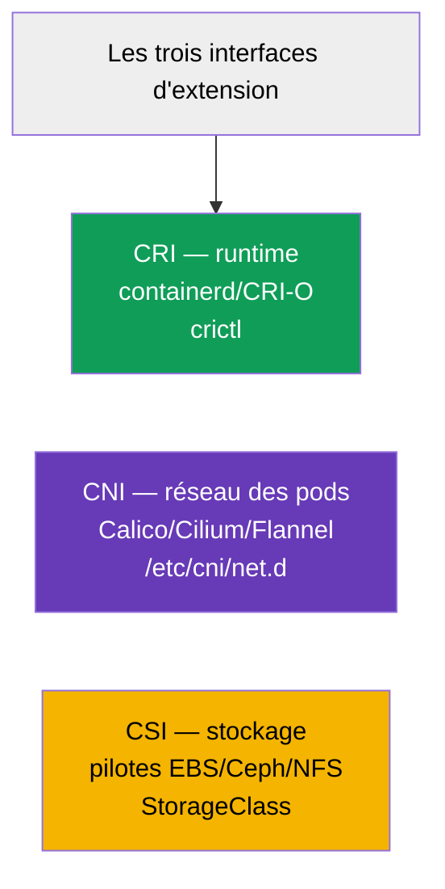

[Русская версия](ru.md) · [Eng version](README.md) · [Versión en español](es.md) · [Deutsche Version](de.md) · [ქართული ვერსია](ge.md) · [繁體中文版](tw.md) · [日本語版](jp.md)

# Chapitre 40. Interfaces d'extension : CNI, CSI, CRI

> 🟦 **Chapitre pour le CKA** (domaine Cluster Architecture, Installation & Configuration).
>
> **Ce qui suit.** Nous avons croisé ces sigles tout au long du cours : CRI (runtime,
> chapitre 2), CNI (réseau des pods, chapitre 30), CSI (stockage, chapitre 26). Il est temps de les
> rassembler en une seule image. Tous les trois sont des **interfaces standard** par lesquelles
> Kubernetes délègue un travail concret à des plugins interchangeables, tout en restant indépendant de
> l'implémentation. Comprendre cette architecture est la base du fonctionnement du cluster et de son
> troubleshooting.

## 40.1. L'idée générale : Kubernetes ne fait pas tout lui-même

Principe architectural clé : Kubernetes n'est **pas lié** à un runtime, un réseau ou un stockage
particulier. Il définit une **interface** (un contrat), et le travail concret est réalisé par un plugin
enfichable. On peut ainsi changer d'implémentation sans changer Kubernetes.



Les trois interfaces principales - les « trois C » : **C**RI (runtime), **C**NI (network),
**C**SI (storage). Chacune s'occupe de sa couche.

## 40.2. CRI - Container Runtime Interface

**CRI** est l'interface entre kubelet et l'environnement d'exécution des conteneurs. Par son
intermédiaire, kubelet ordonne « démarre/arrête un conteneur » sans connaître les détails du runtime
concret.


- **containerd** - aujourd'hui le runtime principal.
- **CRI-O** - un runtime léger conçu spécialement pour Kubernetes.
- **Docker** comme runtime a été retiré (dockershim supprimé en 1.24) - les images Docker fonctionnent,
  mais via containerd.

Diagnostic des conteneurs sur un nœud - avec l'utilitaire `crictl` (qui parle directement à CRI) :

```bash
crictl ps                    # conteneurs en cours d'exécution sur le nœud
crictl images                # images
crictl logs <container-id>   # logs du conteneur
```

`crictl` est irremplaçable quand kubelet ou l'API ne fonctionnent pas : il voit les conteneurs au
niveau du runtime du nœud, en contournant le cluster (chapitre 45).

## 40.3. CNI - Container Network Interface

**CNI** est l'interface du réseau des pods (en détail au chapitre 30). Lorsque kubelet crée un pod, il
demande via CNI au plugin d'attribuer une IP au pod et de le raccorder au réseau du cluster.


- La configuration CNI sur le nœud se trouve dans `/etc/cni/net.d/`.
- Sans CNI, les nœuds sont `NotReady` et les pods ne démarrent pas (chapitres 30, 35).
- Certains CNI (Cilium, Calico) implémentent en plus NetworkPolicy (chapitre 34).

## 40.4. CSI - Container Storage Interface

**CSI** est l'interface du stockage (en détail au chapitre 26). Par son intermédiaire, Kubernetes crée,
attache et monte des volumes de n'importe quel stockage sans connaître ses détails.


- Le `provisioner` d'une StorageClass (chapitre 26) - c'est justement le pilote CSI.
- Un unique mécanisme PV/PVC fonctionne avec EBS, GCE PD, Ceph, NFS, etc. - grâce à CSI.

```bash
kubectl get csidrivers        # pilotes CSI installés
```

## 40.5. Comment les trois interfaces travaillent ensemble au démarrage d'un pod

Rassemblons le tableau : ce qui se passe sur le nœud quand kubelet démarre un pod - les trois
interfaces entrent en jeu l'une après l'autre.



Chaque interface fait sa part : CSI - le stockage, CNI - le réseau, CRI - le lancement des conteneurs
proprement dit. kubelet dirige l'orchestre. Si l'un de ces éléments est cassé, le pod reste bloqué à
l'étape correspondante (`ContainerCreating`, pas d'IP, volumes non montés) - et c'est un indice sur
l'endroit où chercher le problème.

## 40.6. Tableau récapitulatif



| Interface | Responsable de | Exemples | Où chercher |
|-----------|-------------|---------|-----------|
| **CRI** | lancement des conteneurs | containerd, CRI-O | `crictl`, `systemctl status containerd` |
| **CNI** | réseau des pods | Calico, Cilium, Flannel | `/etc/cni/net.d/`, pods CNI dans kube-system |
| **CSI** | stockage | pilotes EBS/GCE/Ceph/NFS | `kubectl get csidrivers`, StorageClass |

Il existe d'autres interfaces d'extension (CRI/CNI/CSI sont les principales pour le CKA), par exemple
les device plugins pour les GPU, mais il n'est pas obligatoire de les connaître.

## 40.7. Comment cela s'applique en production

- **Le choix des implémentations - le socle du cluster.** CRI (généralement containerd), CNI
  (Calico/Cilium selon les besoins en politiques et en performance), CSI (le pilote correspondant au
  stockage utilisé) - des décisions de base lors de la construction d'un cluster, qui influencent tout
  le reste.
- **Mise à jour des plugins indépendamment de Kubernetes.** Grâce aux interfaces CNI/CSI/CRI, les
  plugins se mettent à jour indépendamment de la version du cluster - c'est une souplesse, mais aussi
  une responsabilité (compatibilité des versions de pilotes).
- **Troubleshooting par couches.** Savoir quelle interface est responsable de quoi accélère l'analyse :
  un pod en `ContainerCreating` sans IP - on regarde CNI ; des volumes qui ne se montent pas - CSI ; des
  conteneurs qui ne démarrent pas sur le nœud - CRI (`crictl`, containerd). Cela met de l'ordre dans le
  problème.
- **crictl comme outil de secours.** Quand kubelet/apiserver ne fonctionnent pas, `crictl` reste le
  moyen de voir et d'analyser les conteneurs directement sur le nœud - une compétence clé du diagnostic
  des nœuds (chapitre 45).
- **Cilium/eBPF comme tendance.** Beaucoup de clusters de production choisissent Cilium (CNI basé sur
  eBPF) non seulement pour le réseau, mais aussi pour les NetworkPolicy L7 et le remplacement de
  kube-proxy - un exemple de la façon dont le CNI détermine les capacités du cluster.

## 40.8. Mini-glossaire

- **CRI (Container Runtime Interface)** - interface kubelet ↔ environnement d'exécution.
- **containerd / CRI-O** - implémentations de CRI (runtimes).
- **crictl** - CLI pour travailler avec les conteneurs via CRI sur le nœud.
- **CNI (Container Network Interface)** - interface du réseau des pods.
- **Calico / Cilium / Flannel** - implémentations de CNI.
- **CSI (Container Storage Interface)** - interface du stockage.
- **Pilote CSI** - implémentation de CSI (le provisioner d'une StorageClass).
- **Conteneur pause** - conteneur de service qui maintient le namespace réseau du pod.

## 40.9. Bilan du chapitre

- Kubernetes n'est pas lié à un runtime/réseau/stockage - il définit des interfaces, et le travail est
  fait par des plugins interchangeables.
- CRI - interface de lancement des conteneurs (containerd, CRI-O) ; diagnostic sur le nœud - `crictl` ;
  Docker comme runtime a été retiré.
- CNI - réseau des pods (Calico, Cilium, Flannel) ; config dans `/etc/cni/net.d/` ; sans lui, les nœuds
  sont NotReady.
- CSI - stockage (pilotes EBS/Ceph/NFS) ; le provisioner d'une StorageClass, c'est le pilote CSI.
- Au démarrage d'un pod, les interfaces entrent en jeu l'une après l'autre : CSI (volumes) → CNI
  (réseau) → CRI (conteneurs) ; un blocage indique la couche en cause.
- Les plugins se mettent à jour indépendamment de Kubernetes ; connaître les couches accélère le
  troubleshooting.

## 40.10. À quoi cela sert : à l'examen et dans le travail réel

**À l'examen (CKA).** Le programme exige explicitement de « comprendre les interfaces d'extension (CNI,
CSI, CRI) ». Les exercices directs sont peu nombreux, mais la compréhension est nécessaire pour
l'installation du cluster (chapitre 35) et le troubleshooting : `crictl` pour diagnostiquer les
conteneurs, reconnaître les problèmes CNI (pas d'IP) et CSI (volumes). Cela relie entre eux les
chapitres 2, 26 et 30.

**Dans le travail réel.** Le choix de CRI/CNI/CSI constitue les décisions architecturales de base d'un
cluster, qui déterminent le réseau, le stockage et les capacités (politiques, performance). Comprendre
les couches est la base du diagnostic : d'après le symptôme du pod, on sait tout de suite quelle
interface vérifier. `crictl` est un outil irremplaçable en cas de défaillance de la couche de gestion
du nœud.

## 40.11. Questions d'auto-évaluation

1. Pourquoi Kubernetes définit-il des interfaces au lieu d'implémenter lui-même le runtime/réseau/stockage ?
2. Qu'est-ce que CRI et en quoi `crictl` est-il utile en cas de défaillance de kubelet/apiserver ?
3. Que fait CNI et qu'advient-il des nœuds sans lui ?
4. Qu'est-ce que CSI et quel est son lien avec le provisioner d'une StorageClass ?
5. Dans quel ordre CSI/CNI/CRI entrent-ils en jeu au démarrage d'un pod ?
6. À quels symptômes d'un pod reconnaît-on quelle interface pose problème ?
7. Pourquoi la possibilité de mettre à jour les plugins indépendamment de Kubernetes est-elle à la fois
   un atout et un risque ?

## Pratique

Nous avons vu comment se branchent le runtime, le réseau et le stockage. Au chapitre 41, nous passerons
à l'extension de l'API elle-même - CRD et opérateurs. Les interfaces d'extension apparaissent dans tous
les TP d'administration (surtout lors de l'installation du cluster et du CNI).

🧪 TP 118 (dont l'inspection de CNI/Pod CIDR) : [tasks/cka/labs/118](../../labs/118/README_FR.MD)

🧪 TP 123 (installation de CNI depuis zéro) : [tasks/cka/labs/123](../../labs/123/README_FR.MD)

---
[Sommaire](../README_FR.md) · [Chapitre 39](../39/fr.md) · [Chapitre 41](../41/fr.md)
