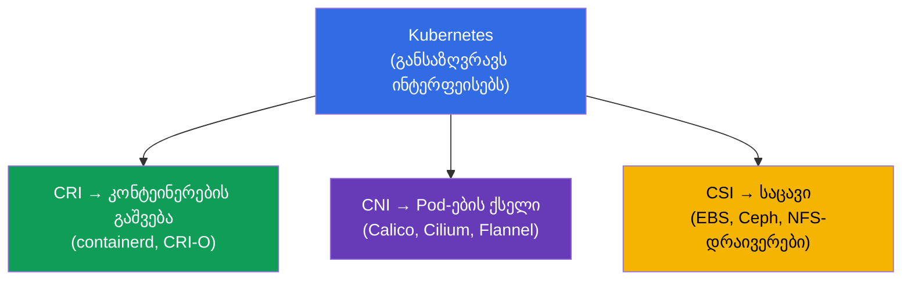
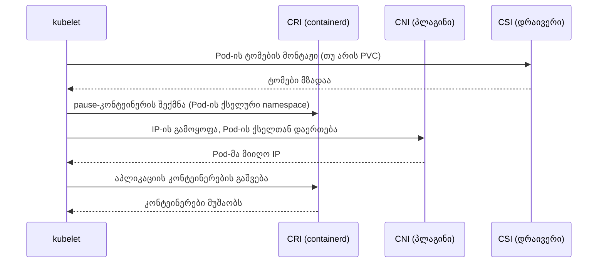
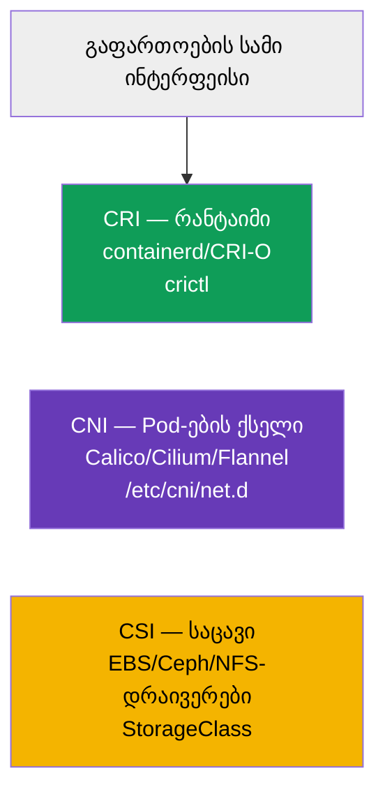

[Русская версия](ru.md) · [Eng version](README.md) · [Versión en español](es.md) · [Version française](fr.md) · [Deutsche Version](de.md) · [繁體中文版](tw.md) · [日本語版](jp.md)

# თავი 40. გაფართოების ინტერფეისები: CNI, CSI, CRI

> 🟦 **თავი CKA-სთვის** (დომენი Cluster Architecture, Installation & Configuration).
>
> **რა იქნება შემდეგ.** ეს აბრევიატურები მთელი კურსის მანძილზე ვხვდებოდით: CRI (შესრულების
> გარემო, თავი 2), CNI (Pod-ების ქსელი, თავი 30), CSI (საცავი, თავი 26). დროა ისინი ერთ
> სურათში შევკრიბოთ. სამივე - **სტანდარტული ინტერფეისია**, რომლის მეშვეობით Kubernetes
> კონკრეტულ სამუშაოს ცვლად პლაგინებს გადასცემს და თავად რეალიზაციისგან დამოუკიდებელი რჩება.
> ამ არქიტექტურის გაგება - კლასტერის მოწყობისა და მისი troubleshooting-ის საფუძველია.

## 40.1. ზოგადი იდეა: Kubernetes ყველაფერს თავად არ აკეთებს

მთავარი არქიტექტურული პრინციპი: Kubernetes **არ არის მიბმული** კონკრეტულ რანტაიმზე, ქსელზე
ან საცავზე. ის განსაზღვრავს **ინტერფეისს** (კონტრაქტს), ხოლო კონკრეტულ სამუშაოს ასრულებს
მისაერთებელი პლაგინი. ასე შეიძლება რეალიზაციის შეცვლა Kubernetes-ის შეცვლის გარეშე.



სამი მთავარი ინტერფეისი - „სამი C“: **C**RI (runtime), **C**NI (network), **C**SI (storage).
თითოეული საკუთარ შრეზეა პასუხისმგებელი.

## 40.2. CRI - Container Runtime Interface

**CRI** - ინტერფეისი kubelet-სა და კონტეინერების შესრულების გარემოს შორის. მისი მეშვეობით kubelet
ბრძანებს „გაუშვი/გააჩერე კონტეინერი“ კონკრეტული რანტაიმის დეტალების ცოდნის გარეშე.


- **containerd** - ამჟამად ძირითადი რანტაიმი.
- **CRI-O** - მსუბუქი რანტაიმი სპეციალურად Kubernetes-ისთვის.
- **Docker** როგორც რანტაიმი მოხსნილია (dockershim წაშლილია 1.24-ში) - Docker-ის იმიჯები მუშაობს, მაგრამ
  containerd-ის გავლით.

კონტეინერების დიაგნოსტიკა ნოუდზე - უტილიტა `crictl`-ით (მუშაობს CRI-სთან პირდაპირ):

```bash
crictl ps                    # გაშვებული კონტეინერები ნოუდზე
crictl images                # იმიჯები
crictl logs <container-id>   # კონტეინერის ლოგები
```

`crictl` შეუცვლელია, როცა kubelet ან API არ მუშაობს: ის ხედავს კონტეინერებს ნოუდის
რანტაიმის დონეზე, კლასტერის გვერდის ავლით (თავი 45).

## 40.3. CNI - Container Network Interface

**CNI** - Pod-ების ქსელის ინტერფეისი (დეტალურად თავ 30-ში). როცა kubelet ქმნის Pod-ს, ის CNI-ის
მეშვეობით სთხოვს პლაგინს, გამოუყოს Pod-ს IP და დააერთოს ის კლასტერის ქსელს.


- CNI-ის კონფიგურაცია ნოუდზე - `/etc/cni/net.d/`-ში.
- CNI-ის გარეშე ნოუდები `NotReady`-ია, Pod-ები არ ეშვება (თავი 30, 35).
- ზოგიერთი CNI (Cilium, Calico) დამატებით ახორციელებს NetworkPolicy-ს (თავი 34).

## 40.4. CSI - Container Storage Interface

**CSI** - საცავის ინტერფეისი (დეტალურად თავ 26-ში). მისი მეშვეობით Kubernetes ქმნის,
აერთებს და მონტაჟს უკეთებს ნებისმიერი საცავის ტომებს ისე, რომ მისი დეტალები არ იცის.


- `provisioner` StorageClass-ში (თავი 26) - ეს სწორედ CSI-დრაივერია.
- PV/PVC-ის ერთი მექანიზმი მუშაობს EBS-თან, GCE PD-თან, Ceph-თან, NFS-თან და სხვ. - CSI-ის წყალობით.

```bash
kubectl get csidrivers        # დაყენებული CSI-დრაივერები
```

## 40.5. როგორ მუშაობს სამივე ინტერფეისი ერთად Pod-ის გაშვებისას

შევკრიბოთ სურათი: რა ხდება ნოუდზე, როცა kubelet Pod-ს ზრდის - სამი ინტერფეისი
რიგრიგობით ერთვება.



თითოეული ინტერფეისი აკეთებს თავის ნაწილს: CSI - საცავი, CNI - ქსელი, CRI - თავად კონტეინერების
გაშვება. kubelet დირიჟორობს. თუ რომელიმე მათგანი გატეხილია, Pod ჭედავს
შესაბამის ნაბიჯზე (`ContainerCreating`, არ არის IP, ტომები არ მონტაჟდება) - და ეს მინიშნებაა,
სად ვეძებოთ პრობლემა.

## 40.6. შემაჯამებელი ცხრილი



| ინტერფეისი | რაზეა პასუხისმგებელი | მაგალითები | სად ვიყუროთ |
|-----------|-------------|---------|-----------|
| **CRI** | კონტეინერების გაშვება | containerd, CRI-O | `crictl`, `systemctl status containerd` |
| **CNI** | Pod-ების ქსელი | Calico, Cilium, Flannel | `/etc/cni/net.d/`, CNI-ის Pod-ები kube-system-ში |
| **CSI** | საცავი | EBS/GCE/Ceph/NFS-დრაივერები | `kubectl get csidrivers`, StorageClass |

არსებობს გაფართოების სხვა ინტერფეისებიც (CRI/CNI/CSI - ძირითადია CKA-სთვის), მაგალითად
device plugins GPU-სთვის, მაგრამ მათი ცოდნა სავალდებულო არ არის.

## 40.7. როგორ იყენებენ ამას პროდაქშენში

- **რეალიზაციების არჩევა - კლასტერის ფუნდამენტია.** CRI (ჩვეულებრივ containerd), CNI (Calico/Cilium
  პოლიტიკებისა და წარმადობის საჭიროებების მიხედვით), CSI (დრაივერი გამოყენებული საცავისთვის) -
  საბაზისო გადაწყვეტილებებია კლასტერის აგებისას, რომლებიც ყველაფერ დანარჩენზე მოქმედებს.
- **პლაგინების განახლება Kubernetes-ისგან დამოუკიდებლად.** CNI/CSI/CRI ინტერფეისების წყალობით
  პლაგინებს კლასტერის ვერსიისგან დამოუკიდებლად აახლებენ - ეს მოქნილობაა, მაგრამ ასევე პასუხისმგებლობა
  (დრაივერების ვერსიების თავსებადობა).
- **Troubleshooting შრეების მიხედვით.** იმის ცოდნა, რომელი ინტერფეისი რაზეა პასუხისმგებელი, აჩქარებს გარჩევას:
  Pod `ContainerCreating` IP-ის გარეშე - ვუყურებთ CNI-ს; ტომები არ მონტაჟდება - CSI; კონტეინერები არ
  ეშვება ნოუდზე - CRI (`crictl`, containerd). ეს პრობლემას თაროებზე ალაგებს.
- **crictl როგორც სასწრაფო ინსტრუმენტი.** როცა kubelet/apiserver არ მუშაობს, `crictl`
  რჩება საშუალებად, ვნახოთ და გავარჩიოთ კონტეინერები პირდაპირ ნოუდზე - ნოუდების დიაგნოსტიკის
  საკვანძო უნარია (თავი 45).
- **Cilium/eBPF როგორც ტრენდი.** ბევრი პროდაქშენ კლასტერი ირჩევს Cilium-ს (CNI eBPF-ზე) არა
  მხოლოდ ქსელისთვის, არამედ L7 NetworkPolicy-სთვისა და kube-proxy-ის ჩანაცვლებისთვის - მაგალითი იმისა, როგორ
  განსაზღვრავს CNI კლასტერის შესაძლებლობებს.

## 40.8. მინი-ლექსიკონი

- **CRI (Container Runtime Interface)** - ინტერფეისი kubelet ↔ შესრულების გარემო.
- **containerd / CRI-O** - CRI-ის რეალიზაციები (რანტაიმები).
- **crictl** - CLI ნოუდზე კონტეინერებთან CRI-ის მეშვეობით მუშაობისთვის.
- **CNI (Container Network Interface)** - Pod-ების ქსელის ინტერფეისი.
- **Calico / Cilium / Flannel** - CNI-ის რეალიზაციები.
- **CSI (Container Storage Interface)** - საცავის ინტერფეისი.
- **CSI-დრაივერი** - CSI-ის რეალიზაცია (provisioner StorageClass-ში).
- **pause-კონტეინერი** - სამსახურებრივი კონტეინერი, რომელიც Pod-ის ქსელურ namespace-ს იჭერს.

## 40.9. თავის შეჯამება

- Kubernetes არ არის მიბმული რანტაიმზე/ქსელზე/საცავზე - ის ინტერფეისებს განსაზღვრავს, ხოლო სამუშაოს ასრულებს
  ცვლადი პლაგინები.
- CRI - კონტეინერების გაშვების ინტერფეისი (containerd, CRI-O); დიაგნოსტიკა ნოუდზე - `crictl`;
  Docker როგორც რანტაიმი მოხსნილია.
- CNI - Pod-ების ქსელი (Calico, Cilium, Flannel); კონფიგი `/etc/cni/net.d/`-ში; მის გარეშე ნოუდები
  NotReady-ია.
- CSI - საცავი (EBS/Ceph/NFS-ის დრაივერები); provisioner StorageClass-ში - ეს CSI-დრაივერია.
- Pod-ის გაშვებისას ინტერფეისები რიგრიგობით ერთვება: CSI (ტომები) → CNI (ქსელი) → CRI
  (კონტეინერები); ჭედვა პრობლემის შრეზე მიუთითებს.
- პლაგინები Kubernetes-ისგან დამოუკიდებლად ახლდება; შრეების ცოდნა აჩქარებს troubleshooting-ს.

## 40.10. როგორ გამოგადგებათ: გამოცდაზე და რეალურ სამუშაოში

**გამოცდაზე (CKA).** პროგრამა პირდაპირ მოითხოვს „გაფართოების ინტერფეისების (CNI, CSI,
CRI) გაგებას“. პირდაპირი დავალებები ბევრი არ არის, მაგრამ გაგება საჭიროა კლასტერის დაყენებისთვის (თავი 35) და
troubleshooting-ისთვის: `crictl` კონტეინერების დიაგნოსტიკისთვის, CNI-ის (არ არის
IP) და CSI-ის (ტომები) პრობლემების ამოცნობა. ეს ერთად კრავს თავებს 2, 26, 30.

**რეალურ სამუშაოში.** CRI/CNI/CSI-ის არჩევა - კლასტერის საბაზისო არქიტექტურული გადაწყვეტილებებია,
რომლებიც განსაზღვრავს ქსელს, საცავს და შესაძლებლობებს (პოლიტიკები, წარმადობა). შრეების გაგება
- დიაგნოსტიკის საფუძველია: Pod-ის სიმპტომით მაშინვე ჩანს, რომელი ინტერფეისი უნდა შემოწმდეს.
`crictl` - შეუცვლელი ინსტრუმენტია ნოუდის მმართველი შრის მწყობრიდან გამოსვლისას.

## 40.11. თვითშემოწმების კითხვები

1. რატომ განსაზღვრავს Kubernetes ინტერფეისებს და თავად არ ახორციელებს რანტაიმს/ქსელს/საცავს?
2. რა არის CRI და რითი არის სასარგებლო `crictl` kubelet/apiserver-ის მწყობრიდან გამოსვლისას?
3. რას აკეთებს CNI და რა მოუვა ნოუდებს მის გარეშე?
4. რა არის CSI და როგორ არის დაკავშირებული StorageClass-ის provisioner-თან?
5. რა თანმიმდევრობით ერთვება CSI/CNI/CRI Pod-ის გაშვებისას?
6. რომელი სიმპტომებით მივხვდებით Pod-ზე, რომელი ინტერფეისი ხარვეზობს?
7. რატომ არის პლაგინების Kubernetes-ისგან ცალკე განახლების შესაძლებლობა ერთდროულად პლიუსიც და
   რისკიც?

## პრაქტიკა

გავარჩიეთ, როგორ ერთვება რანტაიმი, ქსელი და საცავი. თავ 41-ში გადავალთ თავად API-ის
გაფართოებაზე - CRD და ოპერატორები. გაფართოების ინტერფეისები ჩნდება ადმინისტრირების ყველა
ლაბორატორიულში (განსაკუთრებით კლასტერისა და CNI-ის დაყენებისას).

🧪 ლაბი 118 (მათ შორის CNI/Pod CIDR-ის ინსპექცია): [tasks/cka/labs/118](../../labs/118/README_GE.MD)

🧪 ლაბი 123 (CNI-ის დაყენება ნულიდან): [tasks/cka/labs/123](../../labs/123/README_GE.MD)

---
[სარჩევი](../README_GE.md) · [თავი 39](../39/ge.md) · [თავი 41](../41/ge.md)
