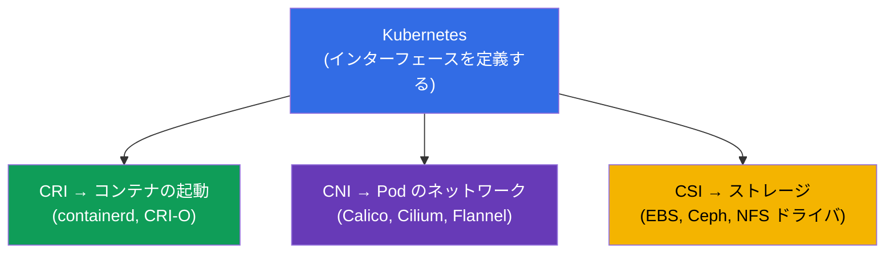
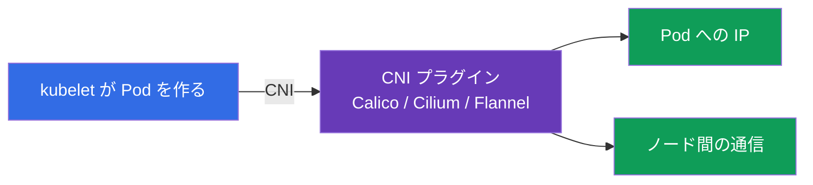
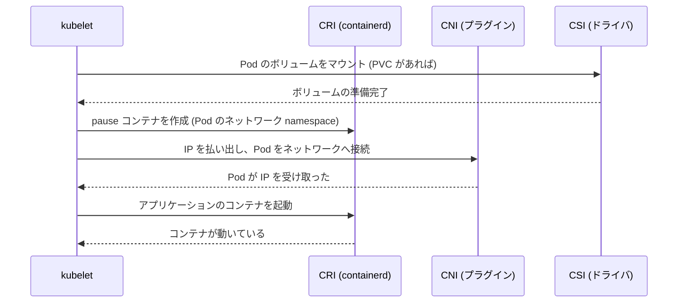
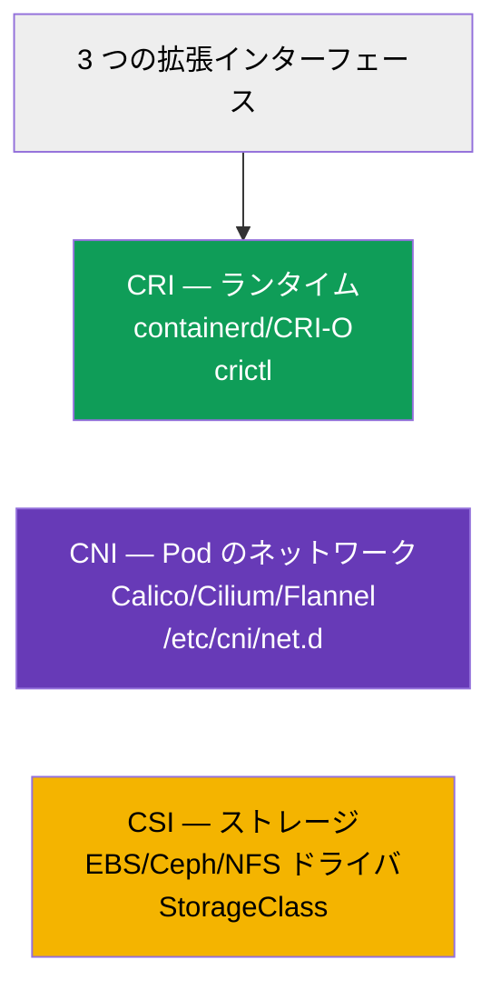

[Русская версия](ru.md) · [Eng version](README.md) · [Versión en español](es.md) · [Version française](fr.md) · [Deutsche Version](de.md) · [ქართული ვერსია](ge.md) · [繁體中文版](tw.md)

# 第 40 章。拡張インターフェース：CNI、CSI、CRI

> 🟦 **CKA 向けの章**（領域 Cluster Architecture, Installation & Configuration）。
>
> **次に来るもの。** これらの略語はコース全体で出てきました：CRI（コンテナ実行環境、
> 第 2 章）、CNI（Pod のネットワーク、第 30 章）、CSI（ストレージ、第 26 章）。そろそろ
> 1 枚の絵にまとめましょう。3 つはすべて **標準インターフェース** で、Kubernetes は
> それを通して具体的な作業を差し替え可能なプラグインへ委譲し、実装から独立したまま
> でいられます。このアーキテクチャの理解は、クラスタの構造と troubleshooting の土台です。

## 40.1. 全体の考え方：Kubernetes はすべてを自分でやらない

鍵となるアーキテクチャの原則：Kubernetes は具体的なランタイム、ネットワーク、ストレージに
**縛られていません**。**インターフェース**（契約）を定義し、具体的な作業は差し込まれた
プラグインが行います。こうして Kubernetes を変えずに実装を差し替えられます。



3 つの主要インターフェース - 「3 つの C」：**C**RI (runtime)、**C**NI (network)、**C**SI (storage)。
それぞれが自分の層を担当します。

## 40.2. CRI - Container Runtime Interface

**CRI** とは、kubelet とコンテナ実行環境のあいだのインターフェースです。これを通して kubelet は
具体的なランタイムの詳細を知らずに「コンテナを起動せよ/停止せよ」と指示します。


- **containerd** - 現在の主流ランタイム。
- **CRI-O** - Kubernetes 専用の軽量ランタイム。
- ランタイムとしての **Docker** は取り除かれました（dockershim は 1.24 で削除）- Docker
  イメージは動きますが、containerd を通して動きます。

ノード上のコンテナの診断は `crictl` ユーティリティで行います（CRI と直接やり取りします）：

```bash
crictl ps                    # ノード上で動いているコンテナ
crictl images                # イメージ
crictl logs <container-id>   # コンテナのログ
```

`crictl` は kubelet や API が動かないときに欠かせません：クラスタを介さず、ノードの
ランタイムのレベルでコンテナを見られます（第 45 章）。

## 40.3. CNI - Container Network Interface

**CNI** とは Pod のネットワークのインターフェースです（詳しくは第 30 章）。kubelet が Pod を
作るとき、CNI を通してプラグインに Pod への IP の払い出しとクラスタネットワークへの接続を
依頼します。



- ノード上の CNI の設定は `/etc/cni/net.d/` にあります。
- CNI がなければノードは `NotReady` で、Pod は起動しません（第 30 章、第 35 章）。
- 一部の CNI (Cilium、Calico) は追加で NetworkPolicy も実装します（第 34 章）。

## 40.4. CSI - Container Storage Interface

**CSI** とはストレージのインターフェースです（詳しくは第 26 章）。これを通して Kubernetes は
あらゆるストレージのボリュームを、その詳細を知らずに作成・接続・マウントします。


- StorageClass の `provisioner`（第 26 章）- これがまさに CSI ドライバです。
- PV/PVC という 1 つの仕組みが EBS、GCE PD、Ceph、NFS などで動くのは、CSI のおかげです。

```bash
kubectl get csidrivers        # インストール済みの CSI ドライバ
```

## 40.5. Pod の起動時に 3 つのインターフェースがどう連携するか

絵をまとめましょう：kubelet が Pod を立ち上げるときノード上で何が起こるのか - 3 つの
インターフェースが順番に働きます。



各インターフェースが自分の担当分をこなします：CSI はストレージ、CNI はネットワーク、CRI は
まさにコンテナの起動です。kubelet が指揮します。このどれかが壊れていると、Pod は対応する
ステップで止まります（`ContainerCreating`、IP がない、ボリュームがマウントされない）- そして
それが、どこに問題を探せばよいかのヒントになります。

## 40.6. まとめの表



| インターフェース | 何を担当するか | 例 | どこを見るか |
|-----------|-------------|---------|-----------|
| **CRI** | コンテナの起動 | containerd, CRI-O | `crictl`、`systemctl status containerd` |
| **CNI** | Pod のネットワーク | Calico, Cilium, Flannel | `/etc/cni/net.d/`、kube-system の CNI Pod |
| **CSI** | ストレージ | EBS/GCE/Ceph/NFS ドライバ | `kubectl get csidrivers`、StorageClass |

拡張インターフェースは他にもあります (CRI/CNI/CSI が CKA の主要なもの)。たとえば GPU 向けの
device plugins ですが、それらは知らなくても構いません。

## 40.7. 本番環境でこれをどう使うか

- **実装の選択はクラスタの土台。** CRI（通常は containerd）、CNI（ポリシーと性能の要件に
  合わせて Calico/Cilium）、CSI（使うストレージ向けのドライバ）- これらはクラスタを構築する
  ときの基本的な決定で、他のすべてに影響します。
- **プラグインを Kubernetes と別に更新する。** CNI/CSI/CRI というインターフェースのおかげで
  プラグインはクラスタのバージョンとは独立に更新されます - これは柔軟性ですが、同時に責任でも
  あります（ドライバのバージョン互換性）。
- **層ごとの troubleshooting。** どのインターフェースが何を担当するかを知っていると調査が
  速くなります：Pod が `ContainerCreating` で IP がない - CNI を見ます；ボリュームが
  マウントされない - CSI；ノード上でコンテナが起動しない - CRI (`crictl`、containerd)。これで
  問題が棚に整理されます。
- **緊急時の道具としての crictl。** kubelet/apiserver が動かないとき、`crictl` はノード上で
  直接コンテナを見て調べるための手段として残ります - ノード診断の要となるスキルです（第 45 章）。
- **トレンドとしての Cilium/eBPF。** 多くの本番クラスタが Cilium (eBPF ベースの CNI) を
  選ぶのは、ネットワークのためだけでなく、L7 の NetworkPolicy と kube-proxy の置き換えの
  ためでもあります - CNI がクラスタの能力を決める一例です。

## 40.8. ミニ用語集

- **CRI (Container Runtime Interface)** - kubelet ↔ 実行環境のインターフェース。
- **containerd / CRI-O** - CRI の実装（ランタイム）。
- **crictl** - ノード上で CRI 経由でコンテナを扱うための CLI。
- **CNI (Container Network Interface)** - Pod のネットワークのインターフェース。
- **Calico / Cilium / Flannel** - CNI の実装。
- **CSI (Container Storage Interface)** - ストレージのインターフェース。
- **CSI ドライバ** - CSI の実装（StorageClass の provisioner）。
- **pause コンテナ** - Pod のネットワーク namespace を保持する補助コンテナ。

## 40.9. 本章のまとめ

- Kubernetes はランタイム/ネットワーク/ストレージに縛られていません - インターフェースを
  定め、作業は差し替え可能なプラグインが行います。
- CRI はコンテナ起動のインターフェース (containerd、CRI-O)；ノード上の診断は `crictl`；
  ランタイムとしての Docker は取り除かれました。
- CNI は Pod のネットワーク (Calico、Cilium、Flannel)；設定は `/etc/cni/net.d/`；これが
  なければノードは NotReady。
- CSI はストレージ (EBS/Ceph/NFS のドライバ)；StorageClass の provisioner が CSI ドライバです。
- Pod の起動時にインターフェースは順番に働きます：CSI（ボリューム）→ CNI（ネットワーク）→ CRI
  （コンテナ）；止まった場所が問題の層を指し示します。
- プラグインは Kubernetes とは独立に更新されます；層を知っていることが troubleshooting を
  速くします。

## 40.10. これがどう役に立つか：試験と実際の仕事で

**試験では (CKA)。** 出題範囲は「拡張インターフェース (CNI、CSI、CRI) を理解すること」を
はっきり求めています。直接の問題は多くありませんが、クラスタのインストール（第 35 章）と
troubleshooting のために理解が必要です：コンテナ診断のための `crictl`、CNI の問題（IP が
ない）と CSI の問題（ボリューム）の見分け。これが第 2 章、第 26 章、第 30 章を 1 つに結びます。

**実際の仕事では。** CRI/CNI/CSI の選択はクラスタの基本的なアーキテクチャ決定で、
ネットワーク、ストレージ、能力（ポリシー、性能）を決めます。層の理解は診断の土台です：
Pod の症状から、どのインターフェースを確認すべきかがすぐ分かります。`crictl` はノードの
管理層が落ちたときに欠かせない道具です。

## 40.11. 自己チェックの質問

1. なぜ Kubernetes はインターフェースを定めるだけで、ランタイム/ネットワーク/ストレージを自分で実装しないのですか？
2. CRI とは何で、kubelet/apiserver が落ちたときに `crictl` はなぜ役に立つのですか？
3. CNI は何をしますか。そしてそれがないとノードはどうなりますか？
4. CSI とは何で、StorageClass の provisioner とどう関係しますか？
5. Pod の起動時に CSI/CNI/CRI はどの順番で働きますか？
6. Pod のどんな症状から、どのインターフェースが不調なのか分かりますか？
7. なぜプラグインを Kubernetes と別に更新できることは、利点でありリスクでもあるのですか？

## 演習

ランタイム、ネットワーク、ストレージがどう接続されるかを分解しました。第 41 章では API 自体の
拡張 - CRD とオペレーター - へ進みます。拡張インターフェースは管理系のすべてのラボで顔を
出します（とくにクラスタと CNI のインストール時に）。

🧪 ラボ 118（CNI/Pod CIDR の調査を含む）: [tasks/cka/labs/118](../../labs/118/README_JP.MD)

🧪 ラボ 123（CNI をゼロからインストール）: [tasks/cka/labs/123](../../labs/123/README_JP.MD)

---
[目次](../README_JP.md) · [第 39 章](../39/jp.md) · [第 41 章](../41/jp.md)
