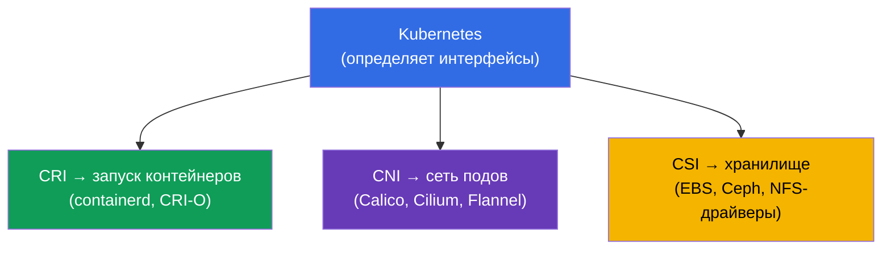
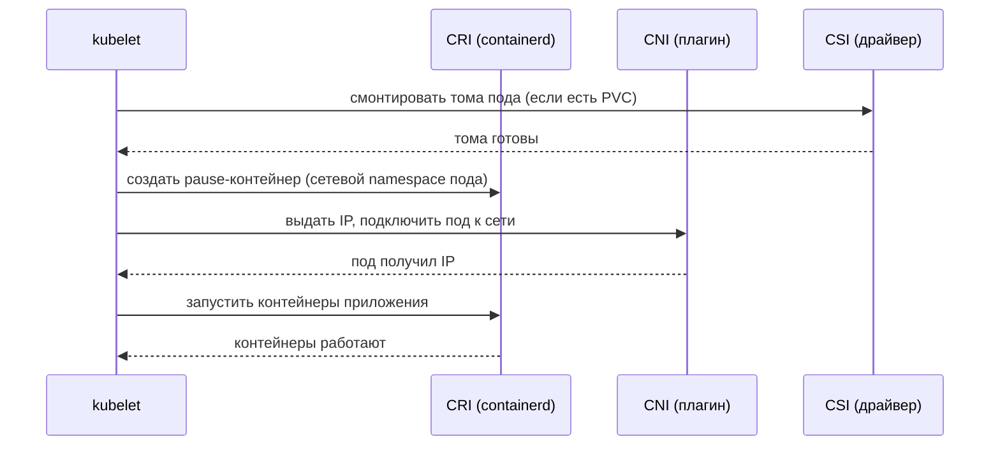
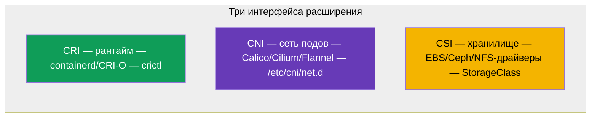

# Глава 40. Интерфейсы расширения: CNI, CSI, CRI

> 🟦 **Глава для CKA** (домен Cluster Architecture, Installation & Configuration).
>
> **Что дальше.** Мы встречали эти аббревиатуры по всему курсу: CRI (среда исполнения,
> глава 2), CNI (сеть подов, глава 30), CSI (хранилище, глава 26). Пора собрать их в
> одну картину. Все три - это **стандартные интерфейсы**, через которые Kubernetes
> делегирует конкретную работу сменным плагинам, оставаясь независимым от реализации.
> Понимание этой архитектуры - основа устройства кластера и его troubleshooting.

## 40.1. Общая идея: Kubernetes не делает всё сам

Ключевой архитектурный принцип: Kubernetes **не привязан** к конкретному рантайму, сети
или хранилищу. Он определяет **интерфейс** (контракт), а конкретную работу выполняет
подключаемый плагин. Так можно менять реализацию, не меняя Kubernetes.



Три главных интерфейса - «три C»: **C**RI (runtime), **C**NI (network), **C**SI (storage).
Каждый отвечает за свой слой.

## 40.2. CRI - Container Runtime Interface

**CRI** - интерфейс между kubelet и средой исполнения контейнеров. Через него kubelet
командует «запусти/останови контейнер», не зная деталей конкретного рантайма.


- **containerd** - сейчас основной рантайм.
- **CRI-O** - лёгкий рантайм специально для Kubernetes.
- **Docker** как рантайм убран (dockershim удалён в 1.24) - Docker-образы работают, но
  через containerd.

Диагностика контейнеров на ноде - утилитой `crictl` (работает с CRI напрямую):

```bash
crictl ps                    # запущенные контейнеры на ноде
crictl images                # образы
crictl logs <container-id>   # логи контейнера
```

`crictl` незаменим, когда kubelet или API не работают: он видит контейнеры на уровне
рантайма ноды, минуя кластер (глава 45).

## 40.3. CNI - Container Network Interface

**CNI** - интерфейс сети подов (подробно в главе 30). Когда kubelet создаёт под, он через
CNI просит плагин выдать поду IP и подключить его к сети кластера.


- Конфигурация CNI на ноде - в `/etc/cni/net.d/`.
- Без CNI ноды `NotReady`, поды не стартуют (глава 30, 35).
- Некоторые CNI (Cilium, Calico) дополнительно реализуют NetworkPolicy (глава 34).

## 40.4. CSI - Container Storage Interface

**CSI** - интерфейс хранилища (подробно в главе 26). Через него Kubernetes создаёт,
подключает и монтирует тома любого хранилища, не зная его деталей.


- `provisioner` в StorageClass (глава 26) - это и есть CSI-драйвер.
- Один механизм PV/PVC работает с EBS, GCE PD, Ceph, NFS и др. - благодаря CSI.

```bash
kubectl get csidrivers        # установленные CSI-драйверы
```

## 40.5. Как три интерфейса работают вместе при запуске пода

Соберём картину: что происходит на ноде, когда kubelet поднимает под - три интерфейса
включаются по очереди.



Каждый интерфейс делает свою часть: CSI - хранилище, CNI - сеть, CRI - собственно запуск
контейнеров. kubelet дирижирует. Если что-то из этого сломано, под застревает на
соответствующем шаге (`ContainerCreating`, нет IP, тома не монтируются) - и это подсказка,
где искать проблему.

## 40.6. Сводная таблица



| Интерфейс | Отвечает за | Примеры | Где искать |
|-----------|-------------|---------|-----------|
| **CRI** | запуск контейнеров | containerd, CRI-O | `crictl`, `systemctl status containerd` |
| **CNI** | сеть подов | Calico, Cilium, Flannel | `/etc/cni/net.d/`, поды CNI в kube-system |
| **CSI** | хранилище | EBS/GCE/Ceph/NFS-драйверы | `kubectl get csidrivers`, StorageClass |

Есть и другие интерфейсы расширения (CRI/CNI/CSI - основные для CKA), например
device plugins для GPU, но их знать необязательно.

## 40.7. Как это применяют в продакшене

- **Выбор реализаций - фундамент кластера.** CRI (обычно containerd), CNI (Calico/Cilium
  под нужды политик и производительности), CSI (драйвер под используемое хранилище) -
  базовые решения при построении кластера, влияющие на всё остальное.
- **Обновление плагинов отдельно от Kubernetes.** Благодаря интерфейсам CNI/CSI/CRI
  плагины обновляют независимо от версии кластера - это гибкость, но и ответственность
  (совместимость версий драйверов).
- **Troubleshooting по слоям.** Знание, какой интерфейс за что отвечает, ускоряет разбор:
  под `ContainerCreating` без IP - смотрим CNI; тома не монтируются - CSI; контейнеры не
  стартуют на ноде - CRI (`crictl`, containerd). Это раскладывает проблему по полочкам.
- **crictl как аварийный инструмент.** Когда kubelet/apiserver не работают, `crictl`
  остаётся способом увидеть и разобрать контейнеры прямо на ноде - ключевой навык
  диагностики нод (глава 45).
- **Cilium/eBPF как тренд.** Многие продовые кластеры выбирают Cilium (CNI на eBPF) не
  только за сеть, но и за NetworkPolicy L7 и замену kube-proxy - пример того, как CNI
  определяет возможности кластера.

## 40.8. Мини-глоссарий

- **CRI (Container Runtime Interface)** - интерфейс kubelet ↔ среда исполнения.
- **containerd / CRI-O** - реализации CRI (рантаймы).
- **crictl** - CLI для работы с контейнерами через CRI на ноде.
- **CNI (Container Network Interface)** - интерфейс сети подов.
- **Calico / Cilium / Flannel** - реализации CNI.
- **CSI (Container Storage Interface)** - интерфейс хранилища.
- **CSI-драйвер** - реализация CSI (provisioner в StorageClass).
- **pause-контейнер** - служебный контейнер, держащий сетевой namespace пода.

## 40.9. Итоги главы

- Kubernetes не привязан к рантайму/сети/хранилищу - он задаёт интерфейсы, а работу делают
  сменные плагины.
- CRI - интерфейс запуска контейнеров (containerd, CRI-O); диагностика на ноде - `crictl`;
  Docker как рантайм убран.
- CNI - сеть подов (Calico, Cilium, Flannel); конфиг в `/etc/cni/net.d/`; без него ноды
  NotReady.
- CSI - хранилище (драйверы EBS/Ceph/NFS); provisioner в StorageClass - это CSI-драйвер.
- При запуске пода интерфейсы включаются по очереди: CSI (тома) → CNI (сеть) → CRI
  (контейнеры); застревание указывает на слой проблемы.
- Плагины обновляются независимо от Kubernetes; знание слоёв ускоряет troubleshooting.

## 40.10. Как это пригодится: на экзамене и в реальной работе

**На экзамене (CKA).** Программа прямо требует «понимать интерфейсы расширения (CNI, CSI,
CRI)». Прямых заданий немного, но понимание нужно для установки кластера (глава 35) и
troubleshooting: `crictl` для диагностики контейнеров, распознавание проблем CNI (нет
IP) и CSI (тома). Это связывает воедино главы 2, 26, 30.

**В реальной работе.** Выбор CRI/CNI/CSI - базовые архитектурные решения кластера,
определяющие сеть, хранилище и возможности (политики, производительность). Понимание
слоёв - основа диагностики: по симптому пода сразу ясно, какой интерфейс проверять.
`crictl` - незаменимый инструмент при отказе управляющего слоя ноды.

## 40.11. Вопросы для самопроверки

1. Почему Kubernetes определяет интерфейсы, а не реализует рантайм/сеть/хранилище сам?
2. Что такое CRI и чем `crictl` полезен при отказе kubelet/apiserver?
3. Что делает CNI и что будет с нодами без него?
4. Что такое CSI и как он связан с provisioner в StorageClass?
5. В каком порядке включаются CSI/CNI/CRI при запуске пода?
6. По каким симптомам пода понять, какой интерфейс барахлит?
7. Почему возможность обновлять плагины отдельно от Kubernetes - это плюс и риск
   одновременно?

## Практика

Мы разобрали, как подключаются рантайм, сеть и хранилище. В главе 41 перейдём к расширению
самого API - CRD и операторам. Интерфейсы расширения проявляются во всех лабах по
администрированию (особенно при установке кластера и CNI).

🧪 Лаба 118 (в т.ч. инспекция CNI/Pod CIDR): [tasks/cka/labs/118](../../labs/118/README_RU.MD)

🧪 Лаба 123 (установка CNI с нуля): [tasks/cka/labs/123](../../labs/123/README_RU.MD)

---
[Оглавление](../README_RU.md) · [Глава 39](../39/ru.md) · [Глава 41](../41/ru.md)
