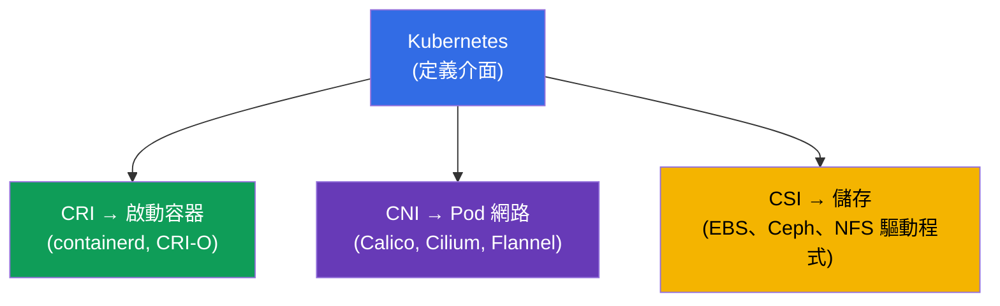
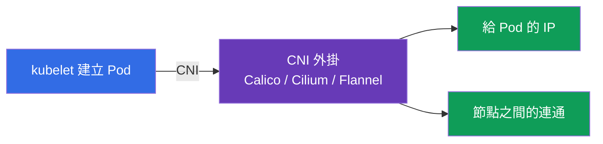
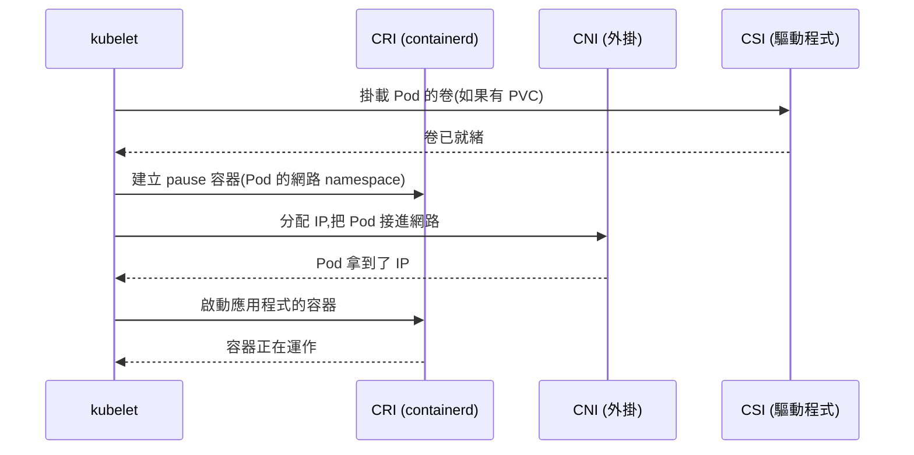
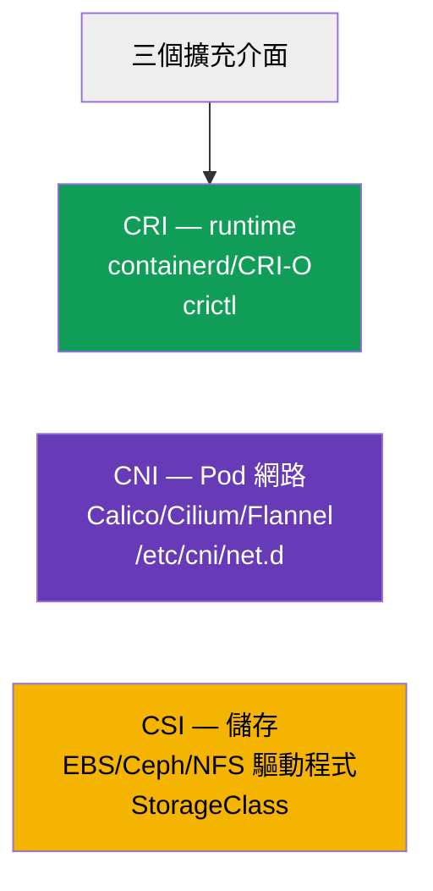

[Русская версия](ru.md) · [Eng version](README.md) · [Versión en español](es.md) · [Version française](fr.md) · [Deutsche Version](de.md) · [ქართული ვერსია](ge.md) · [日本語版](jp.md)

# 第 40 章。擴充介面:CNI、CSI、CRI

> 🟦 **CKA 章節**(領域 Cluster Architecture, Installation & Configuration)。
>
> **接下來是什麼。** 這些縮寫我們在整個課程裡都遇過:CRI(容器 runtime,
> 第 2 章)、CNI(Pod 網路,第 30 章)、CSI(儲存,第 26 章)。是時候把它們拼成
> 一張圖了。這三者都是 **標準介面**,Kubernetes 透過它們把具體的工作
> 委派給可替換的外掛,自己則保持與實作無關。
> 理解這套架構 - 就是理解叢集構造與其 troubleshooting 的基礎。

## 40.1. 總體想法:Kubernetes 不是什麼都自己做

關鍵的架構原則:Kubernetes **不綁定** 特定的 runtime、網路
或儲存。它定義 **介面**(合約),具體的工作則由
可插拔的外掛完成。這樣就能在不改動 Kubernetes 的情況下換掉實作。



三個主要介面 - 「三個 C」:**C**RI(runtime)、**C**NI(網路)、**C**SI(儲存)。
每一個都負責自己的那一層。

## 40.2. CRI - Container Runtime Interface

**CRI** - kubelet 與容器執行環境之間的介面。kubelet 透過它
下令「啟動/停止容器」,而不需要知道特定 runtime 的細節。


- **containerd** - 目前的主流 runtime。
- **CRI-O** - 專為 Kubernetes 設計的輕量 runtime。
- **Docker** 作為 runtime 已被移除(dockershim 在 1.24 中刪除)- Docker 映像仍可運作,
  但是透過 containerd。

節點上容器的診斷 - 用 `crictl` 工具(它直接與 CRI 對話):

```bash
crictl ps                    # 節點上正在執行的容器
crictl images                # 映像
crictl logs <container-id>   # 容器的日誌
```

當 kubelet 或 API 不能用時,`crictl` 無可取代:它在節點 runtime 的層級
看見容器,繞過整個叢集(第 45 章)。

## 40.3. CNI - Container Network Interface

**CNI** - Pod 網路的介面(第 30 章詳述)。kubelet 建立 Pod 時,會透過
CNI 請外掛給 Pod 一個 IP,並把它接進叢集網路。



- 節點上 CNI 的設定 - 在 `/etc/cni/net.d/`。
- 沒有 CNI 節點就是 `NotReady`,Pod 起不來(第 30、35 章)。
- 某些 CNI(Cilium、Calico)還額外實作 NetworkPolicy(第 34 章)。

## 40.4. CSI - Container Storage Interface

**CSI** - 儲存的介面(第 26 章詳述)。Kubernetes 透過它建立、
掛接並掛載任何儲存的卷,而不需要知道它的細節。


- StorageClass 裡的 `provisioner`(第 26 章)- 那就是 CSI 驅動程式。
- 同一套 PV/PVC 機制能配合 EBS、GCE PD、Ceph、NFS 等等 - 全靠 CSI。

```bash
kubectl get csidrivers        # 已安裝的 CSI 驅動程式
```

## 40.5. 啟動 Pod 時三個介面如何一起運作

把整張圖拼起來:kubelet 拉起 Pod 時節點上發生了什麼 - 三個介面
會依序登場。



每個介面各做一部分:CSI - 儲存,CNI - 網路,CRI - 真正啟動
容器。kubelet 負責指揮。如果其中有東西壞了,Pod 就會卡在
對應的步驟上(`ContainerCreating`、沒有 IP、卷掛不上)- 而這正是提示,
告訴你該去哪裡找問題。

## 40.6. 匯總表



| 介面 | 負責什麼 | 例子 | 去哪裡看 |
|-----------|-------------|---------|-----------|
| **CRI** | 啟動容器 | containerd, CRI-O | `crictl`、`systemctl status containerd` |
| **CNI** | Pod 網路 | Calico, Cilium, Flannel | `/etc/cni/net.d/`、kube-system 裡的 CNI Pod |
| **CSI** | 儲存 | EBS/GCE/Ceph/NFS 驅動程式 | `kubectl get csidrivers`、StorageClass |

還有其他的擴充介面(CRI/CNI/CSI 是 CKA 的主要內容),例如
給 GPU 用的 device plugins,但那些不一定要會。

## 40.7. 生產環境怎麼用

- **選擇實作 - 叢集的地基。** CRI(通常是 containerd)、CNI(按政策與效能
  需求選 Calico/Cilium)、CSI(配合所用儲存的驅動程式)-
  都是建置叢集時的基礎決策,會影響其他所有東西。
- **外掛與 Kubernetes 分開升級。** 有了 CNI/CSI/CRI 這些介面,
  外掛可以獨立於叢集版本升級 - 這是彈性,但也是責任
  (驅動程式的版本相容性)。
- **按層排錯。** 知道哪個介面負責什麼,能加快分析:
  Pod 卡在 `ContainerCreating` 又沒有 IP - 看 CNI;卷掛不上 - CSI;節點上容器
  起不來 - CRI(`crictl`、containerd)。這樣就把問題分門別類了。
- **crictl 作為救援工具。** 當 kubelet/apiserver 不能用時,`crictl`
  仍然是直接在節點上檢視與拆解容器的辦法 - 這是節點診斷的
  關鍵技能(第 45 章)。
- **Cilium/eBPF 是趨勢。** 很多生產叢集選 Cilium(基於 eBPF 的 CNI)不
  只是為了網路,還為了 L7 的 NetworkPolicy 與取代 kube-proxy - 這是 CNI
  決定叢集能力的一個例子。

## 40.8. 迷你詞彙表

- **CRI (Container Runtime Interface)** - kubelet ↔ 容器執行環境的介面。
- **containerd / CRI-O** - CRI 的實作(runtime)。
- **crictl** - 在節點上透過 CRI 操作容器的 CLI。
- **CNI (Container Network Interface)** - Pod 網路的介面。
- **Calico / Cilium / Flannel** - CNI 的實作。
- **CSI (Container Storage Interface)** - 儲存的介面。
- **CSI 驅動程式** - CSI 的實作(StorageClass 裡的 provisioner)。
- **pause 容器** - 持有 Pod 網路 namespace 的服務容器。

## 40.9. 本章總結

- Kubernetes 不綁定 runtime/網路/儲存 - 它訂出介面,工作由
  可替換的外掛去做。
- CRI - 啟動容器的介面(containerd、CRI-O);節點上的診斷 - `crictl`;
  Docker 作為 runtime 已被移除。
- CNI - Pod 網路(Calico、Cilium、Flannel);設定在 `/etc/cni/net.d/`;沒有它節點就
  NotReady。
- CSI - 儲存(EBS/Ceph/NFS 驅動程式);StorageClass 裡的 provisioner 就是 CSI 驅動程式。
- 啟動 Pod 時介面依序登場:CSI(卷)→ CNI(網路)→ CRI
  (容器);卡在哪裡就指出問題在哪一層。
- 外掛獨立於 Kubernetes 升級;懂得分層能加快 troubleshooting。

## 40.10. 這些在哪裡用得上:考試與實際工作

**在考試中(CKA)。** 大綱直接要求「理解擴充介面(CNI、CSI、
CRI)」。直接的題目不多,但安裝叢集(第 35 章)與 troubleshooting 都需要這份理解:
用 `crictl` 診斷容器、辨識 CNI 的問題(沒有
IP)與 CSI 的問題(卷)。這把第 2、26、30 章串成一體。

**在實際工作中。** 選擇 CRI/CNI/CSI - 是叢集的基礎架構決策,
決定了網路、儲存與能力(政策、效能)。理解
分層 - 是診斷的基礎:從 Pod 的症狀馬上就知道該檢查哪個介面。
`crictl` - 節點管理層失效時無可取代的工具。

## 40.11. 自我檢查問題

1. 為什麼 Kubernetes 定義介面,而不自己實作 runtime/網路/儲存?
2. 什麼是 CRI,kubelet/apiserver 失效時 `crictl` 有什麼用?
3. CNI 做什麼,沒有它節點會怎樣?
4. 什麼是 CSI,它和 StorageClass 裡的 provisioner 有什麼關係?
5. 啟動 Pod 時 CSI/CNI/CRI 以什麼順序登場?
6. 從 Pod 的哪些症狀可以判斷是哪個介面出問題?
7. 為什麼「外掛可以與 Kubernetes 分開升級」同時是優點也是風險?

## 實踐

我們拆解了 runtime、網路與儲存是怎麼接上的。第 41 章要進到擴充
API 本身 - CRD 與 operator。擴充介面會出現在所有管理類的
實驗中(特別是安裝叢集與 CNI 的時候)。

🧪 實驗 118(其中包含 CNI/Pod CIDR 的檢視):[tasks/cka/labs/118](../../labs/118/README_TW.MD)

🧪 實驗 123(從零安裝 CNI):[tasks/cka/labs/123](../../labs/123/README_TW.MD)

---
[目錄](../README_TW.md) · [第 39 章](../39/tw.md) · [第 41 章](../41/tw.md)
