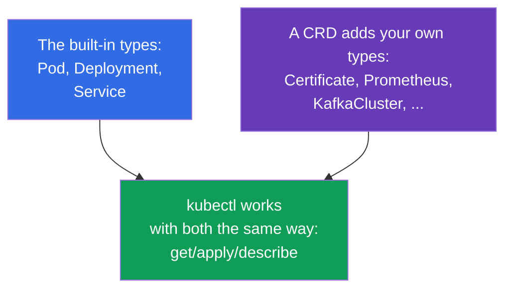
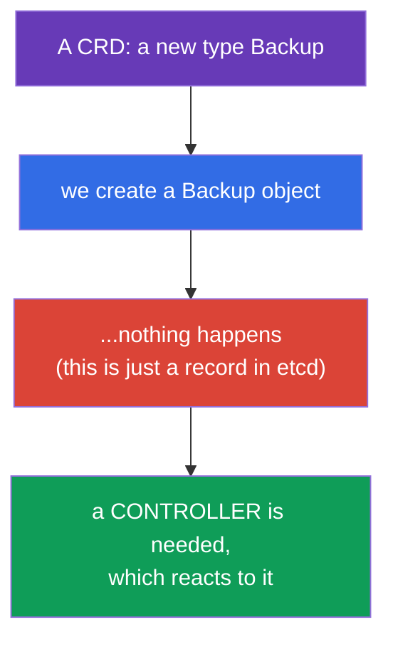
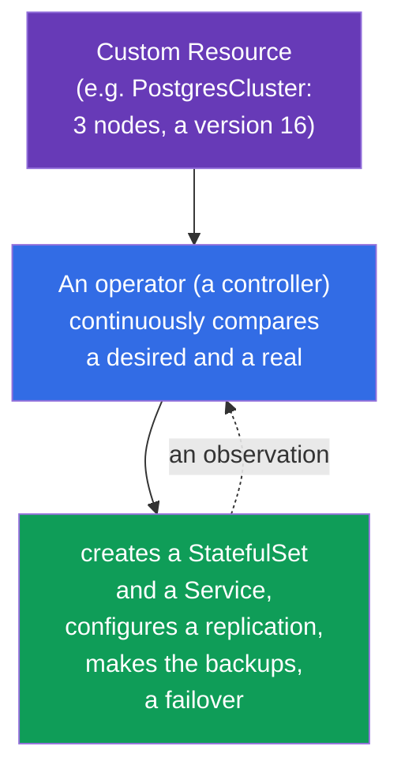
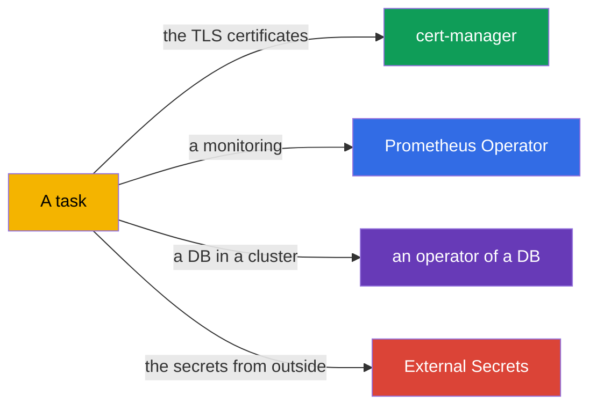
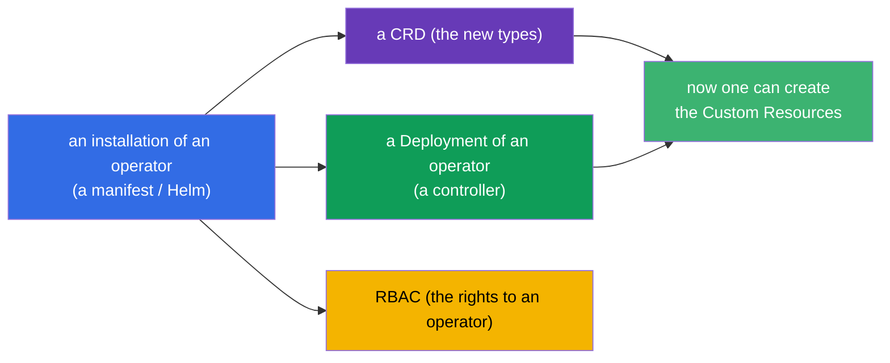
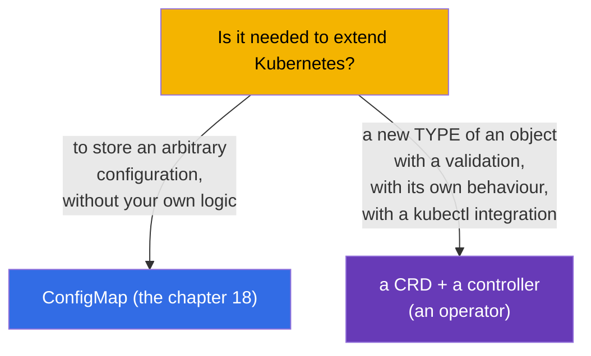
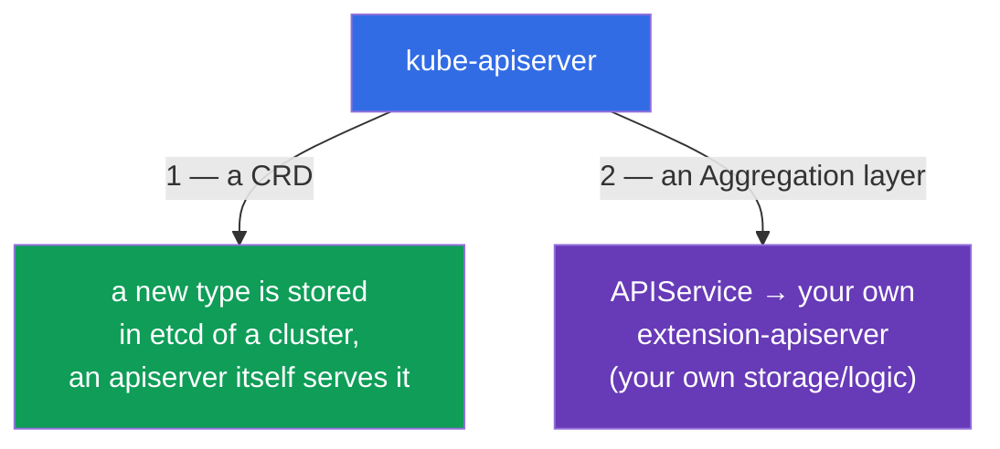

[Русская версия](ru.md) · [Versión en español](es.md) · [Version française](fr.md) · [Deutsche Version](de.md) · [ქართული ვერსია](ge.md)

# Chapter 41. The CRD and the operators

> 🟦 **A chapter for the CKA** (a domain Cluster Architecture). The theme is in the CKAD too (the extensions,
> Environment).
>
> **What comes next.** Until now we worked with the built-in objects of Kubernetes (Pod,
> Deployment, Service...). But the Kubernetes API can be **extended** with your own types of the objects -
> through a **CustomResourceDefinition (CRD)**. And an **operator** - this is a controller, which teaches
> Kubernetes to manage your application the same way, as the built-in objects. This is how
> cert-manager, Prometheus Operator, the databases in a cluster work. A program of the CKA directly
> requires to "understand the CRD, to install and to configure the operators".

## 41.1. The CRD: your own types of the objects in an API

A **CustomResourceDefinition (CRD)** adds into the Kubernetes API a **new kind** of the
objects. After an installation of a CRD one can work with it by the same `kubectl get/apply`, as with the
built-in objects - Kubernetes stores them in etcd and gives them out through an API.



```yaml
apiVersion: apiextensions.k8s.io/v1
kind: CustomResourceDefinition
metadata:
  name: backups.example.com
spec:
  group: example.com
  names:
    kind: Backup
    plural: backups
    singular: backup
  scope: Namespaced
  versions:
  - name: v1
    served: true
    storage: true
    schema:
      openAPIV3Schema:
        type: object
        properties:
          spec:
            type: object
            properties:
              schedule:
                type: string
```

After an application of a CRD a new type `Backup` appears, and one can create its instances
(a **Custom Resource, CR**):

```bash
kubectl get crd                    # a list of the installed CRD
kubectl get backups                # the instances of our new type
kubectl explain backup.spec        # it works for a CRD too
```

## 41.2. A CRD - this is only a storage. A controller is needed

The most important moment: **a CRD by itself does nothing**. It adds a type and allows to
store the objects, but does not perform any actions. We have created a `Backup` - it just lies in
etcd, a backup will not be performed by itself.



For an object to do something, a **controller** is needed - a program with a reconciliation loop (the chapter
1), which watches the objects of this type and brings a reality to their `spec`. A bundle
"a CRD + a controller for it" is exactly an **operator**.

## 41.3. An operator: a controller + the domain knowledge

An **operator** - this is a controller, into which the operational knowledge about a
concrete application is "wired in". It extends an idea of a reconciliation loop: as a built-in controller
holds a needed number of the pods, so an operator of a DB knows how to make the backups, a restore, a failover,
an upgrade of a version - automatically, reacting to its own CR.



An idea: you declaratively describe "I want a cluster of PostgreSQL out of 3 nodes of a version 16", and an operator
does all the routine, which otherwise would be performed by a human administrator. An operator = "a human
operator, packed into a code".

## 41.4. The examples of the operators

The operators are ubiquitous; many instruments, which we mentioned, - these are the operators:

| An operator | What it does | The CRD (the examples) |
|----------|-----------|---------------|
| **cert-manager** | issues and renews the TLS certificates (the chapter 32) | Certificate, Issuer |
| **Prometheus Operator** | deploys and configures a monitoring (the chapter 28) | Prometheus, ServiceMonitor |
| **the operators of the DB** | manage PostgreSQL/MySQL/MongoDB in a cluster | PostgresCluster and so on |
| **External Secrets** | pulls the secrets from Vault/Secrets Manager (the chapter 19) | ExternalSecret |
| **Argo CD** | a GitOps delivery (the chapter 3) | Application |



## 41.5. An installation of an operator

Usually an operator is installed as a package, which brings: a CRD itself (the new types),
a Deployment of a controller-operator and a needed RBAC (an operator needs a right to manage the objects).



The ways of an installation: to apply the manifests (`kubectl apply -f`), through Helm (the chapter 42) or
through an OLM (Operator Lifecycle Manager). After an installation we create the Custom Resources, and
an operator processes them.

```bash
kubectl get crd                          # have the new types appeared?
kubectl get pods -n <operator-namespace> # does a controller of an operator work?
kubectl apply -f my-custom-resource.yaml  # to create a CR - an operator will react
```

## 41.6. A CRD versus the built-in objects and a ConfigMap

When to extend an API through a CRD, and when a ConfigMap is enough? A frequent question of a design:



A CRD is justified, when a full-fledged object of an API is needed: with a schema and a validation, with
`kubectl get/describe`, with a controller, which reacts to it. If it is needed just to
store the data without your own logic - a ConfigMap is enough.

## 41.7. The second way to extend an API: an aggregation layer

A CRD - not the only way to add the new types into Kubernetes. There are two mechanisms of
an extension of an API, and it is important to distinguish them:



- A **CRD** (the sections above) - declaratively adds a type, the data lie in **etcd** of a cluster,
  the requests are served by a kube-apiserver itself. Simple, without your own code of a server. 90% of the cases.
- An **aggregation layer** - you register an object **`APIService`**, which tells an
  apiserver: to **proxy** the requests to such an API group to your separate
  **extension-apiserver**. That one decides by itself, where to store the data and which logic to apply.

This is exactly how **metrics-server** works: it registers an `APIService` for a group
`metrics.k8s.io`, and `kubectl top` (the chapter 28) under a hood goes into an aggregated API, and not
into etcd. Through an aggregation layer an apiserver also finds it by a front-proxy certificate
(`front-proxy-ca`, the chapter 35).

```bash
kubectl get apiservices                      # a list of the API, including the aggregated ones
kubectl get apiservices | grep metrics       # v1beta1.metrics.k8s.io -> metrics-server
```

| | **A CRD** | **An Aggregation layer** |
|--|---------|------------------------|
| What we register | `CustomResourceDefinition` | `APIService` + your own apiserver |
| Where the data are | in etcd of a cluster | where an extension-apiserver decides |
| Your own logic/validation | through a webhook (the chapter 21) | fully your own (your own server) |
| A complexity | low | high (your own server is needed and is maintained) |
| An example | cert-manager, Prometheus (Certificate, Prometheus) | metrics-server (`metrics.k8s.io`) |

For the CKA it is enough to understand: **two ways of an extension of an API** - a CRD (simple, in etcd) and
an aggregation layer (your own apiserver through an `APIService`, as at metrics-server).

## 41.8. How this is applied in a production

- **The operators - a standard for the complex applications.** In a production the DB, the queues, a monitoring,
  the certificates, the secrets are managed by the operators: they automate a routine (the backups,
  a failover, a rotation), which otherwise would be done by an on-duty engineer. This makes the complex systems
  "declarative-friendly".
- **The CRD extend a platform.** The internal platform teams often introduce their own CRD
  (for example, `Application`, `Environment`), so that the developers describe a needed thing at a high level,
  and a platform operator deployed the details. This is a basis of the internal developer platforms.
- **RBAC of the operators - a zone of an attention.** The operators often require the wide rights (not seldom
  cluster-wide). This is a risk (the chapter 38): a compromise of an operator = a lot of a power. In a production their
  rights are reviewed and are narrowed, where possible.
- **A versioning of the CRD.** The CRD have the versions (v1alpha1→v1), and during an upgrade of the operators
  the migrations of the schemas and a deprecation of the versions are possible (it echoes with the chapter 29) - this is planned,
  as well as the upgrades of a cluster.
- **Not everything is worth doing by an operator.** An operator - this is a code, which has to be maintained.
  The simple cases are solved by Helm/Kustomize (the chapters 42-43) and by a ConfigMap; an operator is justified, when
  exactly a continuous automation of a life cycle is needed.

## 41.9. A mini glossary

- **A CRD (CustomResourceDefinition)** - a definition of a new type of the objects in an API.
- **A Custom Resource (CR)** - an instance of a type, set by a CRD.
- **An operator** - a controller + the domain knowledge about a management of an application.
- **A controller** - a program with a reconciliation loop (brings a reality to a spec).
- **A scope (Namespaced/Cluster)** - an area of a CRD: in a namespace or on a whole cluster.
- **An OLM** - Operator Lifecycle Manager, a mechanism of an installation/an upgrade of the operators.
- **cert-manager / Prometheus Operator** - the popular operators.
- **An aggregation layer** - an extension of an API through your own extension-apiserver.
- **An APIService** - an object, registering an aggregated API (e.g. `metrics.k8s.io`).

## 41.10. The conclusions of the chapter

- A CRD adds into an API a new type of the objects; with the Custom Resources the same `kubectl
  get/apply` work, as with the built-in ones.
- A CRD itself does nothing - this is only a storage of a type; for an object to perform something, a
  controller is needed.
- An operator = a CRD + a controller with the domain knowledge; it automates a life cycle of an
  application (the backups, a failover, the upgrades) through a reconciliation loop.
- The examples of the operators: cert-manager, Prometheus Operator, the operators of the DB, External Secrets,
  Argo CD.
- An installation of an operator brings a CRD + a Deployment of a controller + RBAC; the ways - the manifests,
  Helm, an OLM.
- A CRD is justified for a full-fledged type of an object with a logic; for a simple storage of the data -
  a ConfigMap.

- An API is extended in two ways: a CRD (a type in etcd, an apiserver serves it) and an aggregation
  layer (your own extension-apiserver through an `APIService`, as metrics-server).

## 41.11. How this will come in handy: at an exam and in a real work

**At an exam (the CKA).** A program requires to "understand the CRD, to install and to configure the
operators". The tasks "apply a CRD and create a Custom Resource", "install an operator and
check, that its controller works" are expected. A key understanding - a CRD only stores, the actions
are performed by a controller/an operator.

**In a real work.** The operators - a way to manage the complex systems (the DB, a monitoring,
the certificates) declaratively and automatically. A CRD - a basis of an extension of a platform for the needs of an
organization. An understanding of a bundle "a CRD + a controller" and an attention to the rights of the operators - a part
of a designing and of a security of a mature cluster.

## 41.12. The questions for a self-check

1. What does a CRD add into a cluster and how to work with the new objects after this?
2. Why does a CRD by itself do nothing? What is needed for an object to perform something?
3. What is an operator and how is it connected with a reconciliation loop?
4. Give the examples of the operators and what they automate.
5. What does an installation of an operator bring and how to check, that it works?
6. When to extend an API through a CRD, and when is a ConfigMap enough?
7. Why are the RBAC rights of the operators a zone of an increased attention?
8. How does an extension through an aggregation layer (`APIService`) differ from a CRD? Give an example.

## Practice

We have considered an extension of an API. In the chapters 42-43 - the instruments of a packaging and of a configuring of the manifests
(Helm and Kustomize), by which the operators are installed too. The CRD and the operators
are practised in the labs on an administration.

🧪 A lab 115 (the CRD and the operators): [tasks/cka/labs/115](../../labs/115/README.MD)

---
[Contents](../README.md) · [Chapter 40](../40/README.md) · [Chapter 42](../42/README.md)
