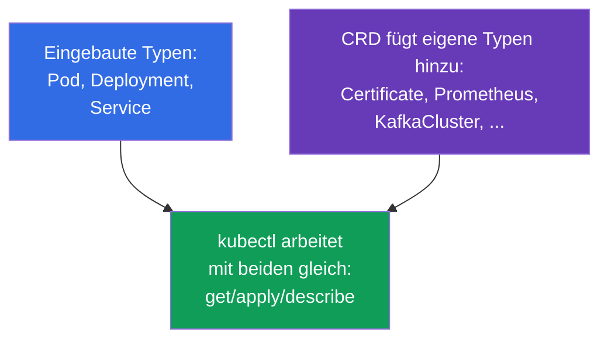
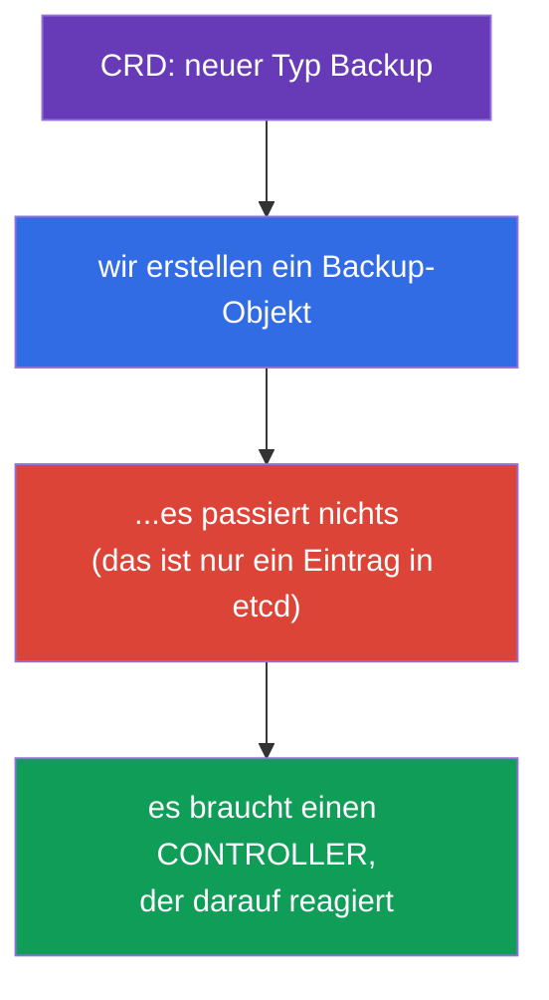
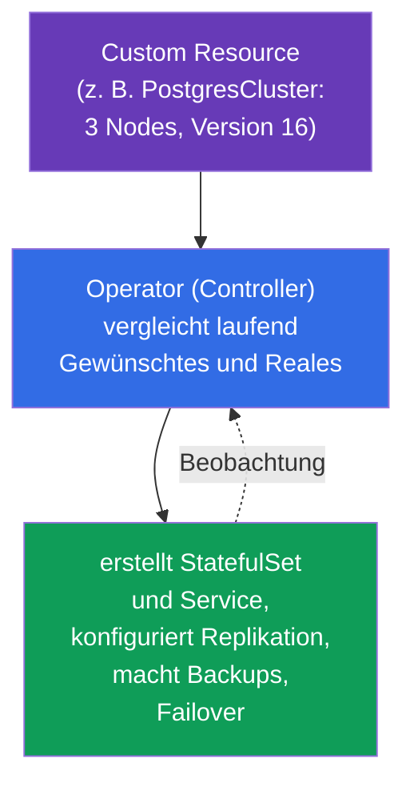
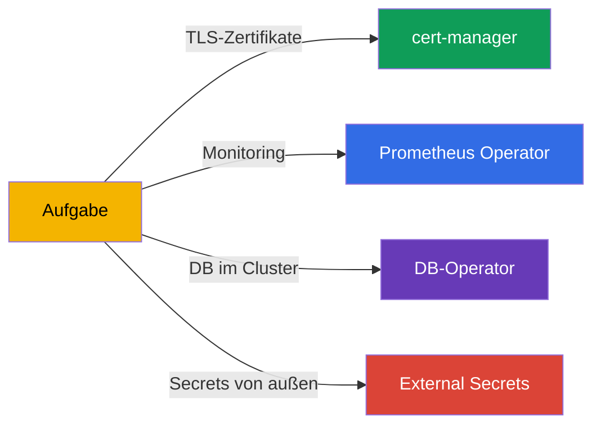
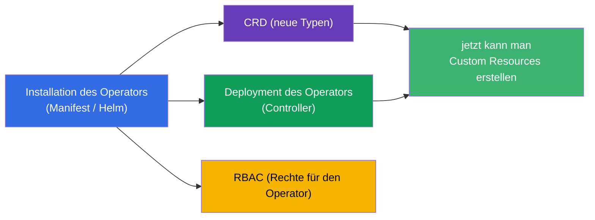
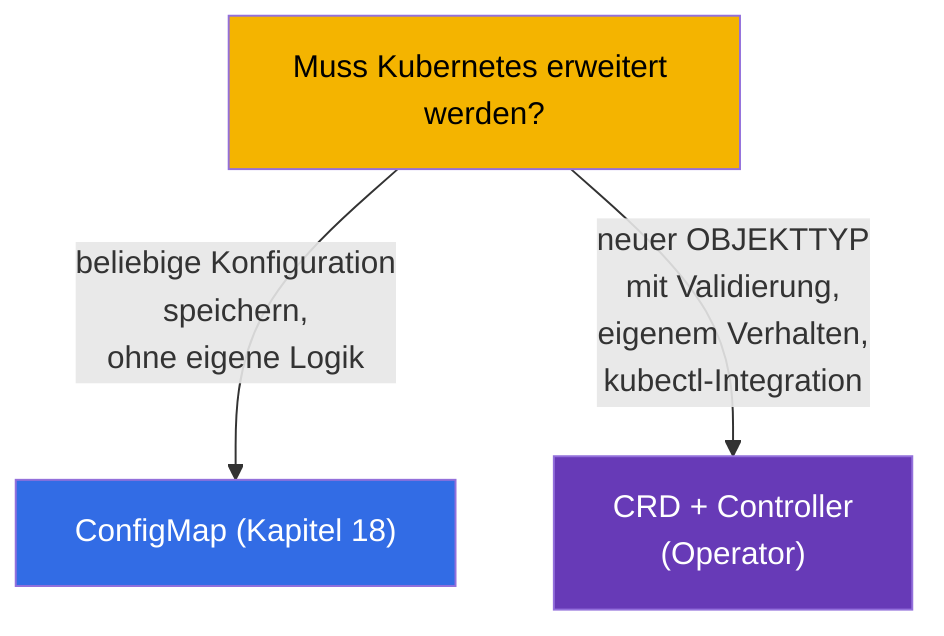
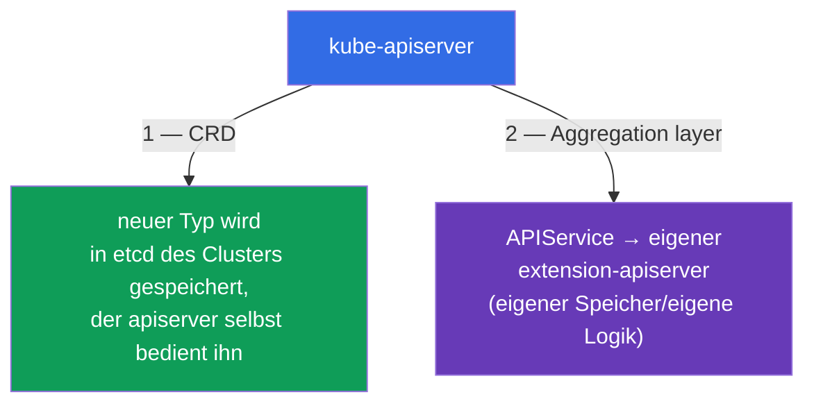

[Русская версия](ru.md) · [Eng version](README.md) · [Versión en español](es.md) · [Version française](fr.md) · [ქართული ვერსია](ge.md) · [繁體中文版](tw.md) · [日本語版](jp.md)

# Kapitel 41. CRD und Operatoren

> 🟦 **Kapitel für CKA** (Domäne Cluster Architecture). Das Thema gibt es auch in CKAD
> (Erweiterungen, Environment).
>
> **Was kommt.** Bisher haben wir mit den eingebauten Kubernetes-Objekten gearbeitet (Pod,
> Deployment, Service...). Doch die Kubernetes-API lässt sich mit eigenen Objekttypen
> **erweitern** - über eine **CustomResourceDefinition (CRD)**. Und ein **Operator** ist ein
> Controller, der Kubernetes beibringt, Ihre Anwendung genauso zu verwalten wie die
> eingebauten Objekte. So funktionieren cert-manager, Prometheus Operator, Datenbanken im
> Cluster. Das CKA-Programm fordert direkt, „CRD zu verstehen, Operatoren zu installieren und
> zu konfigurieren“.

## 41.1. CRD: eigene Objekttypen in der API

Eine **CustomResourceDefinition (CRD)** fügt der Kubernetes-API eine **neue Art (kind)** von
Objekten hinzu. Nach der Installation der CRD kann man mit ihr über dieselben
`kubectl get/apply` arbeiten wie mit den eingebauten Objekten - Kubernetes speichert sie in
etcd und liefert sie über die API aus.



```yaml
apiVersion: apiextensions.k8s.io/v1
kind: CustomResourceDefinition
metadata:
  name: backups.example.com
spec:
  group: example.com
  names:
    kind: Backup
    plural: backups
    singular: backup
  scope: Namespaced
  versions:
  - name: v1
    served: true
    storage: true
    schema:
      openAPIV3Schema:
        type: object
        properties:
          spec:
            type: object
            properties:
              schedule:
                type: string
```

Nach dem Anwenden der CRD erscheint der neue Typ `Backup`, und man kann seine Instanzen
erstellen (**Custom Resource, CR**):

```bash
kubectl get crd                    # Liste der installierten CRD
kubectl get backups                # Instanzen unseres neuen Typs
kubectl explain backup.spec        # funktioniert auch für CRD
```

## 41.2. CRD ist nur ein Speicher. Es braucht einen Controller

Der wichtigste Punkt: **eine CRD allein tut nichts**. Sie fügt einen Typ hinzu und erlaubt,
Objekte zu speichern, führt aber keinerlei Aktionen aus. Sie haben ein `Backup` erstellt - es
liegt einfach in etcd, das Backup läuft von selbst nicht.



Damit ein Objekt etwas tut, braucht es einen **Controller** - ein Programm mit
Abgleichschleife (Kapitel 1), das die Objekte dieses Typs beobachtet und die Realität an
ihre `spec` heranführt. Die Verbindung „CRD + passender Controller“ ist genau ein
**Operator**.

## 41.3. Operator: Controller + Domänenwissen

Ein **Operator** ist ein Controller, in den das Betriebswissen über eine konkrete Anwendung
„eingebaut“ ist. Er erweitert die Idee der Abgleichschleife: wie ein eingebauter Controller
die nötige Anzahl an Pods hält, so kann ein DB-Operator Backups, Wiederherstellung,
Failover, Versions-Update machen - automatisch, als Reaktion auf seine CR.



Die Idee: Sie beschreiben deklarativ „ich will einen PostgreSQL-Cluster aus 3 Nodes der
Version 16“, und der Operator macht die ganze Routine, die sonst ein menschlicher
Administrator erledigen würde. Operator = „menschlicher Operator, in Code verpackt“.

## 41.4. Beispiele für Operatoren

Operatoren sind allgegenwärtig; viele Werkzeuge, die wir erwähnt haben, sind Operatoren:

| Operator | Was er macht | CRD (Beispiele) |
|----------|-----------|---------------|
| **cert-manager** | stellt TLS-Zertifikate aus und erneuert sie (Kapitel 32) | Certificate, Issuer |
| **Prometheus Operator** | rollt Monitoring aus und konfiguriert es (Kapitel 28) | Prometheus, ServiceMonitor |
| **DB-Operatoren** | verwalten PostgreSQL/MySQL/MongoDB im Cluster | PostgresCluster u. a. |
| **External Secrets** | holt Secrets aus Vault/Secrets Manager (Kapitel 19) | ExternalSecret |
| **Argo CD** | GitOps-Auslieferung (Kapitel 3) | Application |



## 41.5. Installation eines Operators

Üblicherweise wird ein Operator als Paket installiert, das mitbringt: die CRD selbst (neue
Typen), das Deployment des Operator-Controllers und das nötige RBAC (der Operator braucht
das Recht, Objekte zu verwalten).



Installationswege: Manifeste anwenden (`kubectl apply -f`), über Helm (Kapitel 42) oder über
OLM (Operator Lifecycle Manager). Nach der Installation erstellen wir Custom Resources, und
der Operator verarbeitet sie.

```bash
kubectl get crd                          # sind neue Typen erschienen?
kubectl get pods -n <namespace-des-operators> # läuft der Controller des Operators?
kubectl apply -f my-custom-resource.yaml  # CR erstellen — der Operator reagiert
```

## 41.6. CRD gegen eingebaute Objekte und ConfigMap

Wann erweitert man die API über eine CRD und wann reicht eine ConfigMap? Eine häufige
Designfrage:



Eine CRD ist berechtigt, wenn man ein vollwertiges API-Objekt braucht: mit Schema und
Validierung, mit `kubectl get/describe`, mit einem Controller, der darauf reagiert. Wenn man
nur Daten ohne eigene Logik speichern muss - genügt eine ConfigMap.

## 41.7. Der zweite Weg, die API zu erweitern: aggregation layer

CRD ist nicht der einzige Weg, Kubernetes neue Typen hinzuzufügen. Es gibt zwei Mechanismen
der API-Erweiterung, und man muss sie unterscheiden:



- **CRD** (die Abschnitte oben) - fügt einen Typ deklarativ hinzu, die Daten liegen in
  **etcd** des Clusters, die Anfragen bedient der kube-apiserver selbst. Einfach, ohne
  eigenen Server-Code. 90 % der Fälle.
- **Aggregation layer** - Sie registrieren ein Objekt **`APIService`**, das dem apiserver
  sagt: Anfragen an eine bestimmte API-Gruppe an Ihren separaten **extension-apiserver**
  **weiterleiten**. Dieser entscheidet selbst, wo er die Daten speichert und welche Logik er
  anwendet.

Genau so funktioniert der **metrics-server**: er registriert einen `APIService` für die
Gruppe `metrics.k8s.io`, und `kubectl top` (Kapitel 28) geht unter der Haube in die
aggregierte API und nicht in etcd. Über den aggregation layer findet der apiserver ihn auch
mit dem front-proxy-Zertifikat (`front-proxy-ca`, Kapitel 35).

```bash
kubectl get apiservices                      # Liste der API, u. a. der aggregierten
kubectl get apiservices | grep metrics       # v1beta1.metrics.k8s.io -> metrics-server
```

| | **CRD** | **Aggregation layer** |
|--|---------|------------------------|
| Was wir registrieren | `CustomResourceDefinition` | `APIService` + eigener apiserver |
| Wo die Daten liegen | in etcd des Clusters | wo der extension-apiserver es entscheidet |
| Eigene Logik/Validierung | über Webhook (Kapitel 21) | vollständig eigene (eigener Server) |
| Komplexität | niedrig | hoch (eigener Server nötig und zu betreiben) |
| Beispiel | cert-manager, Prometheus (Certificate, Prometheus) | metrics-server (`metrics.k8s.io`) |

Für CKA genügt zu verstehen: **zwei Wege der API-Erweiterung** - CRD (einfach, in etcd) und
aggregation layer (eigener apiserver über `APIService`, wie beim metrics-server).

## 41.8. Wie man das in der Produktion anwendet

- **Operatoren sind Standard für komplexe Anwendungen.** In der Produktion werden DB,
  Queues, Monitoring, Zertifikate, Secrets von Operatoren verwaltet: sie automatisieren die
  Routine (Backups, Failover, Rotation), die sonst der Dienstbereitschaftshabende machen
  würde. Das macht komplexe Systeme „declarative-friendly“.
- **CRD erweitern die Plattform.** Interne Plattform-Teams führen oft eigene CRD ein
  (zum Beispiel `Application`, `Environment`), damit Entwickler das Gewünschte auf hohem
  Niveau beschreiben und der Plattform-Operator die Details ausrollt. Das ist die Basis
  interner Developer-Plattformen.
- **RBAC der Operatoren ist ein Aufmerksamkeitsbereich.** Operatoren verlangen oft weite
  Rechte (nicht selten cluster-wide). Das ist ein Risiko (Kapitel 38): Kompromittierung
  eines Operators = viel Macht. In der Produktion werden ihre Rechte reviewt und nach
  Möglichkeit eingeengt.
- **Versionierung der CRD.** CRD haben Versionen (v1alpha1→v1), und beim Update von
  Operatoren sind Schema-Migrationen und das Veralten von Versionen möglich (klingt an
  Kapitel 29 an) - das plant man, genauso wie Cluster-Upgrades.
- **Nicht alles lohnt sich als Operator.** Ein Operator ist Code, den man pflegen muss.
  Einfache Fälle löst man mit Helm/Kustomize (Kapitel 42-43) und ConfigMap; ein Operator ist
  berechtigt, wenn genau die kontinuierliche Automatisierung des Lebenszyklus gebraucht wird.

## 41.9. Mini-Glossar

- **CRD (CustomResourceDefinition)** - Definition eines neuen Objekttyps in der API.
- **Custom Resource (CR)** - Instanz des durch die CRD definierten Typs.
- **Operator** - Controller + Domänenwissen über die Verwaltung einer Anwendung.
- **Controller** - Programm mit Abgleichschleife (führt die Realität an die spec heran).
- **scope (Namespaced/Cluster)** - Bereich der CRD: im Namespace oder clusterweit.
- **OLM** - Operator Lifecycle Manager, Mechanismus zur Installation/Aktualisierung von Operatoren.
- **cert-manager / Prometheus Operator** - populäre Operatoren.
- **aggregation layer** - Erweiterung der API über einen eigenen extension-apiserver.
- **APIService** - Objekt, das eine aggregierte API registriert (z. B. `metrics.k8s.io`).

## 41.10. Zusammenfassung des Kapitels

- Eine CRD fügt der API einen neuen Objekttyp hinzu; mit Custom Resources arbeiten dieselben
  `kubectl get/apply` wie mit den eingebauten.
- Die CRD selbst tut nichts - sie ist nur der Speicher des Typs; damit ein Objekt etwas
  ausführt, braucht es einen Controller.
- Operator = CRD + Controller mit Domänenwissen; automatisiert den Lebenszyklus der
  Anwendung (Backups, Failover, Updates) über die Abgleichschleife.
- Beispiele für Operatoren: cert-manager, Prometheus Operator, DB-Operatoren, External
  Secrets, Argo CD.
- Die Installation eines Operators bringt CRD + Deployment des Controllers + RBAC; die Wege
  sind Manifeste, Helm, OLM.
- Eine CRD ist berechtigt für einen vollwertigen Objekttyp mit Logik; für einfaches Speichern
  von Daten - ConfigMap.

- Die API wird auf zwei Wegen erweitert: CRD (Typ in etcd, vom apiserver bedient) und
  aggregation layer (eigener extension-apiserver über `APIService`, wie metrics-server).

## 41.11. Wofür das nützlich ist: in der Prüfung und in der echten Arbeit

**In der Prüfung (CKA).** Das Programm fordert, „CRD zu verstehen, Operatoren zu installieren
und zu konfigurieren“. Zu erwarten sind Aufgaben wie „wende eine CRD an und erstelle eine
Custom Resource“, „installiere einen Operator und prüfe, dass sein Controller läuft“.
Entscheidend ist das Verständnis - die CRD speichert nur, die Aktionen führt der
Controller/Operator aus.

**In der echten Arbeit.** Operatoren sind der Weg, komplexe Systeme (DB, Monitoring,
Zertifikate) deklarativ und automatisch zu verwalten. CRD sind die Grundlage, die Plattform
auf die Bedürfnisse der Organisation zu erweitern. Das Verständnis der Verbindung
„CRD + Controller“ und die Aufmerksamkeit für die Rechte der Operatoren sind Teil des
Designs und der Sicherheit eines reifen Clusters.

## 41.12. Fragen zur Selbstüberprüfung

1. Was fügt eine CRD dem Cluster hinzu und wie arbeitet man danach mit den neuen Objekten?
2. Warum tut eine CRD allein nichts? Was braucht es, damit ein Objekt etwas ausführt?
3. Was ist ein Operator und wie hängt er mit der Abgleichschleife zusammen?
4. Nennen Sie Beispiele für Operatoren und was sie automatisieren.
5. Was bringt die Installation eines Operators mit und wie prüft man, dass er läuft?
6. Wann erweitert man die API über eine CRD und wann genügt eine ConfigMap?
7. Warum sind die RBAC-Rechte von Operatoren ein Bereich erhöhter Aufmerksamkeit?
8. Wie unterscheidet sich die Erweiterung über den aggregation layer (`APIService`) von einer CRD? Nennen Sie ein Beispiel.

## Praxis

Wir haben die Erweiterung der API besprochen. In den Kapiteln 42-43 kommen die Werkzeuge zum
Verpacken und Konfigurieren von Manifesten (Helm und Kustomize), mit denen unter anderem
Operatoren installiert werden. CRD und Operatoren werden in den Labs zur Administration
geübt.

🧪 Lab 115 (CRD und Operatoren): [tasks/cka/labs/115](../../labs/115/README_DE.MD)

🎮 Killercoda (im Browser, ohne Installation): [Install a Database Operator](https://killercoda.com/chadmcrowell/course/cka/database-operator) · [Create your own Operator in Kubernetes](https://killercoda.com/chadmcrowell/scenario/create-operator)

---
[Inhalt](../README_DE.md) · [Kapitel 40](../40/de.md) · [Kapitel 42](../42/de.md)
