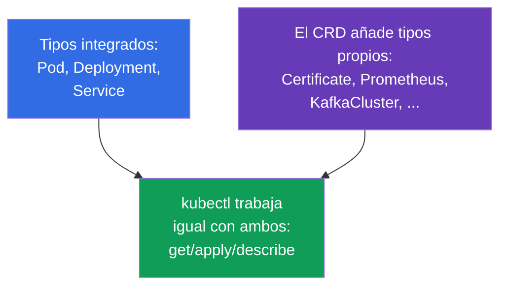
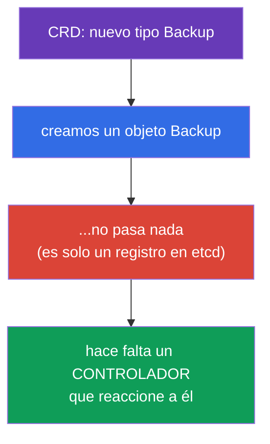
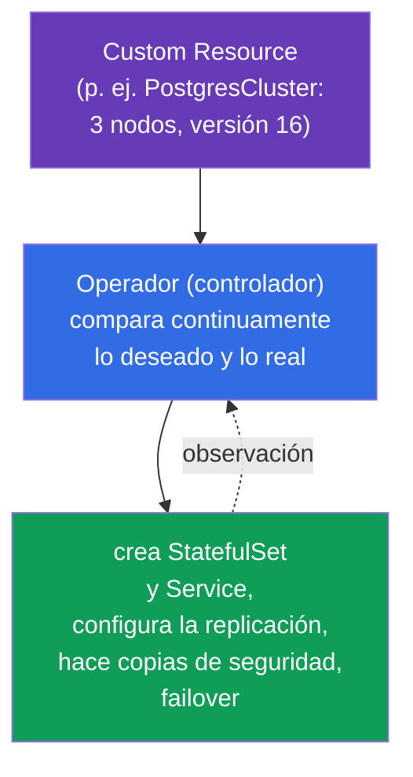
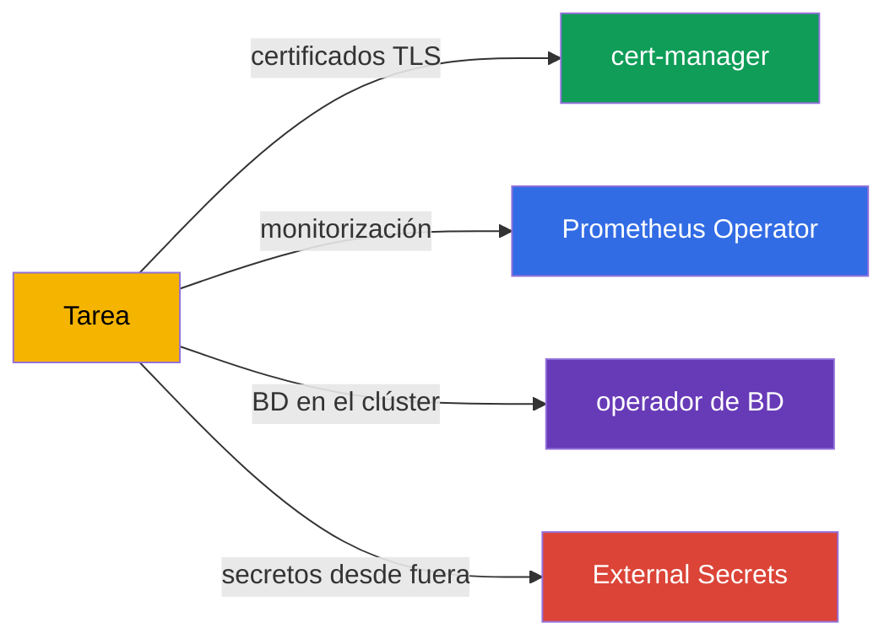
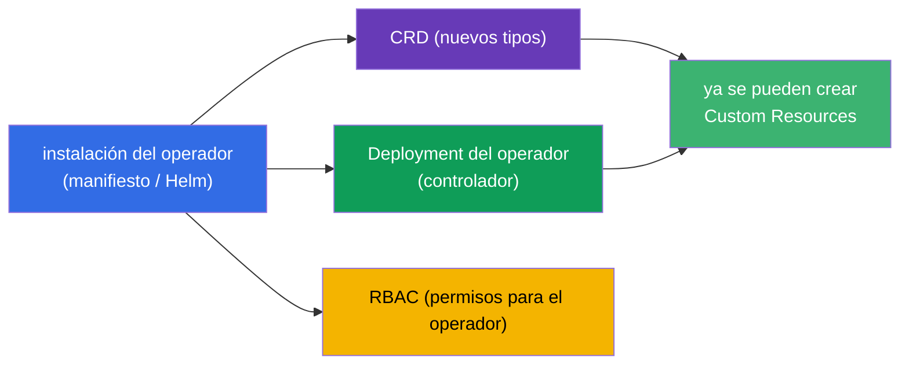
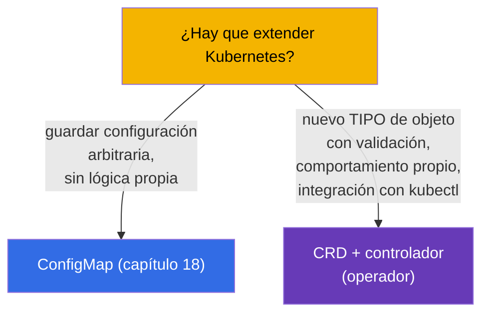
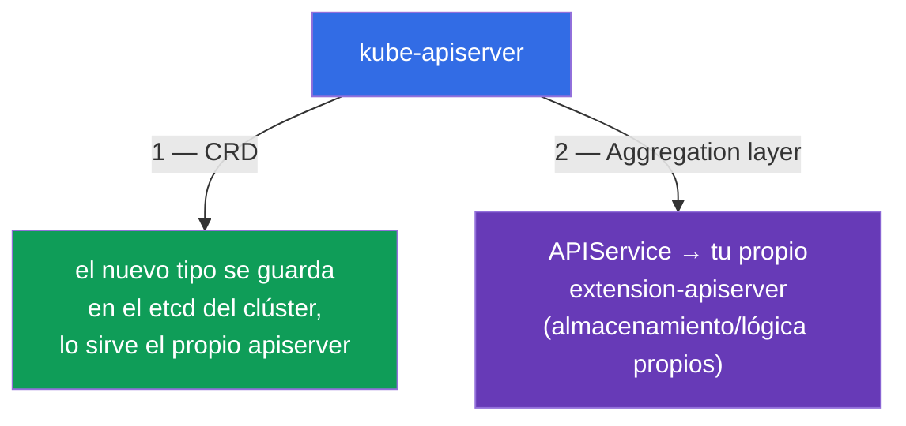

[Русская версия](ru.md) · [Eng version](README.md) · [Version française](fr.md) · [Deutsche Version](de.md) · [ქართული ვერსია](ge.md) · [繁體中文版](tw.md) · [日本語版](jp.md)

# Capítulo 41. CRD y operadores

> 🟦 **Capítulo para CKA** (dominio Cluster Architecture). El tema aparece también en CKAD
> (extensiones, Environment).
>
> **Qué viene ahora.** Hasta ahora hemos trabajado con los objetos integrados de Kubernetes (Pod,
> Deployment, Service...). Pero la API de Kubernetes se puede **extender** con tipos de objetos
> propios - mediante **CustomResourceDefinition (CRD)**. Y un **operador** es un controlador que
> enseña a Kubernetes a gestionar tu aplicación igual que los objetos integrados. Así funcionan
> cert-manager, Prometheus Operator, las bases de datos dentro del clúster. El programa del CKA pide
> expresamente «entender los CRD, instalar y configurar operadores».

## 41.1. CRD: tipos de objetos propios en la API

**CustomResourceDefinition (CRD)** añade a la API de Kubernetes un **nuevo tipo (kind)** de objetos.
Una vez instalado el CRD se puede trabajar con él con los mismos `kubectl get/apply` que con los
objetos integrados - Kubernetes los guarda en etcd y los sirve a través de la API.



```yaml
apiVersion: apiextensions.k8s.io/v1
kind: CustomResourceDefinition
metadata:
  name: backups.example.com
spec:
  group: example.com
  names:
    kind: Backup
    plural: backups
    singular: backup
  scope: Namespaced
  versions:
  - name: v1
    served: true
    storage: true
    schema:
      openAPIV3Schema:
        type: object
        properties:
          spec:
            type: object
            properties:
              schedule:
                type: string
```

Tras aplicar el CRD aparece el nuevo tipo `Backup` y se pueden crear instancias suyas
(**Custom Resource, CR**):

```bash
kubectl get crd                    # lista de CRD instalados
kubectl get backups                # instancias de nuestro nuevo tipo
kubectl explain backup.spec        # funciona también para los CRD
```

## 41.2. El CRD es solo almacenamiento. Hace falta un controlador

El punto más importante: **un CRD por sí solo no hace nada**. Añade el tipo y permite guardar
objetos, pero no realiza ninguna acción. Has creado un `Backup` - simplemente está ahí, en etcd, la
copia de seguridad no se va a ejecutar sola.



Para que el objeto haga algo hace falta un **controlador** - un programa con bucle de reconciliación
(capítulo 1) que vigila los objetos de ese tipo y lleva la realidad a su `spec`. El conjunto
«CRD + controlador para él» es precisamente un **operador**.

## 41.3. El operador: controlador + conocimiento del dominio

Un **operador (operator)** es un controlador en el que están «grabados» los conocimientos operativos
sobre una aplicación concreta. Amplía la idea del bucle de reconciliación: igual que un controlador
integrado mantiene el número necesario de pods, el operador de una BD sabe hacer copias de
seguridad, restauración, failover, actualización de versión - automáticamente, reaccionando a sus CR.



La idea: describes de forma declarativa «quiero un clúster PostgreSQL de 3 nodos versión 16», y el
operador hace toda la rutina que de otro modo haría un administrador humano. Operador = «humano-
operador empaquetado en código».

## 41.4. Ejemplos de operadores

Los operadores están por todas partes; muchas herramientas que hemos mencionado son operadores:

| Operador | Qué hace | CRD (ejemplos) |
|----------|-----------|---------------|
| **cert-manager** | emite y renueva certificados TLS (capítulo 32) | Certificate, Issuer |
| **Prometheus Operator** | despliega y configura la monitorización (capítulo 28) | Prometheus, ServiceMonitor |
| **operadores de BD** | gestionan PostgreSQL/MySQL/MongoDB en el clúster | PostgresCluster, etc. |
| **External Secrets** | trae secretos de Vault/Secrets Manager (capítulo 19) | ExternalSecret |
| **Argo CD** | entrega GitOps (capítulo 3) | Application |



## 41.5. Instalación de un operador

Normalmente un operador se instala como un paquete que trae: el propio CRD (los nuevos tipos), el
Deployment del controlador-operador y el RBAC necesario (el operador necesita permisos para gestionar objetos).



Formas de instalación: aplicar manifiestos (`kubectl apply -f`), con Helm (capítulo 42) o con OLM
(Operator Lifecycle Manager). Después de la instalación creamos Custom Resources y el operador se
encarga de procesarlos.

```bash
kubectl get crd                          # ¿han aparecido los nuevos tipos?
kubectl get pods -n <namespace-del-operador> # ¿funciona el controlador del operador?
kubectl apply -f my-custom-resource.yaml  # crear un CR — el operador reaccionará
```

## 41.6. CRD frente a objetos integrados y ConfigMap

¿Cuándo extender la API con un CRD y cuándo basta un ConfigMap? Es una pregunta de diseño frecuente:



El CRD se justifica cuando hace falta un objeto de API completo: con esquema y validación, con
`kubectl get/describe`, con un controlador que reacciona a él. Si solo hay que guardar datos sin
lógica propia - basta un ConfigMap.

## 41.7. La segunda forma de extender la API: aggregation layer

El CRD no es la única forma de añadir nuevos tipos a Kubernetes. Hay dos mecanismos de extensión de
la API y es importante distinguirlos:



- **CRD** (las secciones anteriores) - añade el tipo declarativamente, los datos viven en el **etcd**
  del clúster y las peticiones las sirve el propio kube-apiserver. Simple, sin servidor propio. El 90% de los casos.
- **Aggregation layer** - registras un objeto **`APIService`** que le dice al apiserver: las
  peticiones a tal grupo de API hay que **proxearlas** a tu **extension-apiserver** aparte. Este
  decide por su cuenta dónde guardar los datos y qué lógica aplicar.

Así funciona precisamente **metrics-server**: registra un `APIService` para el grupo
`metrics.k8s.io`, y `kubectl top` (capítulo 28) por debajo va a la API agregada y no a etcd. Y es a
través del aggregation layer como el apiserver lo encuentra, con el certificado de front-proxy
(`front-proxy-ca`, capítulo 35).

```bash
kubectl get apiservices                      # lista de API, incluidas las agregadas
kubectl get apiservices | grep metrics       # v1beta1.metrics.k8s.io -> metrics-server
```

| | **CRD** | **Aggregation layer** |
|--|---------|------------------------|
| Qué registramos | `CustomResourceDefinition` | `APIService` + un apiserver propio |
| Dónde están los datos | en el etcd del clúster | donde decida el extension-apiserver |
| Lógica/validación propia | vía webhook (capítulo 21) | totalmente propia (servidor propio) |
| Complejidad | baja | alta (hay que tener y mantener un servidor propio) |
| Ejemplo | cert-manager, Prometheus (Certificate, Prometheus) | metrics-server (`metrics.k8s.io`) |

Para el CKA basta con entender: **dos formas de extender la API** - CRD (simple, en etcd) y el
aggregation layer (apiserver propio a través de `APIService`, como metrics-server).

## 41.8. Cómo se aplica esto en producción

- **Los operadores son el estándar para aplicaciones complejas.** En producción las BD, las colas, la
  monitorización, los certificados y los secretos se gestionan con operadores: automatizan la rutina
  (copias de seguridad, failover, rotación) que de otro modo haría la persona de guardia. Eso hace
  que los sistemas complejos sean «declarative-friendly».
- **Los CRD extienden la plataforma.** Los equipos internos de plataforma introducen a menudo sus
  propios CRD (por ejemplo `Application`, `Environment`) para que los desarrolladores describan lo que
  necesitan a alto nivel y el operador de plataforma despliegue los detalles. Es la base de las internal developer platforms.
- **El RBAC de los operadores es zona de atención.** Los operadores suelen requerir permisos amplios
  (a menudo cluster-wide). Eso es un riesgo (capítulo 38): comprometer el operador = mucho poder. En
  producción sus permisos se revisan y se acotan cuando es posible.
- **Versionado de los CRD.** Los CRD tienen versiones (v1alpha1→v1) y al actualizar operadores puede
  haber migraciones de esquema y versiones que se retiran (enlaza con el capítulo 29) - eso se
  planifica, igual que las actualizaciones del clúster.
- **No todo merece un operador.** Un operador es código que hay que mantener. Los casos simples se
  resuelven con Helm/Kustomize (capítulos 42-43) y ConfigMap; el operador se justifica cuando hace
  falta precisamente automatización continua del ciclo de vida.

## 41.9. Mini-glosario

- **CRD (CustomResourceDefinition)** - definición de un nuevo tipo de objetos en la API.
- **Custom Resource (CR)** - instancia del tipo definido por un CRD.
- **Operador** - controlador + conocimiento del dominio sobre la gestión de una aplicación.
- **Controlador** - programa con bucle de reconciliación (lleva la realidad al spec).
- **scope (Namespaced/Cluster)** - alcance del CRD: en un namespace o en todo el clúster.
- **OLM** - Operator Lifecycle Manager, mecanismo de instalación/actualización de operadores.
- **cert-manager / Prometheus Operator** - operadores populares.
- **aggregation layer** - extensión de la API mediante un extension-apiserver propio.
- **APIService** - objeto que registra una API agregada (p. ej. `metrics.k8s.io`).

## 41.10. Resumen del capítulo

- El CRD añade a la API un nuevo tipo de objetos; con los Custom Resources se usan los mismos `kubectl
  get/apply` que con los integrados.
- El CRD por sí solo no hace nada - es solo almacenamiento del tipo; para que el objeto ejecute algo
  hace falta un controlador.
- Operador = CRD + controlador con conocimiento del dominio; automatiza el ciclo de vida de la
  aplicación (copias de seguridad, failover, actualizaciones) mediante el bucle de reconciliación.
- Ejemplos de operadores: cert-manager, Prometheus Operator, operadores de BD, External Secrets,
  Argo CD.
- La instalación de un operador trae CRD + Deployment del controlador + RBAC; las formas son
  manifiestos, Helm, OLM.
- El CRD se justifica para un tipo de objeto completo con lógica; para simplemente guardar datos -
  ConfigMap.

- La API se extiende de dos formas: CRD (tipo en etcd, lo sirve el apiserver) y aggregation layer
  (extension-apiserver propio a través de `APIService`, como metrics-server).

## 41.11. Para qué sirve esto: en el examen y en el trabajo real

**En el examen (CKA).** El programa pide «entender los CRD, instalar y configurar operadores». Se
esperan tareas del tipo «aplica un CRD y crea un Custom Resource», «instala un operador y comprueba
que su controlador funciona». La comprensión clave: el CRD solo guarda, las acciones las realiza el
controlador/operador.

**En el trabajo real.** Los operadores son la forma de gestionar sistemas complejos (BD,
monitorización, certificados) de manera declarativa y automática. Los CRD son la base para extender
la plataforma a las necesidades de la organización. Entender el conjunto «CRD + controlador» y
prestar atención a los permisos de los operadores es parte del diseño y la seguridad de un clúster maduro.

## 41.12. Preguntas de autocomprobación

1. ¿Qué añade un CRD al clúster y cómo se trabaja después con los nuevos objetos?
2. ¿Por qué un CRD por sí solo no hace nada? ¿Qué hace falta para que el objeto ejecute algo?
3. ¿Qué es un operador y cómo se relaciona con el bucle de reconciliación?
4. Pon ejemplos de operadores y di qué automatizan.
5. ¿Qué trae la instalación de un operador y cómo se comprueba que funciona?
6. ¿Cuándo extender la API con un CRD y cuándo basta un ConfigMap?
7. ¿Por qué los permisos RBAC de los operadores son zona de atención especial?
8. ¿En qué se diferencia la extensión con aggregation layer (`APIService`) de un CRD? Pon un ejemplo.

## Práctica

Ya hemos visto cómo se extiende la API. En los capítulos 42-43 veremos las herramientas de empaquetado
y configuración de manifiestos (Helm y Kustomize), con las que también se instalan operadores. Los CRD
y los operadores se practican en los laboratorios de administración.

🧪 Laboratorio 115 (CRD y operadores): [tasks/cka/labs/115](../../labs/115/README_ES.MD)

---
[Índice](../README_ES.md) · [Capítulo 40](../40/es.md) · [Capítulo 42](../42/es.md)
