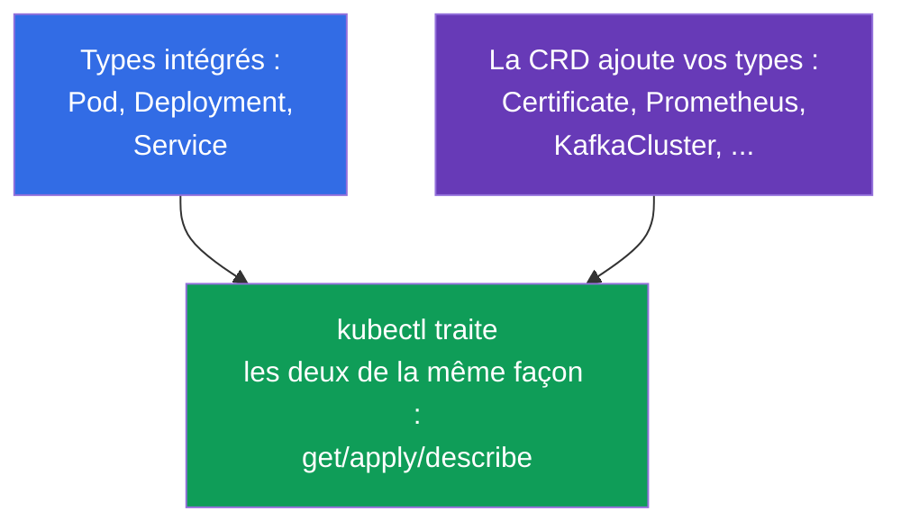
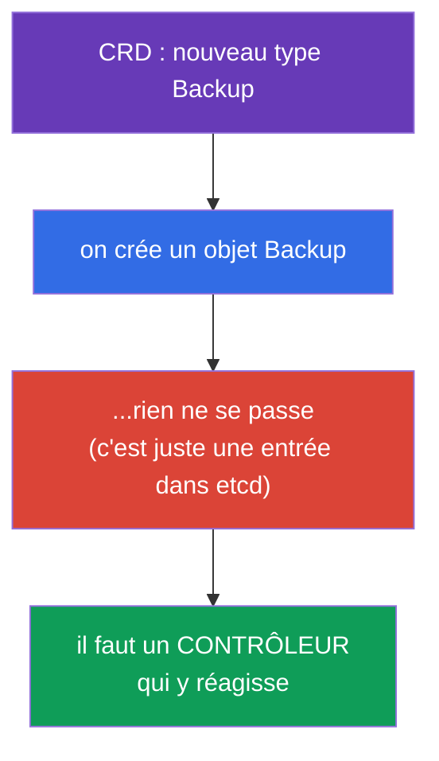
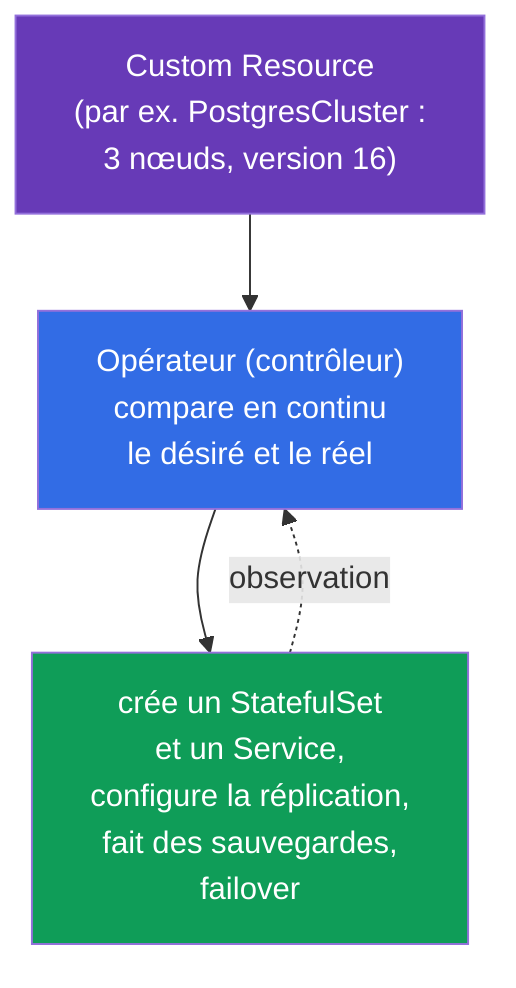
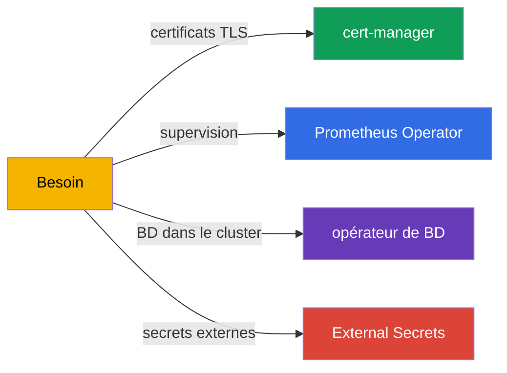
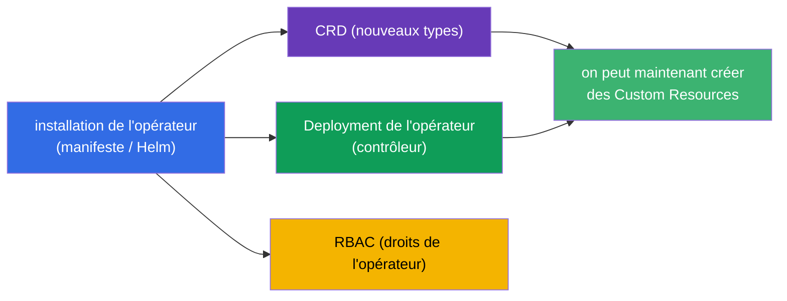
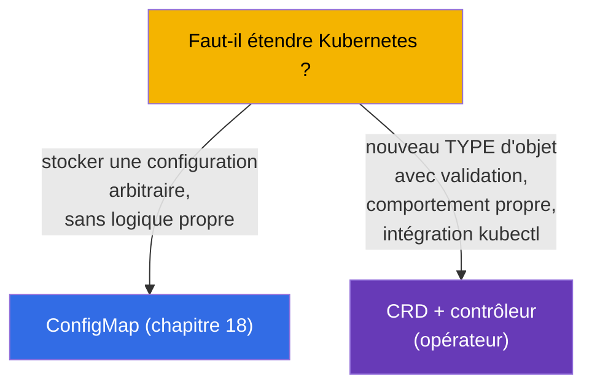
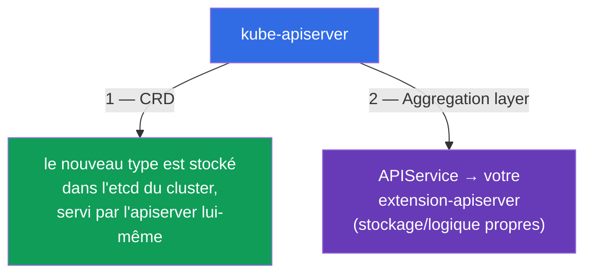

[Русская версия](ru.md) · [Eng version](README.md) · [Versión en español](es.md) · [Deutsche Version](de.md) · [ქართული ვერსია](ge.md) · [繁體中文版](tw.md) · [日本語版](jp.md)

# Chapitre 41. CRD et opérateurs

> 🟦 **Chapitre pour le CKA** (domaine Cluster Architecture). Le thème est aussi présent dans le
> CKAD (extensions, Environment).
>
> **Ce qui suit.** Jusqu'ici nous avons travaillé avec les objets intégrés de Kubernetes (Pod,
> Deployment, Service...). Mais l'API Kubernetes peut être **étendue** avec vos propres types
> d'objets - via une **CustomResourceDefinition (CRD)**. Et un **opérateur** est un contrôleur qui
> apprend à Kubernetes à gérer votre application exactement comme les objets intégrés. C'est ainsi
> que fonctionnent cert-manager, Prometheus Operator, les bases de données dans le cluster. Le
> programme du CKA exige explicitement de « comprendre les CRD, installer et configurer des opérateurs ».

## 41.1. CRD : vos propres types d'objets dans l'API

Une **CustomResourceDefinition (CRD)** ajoute à l'API Kubernetes un **nouveau kind** d'objets.
Après l'installation d'une CRD, on peut travailler avec elle via les mêmes `kubectl get/apply` que
pour les objets intégrés - Kubernetes les stocke dans etcd et les sert via l'API.



```yaml
apiVersion: apiextensions.k8s.io/v1
kind: CustomResourceDefinition
metadata:
  name: backups.example.com
spec:
  group: example.com
  names:
    kind: Backup
    plural: backups
    singular: backup
  scope: Namespaced
  versions:
  - name: v1
    served: true
    storage: true
    schema:
      openAPIV3Schema:
        type: object
        properties:
          spec:
            type: object
            properties:
              schedule:
                type: string
```

Après application de la CRD, un nouveau type `Backup` apparaît, et on peut en créer des instances
(**Custom Resource, CR**) :

```bash
kubectl get crd                    # liste des CRD installées
kubectl get backups                # instances de notre nouveau type
kubectl explain backup.spec        # fonctionne aussi pour les CRD
```

## 41.2. Une CRD n'est qu'un stockage. Il faut un contrôleur

Point essentiel : **une CRD seule ne fait rien**. Elle ajoute un type et permet de stocker des
objets, mais n'effectue aucune action. Vous créez un `Backup` - il reste simplement posé dans
etcd, la sauvegarde ne s'exécutera pas d'elle-même.



Pour qu'un objet fasse quelque chose, il faut un **contrôleur** - un programme avec une boucle de
réconciliation (chapitre 1) qui surveille les objets de ce type et amène la réalité vers leur
`spec`. Le couple « CRD + contrôleur associé » est précisément un **opérateur**.

## 41.3. Opérateur : contrôleur + connaissances métier

Un **opérateur (operator)** est un contrôleur dans lequel sont « encodées » les connaissances
opérationnelles d'une application concrète. Il étend l'idée de la boucle de réconciliation : de même
qu'un contrôleur intégré maintient le nombre voulu de pods, un opérateur de base de données sait
faire des sauvegardes, des restaurations, un failover, une montée de version - automatiquement, en
réagissant à ses CR.



L'idée : vous décrivez de façon déclarative « je veux un cluster PostgreSQL de 3 nœuds en version 16 »,
et l'opérateur fait toute la routine qu'un administrateur humain exécuterait sinon. Opérateur =
« opérateur humain, empaqueté dans du code ».

## 41.4. Exemples d'opérateurs

Les opérateurs sont partout ; beaucoup d'outils que nous avons mentionnés sont des opérateurs :

| Opérateur | Ce qu'il fait | CRD (exemples) |
|----------|-----------|---------------|
| **cert-manager** | émet et renouvelle les certificats TLS (chapitre 32) | Certificate, Issuer |
| **Prometheus Operator** | déploie et configure la supervision (chapitre 28) | Prometheus, ServiceMonitor |
| **opérateurs de bases de données** | gèrent PostgreSQL/MySQL/MongoDB dans le cluster | PostgresCluster, etc. |
| **External Secrets** | récupère les secrets depuis Vault/Secrets Manager (chapitre 19) | ExternalSecret |
| **Argo CD** | livraison GitOps (chapitre 3) | Application |



## 41.5. Installation d'un opérateur

Habituellement, un opérateur s'installe comme un paquet qui apporte : la CRD elle-même (les nouveaux
types), le Deployment du contrôleur-opérateur et le RBAC nécessaire (l'opérateur a besoin du droit de
gérer les objets).



Modes d'installation : appliquer les manifestes (`kubectl apply -f`), via Helm (chapitre 42) ou via
OLM (Operator Lifecycle Manager). Après l'installation, on crée des Custom Resources, et l'opérateur
les traite.

```bash
kubectl get crd                          # les nouveaux types sont-ils apparus ?
kubectl get pods -n <namespace-operateur> # le contrôleur de l'opérateur tourne-t-il ?
kubectl apply -f my-custom-resource.yaml  # créer un CR — l'opérateur réagira
```

## 41.6. CRD face aux objets intégrés et aux ConfigMap

Quand étendre l'API via une CRD, et quand une ConfigMap suffit-elle ? Question de conception
fréquente :



Une CRD est justifiée quand il faut un véritable objet d'API : avec schéma et validation, avec
`kubectl get/describe`, avec un contrôleur qui y réagit. S'il s'agit juste de stocker des données
sans logique propre - une ConfigMap suffit.

## 41.7. Deuxième façon d'étendre l'API : l'aggregation layer

La CRD n'est pas le seul moyen d'ajouter de nouveaux types à Kubernetes. Il existe deux mécanismes
d'extension de l'API, et il est important de les distinguer :



- **CRD** (sections ci-dessus) - ajoute un type de façon déclarative, les données sont dans l'**etcd**
  du cluster, les requêtes sont servies par kube-apiserver lui-même. Simple, sans code serveur propre. 90 % des cas.
- **Aggregation layer** - vous enregistrez un objet **`APIService`** qui indique à l'apiserver de
  **proxyfier** les requêtes vers tel groupe d'API vers votre **extension-apiserver** séparé. Celui-ci
  décide lui-même où stocker les données et quelle logique appliquer.

C'est exactement ainsi que fonctionne **metrics-server** : il enregistre un `APIService` pour le groupe
`metrics.k8s.io`, et `kubectl top` (chapitre 28) passe en coulisses par l'API agrégée, et non par
etcd. C'est via l'aggregation layer que l'apiserver le joint avec son certificat front-proxy
(`front-proxy-ca`, chapitre 35).

```bash
kubectl get apiservices                      # liste des API, y compris agrégées
kubectl get apiservices | grep metrics       # v1beta1.metrics.k8s.io -> metrics-server
```

| | **CRD** | **Aggregation layer** |
|--|---------|------------------------|
| Ce qu'on enregistre | `CustomResourceDefinition` | `APIService` + votre apiserver |
| Où sont les données | dans l'etcd du cluster | là où l'extension-apiserver le décide |
| Logique/validation propre | via webhook (chapitre 21) | entièrement la vôtre (votre serveur) |
| Complexité | faible | élevée (il faut fournir et exploiter son serveur) |
| Exemple | cert-manager, Prometheus (Certificate, Prometheus) | metrics-server (`metrics.k8s.io`) |

Pour le CKA, il suffit de comprendre : **deux façons d'étendre l'API** - CRD (simple, dans etcd) et
aggregation layer (votre apiserver via `APIService`, comme metrics-server).

## 41.8. Comment cela s'applique en production

- **Les opérateurs sont le standard pour les applications complexes.** En prod, les bases de données,
  les files, la supervision, les certificats, les secrets sont gérés par des opérateurs : ils
  automatisent la routine (sauvegardes, failover, rotation) qu'une personne d'astreinte ferait sinon.
  Cela rend les systèmes complexes « declarative-friendly ».
- **Les CRD étendent la plateforme.** Les équipes plateforme internes introduisent souvent leurs
  propres CRD (par exemple `Application`, `Environment`) pour que les développeurs décrivent le besoin
  à haut niveau, et que l'opérateur de plateforme déploie les détails. C'est la base des internal
  developer platforms.
- **Le RBAC des opérateurs est un point de vigilance.** Les opérateurs demandent souvent des droits
  larges (fréquemment cluster-wide). C'est un risque (chapitre 38) : compromettre un opérateur = beaucoup
  de pouvoir. En prod, leurs droits sont revus et restreints autant que possible.
- **Versionnement des CRD.** Les CRD ont des versions (v1alpha1→v1), et lors de la mise à jour des
  opérateurs, des migrations de schémas et des dépréciations de versions sont possibles (cela rejoint le
  chapitre 29) - cela se planifie, comme les upgrades du cluster.
- **Tout ne mérite pas un opérateur.** Un opérateur est du code qu'il faut maintenir. Les cas simples se
  règlent avec Helm/Kustomize (chapitres 42-43) et des ConfigMap ; un opérateur est justifié quand il
  faut vraiment une automatisation continue du cycle de vie.

## 41.9. Mini-glossaire

- **CRD (CustomResourceDefinition)** - définition d'un nouveau type d'objets dans l'API.
- **Custom Resource (CR)** - instance d'un type défini par une CRD.
- **Opérateur** - contrôleur + connaissances métier sur la gestion d'une application.
- **Contrôleur** - programme avec une boucle de réconciliation (amène la réalité vers le spec).
- **scope (Namespaced/Cluster)** - portée de la CRD : dans un namespace ou sur tout le cluster.
- **OLM** - Operator Lifecycle Manager, mécanisme d'installation/mise à jour des opérateurs.
- **cert-manager / Prometheus Operator** - opérateurs populaires.
- **aggregation layer** - extension de l'API via votre propre extension-apiserver.
- **APIService** - objet qui enregistre une API agrégée (par ex. `metrics.k8s.io`).

## 41.10. Bilan du chapitre

- Une CRD ajoute un nouveau type d'objets à l'API ; les Custom Resources se manipulent avec les mêmes
  `kubectl get/apply` que les objets intégrés.
- La CRD seule ne fait rien - ce n'est qu'un stockage de type ; pour qu'un objet agisse, il faut un
  contrôleur.
- Opérateur = CRD + contrôleur avec des connaissances métier ; il automatise le cycle de vie de
  l'application (sauvegardes, failover, mises à jour) via la boucle de réconciliation.
- Exemples d'opérateurs : cert-manager, Prometheus Operator, opérateurs de bases de données, External
  Secrets, Argo CD.
- L'installation d'un opérateur apporte CRD + Deployment du contrôleur + RBAC ; les moyens sont les
  manifestes, Helm, OLM.
- Une CRD est justifiée pour un véritable type d'objet avec de la logique ; pour un simple stockage de
  données - une ConfigMap.

- L'API s'étend de deux façons : CRD (type dans etcd, servi par l'apiserver) et aggregation layer
  (votre extension-apiserver via `APIService`, comme metrics-server).

## 41.11. À quoi cela sert : à l'examen et dans le travail réel

**À l'examen (CKA).** Le programme exige de « comprendre les CRD, installer et configurer des
opérateurs ». On peut attendre des exercices « applique une CRD et crée un Custom Resource »,
« installe un opérateur et vérifie que son contrôleur tourne ». La compréhension clé - la CRD ne fait
que stocker, ce sont le contrôleur/l'opérateur qui agissent.

**Dans le travail réel.** Les opérateurs sont le moyen de gérer des systèmes complexes (bases de
données, supervision, certificats) de façon déclarative et automatique. Les CRD sont la base de
l'extension de la plateforme aux besoins de l'organisation. Comprendre le couple « CRD + contrôleur » et
prêter attention aux droits des opérateurs font partie de la conception et de la sécurité d'un cluster
mature.

## 41.12. Questions d'auto-évaluation

1. Qu'ajoute une CRD au cluster et comment travailler ensuite avec les nouveaux objets ?
2. Pourquoi une CRD seule ne fait-elle rien ? Que faut-il pour qu'un objet agisse ?
3. Qu'est-ce qu'un opérateur et quel est son lien avec la boucle de réconciliation ?
4. Donnez des exemples d'opérateurs et ce qu'ils automatisent.
5. Qu'apporte l'installation d'un opérateur et comment vérifier qu'il fonctionne ?
6. Quand étendre l'API via une CRD, et quand une ConfigMap suffit-elle ?
7. Pourquoi les droits RBAC des opérateurs sont-ils un point de vigilance accrue ?
8. En quoi l'extension via l'aggregation layer (`APIService`) diffère-t-elle d'une CRD ? Donnez un exemple.

## Pratique

Nous avons vu l'extension de l'API. Aux chapitres 42-43 - les outils d'empaquetage et de
personnalisation des manifestes (Helm et Kustomize), qui servent notamment à installer des opérateurs.
Les CRD et les opérateurs se travaillent dans les TP d'administration.

🧪 TP 115 (CRD et opérateurs) : [tasks/cka/labs/115](../../labs/115/README_FR.MD)

---
[Sommaire](../README_FR.md) · [Chapitre 40](../40/fr.md) · [Chapitre 42](../42/fr.md)
