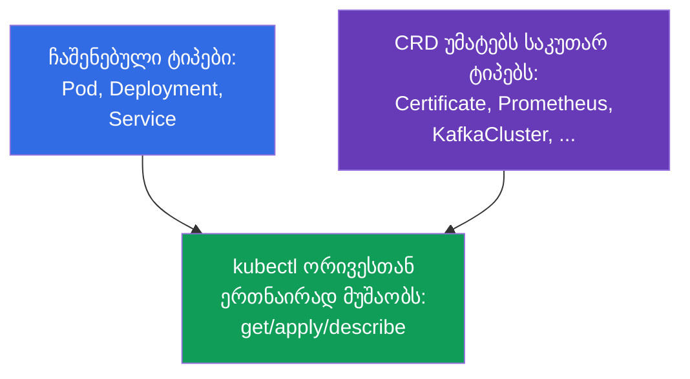
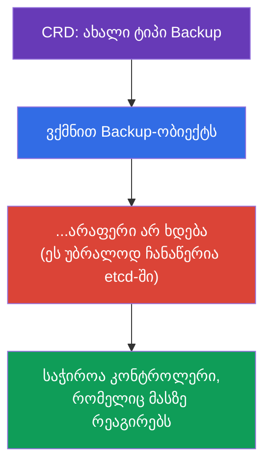
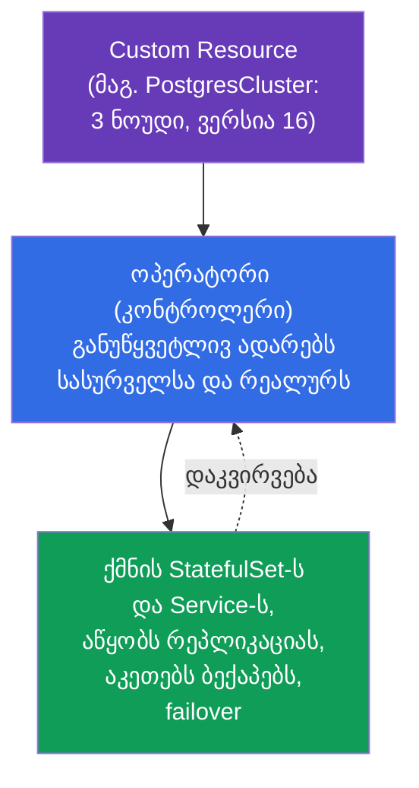
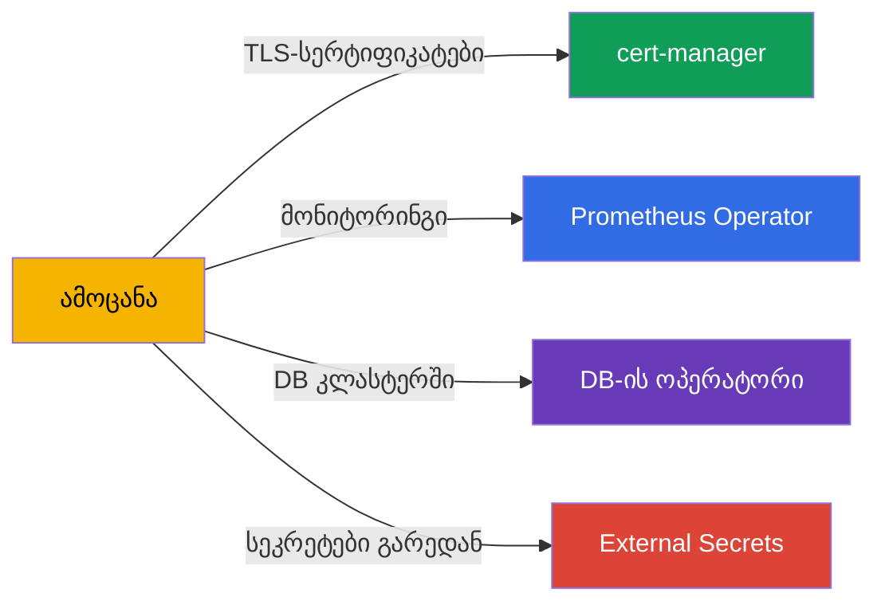
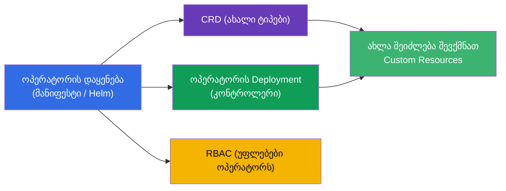
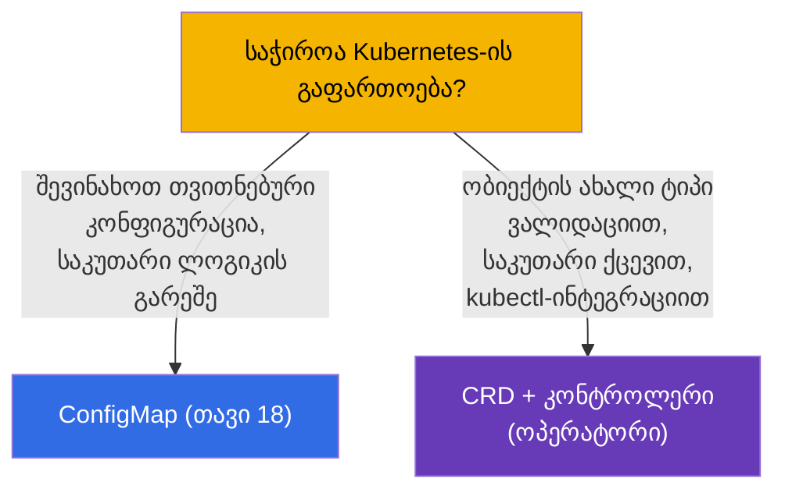
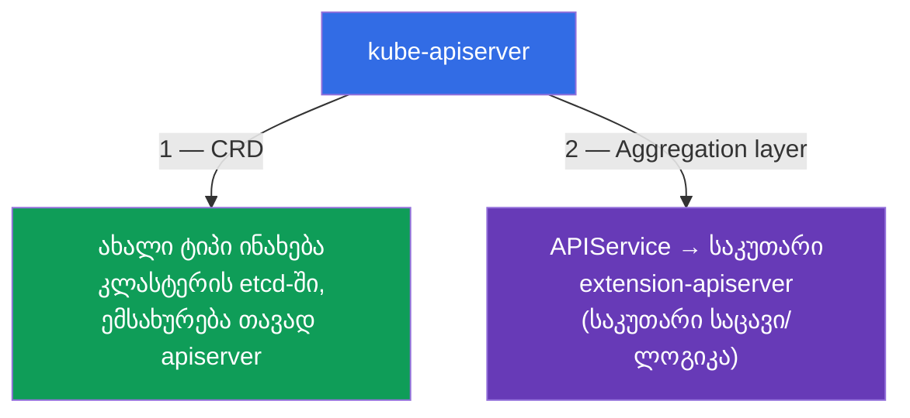

[Русская версия](ru.md) · [Eng version](README.md) · [Versión en español](es.md) · [Version française](fr.md) · [Deutsche Version](de.md) · [繁體中文版](tw.md) · [日本語版](jp.md)

# თავი 41. CRD და ოპერატორები

> 🟦 **თავი CKA-სთვის** (დომენი Cluster Architecture). თემა CKAD-შიც არის (გაფართოებები,
> Environment).
>
> **რა იქნება შემდეგ.** აქამდე Kubernetes-ის ჩაშენებულ ობიექტებთან ვმუშაობდით (Pod, Deployment,
> Service...). მაგრამ Kubernetes API შეიძლება **გავაფართოვოთ** საკუთარი ტიპებით - **CustomResourceDefinition
> (CRD)**-ის მეშვეობით. ხოლო **ოპერატორი** - კონტროლერია, რომელიც Kubernetes-ს ასწავლის, თქვენი აპლიკაცია
> ისევე მართოს, როგორც ჩაშენებული ობიექტები. ასე მუშაობს cert-manager, Prometheus Operator, კლასტერში
> მოთავსებული DB-ები. CKA-ის პროგრამა პირდაპირ მოითხოვს „CRD-ის გაგებას, ოპერატორების დაყენებასა და
> კონფიგურაციას“.

## 41.1. CRD: საკუთარი ტიპის ობიექტები API-ში

**CustomResourceDefinition (CRD)** Kubernetes API-ს უმატებს ობიექტების **ახალ სახეობას (kind)**.
CRD-ის დაყენების შემდეგ მასთან იმავე `kubectl get/apply`-ით შეიძლება მუშაობა, როგორც
ჩაშენებულ ობიექტებთან - Kubernetes მათ etcd-ში ინახავს და API-ის გავლით გასცემს.



```yaml
apiVersion: apiextensions.k8s.io/v1
kind: CustomResourceDefinition
metadata:
  name: backups.example.com
spec:
  group: example.com
  names:
    kind: Backup
    plural: backups
    singular: backup
  scope: Namespaced
  versions:
  - name: v1
    served: true
    storage: true
    schema:
      openAPIV3Schema:
        type: object
        properties:
          spec:
            type: object
            properties:
              schedule:
                type: string
```

CRD-ის გამოყენების შემდეგ ჩნდება ახალი ტიპი `Backup`, და შეიძლება მისი ეგზემპლარების შექმნა
(**Custom Resource, CR**):

```bash
kubectl get crd                    # დაყენებული CRD-ების სია
kubectl get backups                # ჩვენი ახალი ტიპის ეგზემპლარები
kubectl explain backup.spec        # მუშაობს CRD-სთვისაც
```

## 41.2. CRD - ეს მხოლოდ საცავია. საჭიროა კონტროლერი

უმნიშვნელოვანესი მომენტი: **თავისთავად CRD არაფერს არ აკეთებს**. ის ტიპს უმატებს და
ობიექტების შენახვის საშუალებას იძლევა, მაგრამ არანაირ მოქმედებას არ ასრულებს. შევქმენით
`Backup` - ის უბრალოდ etcd-ში იწვება, ბექაპი თავისით არ შესრულდება.



იმისთვის, რომ ობიექტმა რამე გააკეთოს, საჭიროა **კონტროლერი** - პროგრამა შეთანხმების მარყუჟით
(თავი 1), რომელიც ამ ტიპის ობიექტებს ადევნებს თვალს და რეალობას მათ `spec`-ს უსადაგებს. კავშირი
„CRD + მისი კონტროლერი“ სწორედ **ოპერატორია**.

## 41.3. ოპერატორი: კონტროლერი + დომენური ცოდნა

**ოპერატორი (operator)** - ეს კონტროლერია, რომელშიც „ჩაშენებულია“ ოპერაციული ცოდნა კონკრეტული
აპლიკაციის შესახებ. ის შეთანხმების მარყუჟის იდეას აფართოებს: როგორც ჩაშენებული კონტროლერი
ინახავს Pod-ების საჭირო რაოდენობას, ისე DB-ის ოპერატორს შეუძლია ბექაპების გაკეთება,
აღდგენა, failover, ვერსიის განახლება - ავტომატურად, საკუთარ CR-ებზე რეაგირებით.



იდეა: თქვენ დეკლარაციულად აღწერთ „მინდა PostgreSQL-ის კლასტერი 3 ნოუდისგან, ვერსია 16“, ხოლო
ოპერატორი ასრულებს ყველა რუტინას, რომელსაც სხვა შემთხვევაში ადამიანი-ადმინისტრატორი
შეასრულებდა. ოპერატორი = „ადამიანი-ოპერატორი, კოდში შეფუთული“.

## 41.4. ოპერატორების მაგალითები

ოპერატორები ყველგან არის; ბევრი ინსტრუმენტი, რომელიც ვახსენეთ, ოპერატორია:

| ოპერატორი | რას აკეთებს | CRD (მაგალითები) |
|----------|-----------|---------------|
| **cert-manager** | გამოსცემს და აახლებს TLS-სერტიფიკატებს (თავი 32) | Certificate, Issuer |
| **Prometheus Operator** | ათავსებს და აწყობს მონიტორინგს (თავი 28) | Prometheus, ServiceMonitor |
| **DB-ის ოპერატორები** | მართავენ PostgreSQL/MySQL/MongoDB-ს კლასტერში | PostgresCluster და მისთ. |
| **External Secrets** | ამოწევს სეკრეტებს Vault/Secrets Manager-იდან (თავი 19) | ExternalSecret |
| **Argo CD** | GitOps-მიწოდება (თავი 3) | Application |



## 41.5. ოპერატორის დაყენება

ჩვეულებრივ ოპერატორი პაკეტის სახით ყენდება, რომელიც მოაქვს: თავად CRD-ს (ახალ ტიპებს),
ოპერატორ-კონტროლერის Deployment-ს და საჭირო RBAC-ს (ოპერატორს ობიექტების მართვის უფლება სჭირდება).



დაყენების ხერხები: მანიფესტების გამოყენება (`kubectl apply -f`), Helm-ის მეშვეობით (თავი 42) ან
OLM-ის (Operator Lifecycle Manager) მეშვეობით. დაყენების შემდეგ ვქმნით Custom Resources-ს, ხოლო
ოპერატორი მათ ამუშავებს.

```bash
kubectl get crd                          # გამოჩნდა ახალი ტიპები?
kubectl get pods -n <namespace-ოპერატორის> # მუშაობს თუ არა ოპერატორის კონტროლერი?
kubectl apply -f my-custom-resource.yaml  # შევქმნათ CR — ოპერატორი მოახდენს რეაგირებას
```

## 41.6. CRD ჩაშენებული ობიექტებისა და ConfigMap-ის საპირწონედ

როდის უნდა გავაფართოვოთ API CRD-ით, და როდის საკმარისია ConfigMap? დიზაინის ხშირი კითხვა:



CRD გამართლებულია, როცა საჭიროა სრულფასოვანი API-ობიექტი: სქემითა და ვალიდაციით,
`kubectl get/describe`-ით, კონტროლერით, რომელიც მასზე რეაგირებს. თუ საჭიროა უბრალოდ
მონაცემების შენახვა საკუთარი ლოგიკის გარეშე - საკმარისია ConfigMap.

## 41.7. API-ის გაფართოების მეორე ხერხი: aggregation layer

CRD არ არის Kubernetes-ში ახალი ტიპების დამატების ერთადერთი ხერხი. არსებობს API-ის გაფართოების
ორი მექანიზმი, და მათი გარჩევა მნიშვნელოვანია:



- **CRD** (ზემოთ განყოფილებები) - დეკლარაციულად უმატებს ტიპს, მონაცემები კლასტერის **etcd**-ში იწვება,
  მოთხოვნებს ემსახურება თავად kube-apiserver. მარტივია, საკუთარი სერვერის კოდის გარეშე. შემთხვევების 90%.
- **Aggregation layer** - თქვენ არეგისტრირებთ ობიექტს **`APIService`**, რომელიც apiserver-ს
  ეუბნება: ამა და ამ API-ჯგუფის მოთხოვნები **გადაამისამართე** თქვენს ცალკე
  **extension-apiserver**-ზე. ის თავად წყვეტს, სად შეინახოს მონაცემები და რა ლოგიკა გამოიყენოს.

ზუსტად ასე მუშაობს **metrics-server**: ის არეგისტრირებს `APIService`-ს ჯგუფისთვის
`metrics.k8s.io`, და `kubectl top` (თავი 28) კულისებში აგრეგირებულ API-ში მიდის და არა
etcd-ში. aggregation layer-ის მეშვეობით apiserver მას front-proxy-სერტიფიკატით პოულობს
(`front-proxy-ca`, თავი 35).

```bash
kubectl get apiservices                      # API-ების სია, მათ შორის აგრეგირებულების
kubectl get apiservices | grep metrics       # v1beta1.metrics.k8s.io -> metrics-server
```

| | **CRD** | **Aggregation layer** |
|--|---------|------------------------|
| რას ვარეგისტრირებთ | `CustomResourceDefinition` | `APIService` + საკუთარი apiserver |
| სად არის მონაცემები | კლასტერის etcd-ში | სადაც extension-apiserver გადაწყვეტს |
| საკუთარი ლოგიკა/ვალიდაცია | webhook-ის მეშვეობით (თავი 21) | სრულიად საკუთარი (საკუთარი სერვერი) |
| სირთულე | დაბალი | მაღალი (საჭიროა და ემსახურება საკუთარი სერვერი) |
| მაგალითი | cert-manager, Prometheus (Certificate, Prometheus) | metrics-server (`metrics.k8s.io`) |

CKA-სთვის საკმარისია გვესმოდეს: **API-ის გაფართოების ორი ხერხი** - CRD (მარტივი, etcd-ში) და
aggregation layer (საკუთარი apiserver `APIService`-ის მეშვეობით, როგორც metrics-server-ს).

## 41.8. როგორ იყენებენ ამას პროდაქშენში

- **ოპერატორები - სტანდარტია რთული აპლიკაციებისთვის.** პროდში DB-ები, რიგები, მონიტორინგი,
  სერტიფიკატები, სეკრეტები ოპერატორებით იმართება: ისინი ავტომატიზირებენ რუტინას (ბექაპები,
  failover, როტაცია), რომელსაც სხვა შემთხვევაში მორიგე გააკეთებდა. ეს რთულ სისტემებს
  „declarative-friendly“-ს ხდის.
- **CRD პლატფორმას აფართოებს.** შიდა პლატფორმული გუნდები ხშირად შემოაქვთ საკუთარ CRD-ებს (მაგალითად,
  `Application`, `Environment`), რომ დეველოპერებმა საჭირო შედეგი მაღალ დონეზე აღწერონ, ხოლო პლატფორმულმა
  ოპერატორმა დეტალები გაშალოს. ეს internal developer platforms-ის საფუძველია.
- **ოპერატორების RBAC - ყურადღების ზონაა.** ოპერატორები ხშირად ფართო უფლებებს მოითხოვენ
  (არცთუ იშვიათად cluster-wide). ეს რისკია (თავი 38): ოპერატორის კომპრომეტირება = ბევრი
  ძალაუფლება. პროდში მათ უფლებებს განიხილავენ და შესაძლებლობის ფარგლებში ავიწროებენ.
- **CRD-ის ვერსირება.** CRD-ებს ვერსიები აქვთ (v1alpha1→v1), და ოპერატორების განახლებისას
  შესაძლებელია სქემების მიგრაციები და ვერსიების მოძველება (ეხმიანება თავ 29-ს) - ამას გეგმავენ,
  როგორც კლასტერის აპგრეიდებსაც.
- **ყველაფერი არ ღირს ოპერატორად გაკეთება.** ოპერატორი - ეს კოდია, რომელიც მხარდაჭერას
  საჭიროებს. მარტივ შემთხვევებს Helm/Kustomize (თავი 42-43) და ConfigMap წყვეტს; ოპერატორი
  გამართლებულია, როცა საჭიროა ზუსტად სასიცოცხლო ციკლის განუწყვეტელი ავტომატიზაცია.

## 41.9. მინი-ლექსიკონი

- **CRD (CustomResourceDefinition)** - API-ში ობიექტების ახალი ტიპის განსაზღვრება.
- **Custom Resource (CR)** - CRD-ით მოცემული ტიპის ეგზემპლარი.
- **ოპერატორი** - კონტროლერი + დომენური ცოდნა აპლიკაციის მართვის შესახებ.
- **კონტროლერი** - პროგრამა შეთანხმების მარყუჟით (რეალობას spec-ს უსადაგებს).
- **scope (Namespaced/Cluster)** - CRD-ის არეალი: namespace-ში თუ მთელ კლასტერზე.
- **OLM** - Operator Lifecycle Manager, ოპერატორების დაყენების/განახლების მექანიზმი.
- **cert-manager / Prometheus Operator** - პოპულარული ოპერატორები.
- **aggregation layer** - API-ის გაფართოება საკუთარი extension-apiserver-ის მეშვეობით.
- **APIService** - ობიექტი, რომელიც აგრეგირებულ API-ს არეგისტრირებს (მაგ. `metrics.k8s.io`).

## 41.10. თავის შეჯამება

- CRD API-ს უმატებს ობიექტების ახალ ტიპს; Custom Resources-თან იმავე `kubectl
  get/apply`-ით მუშაობენ, როგორც ჩაშენებულებთან.
- თავად CRD არაფერს არ აკეთებს - ეს მხოლოდ ტიპის საცავია; იმისთვის, რომ ობიექტმა რამე
  შეასრულოს, საჭიროა კონტროლერი.
- ოპერატორი = CRD + კონტროლერი დომენური ცოდნით; ავტომატიზირებს აპლიკაციის სასიცოცხლო ციკლს
  (ბექაპები, failover, განახლებები) შეთანხმების მარყუჟის მეშვეობით.
- ოპერატორების მაგალითები: cert-manager, Prometheus Operator, DB-ის ოპერატორები, External
  Secrets, Argo CD.
- ოპერატორის დაყენება მოაქვს CRD + კონტროლერის Deployment + RBAC; ხერხები - მანიფესტები,
  Helm, OLM.
- CRD გამართლებულია ლოგიკის მქონე სრულფასოვანი ობიექტის ტიპისთვის; მონაცემების მარტივი
  შენახვისთვის - ConfigMap.

- API-ს ორი ხერხით აფართოებენ: CRD (ტიპი etcd-ში, ემსახურება apiserver) და aggregation
  layer (საკუთარი extension-apiserver `APIService`-ის მეშვეობით, როგორც metrics-server).

## 41.11. როგორ გამოგადგებათ: გამოცდაზე და რეალურ სამუშაოში

**გამოცდაზე (CKA).** პროგრამა მოითხოვს „CRD-ის გაგებას, ოპერატორების დაყენებასა და
კონფიგურაციას“. მოსალოდნელია დავალებები „გამოიყენე CRD და შექმენი Custom Resource“, „დააყენე
ოპერატორი და შეამოწმე, რომ მისი კონტროლერი მუშაობს“. საკვანძო გაგება - CRD მხოლოდ ინახავს,
მოქმედებებს ასრულებს კონტროლერი/ოპერატორი.

**რეალურ სამუშაოში.** ოპერატორები - ეს რთული სისტემების (DB, მონიტორინგი, სერტიფიკატები)
დეკლარაციულად და ავტომატურად მართვის ხერხია. CRD - ორგანიზაციის საჭიროებებზე პლატფორმის
გაფართოების საფუძველია. კავშირის „CRD + კონტროლერი“ გაგება და ოპერატორების უფლებებზე
ყურადღება - მოწიფული კლასტერის დაპროექტებისა და უსაფრთხოების ნაწილია.

## 41.12. თვითშემოწმების კითხვები

1. რას უმატებს CRD კლასტერს და როგორ ვიმუშაოთ ამის შემდეგ ახალ ობიექტებთან?
2. რატომ არ აკეთებს თავისთავად CRD არაფერს? რა არის საჭირო, რომ ობიექტმა რამე შეასრულოს?
3. რა არის ოპერატორი და როგორ არის დაკავშირებული შეთანხმების მარყუჟთან?
4. მოიყვანეთ ოპერატორების მაგალითები და რას ავტომატიზირებენ ისინი.
5. რას მოაქვს ოპერატორის დაყენება და როგორ შევამოწმოთ, რომ ის მუშაობს?
6. როდის უნდა გავაფართოვოთ API CRD-ით, და როდის საკმარისია ConfigMap?
7. რატომ არის ოპერატორების RBAC-უფლებები გაზრდილი ყურადღების ზონა?
8. რით განსხვავდება aggregation layer-ით (`APIService`) გაფართოება CRD-სგან? მოიყვანეთ მაგალითი.

## პრაქტიკა

გავარჩიეთ API-ის გაფართოება. თავებში 42-43 - მანიფესტების შეფუთვისა და კონფიგურაციის
ინსტრუმენტები (Helm და Kustomize), რომლებითაც სხვათა შორის ოპერატორებსაც აყენებენ. CRD და
ოპერატორები ადმინისტრირების ლაბორატორიულებში მუშავდება.

🧪 ლაბი 115 (CRD და ოპერატორები): [tasks/cka/labs/115](../../labs/115/README_GE.MD)

---
[სარჩევი](../README_GE.md) · [თავი 40](../40/ge.md) · [თავი 42](../42/ge.md)
