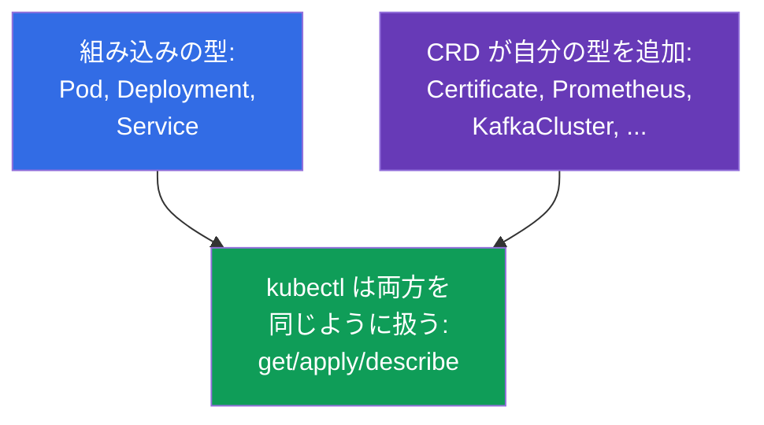
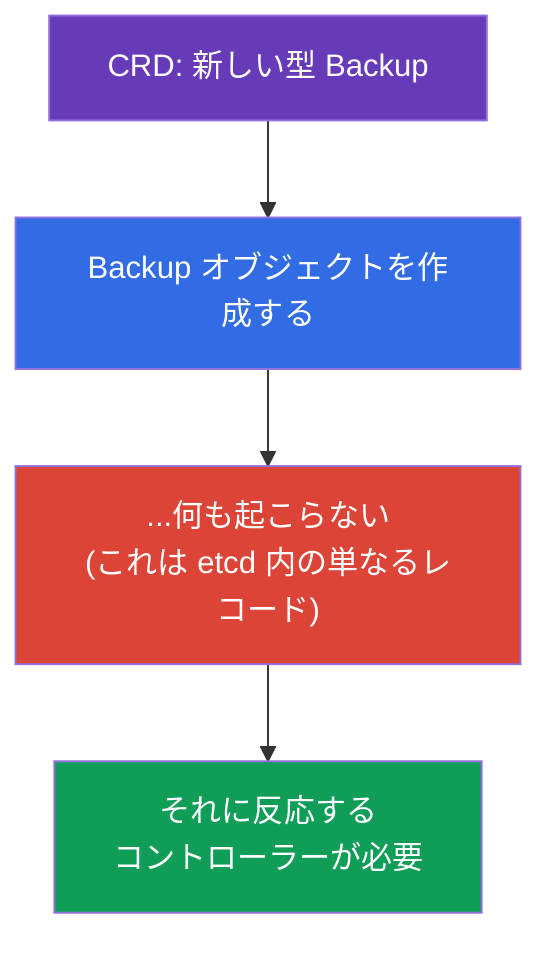
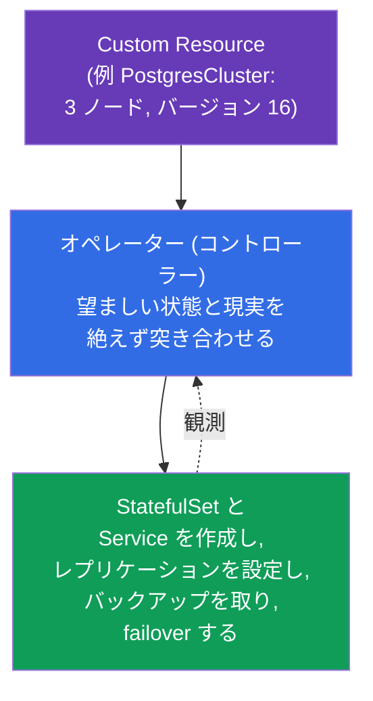
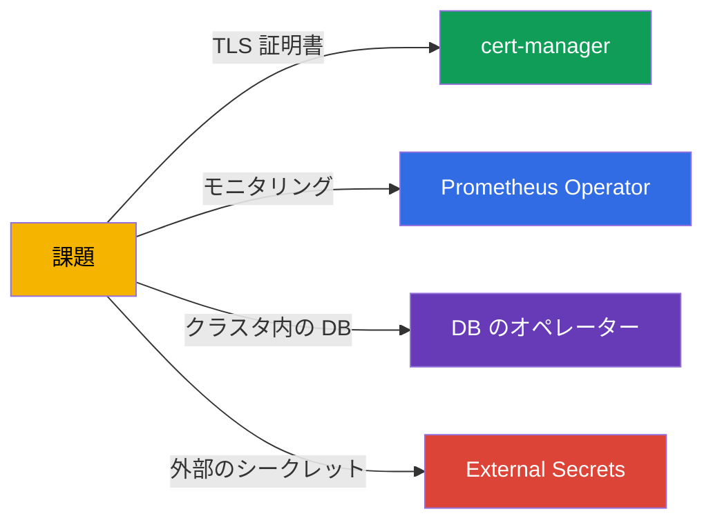
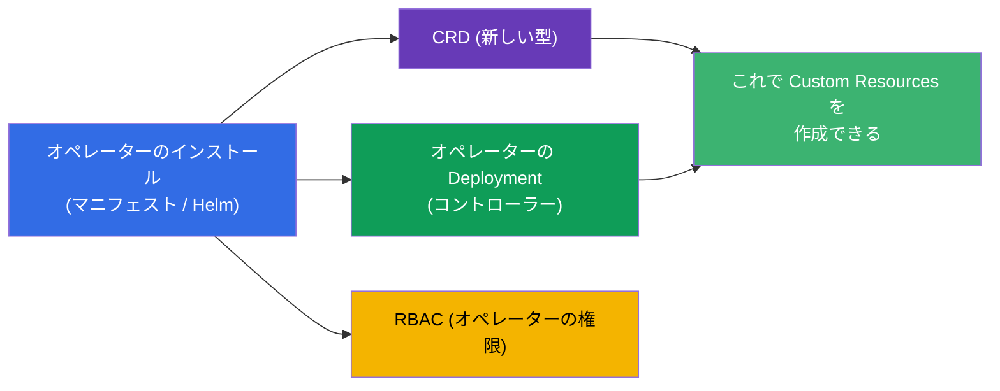
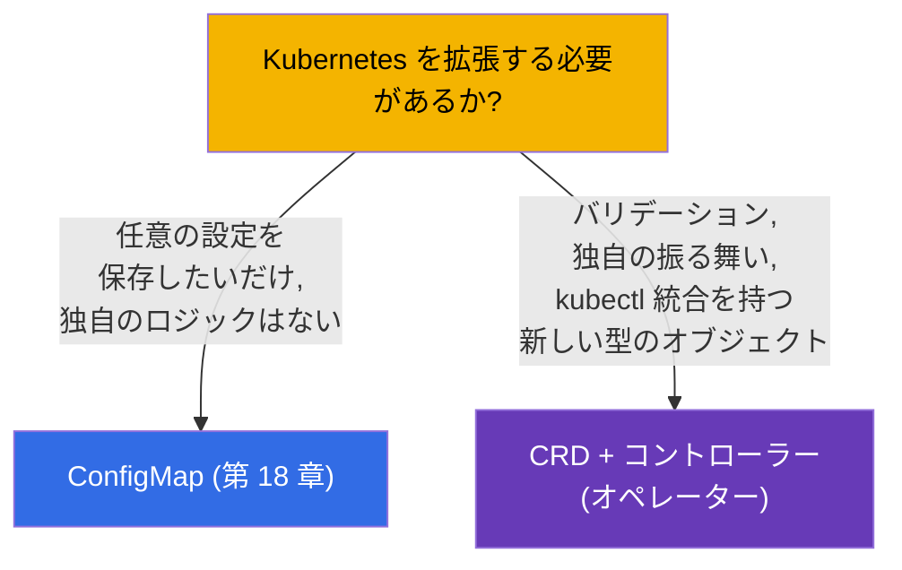
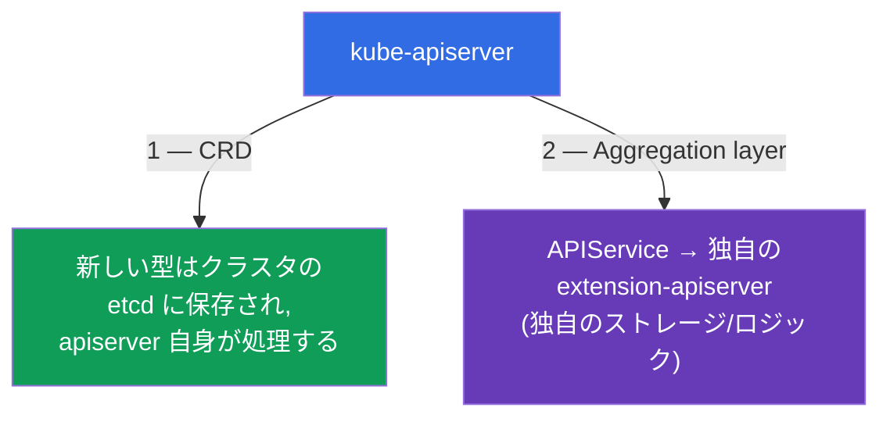

[Русская версия](ru.md) · [Eng version](README.md) · [Versión en español](es.md) · [Version française](fr.md) · [Deutsche Version](de.md) · [ქართული ვერსია](ge.md) · [繁體中文版](tw.md)

# 第 41 章。CRD とオペレーター

> 🟦 **CKA 向けの章**（Cluster Architecture 領域）。このテーマは CKAD にもあります（拡張、
> Environment）。
>
> **次に何を学ぶか。** ここまでは Kubernetes の組み込みオブジェクト（Pod、Deployment、
> Service...）を扱ってきました。しかし Kubernetes API は自分のオブジェクト型で
> **拡張** できます - **CustomResourceDefinition (CRD)** を通して。そして **オペレーター** とは、
> あなたのアプリケーションを組み込みオブジェクトと同じように管理する方法を Kubernetes に
> 教えるコントローラーです。cert-manager、Prometheus Operator、クラスタ内のデータベースは
> こうして動いています。CKA の出題範囲は「CRD を理解し、オペレーターをインストールして
> 設定する」ことを明確に要求しています。

## 41.1. CRD：API に自分のオブジェクト型を追加する

**CustomResourceDefinition (CRD)** は Kubernetes API に **新しい種類 (kind)** の
オブジェクトを追加します。CRD をインストールしたあとは、組み込みオブジェクトと同じ
`kubectl get/apply` で扱えます - Kubernetes はそれらを etcd に保存し、API を通して返します。



```yaml
apiVersion: apiextensions.k8s.io/v1
kind: CustomResourceDefinition
metadata:
  name: backups.example.com
spec:
  group: example.com
  names:
    kind: Backup
    plural: backups
    singular: backup
  scope: Namespaced
  versions:
  - name: v1
    served: true
    storage: true
    schema:
      openAPIV3Schema:
        type: object
        properties:
          spec:
            type: object
            properties:
              schedule:
                type: string
```

CRD を適用すると新しい型 `Backup` が現れ、そのインスタンス
(**Custom Resource, CR**) を作成できるようになります：

```bash
kubectl get crd                    # インストール済み CRD の一覧
kubectl get backups                # 新しい型のインスタンス
kubectl explain backup.spec        # CRD に対しても動作する
```

## 41.2. CRD は保存場所にすぎない。コントローラーが必要

もっとも重要な点：**CRD それ自体は何もしません**。型を追加してオブジェクトを保存
できるようにするだけで、いかなる動作も行いません。`Backup` を作成しても、それは単に
etcd に置かれるだけで、バックアップは自動的に実行されません。



オブジェクトが何かを行うためには **コントローラー** が必要です - 調整ループ（第 1 章）を
持つプログラムで、その型のオブジェクトを監視し、現実を `spec` に合わせていきます。
「CRD + そのためのコントローラー」という組み合わせこそが **オペレーター** です。

## 41.3. オペレーター：コントローラー + ドメイン知識

**オペレーター (operator)** とは、特定のアプリケーションについての運用知識が
「組み込まれた」コントローラーです。調整ループの考え方を拡張したもので、組み込みの
コントローラーが必要な Pod 数を保つのと同じように、DB のオペレーターはバックアップ、
リストア、failover、バージョンアップを自動で - 自分の CR に反応して - 行えます。



考え方はこうです：あなたは「バージョン 16 の 3 ノードからなる PostgreSQL クラスタが
ほしい」と宣言的に記述し、オペレーターは本来なら人間の管理者が行う雑務のすべてを
こなします。オペレーター = 「コードにパッケージされた人間のオペレーター」です。

## 41.4. オペレーターの例

オペレーターはいたるところにあります。これまで触れてきた多くのツールはオペレーターです：

| オペレーター | 何をするか | CRD (例) |
|----------|-----------|---------------|
| **cert-manager** | TLS 証明書を発行・更新する（第 32 章） | Certificate, Issuer |
| **Prometheus Operator** | モニタリングを展開・設定する（第 28 章） | Prometheus, ServiceMonitor |
| **DB のオペレーター** | クラスタ内の PostgreSQL/MySQL/MongoDB を管理する | PostgresCluster など |
| **External Secrets** | Vault/Secrets Manager からシークレットを取得する（第 19 章） | ExternalSecret |
| **Argo CD** | GitOps によるデリバリー（第 3 章） | Application |



## 41.5. オペレーターのインストール

通常、オペレーターはパッケージとしてインストールされ、そのパッケージが持ち込むのは：
CRD 本体（新しい型）、オペレーターのコントローラーの Deployment、そして必要な RBAC
（オペレーターにはオブジェクトを管理する権限が必要です）。



インストールの方法：マニフェストを適用する (`kubectl apply -f`)、Helm 経由（第 42 章）、
または OLM (Operator Lifecycle Manager) 経由。インストール後に Custom Resources を作成し、
オペレーターがそれらを処理します。

```bash
kubectl get crd                          # 新しい型が現れたか?
kubectl get pods -n <namespace-オペレーター> # オペレーターのコントローラーは動いているか?
kubectl apply -f my-custom-resource.yaml  # CR を作成 - オペレーターが反応する
```

## 41.6. CRD と組み込みオブジェクト・ConfigMap の比較

どんなときに CRD で API を拡張し、どんなときに ConfigMap で十分なのでしょうか。
設計でよく出る問いです：



CRD が正当化されるのは、本格的な API オブジェクトが必要なときです：スキーマと
バリデーションを持ち、`kubectl get/describe` が使え、それに反応するコントローラーが
ある場合。独自のロジックなしに単にデータを保存したいだけなら - ConfigMap で十分です。

## 41.7. API を拡張するもう 1 つの方法：aggregation layer

CRD は Kubernetes に新しい型を追加する唯一の方法ではありません。API 拡張の仕組みは
2 つあり、それらを区別することが重要です：



- **CRD**（上のセクション）- 宣言的に型を追加し、データはクラスタの **etcd** にあり、
  リクエストは kube-apiserver 自身が処理します。単純で、自分のサーバーのコードは不要です。
  90% のケースはこれです。
- **Aggregation layer** - あなたは **`APIService`** というオブジェクトを登録し、それが
  apiserver に伝えます：この API グループへのリクエストは、あなたの別の
  **extension-apiserver** へ **プロキシ** せよ、と。そのサーバーがデータの保存先と適用する
  ロジックを自分で決めます。

まさにこの方法で **metrics-server** は動いています：`metrics.k8s.io` グループ用の
`APIService` を登録し、`kubectl top`（第 28 章）は内部で etcd ではなく集約された API を
呼び出します。apiserver は aggregation layer を通して、front-proxy 証明書
(`front-proxy-ca`、第 35 章) によってそれを見つけます。

```bash
kubectl get apiservices                      # 集約された API も含む API の一覧
kubectl get apiservices | grep metrics       # v1beta1.metrics.k8s.io -> metrics-server
```

| | **CRD** | **Aggregation layer** |
|--|---------|------------------------|
| 何を登録するか | `CustomResourceDefinition` | `APIService` + 独自の apiserver |
| データの置き場所 | クラスタの etcd | extension-apiserver が決める場所 |
| 独自のロジック/バリデーション | webhook 経由（第 21 章） | 完全に独自（自分のサーバー） |
| 複雑さ | 低い | 高い（自分のサーバーが必要で、その運用も必要） |
| 例 | cert-manager, Prometheus (Certificate, Prometheus) | metrics-server (`metrics.k8s.io`) |

CKA では次を理解していれば十分です：**API 拡張には 2 つの方法がある** - CRD（単純、
etcd に保存）と aggregation layer（metrics-server のように `APIService` 経由の独自 apiserver）。

## 41.8. 本番環境でこれをどう使うか

- **オペレーターは複雑なアプリケーションの標準。** 本番では DB、キュー、モニタリング、
  証明書、シークレットはオペレーターで管理されます：本来なら当番のエンジニアが行う雑務
  （バックアップ、failover、ローテーション）を自動化します。これによって複雑なシステムが
  「declarative-friendly」になります。
- **CRD はプラットフォームを拡張する。** 社内のプラットフォームチームは、開発者が
  高レベルに必要なものを記述し、プラットフォームのオペレーターが詳細を展開できるよう、
  独自の CRD（たとえば `Application`、`Environment`）を導入することがよくあります。これが
  internal developer platforms の基礎です。
- **オペレーターの RBAC は注意すべき領域。** オペレーターはしばしば広い権限（多くの場合
  cluster-wide）を要求します。これはリスクです（第 38 章）：オペレーターの侵害 = 大きな
  権限の掌握。本番ではその権限をレビューし、可能な範囲で絞り込みます。
- **CRD のバージョニング。** CRD にはバージョンがあり (v1alpha1→v1)、オペレーターの更新時に
  スキーマの移行やバージョンの廃止が起こりえます（第 29 章と呼応します）- クラスタの
  アップグレードと同様に、これは計画して行います。
- **すべてをオペレーターにする必要はない。** オペレーターは保守が必要なコードです。
  単純なケースは Helm/Kustomize（第 42-43 章）と ConfigMap で解決します。オペレーターが
  正当化されるのは、まさにライフサイクルの継続的な自動化が必要なときです。

## 41.9. ミニ用語集

- **CRD (CustomResourceDefinition)** - API における新しいオブジェクト型の定義。
- **Custom Resource (CR)** - CRD で定義された型のインスタンス。
- **オペレーター** - コントローラー + アプリケーション管理についてのドメイン知識。
- **コントローラー** - 調整ループを持つプログラム（現実を spec に合わせる）。
- **scope (Namespaced/Cluster)** - CRD の適用範囲：namespace 内かクラスタ全体か。
- **OLM** - Operator Lifecycle Manager、オペレーターのインストール/更新の仕組み。
- **cert-manager / Prometheus Operator** - よく使われるオペレーター。
- **aggregation layer** - 独自の extension-apiserver による API の拡張。
- **APIService** - 集約された API を登録するオブジェクト（例 `metrics.k8s.io`）。

## 41.10. 本章のまとめ

- CRD は API に新しいオブジェクト型を追加します。Custom Resources は組み込みのものと
  同じ `kubectl get/apply` で扱えます。
- CRD 自体は何もしません - 型の保存場所にすぎません。オブジェクトが何かを実行するには
  コントローラーが必要です。
- オペレーター = CRD + ドメイン知識を持つコントローラー。調整ループを通してアプリケーションの
  ライフサイクル（バックアップ、failover、更新）を自動化します。
- オペレーターの例：cert-manager、Prometheus Operator、DB のオペレーター、External Secrets、
  Argo CD。
- オペレーターのインストールは CRD + コントローラーの Deployment + RBAC を持ち込みます。方法は
  マニフェスト、Helm、OLM です。
- CRD はロジックを伴う本格的なオブジェクト型に適しています。単純なデータの保存には -
  ConfigMap です。

- API は 2 つの方法で拡張します：CRD（型は etcd にあり、apiserver が処理する）と aggregation
  layer（metrics-server のように `APIService` 経由の独自 extension-apiserver）。

## 41.11. これがどう役に立つか：試験と実際の仕事で

**試験では (CKA)。** 出題範囲は「CRD を理解し、オペレーターをインストールして設定する」ことを
要求します。「CRD を適用して Custom Resource を作成する」「オペレーターをインストールし、
そのコントローラーが動いていることを確認する」といった課題が想定されます。鍵となる理解は -
CRD は保存するだけで、動作を行うのはコントローラー/オペレーターだということです。

**実際の仕事では。** オペレーターは複雑なシステム（DB、モニタリング、証明書）を宣言的かつ
自動的に管理する方法です。CRD は組織のニーズに合わせてプラットフォームを拡張する基礎です。
「CRD + コントローラー」という組み合わせの理解と、オペレーターの権限への注意は、成熟した
クラスタの設計とセキュリティの一部です。

## 41.12. 自己チェックの質問

1. CRD はクラスタに何を追加し、そのあと新しいオブジェクトはどう扱いますか？
2. なぜ CRD 自体は何もしないのですか？オブジェクトが何かを実行するには何が必要ですか？
3. オペレーターとは何で、調整ループとどう関係しますか？
4. オペレーターの例と、それらが自動化するものを挙げてください。
5. オペレーターのインストールは何を持ち込み、動いていることはどう確認しますか？
6. どんなときに CRD で API を拡張し、どんなときに ConfigMap で十分ですか？
7. なぜオペレーターの RBAC 権限は特に注意すべき領域なのですか？
8. aggregation layer (`APIService`) による拡張は CRD とどう違いますか？例を挙げてください。

## 演習

API の拡張を見てきました。第 42-43 章では、マニフェストのパッケージングと設定のツール
(Helm と Kustomize) を扱います。オペレーターのインストールにもそれらを使います。CRD と
オペレーターは管理系のラボで練習します。

🧪 ラボ 115 (CRD とオペレーター)：[tasks/cka/labs/115](../../labs/115/README_JP.MD)

---
[目次](../README_JP.md) · [第 40 章](../40/jp.md) · [第 42 章](../42/jp.md)
