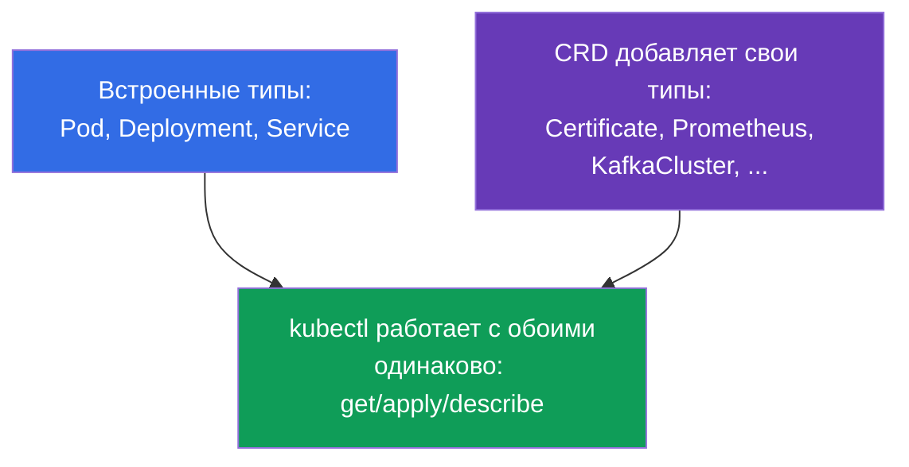
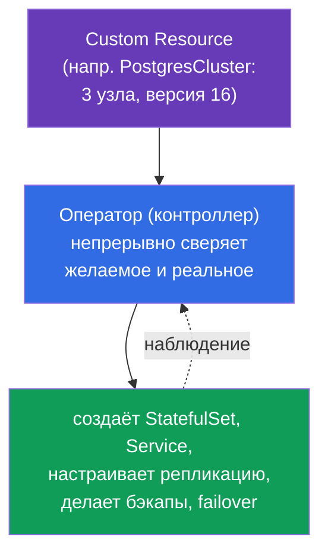
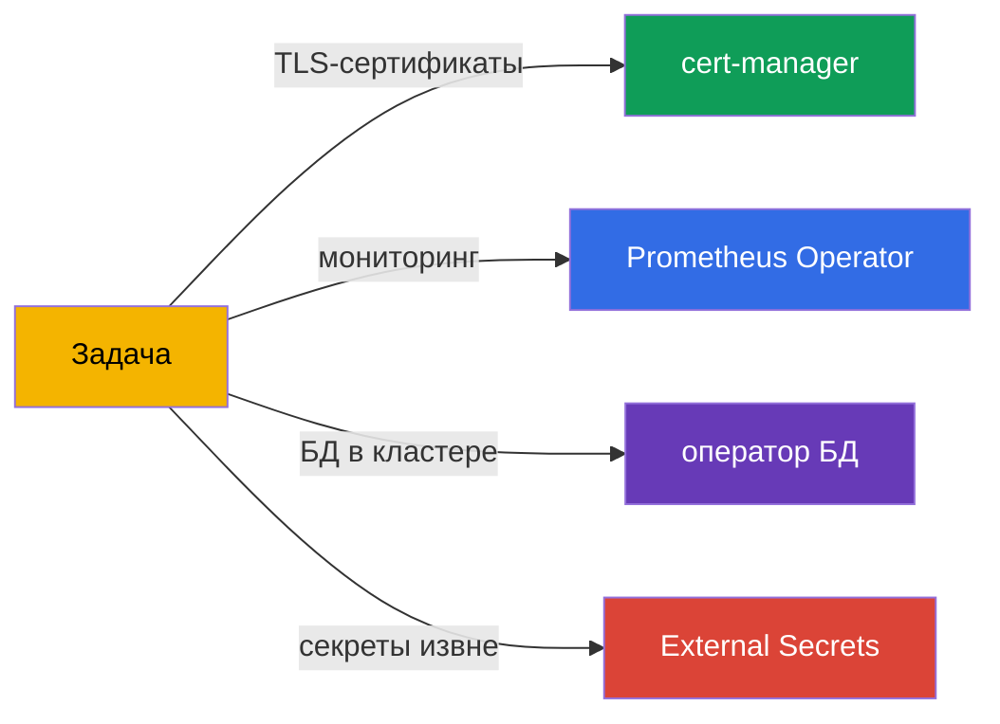
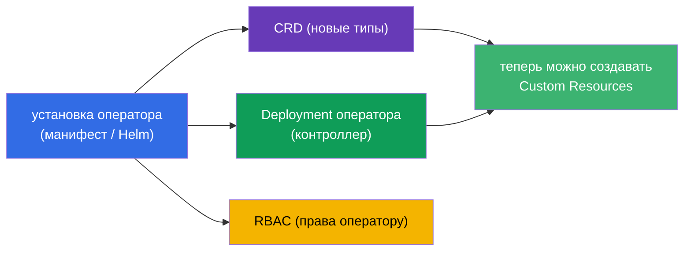
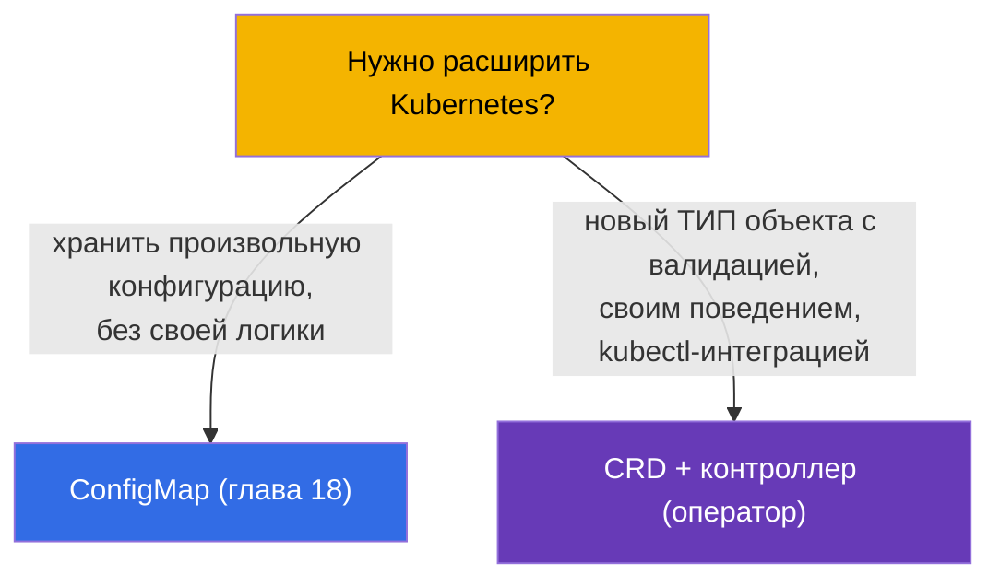
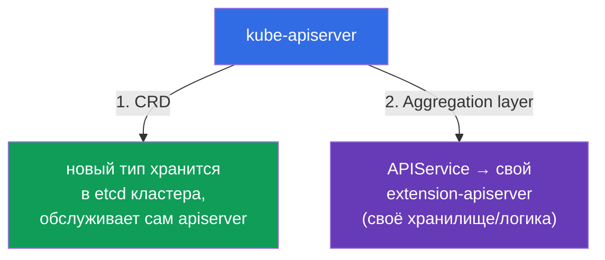

# Глава 41. CRD и операторы

> 🟦 **Глава для CKA** (домен Cluster Architecture). Тема есть и в CKAD (расширения,
> Environment).
>
> **Что дальше.** До сих пор мы работали со встроенными объектами Kubernetes (Pod,
> Deployment, Service...). Но Kubernetes API можно **расширять** своими типами объектов -
> через **CustomResourceDefinition (CRD)**. А **оператор** - это контроллер, который учит
> Kubernetes управлять вашим приложением так же, как встроенными объектами. Это то, как
> работают cert-manager, Prometheus Operator, базы данных в кластере. Программа CKA прямо
> требует «понимать CRD, устанавливать и настраивать операторы».

## 41.1. CRD: свои типы объектов в API

**CustomResourceDefinition (CRD)** добавляет в Kubernetes API **новый вид (kind)**
объектов. После установки CRD с ним можно работать теми же `kubectl get/apply`, что и со
встроенными объектами - Kubernetes хранит их в etcd и отдаёт через API.



```yaml
apiVersion: apiextensions.k8s.io/v1
kind: CustomResourceDefinition
metadata:
  name: backups.example.com
spec:
  group: example.com
  names:
    kind: Backup
    plural: backups
    singular: backup
  scope: Namespaced
  versions:
  - name: v1
    served: true
    storage: true
    schema:
      openAPIV3Schema:
        type: object
        properties:
          spec:
            type: object
            properties:
              schedule: {type: string}
```

После применения CRD появляется новый тип `Backup`, и можно создавать его экземпляры
(**Custom Resource, CR**):

```bash
kubectl get crd                    # список установленных CRD
kubectl get backups                # экземпляры нашего нового типа
kubectl explain backup.spec        # работает и для CRD
```

## 41.2. CRD - это только хранилище. Нужен контроллер

Важнейший момент: **сам по себе CRD ничего не делает**. Он добавляет тип и позволяет
хранить объекты, но не совершает никаких действий. Создали `Backup` - он просто лежит в
etcd, бэкап сам не выполнится.


Чтобы объект что-то делал, нужен **контроллер** - программа с петлёй согласования (глава
1), которая следит за объектами этого типа и приводит реальность к их `spec`. Связка
«CRD + контроллер под него» и есть **оператор**.

## 41.3. Оператор: контроллер + доменные знания

**Оператор (operator)** - это контроллер, в который «зашиты» операционные знания о
конкретном приложении. Он расширяет идею петли согласования: как встроенный контроллер
держит нужное число подов, так оператор БД умеет делать бэкапы, восстановление, failover,
обновление версии - автоматически, реагируя на свои CR.



Идея: вы декларативно описываете «хочу кластер PostgreSQL из 3 узлов версии 16», а оператор
делает всю рутину, которую иначе выполнял бы человек-администратор. Оператор = «человек-
оператор, упакованный в код».

## 41.4. Примеры операторов

Операторы - повсеместны; многие инструменты, что мы упоминали, - это операторы:

| Оператор | Что делает | CRD (примеры) |
|----------|-----------|---------------|
| **cert-manager** | выпускает и продлевает TLS-сертификаты (глава 32) | Certificate, Issuer |
| **Prometheus Operator** | разворачивает и настраивает мониторинг (глава 28) | Prometheus, ServiceMonitor |
| **операторы БД** | управляют PostgreSQL/MySQL/MongoDB в кластере | PostgresCluster и т.п. |
| **External Secrets** | тянет секреты из Vault/Secrets Manager (глава 19) | ExternalSecret |
| **Argo CD** | GitOps-доставка (глава 3) | Application |



## 41.5. Установка оператора

Обычно оператор устанавливается как пакет, который приносит: сам CRD (новые типы),
Deployment контроллера-оператора и нужный RBAC (оператору надо право управлять объектами).



Способы установки: применить манифесты (`kubectl apply -f`), через Helm (глава 42) или
через OLM (Operator Lifecycle Manager). После установки создаём Custom Resources, а
оператор их обрабатывает.

```bash
kubectl get crd                          # появились новые типы?
kubectl get pods -n <namespace-оператора> # работает ли контроллер оператора?
kubectl apply -f my-custom-resource.yaml  # создать CR — оператор среагирует
```

## 41.6. CRD против встроенных объектов и ConfigMap

Когда расширять API через CRD, а когда хватит ConfigMap? Частый вопрос дизайна:



CRD оправдан, когда нужен полноценный объект API: со схемой и валидацией, с
`kubectl get/describe`, с контроллером, который на него реагирует. Если нужно просто
хранить данные без своей логики - достаточно ConfigMap.

## 41.7. Второй способ расширить API: aggregation layer

CRD - не единственный способ добавить в Kubernetes новые типы. Есть два механизма
расширения API, и их важно различать:



- **CRD** (разделы выше) - декларативно добавляет тип, данные лежат в **etcd** кластера,
  запросы обслуживает сам kube-apiserver. Просто, без своего кода-сервера. 90% случаев.
- **Aggregation layer** - вы регистрируете объект **`APIService`**, который говорит
  apiserver'у: запросы к такой-то API-группе **проксировать** на ваш отдельный
  **extension-apiserver**. Тот сам решает, где хранить данные и какую логику применять.

Именно так работает **metrics-server**: он регистрирует `APIService` для группы
`metrics.k8s.io`, и `kubectl top` (глава 28) под капотом ходит в агрегированный API, а не
в etcd. Через aggregation layer apiserver и находит его front-proxy-сертификатом
(`front-proxy-ca`, глава 35).

```bash
kubectl get apiservices                      # список API, в т.ч. агрегированных
kubectl get apiservices | grep metrics       # v1beta1.metrics.k8s.io -> metrics-server
```

| | **CRD** | **Aggregation layer** |
|--|---------|------------------------|
| Что регистрируем | `CustomResourceDefinition` | `APIService` + свой apiserver |
| Где данные | в etcd кластера | где решит extension-apiserver |
| Своя логика/валидация | через webhook (глава 21) | полностью своя (свой сервер) |
| Сложность | низкая | высокая (нужен и обслуживается свой сервер) |
| Пример | cert-manager, Prometheus (Certificate, Prometheus) | metrics-server (`metrics.k8s.io`) |

Для CKA достаточно понимать: **два способа расширения API** - CRD (просто, в etcd) и
aggregation layer (свой apiserver через `APIService`, как у metrics-server).

## 41.8. Как это применяют в продакшене

- **Операторы - стандарт для сложных приложений.** В проде БД, очереди, мониторинг,
  сертификаты, секреты управляются операторами: они автоматизируют рутину (бэкапы,
  failover, ротацию), которую иначе делал бы дежурный. Это делает сложные системы
  «declarative-friendly».
- **CRD расширяют платформу.** Внутренние платформенные команды часто вводят свои CRD
  (например, `Application`, `Environment`), чтобы разработчики описывали нужное高-уровнево,
  а платформенный оператор разворачивал детали. Это основа internal developer platforms.
- **RBAC операторов - зона внимания.** Операторы часто требуют широких прав (нередко
  cluster-wide). Это риск (глава 38): компрометация оператора = много власти. В проде их
  права ревьюят и по возможности сужают.
- **Версионирование CRD.** CRD имеют версии (v1alpha1→v1), и при обновлении операторов
  возможны миграции схем и устаревание версий (перекликается с главой 29) - это планируют,
  как и апгрейды кластера.
- **Не всё стоит делать оператором.** Оператор - это код, который надо поддерживать.
  Простые случаи решают Helm/Kustomize (глава 42-43) и ConfigMap; оператор оправдан, когда
  нужна именно непрерывная автоматизация жизненного цикла.

## 41.9. Мини-глоссарий

- **CRD (CustomResourceDefinition)** - определение нового типа объектов в API.
- **Custom Resource (CR)** - экземпляр типа, заданного CRD.
- **Оператор** - контроллер + доменные знания об управлении приложением.
- **Контроллер** - программа с петлёй согласования (приводит реальность к spec).
- **scope (Namespaced/Cluster)** - область CRD: в namespace или на весь кластер.
- **OLM** - Operator Lifecycle Manager, механизм установки/обновления операторов.
- **cert-manager / Prometheus Operator** - популярные операторы.
- **aggregation layer** - расширение API через свой extension-apiserver.
- **APIService** - объект, регистрирующий агрегированный API (напр. `metrics.k8s.io`).

## 41.10. Итоги главы

- CRD добавляет в API новый тип объектов; с Custom Resources работают те же `kubectl
  get/apply`, что и со встроенными.
- Сам CRD ничего не делает - это только хранилище типа; чтобы объект что-то выполнял, нужен
  контроллер.
- Оператор = CRD + контроллер с доменными знаниями; автоматизирует жизненный цикл
  приложения (бэкапы, failover, обновления) через петлю согласования.
- Примеры операторов: cert-manager, Prometheus Operator, операторы БД, External Secrets,
  Argo CD.
- Установка оператора приносит CRD + Deployment контроллера + RBAC; способы - манифесты,
  Helm, OLM.
- CRD оправдан для полноценного типа объекта с логикой; для простого хранения данных -
  ConfigMap.

- API расширяют двумя способами: CRD (тип в etcd, обслуживает apiserver) и aggregation
  layer (свой extension-apiserver через `APIService`, как metrics-server).

## 41.11. Как это пригодится: на экзамене и в реальной работе

**На экзамене (CKA).** Программа требует «понимать CRD, устанавливать и настраивать
операторы». Ожидаются задания «примени CRD и создай Custom Resource», «установи оператор и
проверь, что его контроллер работает». Ключевое понимание - CRD только хранит, действия
совершает контроллер/оператор.

**В реальной работе.** Операторы - способ управлять сложными системами (БД, мониторинг,
сертификаты) декларативно и автоматически. CRD - основа расширения платформы под нужды
организации. Понимание связки «CRD + контроллер» и внимание к правам операторов - часть
проектирования и безопасности зрелого кластера.

## 41.12. Вопросы для самопроверки

1. Что добавляет CRD в кластер и как после этого работать с новыми объектами?
2. Почему сам по себе CRD ничего не делает? Что нужно, чтобы объект что-то выполнял?
3. Что такое оператор и как он связан с петлёй согласования?
4. Приведите примеры операторов и что они автоматизируют.
5. Что приносит установка оператора и как проверить, что он работает?
6. Когда расширять API через CRD, а когда достаточно ConfigMap?
7. Почему RBAC-права операторов - зона повышенного внимания?
8. Чем расширение через aggregation layer (`APIService`) отличается от CRD? Приведите пример.

## Практика

Мы разобрали расширение API. В главах 42-43 - инструменты упаковки и настройки манифестов
(Helm и Kustomize), которыми в том числе устанавливают операторы. CRD и операторы
отрабатываются в лабах по администрированию.

🧪 Лаба 115 (CRD и операторы): [tasks/cka/labs/115](../../labs/115/README_RU.MD)

---
[Оглавление](../README_RU.md) · [Глава 40](../40/ru.md) · [Глава 42](../42/ru.md)
