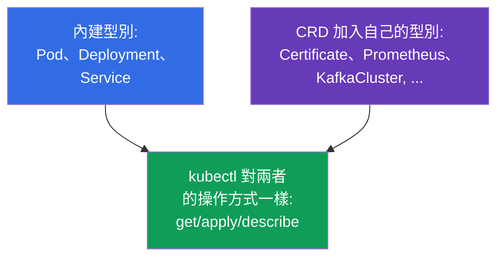
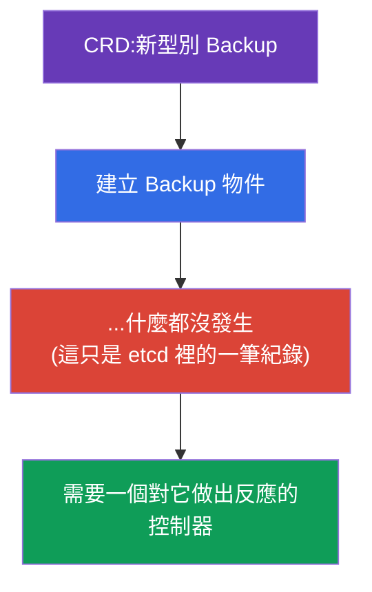
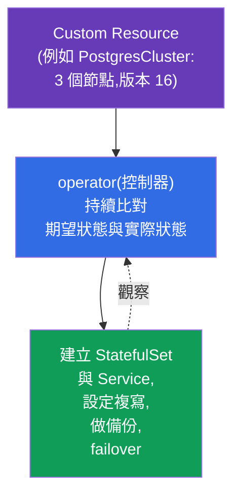
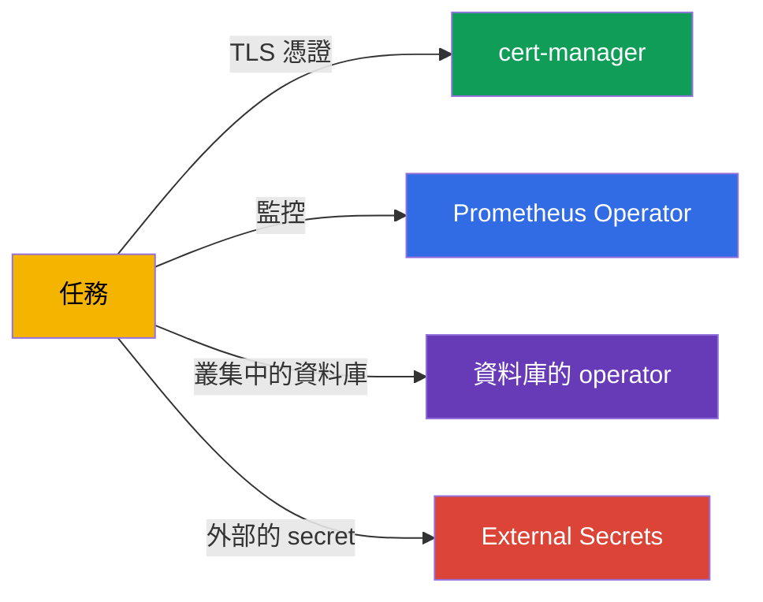
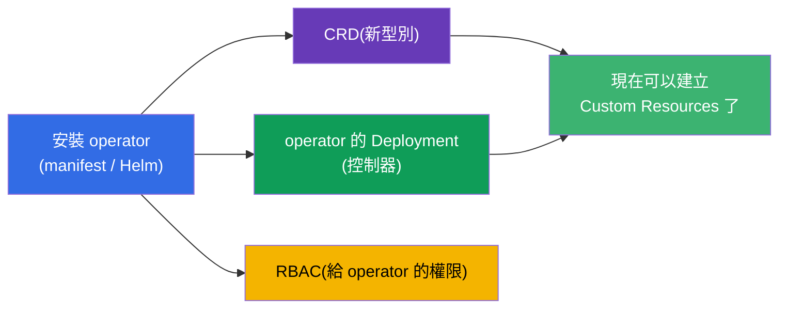
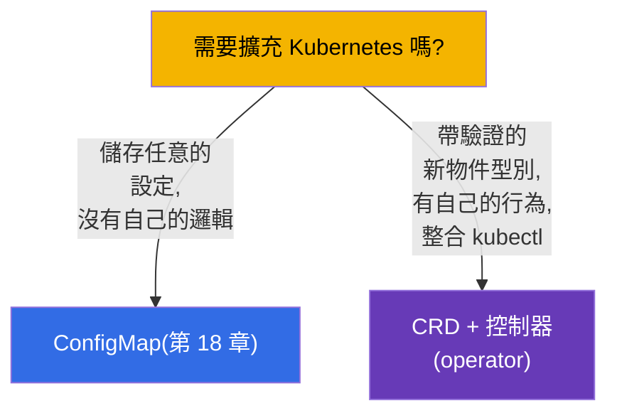
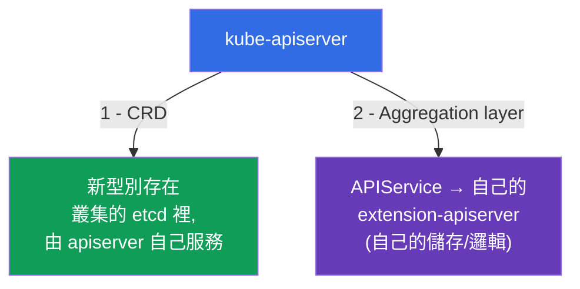

[Русская версия](ru.md) · [Eng version](README.md) · [Versión en español](es.md) · [Version française](fr.md) · [Deutsche Version](de.md) · [ქართული ვერსია](ge.md) · [日本語版](jp.md)

# 第 41 章。CRD 與 operator

> 🟦 **CKA 章節**(領域 Cluster Architecture)。這個主題在 CKAD 也有(擴充機制、
> Environment)。
>
> **接下來是什麼。** 到目前為止我們都在操作 Kubernetes 的內建物件(Pod、
> Deployment、Service...)。但是 Kubernetes API 是可以用自己的物件型別來**擴充**的 -
> 透過 **CustomResourceDefinition (CRD)**。而 **operator** 則是一個控制器,它教會
> Kubernetes 像管理內建物件那樣去管理你的應用。cert-manager、Prometheus Operator、
> 叢集內的資料庫就是這樣運作的。CKA 大綱明確要求「理解 CRD,安裝並設定 operator」。

## 41.1. CRD:在 API 中加入自己的物件型別

**CustomResourceDefinition (CRD)** 為 Kubernetes API 加入一種**新的種類 (kind)**
物件。安裝 CRD 之後,就可以用跟內建物件一樣的 `kubectl get/apply` 來操作它 -
Kubernetes 把它們存在 etcd 裡,並透過 API 提供出來。



```yaml
apiVersion: apiextensions.k8s.io/v1
kind: CustomResourceDefinition
metadata:
  name: backups.example.com
spec:
  group: example.com
  names:
    kind: Backup
    plural: backups
    singular: backup
  scope: Namespaced
  versions:
  - name: v1
    served: true
    storage: true
    schema:
      openAPIV3Schema:
        type: object
        properties:
          spec:
            type: object
            properties:
              schedule:
                type: string
```

套用 CRD 之後就出現了新的型別 `Backup`,接著可以建立它的實例
(**Custom Resource, CR**):

```bash
kubectl get crd                    # 已安裝的 CRD 清單
kubectl get backups                # 我們新型別的實例
kubectl explain backup.spec        # 對 CRD 也有效
```

## 41.2. CRD 只是儲存空間。還需要控制器

最重要的一點:**CRD 本身什麼都不做**。它加入型別、讓你可以儲存物件,但不會執行任何
動作。你建立了 `Backup` - 它就只是躺在 etcd 裡,備份不會自己跑起來。



要讓物件真的做事,就需要**控制器** - 一個帶有調諧迴圈的程式(第 1 章),它監看這個
型別的物件,並讓現實逼近它們的 `spec`。「CRD + 為它而寫的控制器」這個組合就是
**operator**。

## 41.3. operator:控制器 + 領域知識

**operator** 是一種控制器,裡面「內建」了關於某個具體應用的運維知識。它把調諧迴圈的
想法再往前推:就像內建控制器會維持所需的 Pod 數量,資料庫的 operator 會做備份、還原、
failover、版本升級 - 全部自動完成,並對自己的 CR 做出反應。



想法是:你用宣告式的方式描述「我要一個 3 個節點、版本 16 的 PostgreSQL 叢集」,而
operator 就去做那些原本要由人類管理員完成的例行工作。operator = 「被打包成程式碼的
人類維運人員」。

## 41.4. operator 的範例

operator 到處都是;我們提過的許多工具其實就是 operator:

| operator | 做什麼 | CRD(範例) |
|----------|-----------|---------------|
| **cert-manager** | 簽發並續期 TLS 憑證(第 32 章) | Certificate、Issuer |
| **Prometheus Operator** | 部署並設定監控(第 28 章) | Prometheus、ServiceMonitor |
| **資料庫的 operator** | 管理叢集中的 PostgreSQL/MySQL/MongoDB | PostgresCluster 等 |
| **External Secrets** | 從 Vault/Secrets Manager 拉取 secret(第 19 章) | ExternalSecret |
| **Argo CD** | GitOps 交付(第 3 章) | Application |



## 41.5. 安裝 operator

operator 通常是以一個套件的形式安裝,它會帶來:CRD 本身(新型別)、operator 控制器的
Deployment,以及必要的 RBAC(operator 需要管理物件的權限)。



安裝方式:套用 manifest(`kubectl apply -f`)、透過 Helm(第 42 章),或透過
OLM (Operator Lifecycle Manager)。安裝之後我們建立 Custom Resources,由 operator
去處理它們。

```bash
kubectl get crd                          # 新型別出現了嗎?
kubectl get pods -n <operator 的 namespace> # operator 的控制器有在跑嗎?
kubectl apply -f my-custom-resource.yaml  # 建立 CR - operator 會做出反應
```

## 41.6. CRD 與內建物件和 ConfigMap 的比較

什麼時候該用 CRD 擴充 API,什麼時候 ConfigMap 就夠了?這是常見的設計問題:



當你需要一個完整的 API 物件時,CRD 才站得住腳:有 schema 與驗證、可以用
`kubectl get/describe`、有一個控制器會對它做出反應。如果只是要單純儲存資料而沒有
自己的邏輯 - ConfigMap 就夠了。

## 41.7. 擴充 API 的第二種方式:aggregation layer

CRD 並不是把新型別加進 Kubernetes 的唯一方式。擴充 API 有兩種機制,把它們區分開來
很重要:



- **CRD**(上面的各節) - 以宣告式的方式加入型別,資料放在叢集的 **etcd** 裡,
  請求由 kube-apiserver 自己處理。簡單,不需要自己的伺服器程式碼。九成的情況都用它。
- **Aggregation layer** - 你註冊一個 **`APIService`** 物件,它告訴
  apiserver:對某個 API 群組的請求要**代理**到你自己獨立的
  **extension-apiserver**。那台伺服器自己決定資料存在哪裡、要套用什麼邏輯。

**metrics-server** 就是這樣運作的:它為 `metrics.k8s.io` 群組註冊了 `APIService`,
於是 `kubectl top`(第 28 章)底下其實是去查聚合的 API,而不是 etcd。apiserver 也是
透過 aggregation layer,用 front-proxy 憑證(`front-proxy-ca`,第 35 章)去找到它的。

```bash
kubectl get apiservices                      # API 清單,包含聚合的 API
kubectl get apiservices | grep metrics       # v1beta1.metrics.k8s.io -> metrics-server
```

| | **CRD** | **Aggregation layer** |
|--|---------|------------------------|
| 註冊什麼 | `CustomResourceDefinition` | `APIService` + 自己的 apiserver |
| 資料在哪裡 | 在叢集的 etcd 裡 | 由 extension-apiserver 決定 |
| 自己的邏輯/驗證 | 透過 webhook(第 21 章) | 完全自己來(自己的伺服器) |
| 複雜度 | 低 | 高(要有自己的伺服器並負責維運) |
| 範例 | cert-manager、Prometheus(Certificate、Prometheus) | metrics-server(`metrics.k8s.io`) |

對 CKA 來說,理解這點就夠了:**擴充 API 有兩種方式** - CRD(簡單,在 etcd 裡)與
aggregation layer(透過 `APIService` 的自己的 apiserver,像 metrics-server 那樣)。

## 41.8. 這些在生產環境中怎麼用

- **operator 是複雜應用的標準做法。** 生產環境裡的資料庫、佇列、監控、憑證、secret
  都由 operator 管理:它們把原本要值班人員來做的例行工作(備份、failover、輪替)
  自動化。這讓複雜系統變得「declarative-friendly」。
- **CRD 擴充平台。** 內部平台團隊常常引入自己的 CRD(例如 `Application`、
  `Environment`),讓開發者用高層次的方式描述需求,再由平台的 operator 去展開細節。
  這是 internal developer platform 的基礎。
- **operator 的 RBAC 是需要留意的地方。** operator 常常需要很大的權限(往往是
  cluster-wide)。這是一個風險(第 38 章):operator 被攻破 = 攻擊者拿到很大的權力。
  生產環境會 review 它們的權限,並盡可能收窄。
- **CRD 的版本管理。** CRD 有版本(v1alpha1→v1),升級 operator 時可能會有 schema
  遷移與版本淘汰(和第 29 章相呼應) - 這要跟叢集升級一樣事先規劃。
- **不是什麼都值得做成 operator。** operator 是程式碼,要有人維護。簡單的情況用
  Helm/Kustomize(第 42-43 章)和 ConfigMap 就能解決;只有真正需要對生命週期做持續
  自動化時,operator 才站得住腳。

## 41.9. 小辭典

- **CRD (CustomResourceDefinition)** - 在 API 中定義一個新的物件型別。
- **Custom Resource (CR)** - 由 CRD 所定義型別的實例。
- **operator** - 控制器 + 關於管理某個應用的領域知識。
- **控制器** - 帶有調諧迴圈的程式(讓現實逼近 spec)。
- **scope (Namespaced/Cluster)** - CRD 的作用範圍:在 namespace 內或整個叢集。
- **OLM** - Operator Lifecycle Manager,安裝/更新 operator 的機制。
- **cert-manager / Prometheus Operator** - 常見的 operator。
- **aggregation layer** - 透過自己的 extension-apiserver 擴充 API。
- **APIService** - 註冊聚合 API 的物件(例如 `metrics.k8s.io`)。

## 41.10. 本章總結

- CRD 為 API 加入新的物件型別;操作 Custom Resources 用的是跟內建物件一樣的 `kubectl
  get/apply`。
- CRD 本身什麼都不做 - 它只是那個型別的儲存空間;要讓物件真的執行動作,就需要
  控制器。
- operator = CRD + 帶領域知識的控制器;透過調諧迴圈把應用的生命週期
  (備份、failover、升級)自動化。
- operator 的範例:cert-manager、Prometheus Operator、資料庫的 operator、
  External Secrets、Argo CD。
- 安裝 operator 會帶來 CRD + 控制器的 Deployment + RBAC;方式有 manifest、
  Helm、OLM。
- 需要一個帶邏輯的完整物件型別時才用 CRD;若只是單純儲存資料 -
  用 ConfigMap。

- 擴充 API 有兩種方式:CRD(型別在 etcd 裡,由 apiserver 服務)與 aggregation
  layer(透過 `APIService` 的自己的 extension-apiserver,像 metrics-server)。

## 41.11. 這些在哪裡用得上:考試與實際工作

**在考試中(CKA)。** 大綱要求「理解 CRD,安裝並設定 operator」。可以預期的題目是
「套用 CRD 並建立 Custom Resource」、「安裝一個 operator 並確認它的控制器有在跑」。
關鍵的理解是 - CRD 只負責儲存,真正執行動作的是控制器/operator。

**在實際工作中。** operator 是用宣告式且自動化的方式管理複雜系統(資料庫、監控、
憑證)的手段。CRD 則是依組織需求擴充平台的基礎。理解「CRD + 控制器」這個組合,並留意
operator 的權限 - 是設計與保護一個成熟叢集的一部分。

## 41.12. 自我檢查問題

1. CRD 為叢集加入了什麼,之後要怎麼操作這些新物件?
2. 為什麼 CRD 本身什麼都不做?要讓物件真的執行動作需要什麼?
3. 什麼是 operator,它跟調諧迴圈有什麼關係?
4. 舉出一些 operator 的例子,以及它們把什麼自動化了。
5. 安裝 operator 會帶來什麼,怎麼檢查它有在運作?
6. 什麼時候要用 CRD 擴充 API,什麼時候 ConfigMap 就夠了?
7. 為什麼 operator 的 RBAC 權限是需要特別留意的地方?
8. 透過 aggregation layer(`APIService`)擴充跟 CRD 有什麼不同?舉個例子。

## 實踐

我們把 API 的擴充講完了。第 42-43 章要講的是打包與設定 manifest 的工具
(Helm 與 Kustomize),operator 也常常是用它們來安裝的。CRD 與 operator
會在管理相關的實驗中操練。

🧪 實驗 115(CRD 與 operator):[tasks/cka/labs/115](../../labs/115/README_TW.MD)

🎮 Killercoda（在瀏覽器中，無需安裝）：[Install a Database Operator](https://killercoda.com/chadmcrowell/course/cka/database-operator) · [Create your own Operator in Kubernetes](https://killercoda.com/chadmcrowell/scenario/create-operator)

---
[目錄](../README_TW.md) · [第 40 章](../40/tw.md) · [第 42 章](../42/tw.md)
