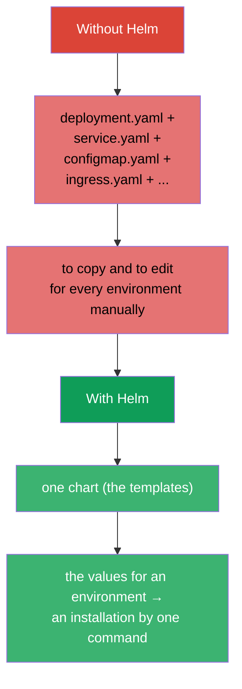
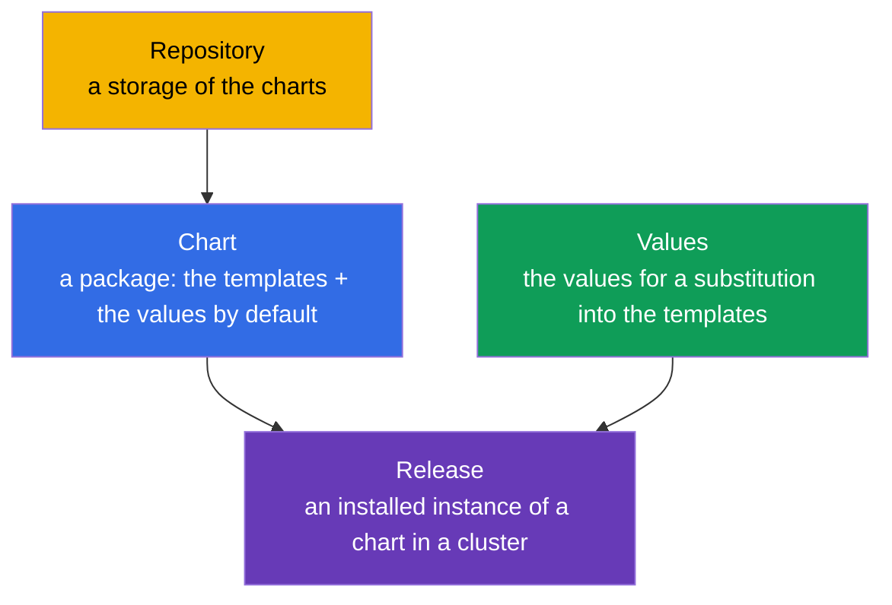
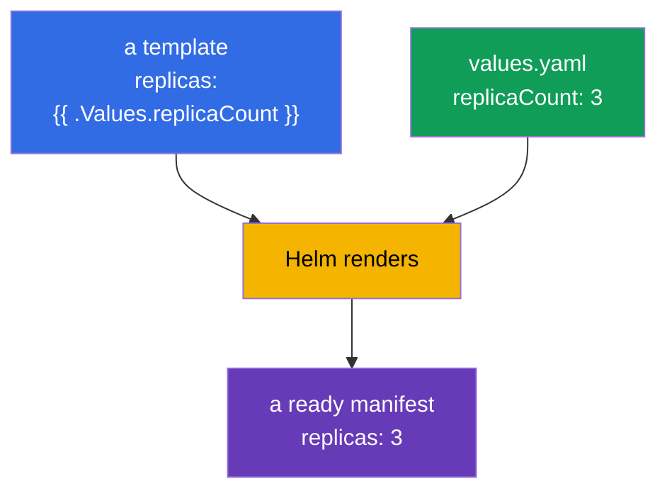
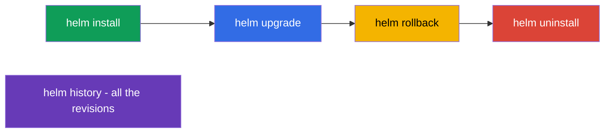
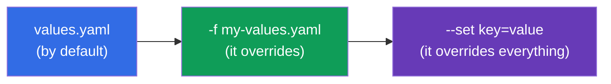
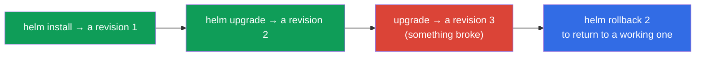

[Русская версия](ru.md) · [Versión en español](es.md) · [Version française](fr.md) · [Deutsche Version](de.md) · [ქართული ვერსია](ge.md) · [繁體中文版](tw.md) · [日本語版](jp.md)

# Chapter 42. Helm

> 🟦 **A chapter for the CKA** (a domain Cluster Architecture: "to use Helm and Kustomize for
> an installation of the components"). The theme is in the CKAD too (a use of the packages).
>
> **What comes next.** We installed a lot of things through `kubectl apply -f`. But a real
> application - these are the dozens of the manifests (Deployment, Service, ConfigMap, Ingress...), and moreover
> with the different values for dev/prod. To manage them separately is hard. **Helm** - this is
> a "manager of the packages for Kubernetes": it packs the manifests into a reusable
> templatable package (a chart) and manages its installation as a single whole.

## 42.1. A problem, which Helm solves

Without Helm every application - this is a scattering of the YAML files, which have to be applied,
versioned and parameterized manually for every environment.



Helm gives: a packing of a set of the manifests into a **chart**, a **templating** (the same templates -
the different values for the environments), a management of the **releases** (an installation/an upgrade/a rollback as a single
whole) and the **repositories** of the ready packages.

## 42.2. The key notions of Helm



| A notion | What this is |
|---------|---------|
| **Chart** | a package of Helm: the templates of the manifests + the values by default + the metadata |
| **Values** | the parameters, substituted into the templates (they override the values by default) |
| **Release** | a concrete installation of a chart in a cluster (with a name and a history of the revisions) |
| **Repository** | a storage of the charts (as a registry of the images, but for the charts) |

A key idea: **one chart → many releases** with the different values (one chart of PostgreSQL
can be installed as `db-dev` and `db-prod` with the different settings).

## 42.3. A structure of a chart

A chart - this is a directory of a set structure:

```
mychart/
├── Chart.yaml          # the metadata: a name, a version
├── values.yaml         # the values by default
├── templates/          # the templates of the manifests
│   ├── deployment.yaml
│   ├── service.yaml
│   └── _helpers.tpl    # the auxiliary templates
└── charts/             # the dependencies (the nested charts)
```

The templates use the variables from the values through a syntax of the Go templates:

```yaml
# templates/deployment.yaml
spec:
  replicas: {{ .Values.replicaCount }}      # it will be substituted from the values
  template:
    spec:
      containers:
      - image: {{ .Values.image.repository }}:{{ .Values.image.tag }}
```

```yaml
# values.yaml (the values by default)
replicaCount: 3
image:
  repository: nginx
  tag: "1.27"
```



## 42.4. The main commands of Helm

```bash
# The repositories
helm repo add bitnami https://charts.bitnami.com/bitnami
helm repo update
helm search repo nginx                 # to find a chart

# An installation / an upgrade
helm install my-release bitnami/nginx                    # to install
helm install my-release bitnami/nginx --set replicaCount=5   # with a parameter
helm install my-release bitnami/nginx -f my-values.yaml      # with your own values
helm upgrade my-release bitnami/nginx -f my-values.yaml      # to upgrade

# A viewing and a management
helm list                              # the installed releases
helm status my-release
helm history my-release                # a history of the revisions
helm rollback my-release 1             # a rollback to a revision
helm uninstall my-release              # to delete

# It is useful for a debugging - what will really be applied
helm template my-release bitnami/nginx -f my-values.yaml   # to render locally
```



## 42.5. An overriding of the values

The values by default from `values.yaml` are overridden by two ways (by an ascending of a
priority):

| A way | An example | When |
|--------|--------|-------|
| your own values file | `-f prod-values.yaml` | many parameters, the environments |
| `--set` in a command line | `--set replicaCount=5` | a pinpoint overriding |



This is how one chart is adapted for the environments: `-f dev-values.yaml` and `-f prod-values.yaml` with
the different replicas, the resources, the hosts.

## 42.6. Helm and the releases: install/upgrade/rollback

Helm manages an application as a **single release** with a history - it is similar to a Deployment (the chapter
8), but at a level of a whole set of the manifests:



Helm stores a history of the revisions of a release (in the Secrets of a cluster), therefore `helm rollback` can
return a whole set of the objects to a previous state by one command - it is convenient at an unsuccessful
upgrade.

## 42.7. How this is applied in a production

- **Helm - a standard of an installation of a ready software.** The Ingress controllers, cert-manager, Prometheus,
  the DB, the operators (the chapter 41) are almost always installed by the Helm charts: one command instead of the dozens of
  the manifests, with the parameters for your own environment.
- **The values for the environments + GitOps.** In a production the values files (dev/stage/prod) are stored in git, and
  a GitOps instrument applies them (Argo CD/Flux, the chapter 3) - often Argo CD renders the Helm
  charts by itself. This is how one chart serves all the environments reproducibly.
- **Your own charts for your own applications.** The teams pack their own services into the charts (or a common
  "library" chart), in order to roll out the dozens of the similar services uniformly.
- **A carefulness with helm upgrade.** A careless upgrade can recreate the resources or
  touch the data (for example, a PVC). In a production before an upgrade they look at `helm diff`/`helm template`,
  in order to understand, what exactly will change.
- **Helm vs Kustomize.** Helm is strong by a templating and by an ecosystem of the ready charts; for a more
  simple "overlaying of the changes" onto the base manifests Kustomize is used (the chapter 43).
  Often they are combined.

## 42.8. A mini glossary

- **Helm** - a manager of the packages for Kubernetes.
- **A chart** - a package: the templates of the manifests + the values + the metadata.
- **The values** - the parameters for a substitution into the templates.
- **A release** - an installed instance of a chart (with a history of the revisions).
- **A repository** - a storage of the charts.
- **helm install/upgrade/rollback/uninstall** - a life cycle of a release.
- **--set / -f** - an overriding of the values in a CLI / by a file.
- **helm template** - a local render of a chart into the manifests (for a check).

## 42.9. The conclusions of the chapter

- Helm - a manager of the packages of Kubernetes: it packs a set of the manifests into a templatable chart
  and manages it as a single release.
- The notions: a Chart (a package), the Values (the parameters), a Release (an installation), a Repository (a storage);
  one chart → many releases with the different values.
- A chart - a directory with `Chart.yaml`, `values.yaml`, `templates/`; the templates substitute
  the values through `{{ .Values.* }}`.
- The commands: repo add/update, install, upgrade, rollback, uninstall, list, history; `helm
  template` renders locally for a check.
- The values are overridden by a file (`-f`) and by `--set` (the highest priority) - this is how they are adapted for the
  environments.
- Helm keeps a history of the revisions of a release, therefore `helm rollback` rolls back a whole set of the
  objects by one command.

## 42.10. How this will come in handy: at an exam and in a real work

**At an exam.** A program of the CKA includes a use of Helm. The tasks "install
a component by a Helm chart", "upgrade/roll back a release", "override a value through --set/values" are expected.
It is needed to know the commands install/upgrade/rollback/list and how to pass the values. A deep
writing of the charts is usually not required.

**In a real work.** Helm - a main way to install a ready software and to roll out your own services:
one command, the parameters for an environment, a rollback of a release. In a bundle with GitOps (the values in git, Argo CD)
this is a foundation of a reproducible delivery. An understanding of the releases and a carefulness with an upgrade -
the everyday skills of an operation.

## 42.11. The questions for a self-check

1. Which problem does Helm solve in comparison with `kubectl apply -f`?
2. What are a chart, the values and a release? How are the different installations obtained out of one chart?
3. Of what does a directory of a chart consist and how do the templates use the values?
4. How to override the values at an installation and which priority do `--set` and `-f` have?
5. How to look at a history of a release and to roll it back?
6. What for is `helm template` needed before an installation/an upgrade?
7. How does Helm differ from Kustomize by an approach?

## Practice

We have mastered a packing and an installation through Helm. In the chapter 43 - an alternative approach to a configuring
of the manifests without the templates: Kustomize. Helm is practised in the labs on an administration (including
at an installation of the components of a cluster).

🧪 A lab 115 (Helm): [tasks/cka/labs/115](../../labs/115/README.MD)

---
[Contents](../README.md) · [Chapter 41](../41/README.md) · [Chapter 43](../43/README.md)
