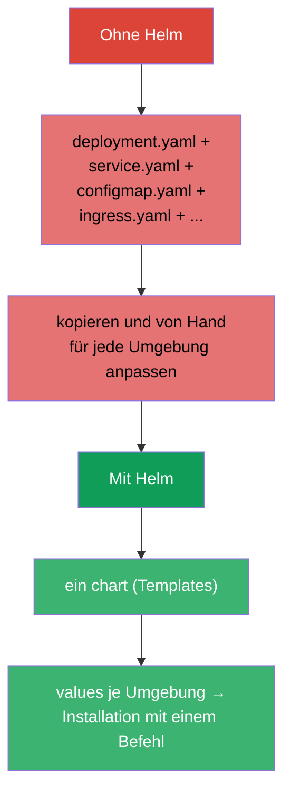
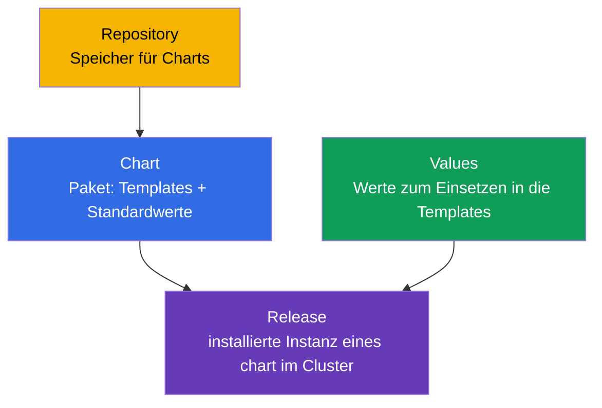
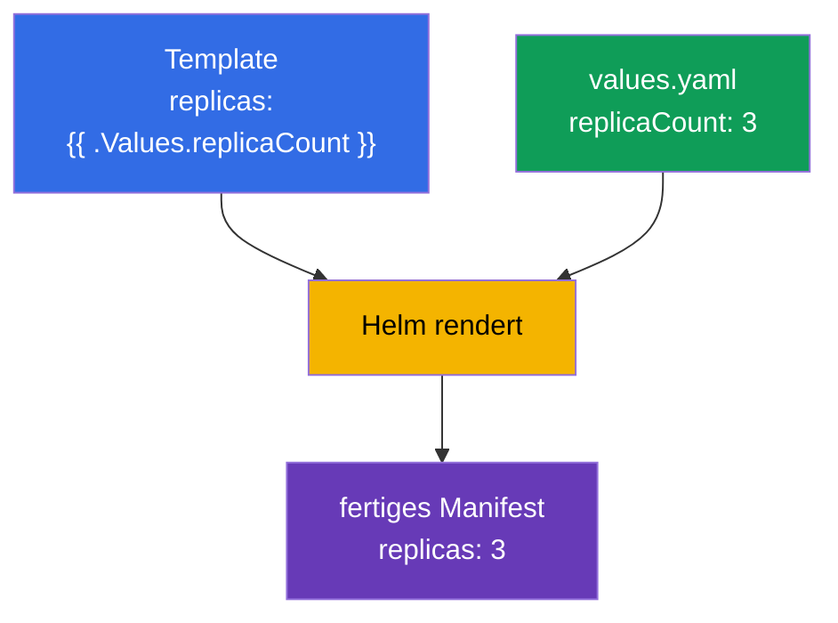
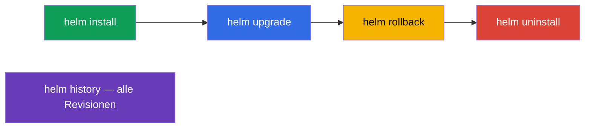
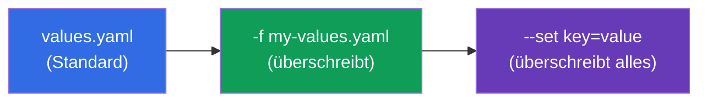
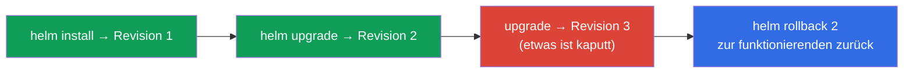

[Русская версия](ru.md) · [Eng version](README.md) · [Versión en español](es.md) · [Version française](fr.md) · [ქართული ვერსია](ge.md)

# Kapitel 42. Helm

> 🟦 **Kapitel für CKA** (Domäne Cluster Architecture: „Helm und Kustomize zur Installation
> von Komponenten verwenden“). Das Thema gibt es auch in CKAD (Nutzung von Paketen).
>
> **Was kommt.** Wir haben viel über `kubectl apply -f` installiert. Doch eine reale
> Anwendung - das sind Dutzende Manifeste (Deployment, Service, ConfigMap, Ingress...), und
> dazu mit unterschiedlichen Werten für dev/prod. Sie einzeln zu verwalten ist mühsam.
> **Helm** ist der „Paketmanager für Kubernetes“: er verpackt Manifeste in ein
> wiederverwendbares, templatisierbares Paket (chart) und verwaltet dessen Installation als
> Ganzes.

## 42.1. Das Problem, das Helm löst

Ohne Helm ist jede Anwendung ein Haufen YAML-Dateien, die man von Hand anwenden,
versionieren und für jede Umgebung parametrisieren muss.



Helm liefert: das Verpacken eines Satzes von Manifesten in ein **chart**, **Templating**
(dieselben Templates - unterschiedliche Werte je Umgebung), die Verwaltung von **Releases**
(Installation/Update/Rollback als Ganzes) und **Repositories** fertiger Pakete.

## 42.2. Schlüsselbegriffe von Helm



| Begriff | Was es ist |
|---------|---------|
| **Chart** | Helm-Paket: Manifest-Templates + Standardwerte + Metadaten |
| **Values** | Parameter, die in die Templates eingesetzt werden (überschreiben die Standardwerte) |
| **Release** | konkrete Installation eines chart im Cluster (mit Namen und Revisionshistorie) |
| **Repository** | Speicher für Charts (wie eine Image-Registry, nur für Charts) |

Die Schlüsselidee: **ein chart → viele Releases** mit unterschiedlichen values (ein
PostgreSQL-chart kann man als `db-dev` und `db-prod` mit unterschiedlichen Einstellungen
installieren).

## 42.3. Struktur eines chart

Ein chart ist ein Verzeichnis mit vorgegebener Struktur:

```
mychart/
├── Chart.yaml          # Metadaten: Name, Version
├── values.yaml         # Standardwerte
├── templates/          # Manifest-Templates
│   ├── deployment.yaml
│   ├── service.yaml
│   └── _helpers.tpl    # Hilfs-Templates
└── charts/             # Abhängigkeiten (eingebettete Charts)
```

Die Templates nutzen Variablen aus den values über die Syntax der Go-Templates:

```yaml
# templates/deployment.yaml
spec:
  replicas: {{ .Values.replicaCount }}      # wird aus values eingesetzt
  template:
    spec:
      containers:
      - image: {{ .Values.image.repository }}:{{ .Values.image.tag }}
```

```yaml
# values.yaml (Standardwerte)
replicaCount: 3
image:
  repository: nginx
  tag: "1.27"
```



## 42.4. Die wichtigsten Helm-Befehle

```bash
# Repositories
helm repo add bitnami https://charts.bitnami.com/bitnami
helm repo update
helm search repo nginx                 # chart finden

# Installation / Update
helm install my-release bitnami/nginx                    # installieren
helm install my-release bitnami/nginx --set replicaCount=5   # mit Parameter
helm install my-release bitnami/nginx -f my-values.yaml      # mit eigenen values
helm upgrade my-release bitnami/nginx -f my-values.yaml      # aktualisieren

# Ansehen und verwalten
helm list                              # installierte Releases
helm status my-release
helm history my-release                # Revisionshistorie
helm rollback my-release 1             # Rollback auf eine Revision
helm uninstall my-release              # löschen

# Nützlich zur Fehlersuche — was tatsächlich angewendet wird
helm template my-release bitnami/nginx -f my-values.yaml   # lokal rendern
```



## 42.5. Values überschreiben

Die Standardwerte aus `values.yaml` werden auf zwei Wegen überschrieben (nach steigender
Priorität):

| Weg | Beispiel | Wann |
|--------|--------|-------|
| eigene values-Datei | `-f prod-values.yaml` | viele Parameter, Umgebungen |
| `--set` in der Kommandozeile | `--set replicaCount=5` | punktuelles Überschreiben |



So passt man ein chart an die Umgebungen an: `-f dev-values.yaml` und `-f prod-values.yaml`
mit unterschiedlichen Repliken, Ressourcen, Hosts.

## 42.6. Helm und Releases: install/upgrade/rollback

Helm verwaltet die Anwendung als **ein einzelnes Release** mit Historie - ähnlich wie ein
Deployment (Kapitel 8), aber auf der Ebene des ganzen Satzes von Manifesten:



Helm speichert die Revisionshistorie eines Release (in Secrets des Clusters), deshalb kann
`helm rollback` den ganzen Satz von Objekten mit einem Befehl in den vorherigen Zustand
zurückversetzen - praktisch bei einem misslungenen Update.

## 42.7. Wie man das in der Produktion anwendet

- **Helm ist der Standard zur Installation fertiger Software.** Ingress-Controller,
  cert-manager, Prometheus, Datenbanken, Operatoren (Kapitel 41) werden fast immer mit
  Helm-Charts installiert: ein Befehl statt Dutzender Manifeste, mit Parametern für die
  eigene Umgebung.
- **Values je Umgebung + GitOps.** In der Produktion liegen die values-Dateien
  (dev/stage/prod) in git, und ein GitOps-Werkzeug wendet sie an (Argo CD/Flux, Kapitel 3) -
  häufig rendert Argo CD die Helm-Charts selbst. So bedient ein chart alle Umgebungen
  reproduzierbar.
- **Eigene Charts für eigene Anwendungen.** Teams verpacken ihre Services in Charts (oder in
  ein gemeinsames „Library“-chart), um Dutzende ähnlicher Services einheitlich auszurollen.
- **Vorsicht bei helm upgrade.** Ein unachtsames upgrade kann Ressourcen neu erstellen oder
  Daten berühren (zum Beispiel PVC). In der Produktion schaut man vor dem upgrade auf
  `helm diff`/`helm template`, um zu verstehen, was sich genau ändert.
- **Helm vs. Kustomize.** Helm ist stark im Templating und im Ökosystem fertiger Charts; für
  das einfachere „Überlagern von Änderungen“ auf Basis-Manifeste nutzt man Kustomize
  (Kapitel 43). Oft kombiniert man beides.

## 42.8. Mini-Glossar

- **Helm** - Paketmanager für Kubernetes.
- **Chart** - Paket: Manifest-Templates + values + Metadaten.
- **Values** - Parameter zum Einsetzen in die Templates.
- **Release** - installierte Instanz eines chart (mit Revisionshistorie).
- **Repository** - Speicher für Charts.
- **helm install/upgrade/rollback/uninstall** - Lebenszyklus eines Release.
- **--set / -f** - Überschreiben der values im CLI / per Datei.
- **helm template** - lokales Rendern eines chart in Manifeste (zur Prüfung).

## 42.9. Zusammenfassung des Kapitels

- Helm ist der Paketmanager von Kubernetes: er verpackt einen Satz von Manifesten in ein
  templatisierbares chart und verwaltet es als ein einzelnes Release.
- Begriffe: Chart (Paket), Values (Parameter), Release (Installation), Repository (Speicher);
  ein chart → viele Releases mit unterschiedlichen values.
- Ein chart ist ein Verzeichnis mit `Chart.yaml`, `values.yaml`, `templates/`; die Templates
  setzen Werte über `{{ .Values.* }}` ein.
- Befehle: repo add/update, install, upgrade, rollback, uninstall, list, history; `helm
  template` rendert lokal zur Prüfung.
- Values überschreibt man per Datei (`-f`) und per `--set` (höchste Priorität) - so passt man
  sie an die Umgebungen an.
- Helm führt die Revisionshistorie eines Release, deshalb rollt `helm rollback` den ganzen
  Satz von Objekten mit einem Befehl zurück.

## 42.10. Wofür das nützlich ist: in der Prüfung und in der echten Arbeit

**In der Prüfung.** Das CKA-Programm umfasst die Nutzung von Helm. Zu erwarten sind Aufgaben
wie „installiere eine Komponente mit einem Helm-chart“, „aktualisiere/rolle ein Release
zurück“, „überschreibe einen Wert über --set/values“. Man muss die Befehle
install/upgrade/rollback/list kennen und wissen, wie man values übergibt. Tiefes Schreiben
von Charts wird üblicherweise nicht verlangt.

**In der echten Arbeit.** Helm ist der Hauptweg, fertige Software zu installieren und eigene
Services auszurollen: ein Befehl, Parameter je Umgebung, Rollback eines Release. Zusammen mit
GitOps (values in git, Argo CD) ist das die Grundlage reproduzierbarer Auslieferung. Das
Verständnis von Releases und Vorsicht beim upgrade sind alltägliche Betriebsfähigkeiten.

## 42.11. Fragen zur Selbstüberprüfung

1. Welches Problem löst Helm im Vergleich zu `kubectl apply -f`?
2. Was sind chart, values und release? Wie entstehen aus einem chart verschiedene Installationen?
3. Woraus besteht das Verzeichnis eines chart und wie nutzen die Templates die values?
4. Wie überschreibt man Werte bei der Installation und welche Priorität haben `--set` und `-f`?
5. Wie sieht man die Historie eines Release an und wie rollt man es zurück?
6. Wozu braucht man `helm template` vor der Installation/dem Update?
7. Wie unterscheidet sich Helm im Ansatz von Kustomize?

## Praxis

Wir haben das Verpacken und Installieren über Helm beherrscht. In Kapitel 43 kommt der
alternative Ansatz zum Konfigurieren von Manifesten ohne Templates: Kustomize. Helm wird in
den Labs zur Administration geübt (u. a. bei der Installation von Cluster-Komponenten).

🧪 Lab 115 (Helm): [tasks/cka/labs/115](../../labs/115/README_DE.MD)

---
[Inhalt](../README_DE.md) · [Kapitel 41](../41/de.md) · [Kapitel 43](../43/de.md)
