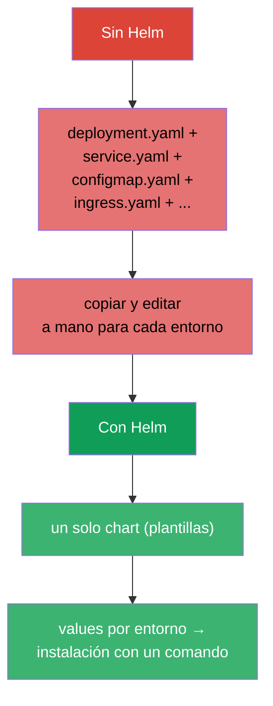
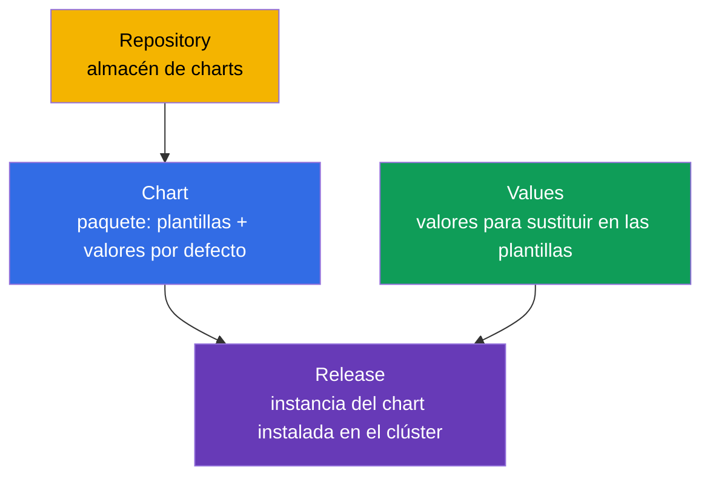
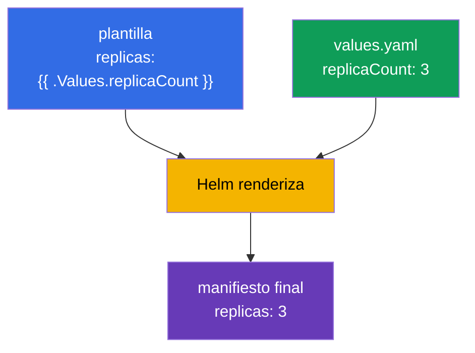
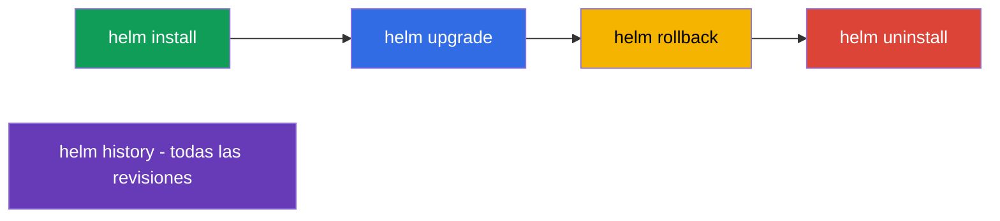
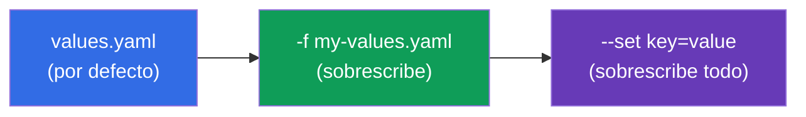
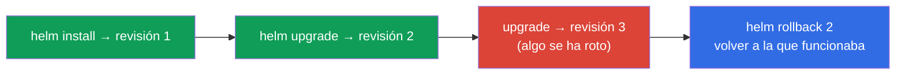

[Русская версия](ru.md) · [Eng version](README.md) · [Version française](fr.md) · [Deutsche Version](de.md) · [ქართული ვერსია](ge.md) · [繁體中文版](tw.md) · [日本語版](jp.md)

# Capítulo 42. Helm

> 🟦 **Capítulo para CKA** (dominio Cluster Architecture: «usar Helm y Kustomize para
> instalar componentes»). El tema aparece también en CKAD (uso de paquetes).
>
> **Qué viene ahora.** Hemos instalado muchas cosas con `kubectl apply -f`. Pero una
> aplicación real son decenas de manifiestos (Deployment, Service, ConfigMap, Ingress...), y
> encima con valores distintos para dev/prod. Gestionarlos por separado es duro. **Helm** es
> el «gestor de paquetes para Kubernetes»: empaqueta los manifiestos en un paquete
> reutilizable y plantillable (chart) y gestiona su instalación como un todo.

## 42.1. El problema que resuelve Helm

Sin Helm cada aplicación es un montón de ficheros YAML que hay que aplicar, versionar y
parametrizar a mano para cada entorno.



Helm aporta: empaquetado del conjunto de manifiestos en un **chart**, **plantillas** (unas
mismas plantillas - valores distintos por entorno), gestión de **releases** (instalación/
actualización/rollback como un todo) y **repositorios** de paquetes listos.

## 42.2. Conceptos clave de Helm



| Concepto | Qué es |
|---------|---------|
| **Chart** | paquete de Helm: plantillas de manifiestos + valores por defecto + metadatos |
| **Values** | parámetros que se sustituyen en las plantillas (sobrescriben los valores por defecto) |
| **Release** | una instalación concreta del chart en el clúster (con nombre e historial de revisiones) |
| **Repository** | almacén de charts (como un registro de imágenes, pero para charts) |

La idea clave: **un chart → muchos releases** con values distintos (un mismo chart de PostgreSQL
se puede instalar como `db-dev` y `db-prod` con configuraciones distintas).

## 42.3. Estructura de un chart

Un chart es un directorio con una estructura dada:

```
mychart/
├── Chart.yaml          # metadatos: nombre, versión
├── values.yaml         # valores por defecto
├── templates/          # plantillas de manifiestos
│   ├── deployment.yaml
│   ├── service.yaml
│   └── _helpers.tpl    # plantillas auxiliares
└── charts/             # dependencias (charts anidados)
```

Las plantillas usan variables de values mediante la sintaxis de plantillas de Go:

```yaml
# templates/deployment.yaml
spec:
  replicas: {{ .Values.replicaCount }}      # se sustituye desde values
  template:
    spec:
      containers:
      - image: {{ .Values.image.repository }}:{{ .Values.image.tag }}
```

```yaml
# values.yaml (valores por defecto)
replicaCount: 3
image:
  repository: nginx
  tag: "1.27"
```



## 42.4. Comandos principales de Helm

```bash
# Repositorios
helm repo add bitnami https://charts.bitnami.com/bitnami
helm repo update
helm search repo nginx                 # buscar un chart

# Instalación / actualización
helm install my-release bitnami/nginx                    # instalar
helm install my-release bitnami/nginx --set replicaCount=5   # con un parámetro
helm install my-release bitnami/nginx -f my-values.yaml      # con values propio
helm upgrade my-release bitnami/nginx -f my-values.yaml      # actualizar

# Consulta y gestión
helm list                              # releases instalados
helm status my-release
helm history my-release                # historial de revisiones
helm rollback my-release 1             # volver a una revisión
helm uninstall my-release              # eliminar

# Útil para depurar - qué se va a aplicar realmente
helm template my-release bitnami/nginx -f my-values.yaml   # renderizar en local
```



## 42.5. Sobrescribir values

Los valores por defecto de `values.yaml` se sobrescriben de dos formas (en orden creciente de
prioridad):

| Forma | Ejemplo | Cuándo |
|--------|--------|-------|
| fichero values propio | `-f prod-values.yaml` | muchos parámetros, entornos |
| `--set` en la línea de comandos | `--set replicaCount=5` | sobrescritura puntual |



Así se adapta un mismo chart a los entornos: `-f dev-values.yaml` y `-f prod-values.yaml` con
réplicas, recursos y hosts distintos.

## 42.6. Helm y los releases: install/upgrade/rollback

Helm gestiona la aplicación como un **release único** con historial - parecido a un Deployment
(capítulo 8), pero al nivel de todo el conjunto de manifiestos:



Helm guarda el historial de revisiones del release (en Secrets del clúster), por eso `helm rollback`
puede devolver todo el conjunto de objetos al estado anterior con un solo comando - cómodo cuando una
actualización sale mal.

## 42.7. Cómo se aplica esto en producción

- **Helm es el estándar para instalar software listo.** Los controladores Ingress, cert-manager, Prometheus,
  las BD y los operadores (capítulo 41) casi siempre se instalan con charts de Helm: un comando en lugar de decenas
  de manifiestos, con parámetros propios del entorno.
- **Values por entorno + GitOps.** En producción los ficheros de values (dev/stage/prod) se guardan en git, y
  los aplica una herramienta GitOps (Argo CD/Flux, capítulo 3) - a menudo Argo CD renderiza los charts de
  Helm por su cuenta. Así un mismo chart sirve todos los entornos de forma reproducible.
- **Charts propios para las aplicaciones propias.** Los equipos empaquetan sus servicios en charts (o en un
  chart «de librería» común) para desplegar de forma uniforme decenas de servicios parecidos.
- **Cuidado con helm upgrade.** Un upgrade descuidado puede recrear recursos o tocar datos
  (por ejemplo, PVC). En producción, antes de un upgrade se mira `helm diff`/`helm template`,
  para entender qué va a cambiar exactamente.
- **Helm vs Kustomize.** Helm es fuerte en plantillas y en el ecosistema de charts listos; para una
  «superposición de cambios» más simple sobre manifiestos base se usa Kustomize (capítulo 43).
  A menudo se combinan.

## 42.8. Mini-glosario

- **Helm** - gestor de paquetes para Kubernetes.
- **Chart** - paquete: plantillas de manifiestos + values + metadatos.
- **Values** - parámetros para sustituir en las plantillas.
- **Release** - instancia instalada de un chart (con historial de revisiones).
- **Repository** - almacén de charts.
- **helm install/upgrade/rollback/uninstall** - ciclo de vida del release.
- **--set / -f** - sobrescritura de values por CLI / por fichero.
- **helm template** - renderizado local del chart a manifiestos (para comprobar).

## 42.9. Resumen del capítulo

- Helm es el gestor de paquetes de Kubernetes: empaqueta un conjunto de manifiestos en un chart plantillable
  y lo gestiona como un release único.
- Conceptos: Chart (paquete), Values (parámetros), Release (instalación), Repository (almacén);
  un chart → muchos releases con values distintos.
- Un chart es un directorio con `Chart.yaml`, `values.yaml`, `templates/`; las plantillas sustituyen
  valores mediante `{{ .Values.* }}`.
- Comandos: repo add/update, install, upgrade, rollback, uninstall, list, history; `helm
  template` renderiza en local para comprobar.
- Los values se sobrescriben con fichero (`-f`) y con `--set` (máxima prioridad) - así se adapta a los
  entornos.
- Helm mantiene el historial de revisiones del release, por eso `helm rollback` revierte todo el conjunto
  de objetos con un solo comando.

## 42.10. Para qué sirve esto: en el examen y en el trabajo real

**En el examen.** El programa del CKA incluye el uso de Helm. Se esperan tareas del tipo «instala un
componente con un chart de Helm», «actualiza/revierte un release», «sobrescribe un valor con --set/values».
Hay que conocer los comandos install/upgrade/rollback/list y cómo pasar values. Normalmente no se pide
escribir charts en profundidad.

**En el trabajo real.** Helm es la forma principal de instalar software listo y de desplegar los propios
servicios: un comando, parámetros por entorno, rollback del release. Junto con GitOps (values en git, Argo CD)
es la base de una entrega reproducible. Entender los releases y ser prudente con los upgrade son
habilidades diarias de operación.

## 42.11. Preguntas de autocomprobación

1. ¿Qué problema resuelve Helm frente a `kubectl apply -f`?
2. ¿Qué son chart, values y release? ¿Cómo se obtienen instalaciones distintas de un mismo chart?
3. ¿De qué consta el directorio de un chart y cómo usan las plantillas los values?
4. ¿Cómo se sobrescriben los valores al instalar y qué prioridad tienen `--set` y `-f`?
5. ¿Cómo se consulta el historial de un release y cómo se revierte?
6. ¿Para qué sirve `helm template` antes de instalar/actualizar?
7. ¿En qué se diferencia Helm de Kustomize por su enfoque?

## Práctica

Ya dominamos el empaquetado y la instalación con Helm. En el capítulo 43 veremos un enfoque alternativo
para ajustar manifiestos sin plantillas: Kustomize. Helm se practica en los laboratorios de administración
(incluida la instalación de componentes del clúster).

🧪 Laboratorio 115 (Helm): [tasks/cka/labs/115](../../labs/115/README_ES.MD)

🎮 Killercoda (en el navegador, sin instalación): [Installing NGINX Ingress with Helm](https://killercoda.com/chadmcrowell/course/cka/helm-install-nginx)

---
[Índice](../README_ES.md) · [Capítulo 41](../41/es.md) · [Capítulo 43](../43/es.md)
