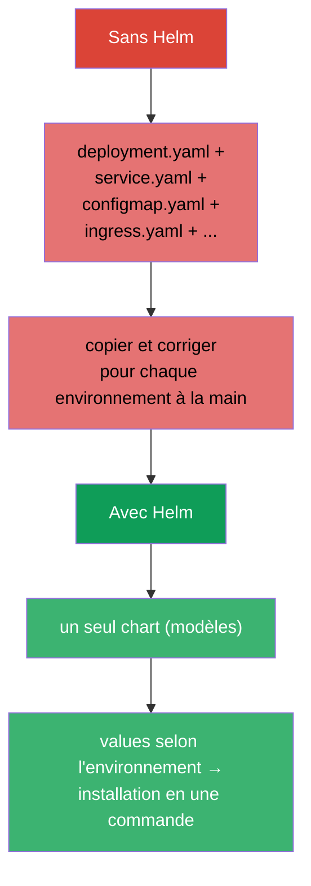
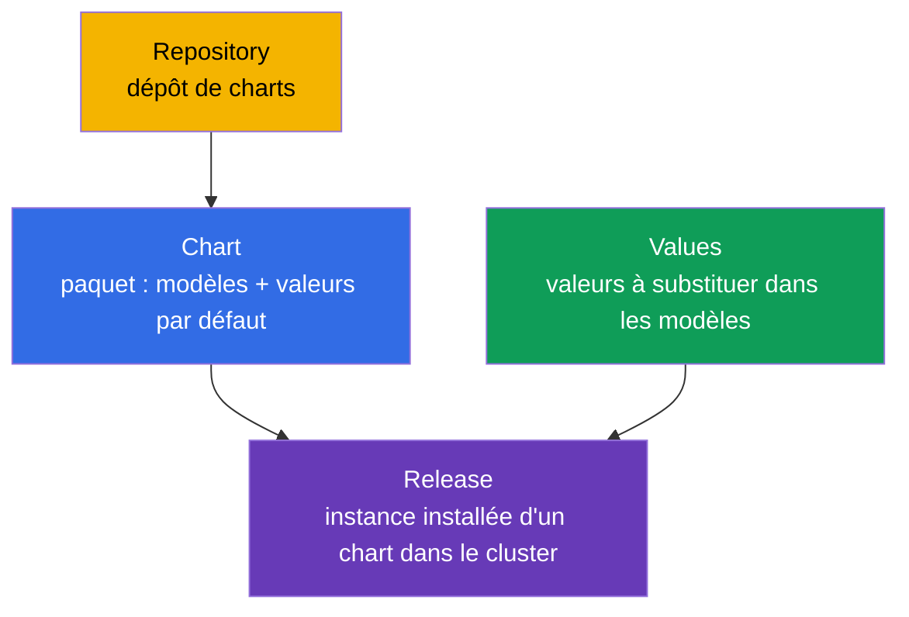
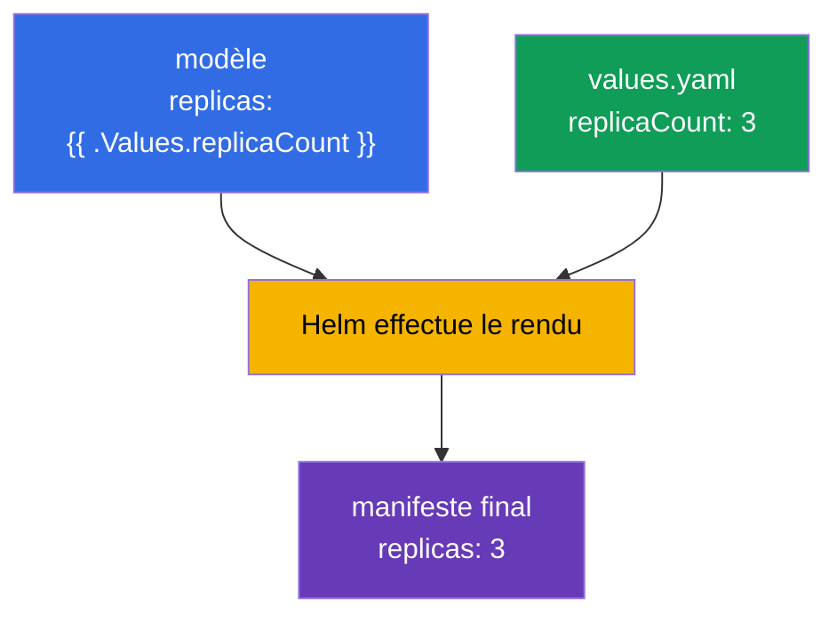
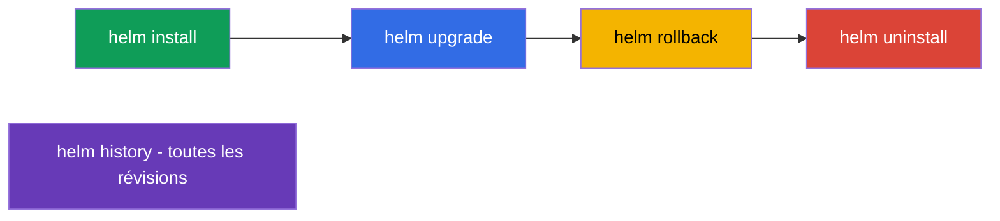
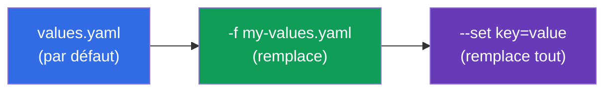
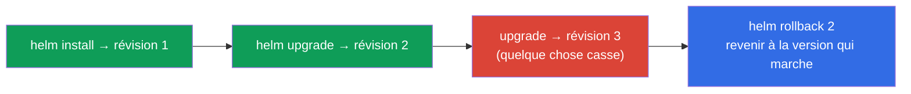

[Русская версия](ru.md) · [Eng version](README.md) · [Versión en español](es.md) · [Deutsche Version](de.md) · [ქართული ვერსია](ge.md) · [繁體中文版](tw.md) · [日本語版](jp.md)

# Chapitre 42. Helm

> 🟦 **Chapitre pour le CKA** (domaine Cluster Architecture : « utiliser Helm et Kustomize pour
> installer des composants »). Le thème est aussi présent dans le CKAD (utilisation de paquets).
>
> **Ce qui suit.** Nous avons installé beaucoup de choses avec `kubectl apply -f`. Mais une vraie
> application, c'est des dizaines de manifestes (Deployment, Service, ConfigMap, Ingress...), et en
> plus avec des valeurs différentes pour dev/prod. Les gérer un par un est pénible. **Helm** est le
> « gestionnaire de paquets pour Kubernetes » : il empaquette les manifestes dans un paquet
> réutilisable et modélisable (chart) et gère son installation comme un tout.

## 42.1. Le problème que Helm résout

Sans Helm, chaque application est un éparpillement de fichiers YAML qu'il faut appliquer,
versionner et paramétrer à la main pour chaque environnement.



Helm apporte : l'empaquetage d'un ensemble de manifestes dans un **chart**, la **modélisation**
(les mêmes modèles - des valeurs différentes selon les environnements), la gestion des **releases**
(installation/mise à jour/retour arrière comme un tout) et des **dépôts** de paquets prêts à l'emploi.

## 42.2. Notions clés de Helm



| Notion | Ce que c'est |
|---------|---------|
| **Chart** | paquet Helm : modèles de manifestes + valeurs par défaut + métadonnées |
| **Values** | paramètres substitués dans les modèles (ils remplacent les valeurs par défaut) |
| **Release** | une installation concrète d'un chart dans le cluster (avec un nom et un historique de révisions) |
| **Repository** | dépôt de charts (comme un registre d'images, mais pour les charts) |

L'idée clé : **un chart → plusieurs releases** avec des values différentes (un même chart PostgreSQL
peut être installé comme `db-dev` et `db-prod` avec des réglages différents).

## 42.3. Structure d'un chart

Un chart est un répertoire à la structure imposée :

```
mychart/
├── Chart.yaml          # métadonnées : nom, version
├── values.yaml         # valeurs par défaut
├── templates/          # modèles de manifestes
│   ├── deployment.yaml
│   ├── service.yaml
│   └── _helpers.tpl    # modèles auxiliaires
└── charts/             # dépendances (charts imbriqués)
```

Les modèles utilisent les variables des values via la syntaxe des modèles Go :

```yaml
# templates/deployment.yaml
spec:
  replicas: {{ .Values.replicaCount }}      # sera substitué depuis les values
  template:
    spec:
      containers:
      - image: {{ .Values.image.repository }}:{{ .Values.image.tag }}
```

```yaml
# values.yaml (valeurs par défaut)
replicaCount: 3
image:
  repository: nginx
  tag: "1.27"
```



## 42.4. Commandes principales de Helm

```bash
# Dépôts
helm repo add bitnami https://charts.bitnami.com/bitnami
helm repo update
helm search repo nginx                 # trouver un chart

# Installation / mise à jour
helm install my-release bitnami/nginx                    # installer
helm install my-release bitnami/nginx --set replicaCount=5   # avec un paramètre
helm install my-release bitnami/nginx -f my-values.yaml      # avec ses propres values
helm upgrade my-release bitnami/nginx -f my-values.yaml      # mettre à jour

# Consultation et gestion
helm list                              # releases installés
helm status my-release
helm history my-release                # historique des révisions
helm rollback my-release 1              # retour à une révision
helm uninstall my-release              # supprimer

# Utile pour le débogage - ce qui sera réellement appliqué
helm template my-release bitnami/nginx -f my-values.yaml   # rendu en local
```



## 42.5. Remplacement des values

Les valeurs par défaut de `values.yaml` se remplacent de deux façons (par priorité croissante) :

| Moyen | Exemple | Quand |
|--------|--------|-------|
| son propre fichier values | `-f prod-values.yaml` | beaucoup de paramètres, environnements |
| `--set` en ligne de commande | `--set replicaCount=5` | remplacement ponctuel |



C'est ainsi qu'un même chart est adapté aux environnements : `-f dev-values.yaml` et
`-f prod-values.yaml` avec des répliques, ressources et hôtes différents.

## 42.6. Helm et les releases : install/upgrade/rollback

Helm gère l'application comme un **release unique** avec un historique - un peu comme un Deployment
(chapitre 8), mais au niveau de tout l'ensemble de manifestes :



Helm conserve l'historique des révisions d'un release (dans des Secret du cluster), c'est pourquoi
`helm rollback` peut ramener tout l'ensemble d'objets à l'état précédent en une commande - pratique
en cas de mise à jour ratée.

## 42.7. Comment cela s'applique en production

- **Helm est le standard pour installer des logiciels prêts à l'emploi.** Les contrôleurs Ingress,
  cert-manager, Prometheus, les bases de données, les opérateurs (chapitre 41) sont presque toujours
  installés par des charts Helm : une commande au lieu de dizaines de manifestes, avec des paramètres
  adaptés à son environnement.
- **Values par environnement + GitOps.** En prod, les fichiers values (dev/stage/prod) sont gardés
  dans git, et c'est un outil GitOps qui les applique (Argo CD/Flux, chapitre 3) - souvent Argo CD
  fait lui-même le rendu des charts Helm. Ainsi un seul chart sert tous les environnements de façon
  reproductible.
- **Ses propres charts pour ses propres applications.** Les équipes empaquettent leurs services dans
  des charts (ou un chart « de bibliothèque » commun) pour déployer uniformément des dizaines de
  services similaires.
- **Prudence avec helm upgrade.** Un upgrade négligent peut recréer des ressources ou toucher aux
  données (par exemple un PVC). En prod, avant un upgrade, on regarde `helm diff`/`helm template`
  pour comprendre ce qui va exactement changer.
- **Helm vs Kustomize.** Helm est fort en modélisation et par son écosystème de charts prêts ; pour
  une « superposition de modifications » plus simple sur des manifestes de base, on utilise Kustomize
  (chapitre 43). Souvent on les combine.

## 42.8. Mini-glossaire

- **Helm** - gestionnaire de paquets pour Kubernetes.
- **Chart** - paquet : modèles de manifestes + values + métadonnées.
- **Values** - paramètres à substituer dans les modèles.
- **Release** - instance installée d'un chart (avec un historique de révisions).
- **Repository** - dépôt de charts.
- **helm install/upgrade/rollback/uninstall** - cycle de vie d'un release.
- **--set / -f** - remplacement des values en CLI / par fichier.
- **helm template** - rendu local d'un chart en manifestes (pour vérification).

## 42.9. Bilan du chapitre

- Helm est le gestionnaire de paquets de Kubernetes : il empaquette un ensemble de manifestes dans un
  chart modélisable et le gère comme un release unique.
- Notions : Chart (paquet), Values (paramètres), Release (installation), Repository (dépôt) ;
  un chart → plusieurs releases avec des values différentes.
- Un chart est un répertoire avec `Chart.yaml`, `values.yaml`, `templates/` ; les modèles substituent
  les valeurs via `{{ .Values.* }}`.
- Commandes : repo add/update, install, upgrade, rollback, uninstall, list, history ; `helm
  template` fait le rendu en local pour vérification.
- Les values se remplacent par fichier (`-f`) et par `--set` (priorité la plus haute) - c'est ainsi
  qu'on adapte aux environnements.
- Helm tient l'historique des révisions d'un release, c'est pourquoi `helm rollback` ramène tout
  l'ensemble d'objets en une commande.

## 42.10. À quoi cela sert : à l'examen et dans le travail réel

**À l'examen.** Le programme du CKA inclut l'utilisation de Helm. On peut attendre des exercices
« installe un composant avec un chart Helm », « mets à jour/retourne en arrière un release »,
« remplace une valeur via --set/values ». Il faut connaître les commandes install/upgrade/rollback/list
et savoir passer des values. L'écriture poussée de charts n'est généralement pas demandée.

**Dans le travail réel.** Helm est le moyen principal d'installer des logiciels prêts et de déployer
ses propres services : une commande, des paramètres par environnement, le retour arrière d'un release.
En association avec GitOps (values dans git, Argo CD), c'est le socle d'une livraison reproductible.
Comprendre les releases et rester prudent avec upgrade sont des compétences d'exploitation quotidiennes.

## 42.11. Questions d'auto-évaluation

1. Quel problème Helm résout-il par rapport à `kubectl apply -f` ?
2. Qu'est-ce qu'un chart, des values et un release ? Comment obtient-on des installations différentes à partir d'un seul chart ?
3. De quoi est composé le répertoire d'un chart et comment les modèles utilisent-ils les values ?
4. Comment remplacer des valeurs à l'installation et quelle est la priorité entre `--set` et `-f` ?
5. Comment consulter l'historique d'un release et le ramener en arrière ?
6. À quoi sert `helm template` avant une installation/mise à jour ?
7. En quoi Helm diffère-t-il de Kustomize dans l'approche ?

## Pratique

Nous avons vu l'empaquetage et l'installation via Helm. Au chapitre 43 - une approche alternative de
personnalisation des manifestes sans modèles : Kustomize. Helm se travaille dans les TP
d'administration (y compris lors de l'installation de composants du cluster).

🧪 TP 115 (Helm) : [tasks/cka/labs/115](../../labs/115/README_FR.MD)

---
[Sommaire](../README_FR.md) · [Chapitre 41](../41/fr.md) · [Chapitre 43](../43/fr.md)
