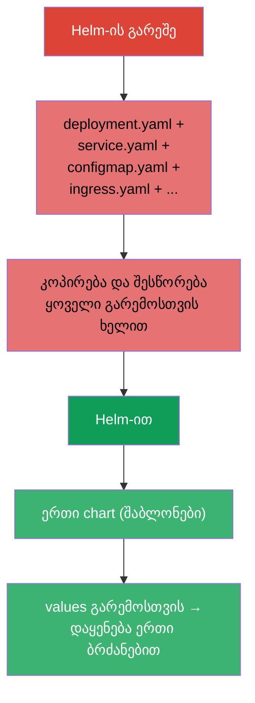
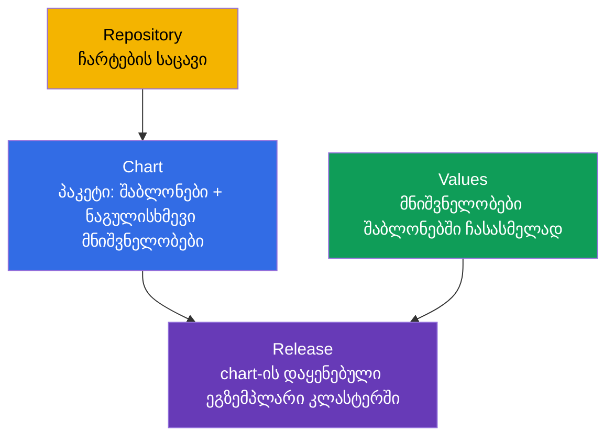
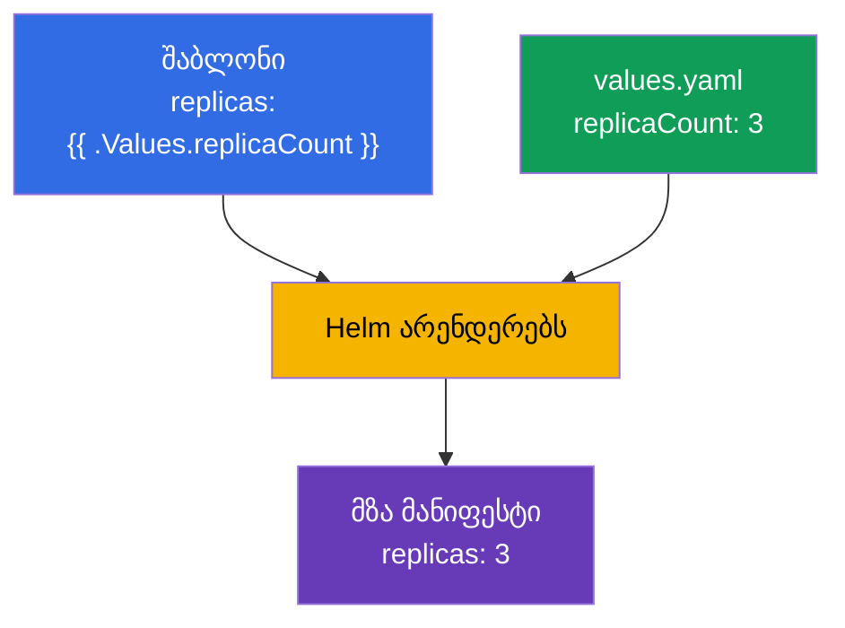
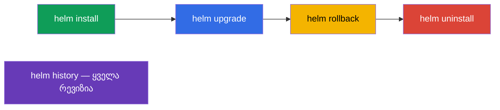
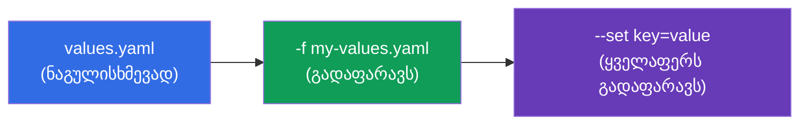
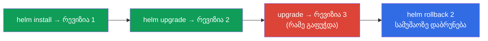

[Русская версия](ru.md) · [Eng version](README.md) · [Versión en español](es.md) · [Version française](fr.md) · [Deutsche Version](de.md) · [繁體中文版](tw.md) · [日本語版](jp.md)

# თავი 42. Helm

> 🟦 **თავი CKA-სთვის** (დომენი Cluster Architecture: „გამოიყენე Helm და Kustomize
> კომპონენტების დასაყენებლად“). თემა CKAD-შიც არის (პაკეტების გამოყენება).
>
> **რა იქნება შემდეგ.** ბევრი რამ დავაყენეთ `kubectl apply -f`-ის მეშვეობით. მაგრამ რეალური
> აპლიკაცია - ეს ათეულობით მანიფესტია (Deployment, Service, ConfigMap, Ingress...), და კიდევ
> dev/prod-ისთვის განსხვავებული მნიშვნელობებით. მათი ცალ-ცალკე მართვა რთულია. **Helm** - ეს
> არის „პაკეტების მენეჯერი Kubernetes-ისთვის“: ის მანიფესტებს ახვევს ხელახლა გამოსაყენებელ
> შაბლონიზირებად პაკეტში (chart) და მის დაყენებას ერთიან მთლიანობად მართავს.

## 42.1. პრობლემა, რომელსაც Helm წყვეტს

Helm-ის გარეშე ყოველი აპლიკაცია - ეს YAML-ფაილების ნაყარია, რომლებიც ხელით უნდა გამოვიყენოთ,
დავაწესოთ ვერსია და დავაპარამეტრიზოთ ყოველი გარემოსთვის.



Helm იძლევა: მანიფესტების ნაკრების შეფუთვას **chart**-ში, **შაბლონიზაციას** (ერთი შაბლონები -
განსხვავებული მნიშვნელობები გარემოებისთვის), **რელიზების** მართვას (დაყენება/განახლება/დაბრუნება
ერთიან მთლიანობად) და მზა პაკეტების **რეპოზიტორიებს**.

## 42.2. Helm-ის საკვანძო ცნებები



| ცნება | რა არის ეს |
|---------|---------|
| **Chart** | Helm-ის პაკეტი: მანიფესტების შაბლონები + ნაგულისხმევი მნიშვნელობები + მეტამონაცემები |
| **Values** | პარამეტრები, რომლებიც შაბლონებში ისმება (ნაგულისხმევ მნიშვნელობებს გადაფარავს) |
| **Release** | chart-ის კონკრეტული დაყენება კლასტერში (სახელითა და რევიზიების ისტორიით) |
| **Repository** | ჩარტების საცავი (როგორც იმიჯების რეესტრი, ოღონდ ჩარტებისთვის) |

საკვანძო იდეა: **ერთი chart → ბევრი releases** განსხვავებული values-ით (PostgreSQL-ის ერთი chart
შეიძლება დაყენდეს როგორც `db-dev` და `db-prod` განსხვავებული პარამეტრებით).

## 42.3. chart-ის სტრუქტურა

Chart - ეს მოცემული სტრუქტურის კატალოგია:

```
mychart/
├── Chart.yaml          # მეტამონაცემები: სახელი, ვერსია
├── values.yaml         # ნაგულისხმევი მნიშვნელობები
├── templates/          # მანიფესტების შაბლონები
│   ├── deployment.yaml
│   ├── service.yaml
│   └── _helpers.tpl    # დამხმარე შაბლონები
└── charts/             # დამოკიდებულებები (ჩადგმული ჩარტები)
```

შაბლონები values-იდან ცვლადებს იყენებენ Go-შაბლონების სინტაქსის მეშვეობით:

```yaml
# templates/deployment.yaml
spec:
  replicas: {{ .Values.replicaCount }}      # ჩაისმება values-იდან
  template:
    spec:
      containers:
      - image: {{ .Values.image.repository }}:{{ .Values.image.tag }}
```

```yaml
# values.yaml (ნაგულისხმევი მნიშვნელობები)
replicaCount: 3
image:
  repository: nginx
  tag: "1.27"
```



## 42.4. Helm-ის ძირითადი ბრძანებები

```bash
# რეპოზიტორიები
helm repo add bitnami https://charts.bitnami.com/bitnami
helm repo update
helm search repo nginx                 # chart-ის მოძებნა

# დაყენება / განახლება
helm install my-release bitnami/nginx                    # დაყენება
helm install my-release bitnami/nginx --set replicaCount=5   # პარამეტრით
helm install my-release bitnami/nginx -f my-values.yaml      # საკუთარი values-ით
helm upgrade my-release bitnami/nginx -f my-values.yaml      # განახლება

# დათვალიერება და მართვა
helm list                              # დაყენებული releases
helm status my-release
helm history my-release                # რევიზიების ისტორია
helm rollback my-release 1             # რევიზიაზე დაბრუნება
helm uninstall my-release              # წაშლა

# სასარგებლოა გამართვისთვის — რა გამოიყენება რეალურად
helm template my-release bitnami/nginx -f my-values.yaml   # ლოკალურად დარენდერება
```



## 42.5. values-ის გადაფარვა

`values.yaml`-იდან ნაგულისხმევი მნიშვნელობები ორი ხერხით გადაიფარება (პრიორიტეტის
ზრდის მიხედვით):

| ხერხი | მაგალითი | როდის |
|--------|--------|-------|
| საკუთარი values-ფაილი | `-f prod-values.yaml` | ბევრი პარამეტრი, გარემოები |
| `--set` ბრძანების სტრიქონში | `--set replicaCount=5` | წერტილოვანი გადაფარვა |



ასე ერთ chart-ს გარემოებზე ადაპტირებენ: `-f dev-values.yaml` და `-f prod-values.yaml`
განსხვავებული რეპლიკებით, რესურსებით, ჰოსტებით.

## 42.6. Helm და რელიზები: install/upgrade/rollback

Helm აპლიკაციას მართავს როგორც **ერთიან რელიზს** ისტორიით - Deployment-ის მსგავსად (თავი
8), ოღონდ მანიფესტების მთელი ნაკრების დონეზე:



Helm ინახავს რელიზის რევიზიების ისტორიას (კლასტერის Secret-ებში), ამიტომ `helm rollback` შეუძლია
ობიექტების მთელი ნაკრები ერთი ბრძანებით წინა მდგომარეობას დაუბრუნოს - მოსახერხებელია წარუმატებელი
განახლების დროს.

## 42.7. როგორ იყენებენ ამას პროდაქშენში

- **Helm - მზა პროგრამული უზრუნველყოფის დაყენების სტანდარტია.** Ingress-კონტროლერები, cert-manager, Prometheus,
  DB-ები, ოპერატორები (თავი 41) თითქმის ყოველთვის Helm-ჩარტებით ყენდება: ერთი ბრძანება ათეულობით
  მანიფესტის ნაცვლად, საკუთარ გარემოზე მორგებული პარამეტრებით.
- **Values გარემოებისთვის + GitOps.** პროდში values-ფაილებს (dev/stage/prod) git-ში ინახავენ, ხოლო
  იყენებს მათ GitOps-ინსტრუმენტი (Argo CD/Flux, თავი 3) - ხშირად Argo CD Helm-
  ჩარტებს თავად არენდერებს. ასე ერთი chart ყველა გარემოს რეპროდუცირებადად ემსახურება.
- **საკუთარი ჩარტები საკუთარი აპლიკაციებისთვის.** გუნდები საკუთარ სერვისებს ჩარტებში ახვევენ (ან საერთო
  „ბიბლიოთეკურ“ chart-ში), რომ ერთგვაროვნად გამოუშვან ათეულობით მსგავსი სერვისი.
- **სიფრთხილე helm upgrade-თან.** უზუსტო upgrade-ს შეუძლია რესურსები ხელახლა შექმნას ან
  მონაცემები დააზიანოს (მაგალითად, PVC). პროდში upgrade-მდე უყურებენ `helm diff`/`helm template`-ს,
  რომ გაიგონ, ზუსტად რა შეიცვლება.
- **Helm vs Kustomize.** Helm ძლიერია შაბლონიზაციითა და მზა ჩარტების ეკოსისტემით; უფრო
  მარტივი „ცვლილებების ზედდებისთვის“ საბაზისო მანიფესტებზე Kustomize-ს იყენებენ (თავი 43).
  ხშირად მათ აერთიანებენ.

## 42.8. მინი-ლექსიკონი

- **Helm** - პაკეტების მენეჯერი Kubernetes-ისთვის.
- **Chart** - პაკეტი: მანიფესტების შაბლონები + values + მეტამონაცემები.
- **Values** - პარამეტრები შაბლონებში ჩასასმელად.
- **Release** - chart-ის დაყენებული ეგზემპლარი (რევიზიების ისტორიით).
- **Repository** - ჩარტების საცავი.
- **helm install/upgrade/rollback/uninstall** - რელიზის სასიცოცხლო ციკლი.
- **--set / -f** - values-ის გადაფარვა CLI-ში / ფაილით.
- **helm template** - ჩარტის ლოკალური რენდერი მანიფესტებში (შესამოწმებლად).

## 42.9. თავის შეჯამება

- Helm - Kubernetes-ის პაკეტების მენეჯერია: მანიფესტების ნაკრებს ახვევს შაბლონიზირებად chart-ში
  და მას ერთიან რელიზად მართავს.
- ცნებები: Chart (პაკეტი), Values (პარამეტრები), Release (დაყენება), Repository (საცავი);
  ერთი chart → ბევრი releases განსხვავებული values-ით.
- Chart - კატალოგი `Chart.yaml`-ით, `values.yaml`-ით, `templates/`-ით; შაბლონები
  მნიშვნელობებს `{{ .Values.* }}`-ის მეშვეობით ისმენ.
- ბრძანებები: repo add/update, install, upgrade, rollback, uninstall, list, history; `helm
  template` ლოკალურად არენდერებს შესამოწმებლად.
- Values გადაიფარება ფაილით (`-f`) და `--set`-ით (უმაღლესი პრიორიტეტი) - ასე ადაპტირებენ
  გარემოებზე.
- Helm აწარმოებს რელიზის რევიზიების ისტორიას, ამიტომ `helm rollback` ობიექტების მთელ ნაკრებს
  ერთი ბრძანებით აბრუნებს.

## 42.10. როგორ გამოგადგებათ: გამოცდაზე და რეალურ სამუშაოში

**გამოცდაზე.** CKA-ის პროგრამა მოიცავს Helm-ის გამოყენებას. მოსალოდნელია დავალებები „დააყენე
კომპონენტი Helm-ჩარტით“, „განაახლე/დააბრუნე რელიზი“, „გადააფარე მნიშვნელობა --set/values-ის მეშვეობით“.
საჭიროა ვიცოდეთ ბრძანებები install/upgrade/rollback/list და როგორ გადავცეთ values. ჩარტების ღრმა
წერას ჩვეულებრივ არ მოითხოვენ.

**რეალურ სამუშაოში.** Helm - მზა პროგრამული უზრუნველყოფის დაყენებისა და საკუთარი სერვისების გამოშვების ძირითადი ხერხია:
ერთი ბრძანება, პარამეტრები გარემოსთვის, რელიზის დაბრუნება. GitOps-თან კავშირში (values git-ში, Argo CD)
ეს რეპროდუცირებადი მიწოდების საფუძველია. რელიზების გაგება და სიფრთხილე upgrade-თან -
ექსპლუატაციის ყოველდღიური უნარებია.

## 42.11. თვითშემოწმების კითხვები

1. რომელ პრობლემას წყვეტს Helm `kubectl apply -f`-თან შედარებით?
2. რა არის chart, values და release? როგორ მიიღება ერთი chart-იდან სხვადასხვა დაყენებები?
3. რისგან შედგება chart-ის კატალოგი და როგორ იყენებენ შაბლონები values-ს?
4. როგორ გადავაფაროთ მნიშვნელობები დაყენებისას და რა პრიორიტეტი აქვს `--set`-სა და `-f`-ს?
5. როგორ ვნახოთ რელიზის ისტორია და დავაბრუნოთ ის?
6. რისთვის არის საჭირო `helm template` დაყენებამდე/განახლებამდე?
7. რით განსხვავდება Helm Kustomize-სგან მიდგომით?

## პრაქტიკა

ავითვისეთ შეფუთვა და დაყენება Helm-ის მეშვეობით. თავში 43 - მანიფესტების კონფიგურაციის
ალტერნატიული მიდგომა შაბლონების გარეშე: Kustomize. Helm ადმინისტრირების ლაბორატორიულებში მუშავდება (მათ
შორის კლასტერის კომპონენტების დაყენებისას).

🧪 ლაბი 115 (Helm): [tasks/cka/labs/115](../../labs/115/README_GE.MD)

🎮 Killercoda (ბრაუზერში, ინსტალაციის გარეშე): [Installing NGINX Ingress with Helm](https://killercoda.com/chadmcrowell/course/cka/helm-install-nginx)

---
[სარჩევი](../README_GE.md) · [თავი 41](../41/ge.md) · [თავი 43](../43/ge.md)
