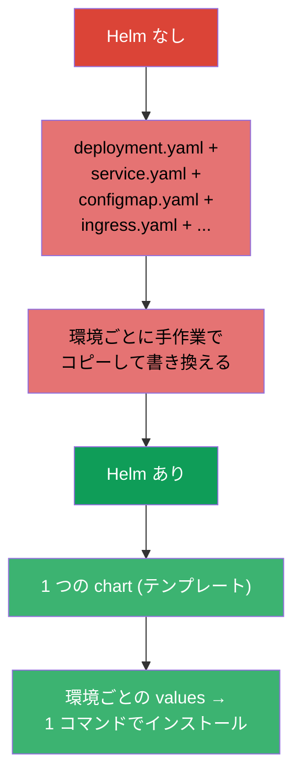
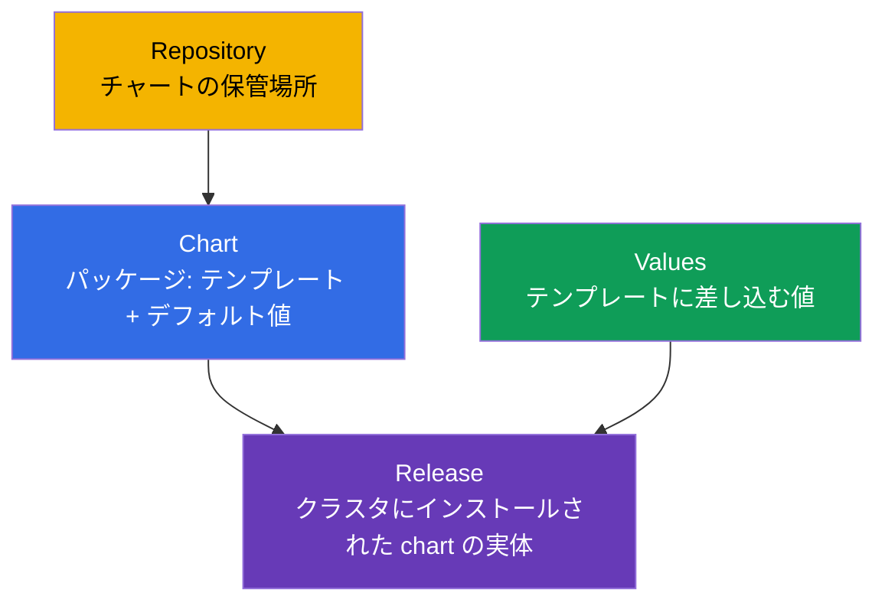
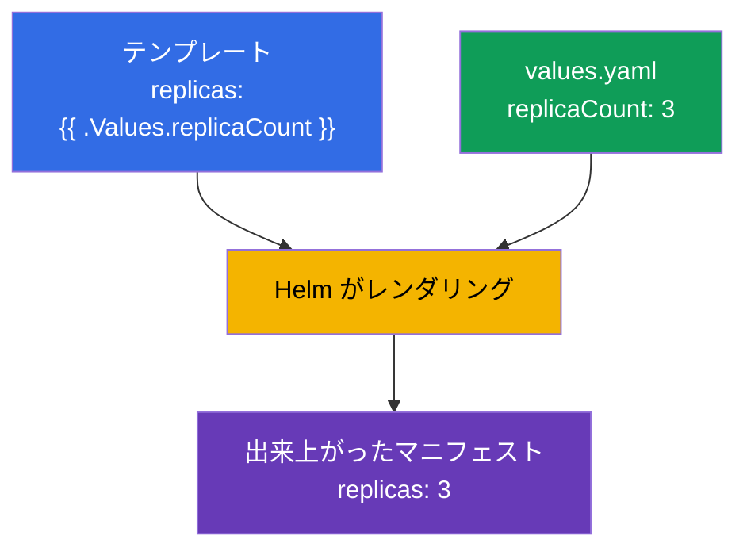
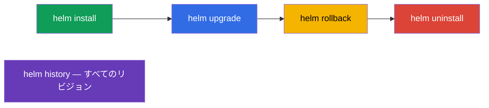
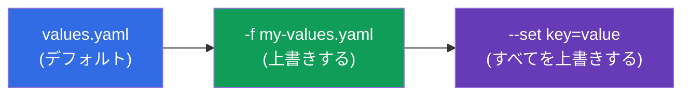
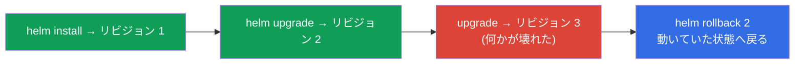

[Русская версия](ru.md) · [Eng version](README.md) · [Versión en español](es.md) · [Version française](fr.md) · [Deutsche Version](de.md) · [ქართული ვერსია](ge.md) · [繁體中文版](tw.md)

# 第 42 章。Helm

> 🟦 **CKA 向けの章**（Cluster Architecture 領域：「コンポーネントのインストールに Helm と
> Kustomize を使う」）。このテーマは CKAD にもあります（パッケージの利用）。
>
> **次に何を学ぶか。** ここまで多くのものを `kubectl apply -f` でインストールしてきました。
> しかし実際のアプリケーションは数十のマニフェスト（Deployment、Service、ConfigMap、
> Ingress...）から成り、しかも dev/prod で値が違います。それらを個別に管理するのは大変です。
> **Helm** とは「Kubernetes のパッケージマネージャー」です：マニフェストを再利用できる
> テンプレート化されたパッケージ (chart) にまとめ、そのインストールを一つのまとまりとして
> 管理します。

## 42.1. Helm が解決する問題

Helm がないと、それぞれのアプリケーションは YAML ファイルの寄せ集めであり、環境ごとに
手作業で適用し、バージョン管理し、パラメータ化しなければなりません。



Helm が与えてくれるもの：マニフェスト一式を **chart** にまとめること、**テンプレート化**
（同じテンプレートに環境ごとの異なる値）、**リリース** の管理（インストール/更新/ロールバックを
一つのまとまりとして）、そして出来合いのパッケージの **リポジトリ** です。

## 42.2. Helm の主要な概念



| 概念 | それは何か |
|---------|---------|
| **Chart** | Helm のパッケージ：マニフェストのテンプレート + デフォルト値 + メタデータ |
| **Values** | テンプレートに差し込まれるパラメータ（デフォルト値を上書きします） |
| **Release** | クラスタへの具体的な chart のインストール（名前とリビジョン履歴を持ちます） |
| **Repository** | チャートの保管場所（イメージのレジストリのようなもの、ただしチャート用） |

重要な考え方：**1 つの chart → 多くの releases**、それぞれ異なる values で（PostgreSQL の
1 つの chart を、異なる設定で `db-dev` と `db-prod` としてインストールできます）。

## 42.3. chart の構造

chart とは決められた構造のディレクトリです：

```
mychart/
├── Chart.yaml          # メタデータ: 名前、バージョン
├── values.yaml         # デフォルト値
├── templates/          # マニフェストのテンプレート
│   ├── deployment.yaml
│   ├── service.yaml
│   └── _helpers.tpl    # 補助テンプレート
└── charts/             # 依存関係 (入れ子のチャート)
```

テンプレートは Go テンプレートの構文で values の変数を使います：

```yaml
# templates/deployment.yaml
spec:
  replicas: {{ .Values.replicaCount }}      # values から差し込まれます
  template:
    spec:
      containers:
      - image: {{ .Values.image.repository }}:{{ .Values.image.tag }}
```

```yaml
# values.yaml (デフォルト値)
replicaCount: 3
image:
  repository: nginx
  tag: "1.27"
```



## 42.4. Helm の基本コマンド

```bash
# リポジトリ
helm repo add bitnami https://charts.bitnami.com/bitnami
helm repo update
helm search repo nginx                 # chart を探す

# インストール / 更新
helm install my-release bitnami/nginx                    # インストール
helm install my-release bitnami/nginx --set replicaCount=5   # パラメータ付き
helm install my-release bitnami/nginx -f my-values.yaml      # 自分の values で
helm upgrade my-release bitnami/nginx -f my-values.yaml      # 更新

# 参照と管理
helm list                              # インストール済みの releases
helm status my-release
helm history my-release                # リビジョンの履歴
helm rollback my-release 1             # リビジョンへロールバック
helm uninstall my-release              # 削除

# デバッグに便利 — 実際に何が適用されるか
helm template my-release bitnami/nginx -f my-values.yaml   # ローカルでレンダリング
```



## 42.5. values の上書き

`values.yaml` のデフォルト値は 2 つの方法で上書きされます（優先度の低い順）：

| 方法 | 例 | どんなときに |
|--------|--------|------|
| 自分の values ファイル | `-f prod-values.yaml` | パラメータが多いとき、環境ごと |
| コマンドラインの `--set` | `--set replicaCount=5` | ピンポイントの上書き |



こうして 1 つの chart を環境ごとに適応させます：`-f dev-values.yaml` と
`-f prod-values.yaml` で、レプリカ数、リソース、ホストを変えます。

## 42.6. Helm とリリース：install/upgrade/rollback

Helm はアプリケーションを履歴を持つ **一つのリリース** として管理します - Deployment
（第 8 章）に似ていますが、マニフェスト一式のレベルでです：



Helm はリリースのリビジョン履歴を（クラスタの Secret に）保存しているので、`helm rollback` は
オブジェクト一式を 1 コマンドで以前の状態へ戻せます - 更新が失敗したときに便利です。

## 42.7. 本番環境でこれをどう使うか

- **Helm は出来合いのソフトウェアをインストールする標準です。** Ingress コントローラー、
  cert-manager、Prometheus、データベース、オペレーター（第 41 章）は、ほぼ常に Helm チャートで
  入れます：数十のマニフェストの代わりに 1 コマンドで、自分の環境向けのパラメータ付きで。
- **環境ごとの values + GitOps。** 本番では values ファイル (dev/stage/prod) を git に置き、
  それを適用するのは GitOps ツール（Argo CD/Flux、第 3 章）です - Argo CD が Helm チャートを
  自分でレンダリングすることも多いです。こうして 1 つの chart が再現可能な形ですべての環境を
  まかないます。
- **自分のアプリケーション用の自作チャート。** チームは自分のサービスをチャート（あるいは共通の
  「ライブラリ」chart）にまとめ、似たようなサービスを数十個、統一された形で出していきます。
- **helm upgrade には注意。** 不注意な upgrade はリソースを作り直したり、データ（たとえば PVC）に
  影響したりすることがあります。本番では upgrade の前に `helm diff`/`helm template` を見て、
  何が変わるのかを確認します。
- **Helm と Kustomize。** Helm はテンプレート化と出来合いチャートのエコシステムが強みです。
  ベースのマニフェストに「変更を重ねる」だけのもっと単純な用途には Kustomize（第 43 章）を
  使います。両方を組み合わせることも多いです。

## 42.8. ミニ用語集

- **Helm** - Kubernetes のパッケージマネージャー。
- **Chart** - パッケージ：マニフェストのテンプレート + values + メタデータ。
- **Values** - テンプレートに差し込むためのパラメータ。
- **Release** - インストールされた chart の実体（リビジョン履歴付き）。
- **Repository** - チャートの保管場所。
- **helm install/upgrade/rollback/uninstall** - リリースのライフサイクル。
- **--set / -f** - CLI で / ファイルで values を上書きすること。
- **helm template** - チャートをローカルでマニフェストへレンダリングすること（確認用）。

## 42.9. 本章のまとめ

- Helm は Kubernetes のパッケージマネージャーです：マニフェスト一式をテンプレート化できる
  chart にまとめ、それを一つのリリースとして管理します。
- 概念：Chart（パッケージ）、Values（パラメータ）、Release（インストール）、Repository（保管場所）。
  1 つの chart → 異なる values で多くの releases。
- chart は `Chart.yaml`、`values.yaml`、`templates/` を持つディレクトリです。テンプレートは
  `{{ .Values.* }}` で値を差し込みます。
- コマンド：repo add/update、install、upgrade、rollback、uninstall、list、history。`helm
  template` は確認のためにローカルでレンダリングします。
- values はファイル (`-f`) と `--set`（最優先）で上書きします - こうして環境ごとに適応させます。
- Helm はリリースのリビジョン履歴を持っているので、`helm rollback` はオブジェクト一式を
  1 コマンドで戻します。

## 42.10. これがどう役に立つか：試験と実際の仕事で

**試験では。** CKA の出題範囲には Helm の利用が含まれます。「コンポーネントを Helm チャートで
インストールせよ」「リリースを更新/ロールバックせよ」「--set/values で値を上書きせよ」といった
課題が想定されます。install/upgrade/rollback/list のコマンドと values の渡し方を知っておく
必要があります。チャートを深く書くことは通常求められません。

**実際の仕事では。** Helm は出来合いのソフトウェアを入れ、自分のサービスを出していく主要な
手段です：1 コマンド、環境ごとのパラメータ、リリースのロールバック。GitOps との組み合わせ
（values を git に、Argo CD で）は再現可能なデリバリーの土台です。リリースの理解と upgrade への
注意深さは、運用の日常的なスキルです。

## 42.11. 自己チェックの質問

1. `kubectl apply -f` と比べて Helm はどんな問題を解決しますか？
2. chart、values、release とは何ですか？1 つの chart からどうやって異なるインストールが
   できるのですか？
3. chart のディレクトリは何から成り、テンプレートは values をどう使いますか？
4. インストール時に値を上書きするにはどうしますか。`--set` と `-f` の優先度はどうなっていますか？
5. リリースの履歴を見て、それをロールバックするにはどうしますか？
6. インストール/更新の前に `helm template` は何のために必要ですか？
7. Helm はアプローチの点で Kustomize とどう違いますか？

## 演習

Helm によるパッケージングとインストールを身につけました。第 43 章では、テンプレートを使わずに
マニフェストを設定する別のアプローチ - Kustomize を扱います。Helm は管理系のラボ（クラスタの
コンポーネントのインストールを含む）で練習します。

🧪 ラボ 115 (Helm)：[tasks/cka/labs/115](../../labs/115/README_JP.MD)

---
[目次](../README_JP.md) · [第 41 章](../41/jp.md) · [第 43 章](../43/jp.md)
