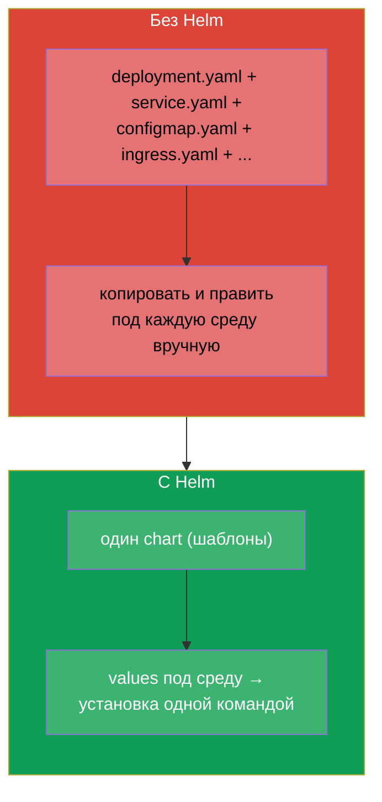
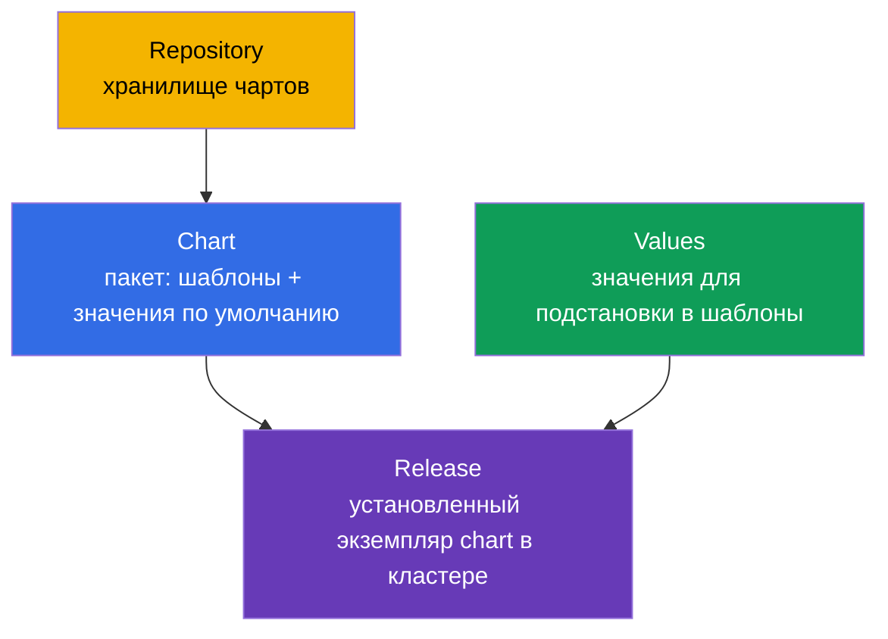
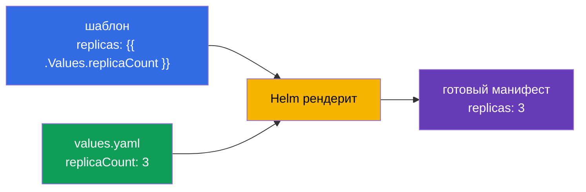
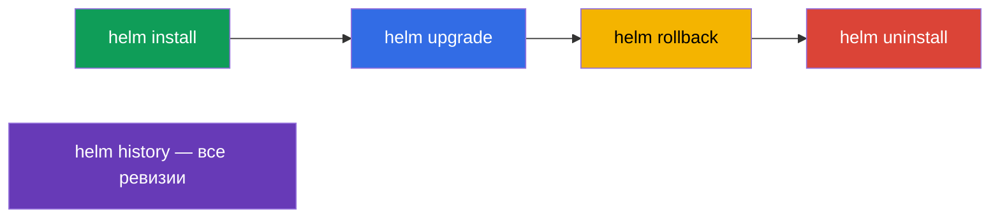
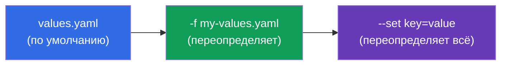
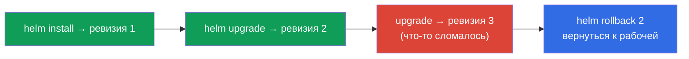

# Глава 42. Helm

> 🟦 **Глава для CKA** (домен Cluster Architecture: «использовать Helm и Kustomize для
> установки компонентов»). Тема есть и в CKAD (использование пакетов).
>
> **Что дальше.** Мы установили много всего через `kubectl apply -f`. Но реальное
> приложение - это десятки манифестов (Deployment, Service, ConfigMap, Ingress...), да ещё
> с разными значениями для dev/prod. Управлять ими по отдельности тяжело. **Helm** - это
> «менеджер пакетов для Kubernetes»: он упаковывает манифесты в переиспользуемый
> шаблонизируемый пакет (chart) и управляет его установкой как единым целым.

## 42.1. Проблема, которую решает Helm

Без Helm каждое приложение - это россыпь YAML-файлов, которые надо применять,
версионировать и параметризовать вручную под каждую среду.



Helm даёт: упаковку набора манифестов в **chart**, **шаблонизацию** (одни шаблоны -
разные значения для сред), управление **релизами** (установка/обновление/откат как единым
целым) и **репозитории** готовых пакетов.

## 42.2. Ключевые понятия Helm



| Понятие | Что это |
|---------|---------|
| **Chart** | пакет Helm: шаблоны манифестов + значения по умолчанию + метаданные |
| **Values** | параметры, подставляемые в шаблоны (переопределяют значения по умолчанию) |
| **Release** | конкретная установка chart в кластере (с именем и историей ревизий) |
| **Repository** | хранилище чартов (как реестр образов, но для чартов) |

Ключевая идея: **один chart → много releases** с разными values (один chart PostgreSQL
можно установить как `db-dev` и `db-prod` с разными настройками).

## 42.3. Структура chart

Chart - это каталог заданной структуры:

```
mychart/
├── Chart.yaml          # метаданные: имя, версия
├── values.yaml         # значения по умолчанию
├── templates/          # шаблоны манифестов
│   ├── deployment.yaml
│   ├── service.yaml
│   └── _helpers.tpl    # вспомогательные шаблоны
└── charts/             # зависимости (вложенные чарты)
```

Шаблоны используют переменные из values через синтаксис Go-шаблонов:

```yaml
# templates/deployment.yaml
spec:
  replicas: {{ .Values.replicaCount }}      # подставится из values
  template:
    spec:
      containers:
      - image: {{ .Values.image.repository }}:{{ .Values.image.tag }}
```

```yaml
# values.yaml (значения по умолчанию)
replicaCount: 3
image:
  repository: nginx
  tag: "1.27"
```



## 42.4. Основные команды Helm

```bash
# Репозитории
helm repo add bitnami https://charts.bitnami.com/bitnami
helm repo update
helm search repo nginx                 # найти chart

# Установка / обновление
helm install my-release bitnami/nginx                    # установить
helm install my-release bitnami/nginx --set replicaCount=5   # с параметром
helm install my-release bitnami/nginx -f my-values.yaml      # со своим values
helm upgrade my-release bitnami/nginx -f my-values.yaml      # обновить

# Просмотр и управление
helm list                              # установленные releases
helm status my-release
helm history my-release                # история ревизий
helm rollback my-release 1             # откат на ревизию
helm uninstall my-release              # удалить

# Полезно для отладки — что реально применится
helm template my-release bitnami/nginx -f my-values.yaml   # отрендерить локально
```



## 42.5. Переопределение values

Значения по умолчанию из `values.yaml` переопределяются двумя способами (по возрастанию
приоритета):

| Способ | Пример | Когда |
|--------|--------|-------|
| свой values-файл | `-f prod-values.yaml` | много параметров, среды |
| `--set` в командной строке | `--set replicaCount=5` | точечное переопределение |



Так один chart адаптируют под среды: `-f dev-values.yaml` и `-f prod-values.yaml` с
разными репликами, ресурсами, хостами.

## 42.6. Helm и релизы: install/upgrade/rollback

Helm управляет приложением как **единым релизом** с историей - похоже на Deployment (глава
8), но на уровне всего набора манифестов:



Helm хранит историю ревизий релиза (в Secret'ах кластера), поэтому `helm rollback` может
вернуть весь набор объектов к предыдущему состоянию одной командой - удобно при неудачном
обновлении.

## 42.7. Как это применяют в продакшене

- **Helm - стандарт установки готового ПО.** Ingress-контроллеры, cert-manager, Prometheus,
  БД, операторы (глава 41) почти всегда ставят Helm-чартами: одна команда вместо десятков
  манифестов, с параметрами под свою среду.
- **Values под среды + GitOps.** В проде values-файлы (dev/stage/prod) хранят в git, а
  применяет их GitOps-инструмент (Argo CD/Flux, глава 3) - часто Argo CD рендерит Helm-
  чарты сам. Так один chart обслуживает все среды воспроизводимо.
- **Свои чарты для своих приложений.** Команды упаковывают свои сервисы в чарты (или общий
  «библиотечный» chart), чтобы единообразно катить десятки похожих сервисов.
- **Осторожность с helm upgrade.** Неаккуратный upgrade может пересоздать ресурсы или
  задеть данные (например, PVC). В проде перед upgrade смотрят `helm diff`/`helm template`,
  чтобы понять, что именно изменится.
- **Helm vs Kustomize.** Helm силён шаблонизацией и экосистемой готовых чартов; для более
  простого «наложения изменений» на базовые манифесты используют Kustomize (глава 43).
  Часто их сочетают.

## 42.8. Мини-глоссарий

- **Helm** - менеджер пакетов для Kubernetes.
- **Chart** - пакет: шаблоны манифестов + values + метаданные.
- **Values** - параметры для подстановки в шаблоны.
- **Release** - установленный экземпляр chart (с историей ревизий).
- **Repository** - хранилище чартов.
- **helm install/upgrade/rollback/uninstall** - жизненный цикл релиза.
- **--set / -f** - переопределение values в CLI / файлом.
- **helm template** - локальный рендер чарта в манифесты (для проверки).

## 42.9. Итоги главы

- Helm - менеджер пакетов Kubernetes: упаковывает набор манифестов в шаблонизируемый chart
  и управляет им как единым релизом.
- Понятия: Chart (пакет), Values (параметры), Release (установка), Repository (хранилище);
  один chart → много releases с разными values.
- Chart - каталог с `Chart.yaml`, `values.yaml`, `templates/`; шаблоны подставляют
  значения через `{{ .Values.* }}`.
- Команды: repo add/update, install, upgrade, rollback, uninstall, list, history; `helm
  template` рендерит локально для проверки.
- Values переопределяют файлом (`-f`) и `--set` (высший приоритет) - так адаптируют под
  среды.
- Helm ведёт историю ревизий релиза, поэтому `helm rollback` откатывает весь набор
  объектов одной командой.

## 42.10. Как это пригодится: на экзамене и в реальной работе

**На экзамене.** Программа CKA включает использование Helm. Ожидаются задания «установи
компонент Helm-чартом», «обнови/откати релиз», «переопредели значение через --set/values».
Нужно знать команды install/upgrade/rollback/list и как передавать values. Глубокого
написания чартов обычно не требуют.

**В реальной работе.** Helm - основной способ ставить готовое ПО и катить свои сервисы:
одна команда, параметры под среду, откат релиза. В связке с GitOps (values в git, Argo CD)
это фундамент воспроизводимой доставки. Понимание релизов и осторожность с upgrade -
повседневные навыки эксплуатации.

## 42.11. Вопросы для самопроверки

1. Какую проблему решает Helm по сравнению с `kubectl apply -f`?
2. Что такое chart, values и release? Как из одного chart получаются разные установки?
3. Из чего состоит каталог chart и как шаблоны используют values?
4. Как переопределить значения при установке и какой приоритет у `--set` и `-f`?
5. Как посмотреть историю релиза и откатить его?
6. Зачем нужен `helm template` перед установкой/обновлением?
7. Чем Helm отличается от Kustomize по подходу?

## Практика

Мы освоили упаковку и установку через Helm. В главе 43 - альтернативный подход к настройке
манифестов без шаблонов: Kustomize. Helm отрабатывается в лабах по администрированию (в
т.ч. при установке компонентов кластера).

🧪 Лаба 115 (Helm): [tasks/cka/labs/115](../../labs/115/README_RU.MD)

---
[Оглавление](../README_RU.md) · [Глава 41](../41/ru.md) · [Глава 43](../43/ru.md)
