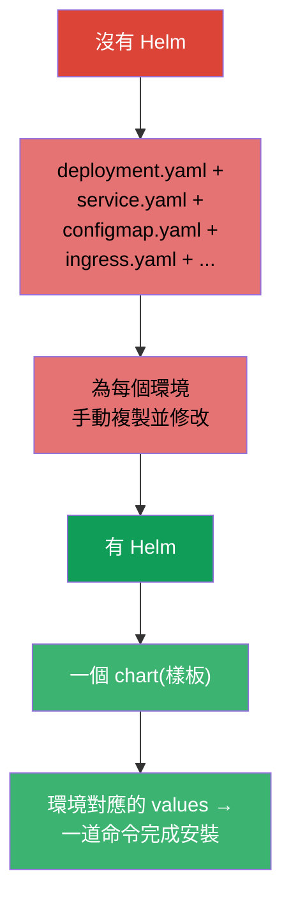
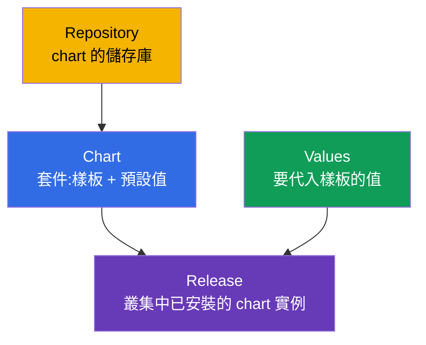
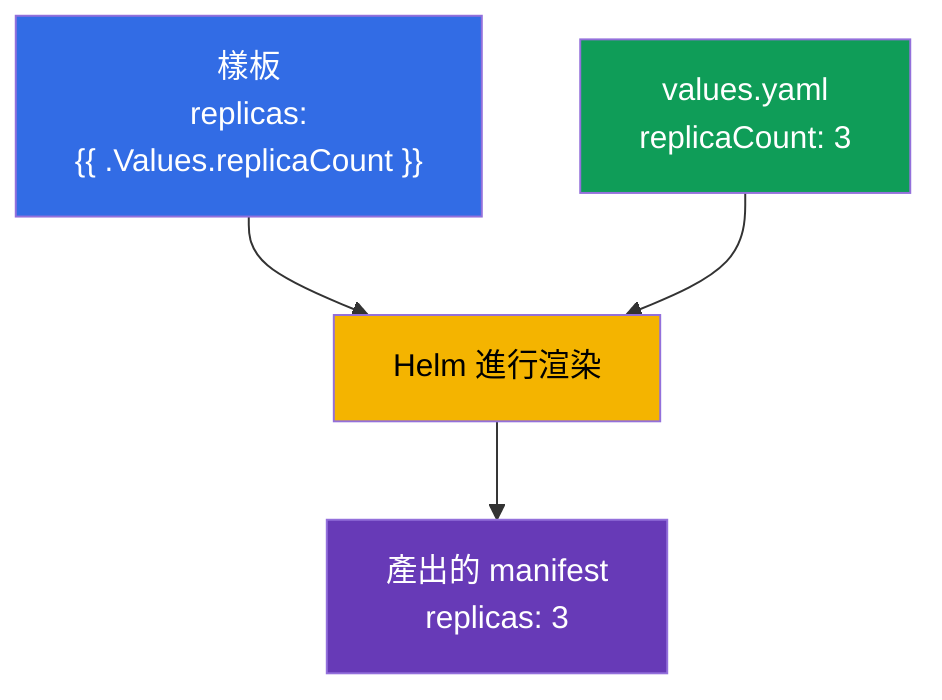
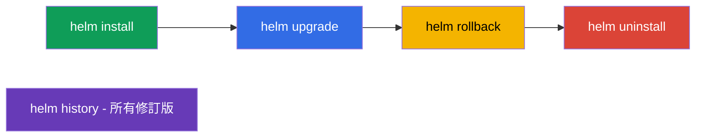
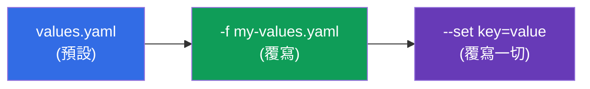
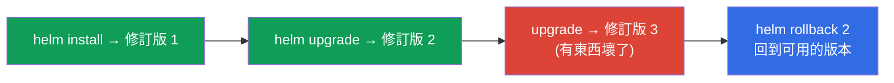

[Русская версия](ru.md) · [Eng version](README.md) · [Versión en español](es.md) · [Version française](fr.md) · [Deutsche Version](de.md) · [ქართული ვერსია](ge.md) · [日本語版](jp.md)

# 第 42 章。Helm

> 🟦 **CKA 章節**(領域 Cluster Architecture:「使用 Helm 與 Kustomize 安裝
> 元件」)。這個主題在 CKAD 裡也有(套件的使用)。
>
> **接下來是什麼。** 我們透過 `kubectl apply -f` 裝了很多東西。但真實的
> 應用 - 是好幾十個 manifest(Deployment、Service、ConfigMap、Ingress...),而且
> dev/prod 還各有不同的值。一個一個管起來很吃力。**Helm** 就是
> 「Kubernetes 的套件管理器」:它把 manifest 打包成可重複使用、可
> 樣板化的套件(chart),並把它的安裝當成一個整體來管理。

## 42.1. Helm 解決的問題

沒有 Helm 的話,每個應用就是一堆散落的 YAML 檔,要手動套用、
做版本管理,還要為每個環境手動參數化。



Helm 提供:把一組 manifest 打包成 **chart**、**樣板化**(同一套樣板 -
不同環境不同的值)、**release** 的管理(安裝/更新/回滾都當成一個整體)以及
現成套件的**儲存庫**。

## 42.2. Helm 的關鍵概念



| 概念 | 這是什麼 |
|---------|---------|
| **Chart** | Helm 的套件:manifest 樣板 + 預設值 + 中介資料 |
| **Values** | 代入樣板的參數(會覆寫預設值) |
| **Release** | chart 在叢集中的一次具體安裝(有名稱與修訂版歷史) |
| **Repository** | chart 的儲存庫(像映像檔的 registry,但是放 chart) |

關鍵想法:**一個 chart → 多個 releases**,搭配不同的 values(同一個 PostgreSQL
的 chart 可以用不同設定裝成 `db-dev` 與 `db-prod`)。

## 42.3. chart 的結構

Chart 就是一個具有既定結構的目錄:

```
mychart/
├── Chart.yaml          # 中介資料:名稱、版本
├── values.yaml         # 預設值
├── templates/          # manifest 的樣板
│   ├── deployment.yaml
│   ├── service.yaml
│   └── _helpers.tpl    # 輔助樣板
└── charts/             # 依賴(內嵌的 chart)
```

樣板透過 Go 樣板的語法使用來自 values 的變數:

```yaml
# templates/deployment.yaml
spec:
  replicas: {{ .Values.replicaCount }}      # 會從 values 代入
  template:
    spec:
      containers:
      - image: {{ .Values.image.repository }}:{{ .Values.image.tag }}
```

```yaml
# values.yaml (預設值)
replicaCount: 3
image:
  repository: nginx
  tag: "1.27"
```



## 42.4. Helm 的主要命令

```bash
# 儲存庫
helm repo add bitnami https://charts.bitnami.com/bitnami
helm repo update
helm search repo nginx                 # 尋找 chart

# 安裝 / 更新
helm install my-release bitnami/nginx                    # 安裝
helm install my-release bitnami/nginx --set replicaCount=5   # 帶參數
helm install my-release bitnami/nginx -f my-values.yaml      # 用自己的 values
helm upgrade my-release bitnami/nginx -f my-values.yaml      # 更新

# 檢視與管理
helm list                              # 已安裝的 releases
helm status my-release
helm history my-release                # 修訂版歷史
helm rollback my-release 1             # 回滾到某個修訂版
helm uninstall my-release              # 刪除

# 除錯時很有用 - 實際會套用什麼
helm template my-release bitnami/nginx -f my-values.yaml   # 在本機渲染
```



## 42.5. values 的覆寫

`values.yaml` 裡的預設值可以用兩種方式覆寫(依優先順序由低到高):

| 方式 | 範例 | 什麼時候用 |
|--------|--------|------|
| 自己的 values 檔 | `-f prod-values.yaml` | 參數很多、多個環境 |
| 命令列的 `--set` | `--set replicaCount=5` | 局部的單點覆寫 |



一個 chart 就是這樣適配到各環境:`-f dev-values.yaml` 與 `-f prod-values.yaml`,
搭配不同的副本數、資源與主機名。

## 42.6. Helm 與 release:install/upgrade/rollback

Helm 把應用當成帶有歷史的**單一 release** 來管理 - 有點像 Deployment
(第 8 章),但層級是整組 manifest:



Helm 會保存 release 的修訂版歷史(存在叢集的 Secret 裡),所以 `helm rollback` 可以
用一道命令把整組物件退回上一個狀態 - 在更新失敗時很好用。

## 42.7. 生產環境怎麼用

- **Helm - 安裝現成軟體的標準做法。** Ingress 控制器、cert-manager、Prometheus、
  資料庫、operator(第 41 章)幾乎都是用 Helm chart 安裝:一道命令取代好幾十個
  manifest,並帶上自己環境的參數。
- **環境對應的 values + GitOps。** 生產環境會把 values 檔(dev/stage/prod)放在 git 裡,由
  GitOps 工具(Argo CD/Flux,第 3 章)去套用 - 常常是 Argo CD 自己渲染 Helm
  chart。這樣一個 chart 就能可重現地服務所有環境。
- **自家應用的自家 chart。** 團隊會把自己的服務打包成 chart(或一個共用的
  「函式庫型」chart),以便一致地發布幾十個相似的服務。
- **helm upgrade 要小心。** 不謹慎的 upgrade 可能重建資源或
  影響資料(例如 PVC)。生產環境在 upgrade 前會看 `helm diff`/`helm template`,
  以了解到底會變動什麼。
- **Helm vs Kustomize。** Helm 強在樣板化與現成 chart 的生態;若只是要比較
  單純地「在基礎 manifest 上疊加變更」,就用 Kustomize(第 43 章)。
  兩者常常搭配使用。

## 42.8. 迷你詞彙表

- **Helm** - Kubernetes 的套件管理器。
- **Chart** - 套件:manifest 樣板 + values + 中介資料。
- **Values** - 要代入樣板的參數。
- **Release** - 已安裝的 chart 實例(帶有修訂版歷史)。
- **Repository** - chart 的儲存庫。
- **helm install/upgrade/rollback/uninstall** - release 的生命週期。
- **--set / -f** - 在 CLI / 用檔案覆寫 values。
- **helm template** - 在本機把 chart 渲染成 manifest(用於檢查)。

## 42.9. 本章總結

- Helm 是 Kubernetes 的套件管理器:把一組 manifest 打包成可樣板化的 chart,
  並當成單一 release 來管理。
- 概念:Chart(套件)、Values(參數)、Release(安裝)、Repository(儲存庫);
  一個 chart → 多個 releases,搭配不同的 values。
- Chart 是含有 `Chart.yaml`、`values.yaml`、`templates/` 的目錄;樣板透過
  `{{ .Values.* }}` 代入值。
- 命令:repo add/update、install、upgrade、rollback、uninstall、list、history;`helm
  template` 在本機渲染以便檢查。
- Values 可用檔案(`-f`)與 `--set`(最高優先)覆寫 - 就是這樣適配各
  環境。
- Helm 會保留 release 的修訂版歷史,所以 `helm rollback` 一道命令就能回滾整組
  物件。

## 42.10. 這些在哪裡用得上:考試與實際工作

**在考試中。** CKA 的大綱包含 Helm 的使用。可以預期會有「用 Helm chart 安裝
某個元件」、「更新/回滾 release」、「透過 --set/values 覆寫某個值」這類題目。
需要知道 install/upgrade/rollback/list 命令,以及怎麼傳入 values。通常不會要求
深入撰寫 chart。

**在實際工作中。** Helm 是安裝現成軟體與發布自家服務的主要方式:
一道命令、環境對應的參數、release 的回滾。搭配 GitOps(values 放 git、Argo CD)
就是可重現交付的基礎。理解 release 並對 upgrade 保持謹慎 -
是日常維運的技能。

## 42.11. 自我檢查問題

1. 相較於 `kubectl apply -f`,Helm 解決了什麼問題?
2. chart、values 與 release 是什麼?一個 chart 怎麼得出不同的安裝?
3. chart 的目錄由什麼組成,樣板如何使用 values?
4. 安裝時如何覆寫值,`--set` 與 `-f` 的優先順序是什麼?
5. 如何查看 release 的歷史並回滾它?
6. 為什麼在安裝/更新之前需要 `helm template`?
7. Helm 與 Kustomize 在做法上有什麼不同?

## 實踐

我們掌握了透過 Helm 打包與安裝。第 43 章 - 不用樣板來調整 manifest 的
另一種做法:Kustomize。Helm 會在管理相關的實驗中操練(其中
也包含安裝叢集元件時)。

🧪 實驗 115(Helm):[tasks/cka/labs/115](../../labs/115/README_TW.MD)

🎮 Killercoda（在瀏覽器中，無需安裝）：[Installing NGINX Ingress with Helm](https://killercoda.com/chadmcrowell/course/cka/helm-install-nginx)

---
[目錄](../README_TW.md) · [第 41 章](../41/tw.md) · [第 43 章](../43/tw.md)
