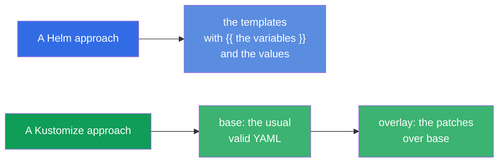
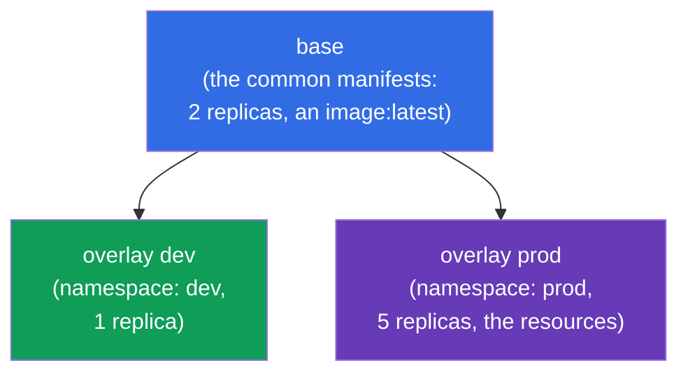
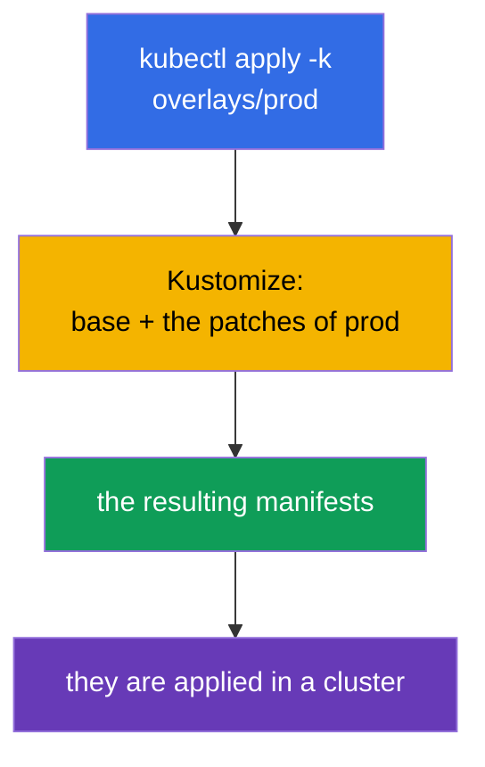
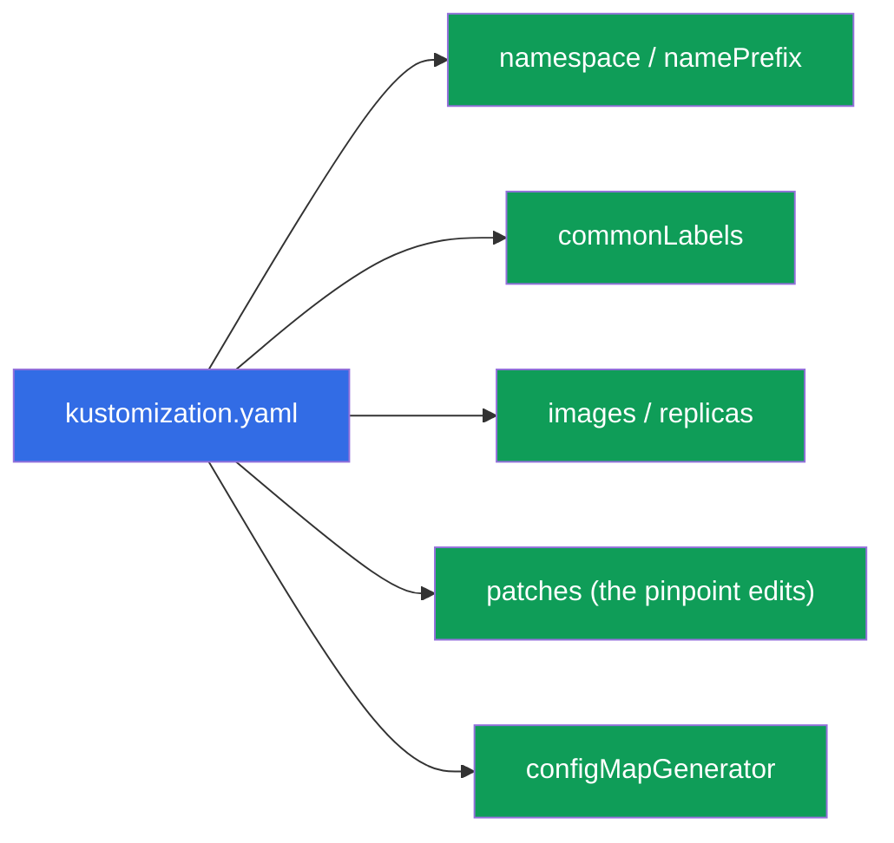
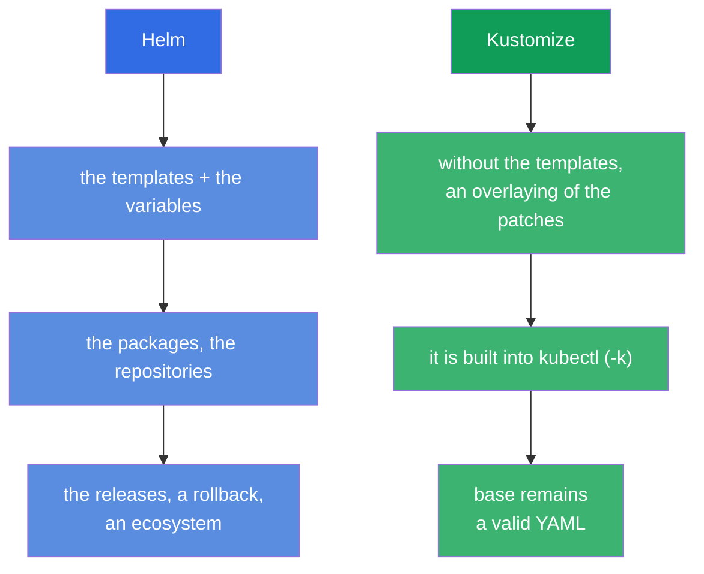

[Русская версия](ru.md) · [Versión en español](es.md) · [Version française](fr.md) · [Deutsche Version](de.md) · [ქართული ვერსია](ge.md) · [繁體中文版](tw.md) · [日本語版](jp.md)

# Chapter 43. Kustomize

> 🟦 **A chapter for the CKA** (a domain Cluster Architecture: "to use Helm and Kustomize"). The theme
> is in the CKAD too (a deploy).
>
> **What comes next.** Helm (the chapter 42) configures the manifests through the templates and the variables.
> **Kustomize** solves the same task - an adaptation of the manifests for the environments - but **without the templates**:
> it takes the usual YAML and overlays the changes onto them (overlays). Kustomize is built right
> into `kubectl` (`kubectl apply -k`). We will consider a base model base + overlays and will compare it with
> Helm - a question "Helm or Kustomize" is frequent both at an exam and in a life.

## 43.1. An idea of Kustomize: without the templates, only an overlaying

Helm templatizes (`{{ .Values.x }}`), and Kustomize goes by another way: you have the usual,
valid YAML manifests (**base**), and you **overlay** the changes onto them for a concrete
environment (**overlay**) - without touching the sources.



A plus of the approach: the base manifests remain a usual working YAML (they can be applied even without
Kustomize), and the differences of the environments live separately, not littering the sources with the template insertions.

## 43.2. base and overlays

A typical structure of Kustomize - **base** (the common manifests) and **overlays** (the folders for
every environment with the patches):

```
myapp/
├── base/
│   ├── kustomization.yaml
│   ├── deployment.yaml
│   └── service.yaml
└── overlays/
    ├── dev/
    │   └── kustomization.yaml      # the patches for dev
    └── prod/
        └── kustomization.yaml      # the patches for prod
```



`base/kustomization.yaml` lists the resources:

```yaml
resources:
- deployment.yaml
- service.yaml
```

`overlays/prod/kustomization.yaml` refers to base and adds the changes:

```yaml
resources:
- ../../base
namespace: prod
replicas:
- name: myapp
  count: 5
images:
- name: myapp
  newTag: "1.27"
```

## 43.3. An application

Kustomize is built into kubectl - it is applied by the flag `-k` (pointing at a folder with
`kustomization.yaml`):

```bash
# To look, what will be obtained (to render, without an applying)
kubectl kustomize overlays/prod

# To apply an overlay
kubectl apply -k overlays/prod

# A separate binary kustomize (the same possibilities)
kustomize build overlays/prod | kubectl apply -f -
```



> **An advice.** `kubectl kustomize <dir>` (or `kustomize build`) shows a resulting YAML
> **without applying** it - as `helm template` at Helm. It is useful to check, what will be obtained.

## 43.4. The possibilities of Kustomize

Kustomize can do the typical transformations without the templates:

| A possibility | What it does |
|-------------|-----------|
| `namespace` | to set a namespace to all the resources |
| `namePrefix` / `nameSuffix` | to add a prefix/a suffix to the names |
| `commonLabels` / `commonAnnotations` | to add the labels/the annotations to all |
| `images` | to replace an image/a tag |
| `replicas` | to change a number of the replicas |
| `patches` (strategic/JSON6902) | the pinpoint changes of any fields |
| `configMapGenerator` / `secretGenerator` | to generate a ConfigMap/a Secret out of the files/the literals |



The generators are useful separately: `configMapGenerator` creates a ConfigMap out of the files/the literals and
adds a **hash of a content** to a name. At a change of the data a name of a ConfigMap changes → a pod
is recreated and picks up a new config (a solution of a problem "an env out of a ConfigMap is not
updated", the chapter 18).

## 43.5. Helm against Kustomize

A frequent question of a choice. Both solve an adaptation of the manifests for the environments, but by a different way:



| | Helm | Kustomize |
|---|------|-----------|
| An approach | a templating (the variables) | an overlaying of the patches (overlays) |
| An installation | a separate instrument | it is built into kubectl (`-k`) |
| The ready packages | a huge ecosystem of the charts | no packages, only your own manifests |
| A management of the releases | yes (install/rollback, a history) | no (simply apply) |
| A curve of an entry | higher (the Go templates) | lower (a usual YAML) |
| It is better for | a ready software, a complex parameterization | your own manifests, an adaptation for the environments |

In a practice they are **often combined**: a third-party software is installed by the Helm charts, and your own manifests
are adapted by Kustomize. Many GitOps instruments (Argo CD) support both.

## 43.6. How this is applied in a production

- **Kustomize for your own manifests and the environments.** In a production your own applications are often kept as
  base + overlays (dev/stage/prod): a common base, and the differences (the replicas, the resources, the hosts,
  a namespace) - in an overlay. No templating, a clean YAML.
- **A built-in nature in kubectl and GitOps.** Since Kustomize is built into kubectl and is understood by Argo
  CD/Flux, it is convenient to use it in the GitOps repositories: you changed an overlay in git - GitOps
  applied it. This simplifies a pipeline.
- **configMapGenerator against a stale config.** A hash in a name of a ConfigMap automatically
  recreates the pods at a change of a config - in a production this solves a frequent problem "they changed a
  ConfigMap, and an application did not pick it up" without a manual rollout restart.
- **Helm + Kustomize together.** A typical prod pattern: a foreign software - Helm, your own - Kustomize;
  sometimes Kustomize "patches up" an output of Helm. A choice - by a task, and not "either-or".
- **base as a source of a truth.** Since base - the valid manifests, they are easy to review and to
  reuse between the teams; overlays keep a specificity of an environment isolated.

## 43.7. A mini glossary

- **Kustomize** - an instrument of an adaptation of the manifests by an overlaying of the patches, without the templates.
- **base** - the common source manifests.
- **overlay** - a set of the changes over base for a concrete environment.
- **kustomization.yaml** - a file, describing the resources and the transformations.
- **kubectl apply -k** - to apply a Kustomize directory.
- **patches** - the pinpoint changes of the fields (strategic merge / JSON6902).
- **configMapGenerator / secretGenerator** - a generation of a ConfigMap/a Secret (with a hash in a name).
- **kubectl kustomize / kustomize build** - a render without an applying.

## 43.8. The conclusions of the chapter

- Kustomize adapts the manifests for the environments **without the templates** - by an overlaying of the patches onto base.
- A model: base (the common valid YAML) + overlays (the patches for dev/prod); base remains
  applicable by itself too.
- It is built into kubectl: `kubectl apply -k <dir>`; `kubectl kustomize <dir>` renders without an
  applying.
- It can do a namespace, the prefixes, the labels, a replacement of the images/the replicas, the pinpoint patches and the generators of
  a ConfigMap/a Secret (with a hash in a name - an autorecreation of the pods at a change of a config).
- Helm vs Kustomize: Helm - the templates, the packages, the releases; Kustomize - an overlaying, it is built into
  kubectl, it is simpler; often they are used together.

## 43.9. How this will come in handy: at an exam and in a real work

**At an exam.** A program of the CKA includes Kustomize. The tasks "apply a Kustomize
directory" (`kubectl apply -k`), "configure an overlay with a change of the replicas/an image/a namespace",
an understanding of base/overlay are expected. It is useful to know `kubectl kustomize` for a check of a result.

**In a real work.** Kustomize - a popular way to keep your own manifests for several
environments without a template magic, it lies perfectly into GitOps (it is built into kubectl, it is understood by Argo
CD). configMapGenerator solves a problem of a stale config. An understanding, when to take Helm, and
when Kustomize (and how to combine them), - a practical skill of a delivery.

## 43.10. The questions for a self-check

1. By what does an approach of Kustomize differ from Helm fundamentally?
2. What are base and overlay? Why does base remain applicable by itself?
3. How to apply a Kustomize directory and how to look at a result without an applying?
4. Which transformations can Kustomize do? Give a few of them.
5. What does configMapGenerator do with a name of a ConfigMap and which problem does this solve?
6. In which cases to choose Helm, and in which Kustomize?
7. Is it possible to use Helm and Kustomize together? How?

## Practice

At this the part 8 (an architecture, an installation and a configuring) is completed. Next - the part 9,
a troubleshooting (CKA): a systematic analysis of the failures of the applications (the chapter 44), a control plane and
the nodes (45), a network (46). Kustomize is practised in the labs on an administration.

🧪 A lab 115 (Kustomize): [tasks/cka/labs/115](../../labs/115/README.MD)

---
[Contents](../README.md) · [Chapter 42](../42/README.md) · [Chapter 44](../44/README.md)
