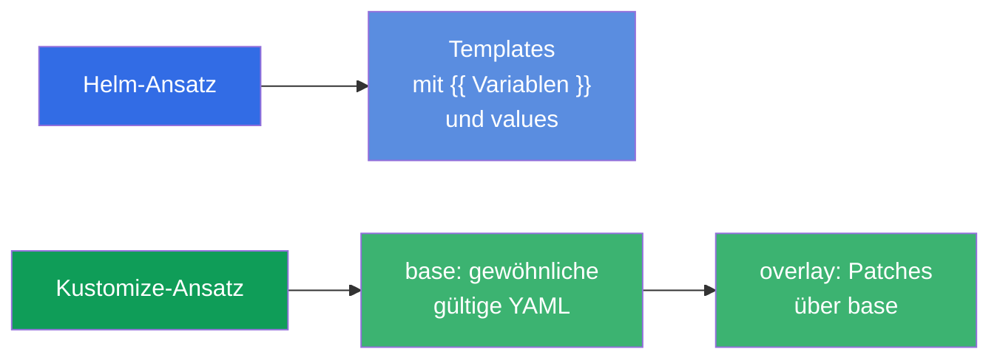
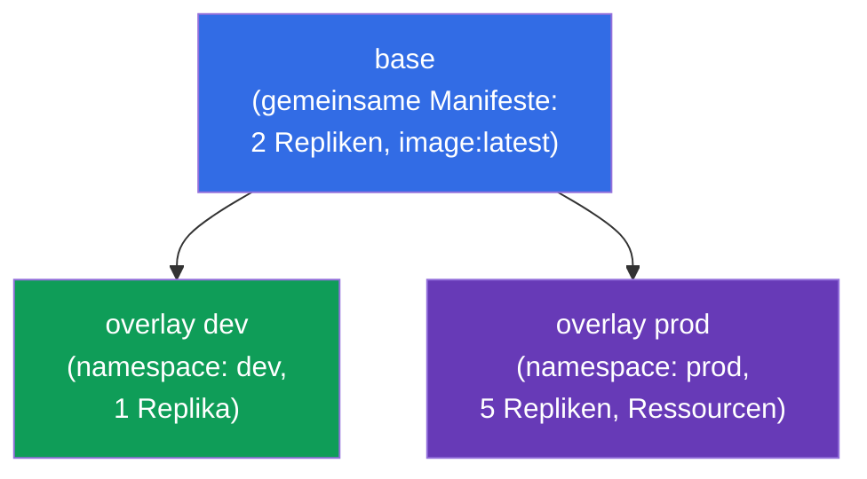
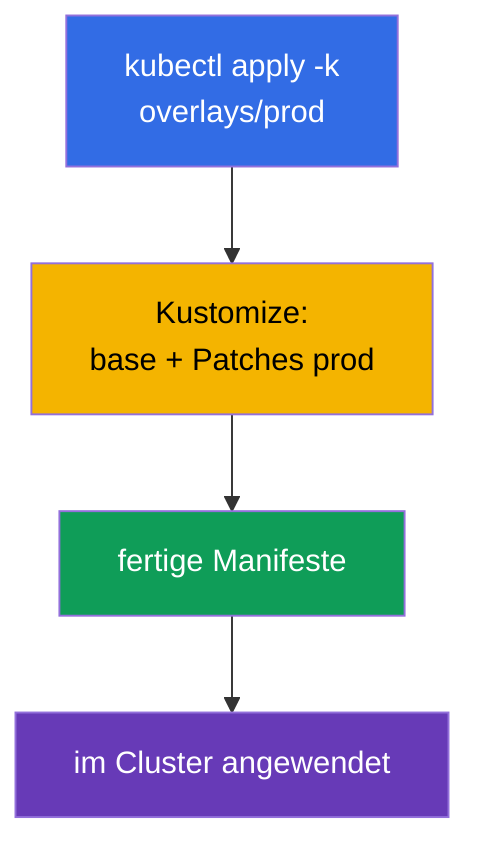
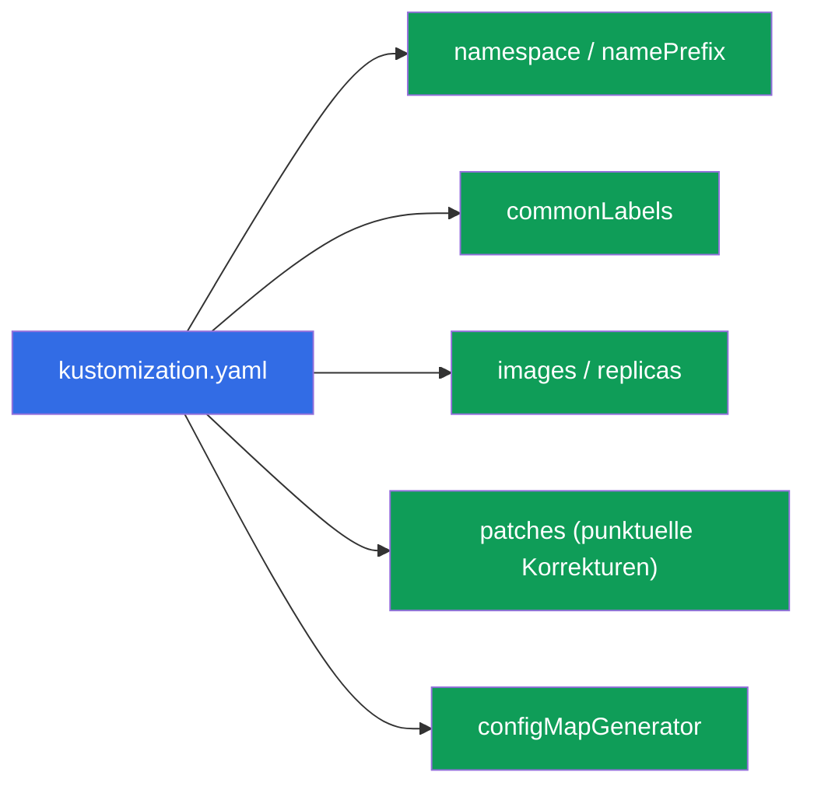
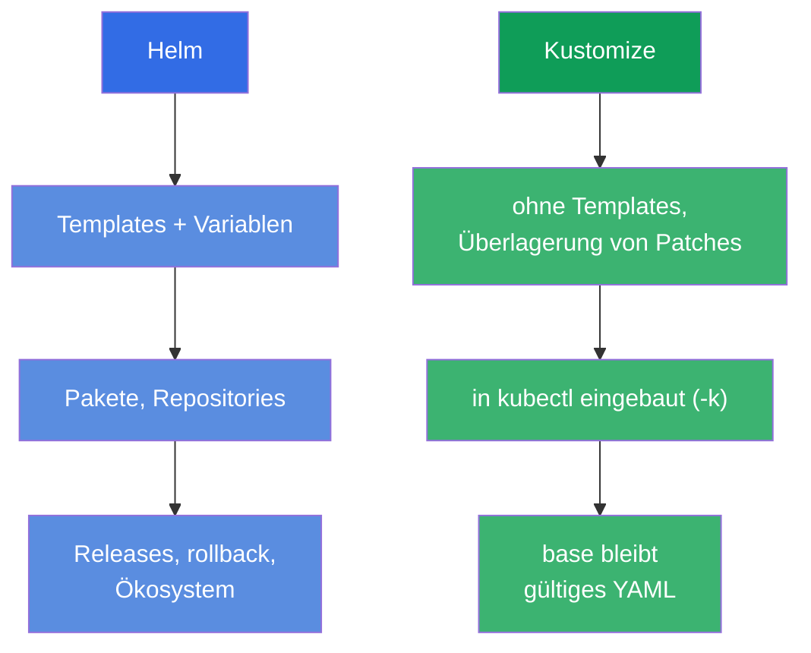

[Русская версия](ru.md) · [Eng version](README.md) · [Versión en español](es.md) · [Version française](fr.md) · [ქართული ვერსია](ge.md) · [繁體中文版](tw.md) · [日本語版](jp.md)

# Kapitel 43. Kustomize

> 🟦 **Kapitel für CKA** (Domäne Cluster Architecture: „Helm und Kustomize verwenden“). Das
> Thema gibt es auch in CKAD (Deployment).
>
> **Was kommt.** Helm (Kapitel 42) konfiguriert Manifeste über Templates und Variablen.
> **Kustomize** löst dieselbe Aufgabe - die Anpassung von Manifesten an Umgebungen - aber
> **ohne Templates**: es nimmt gewöhnliche YAML-Dateien und legt Änderungen darüber
> (overlays). Kustomize ist direkt in `kubectl` eingebaut (`kubectl apply -k`). Wir schauen
> uns das Basismodell base + overlays an und vergleichen es mit Helm - die Frage „Helm oder
> Kustomize“ ist häufig, in der Prüfung wie im Leben.

## 43.1. Die Idee von Kustomize: keine Templates, nur Überlagerung

Helm templatisiert (`{{ .Values.x }}`), Kustomize geht einen anderen Weg: Sie haben
gewöhnliche, gültige YAML-Manifeste (**base**) und **legen** Änderungen für eine konkrete
Umgebung darüber (**overlay**) - ohne die Quellen anzufassen.



Der Vorteil des Ansatzes: die base-Manifeste bleiben gewöhnliches, funktionierendes YAML
(man kann sie auch ohne Kustomize anwenden), und die Unterschiede der Umgebungen leben
separat, ohne die Quellen mit Template-Einschüben zu verschmutzen.

## 43.2. base und overlays

Die typische Kustomize-Struktur ist **base** (gemeinsame Manifeste) und **overlays** (Ordner
je Umgebung mit Patches):

```
myapp/
├── base/
│   ├── kustomization.yaml
│   ├── deployment.yaml
│   └── service.yaml
└── overlays/
    ├── dev/
    │   └── kustomization.yaml      # Patches für dev
    └── prod/
        └── kustomization.yaml      # Patches für prod
```



`base/kustomization.yaml` listet die Ressourcen auf:

```yaml
resources:
- deployment.yaml
- service.yaml
```

`overlays/prod/kustomization.yaml` verweist auf base und fügt Änderungen hinzu:

```yaml
resources:
- ../../base
namespace: prod
replicas:
- name: myapp
  count: 5
images:
- name: myapp
  newTag: "1.27"
```

## 43.3. Anwenden

Kustomize ist in kubectl eingebaut - angewendet wird es mit dem Flag `-k` (zeigt auf den
Ordner mit `kustomization.yaml`):

```bash
# Ansehen, was herauskommt (rendern, ohne anzuwenden)
kubectl kustomize overlays/prod

# Overlay anwenden
kubectl apply -k overlays/prod

# Separates kustomize-Binary (dieselben Möglichkeiten)
kustomize build overlays/prod | kubectl apply -f -
```



> **Tipp.** `kubectl kustomize <dir>` (oder `kustomize build`) zeigt das fertige YAML,
> **ohne es anzuwenden** - wie `helm template` bei Helm. Nützlich, um zu prüfen, was
> herauskommt.

## 43.4. Möglichkeiten von Kustomize

Kustomize beherrscht typische Transformationen ohne Templates:

| Möglichkeit | Was sie macht |
|-------------|-----------|
| `namespace` | allen Ressourcen einen namespace setzen |
| `namePrefix` / `nameSuffix` | Präfix/Suffix zu den Namen hinzufügen |
| `commonLabels` / `commonAnnotations` | allen Labels/Annotationen hinzufügen |
| `images` | Image/Tag ersetzen |
| `replicas` | die Anzahl der Repliken ändern |
| `patches` (strategic/JSON6902) | punktuelle Änderungen beliebiger Felder |
| `configMapGenerator` / `secretGenerator` | ConfigMap/Secret aus Dateien/Literalen generieren |



Besonders nützlich sind die Generatoren: `configMapGenerator` erzeugt eine ConfigMap aus
Dateien/Literalen und fügt dem Namen einen **Hash des Inhalts** hinzu. Bei einer Änderung
der Daten ändert sich der Name der ConfigMap → der Pod wird neu erstellt und übernimmt die
neue Konfiguration (Lösung des Problems „env aus ConfigMap wird nicht aktualisiert“,
Kapitel 18).

## 43.5. Helm gegen Kustomize

Eine häufige Wahlfrage. Beide lösen die Anpassung von Manifesten an Umgebungen, aber
unterschiedlich:



| | Helm | Kustomize |
|---|------|-----------|
| Ansatz | Templating (Variablen) | Überlagerung von Patches (overlays) |
| Installation | separates Werkzeug | in kubectl eingebaut (`-k`) |
| Fertige Pakete | riesiges Ökosystem an Charts | keine Pakete, nur eigene Manifeste |
| Release-Verwaltung | ja (install/rollback, Historie) | nein (einfach apply) |
| Einstiegskurve | höher (Go-Templates) | niedriger (gewöhnliches YAML) |
| Besser für | fertige Software, komplexe Parametrisierung | eigene Manifeste, Anpassung an Umgebungen |

In der Praxis werden sie **oft kombiniert**: fremde Software installiert man mit
Helm-Charts, eigene Manifeste passt man mit Kustomize an. Viele GitOps-Werkzeuge (Argo CD)
unterstützen beides.

## 43.6. Wie man das in der Produktion anwendet

- **Kustomize für eigene Manifeste und Umgebungen.** In der Produktion hält man eigene
  Anwendungen oft als base + overlays (dev/stage/prod): ein gemeinsames base, und die
  Unterschiede (Repliken, Ressourcen, Hosts, namespace) - im overlay. Kein Templating,
  reines YAML.
- **Eingebaut in kubectl und GitOps.** Da Kustomize in kubectl eingebaut ist und von Argo
  CD/Flux verstanden wird, lässt es sich bequem in GitOps-Repositories nutzen: overlay in
  git geändert - GitOps hat es angewendet. Das vereinfacht die Pipeline.
- **configMapGenerator gegen stale Konfiguration.** Der Hash im Namen der ConfigMap
  erstellt die Pods bei einer Änderung der Konfiguration automatisch neu - in der
  Produktion löst das das häufige Problem „ConfigMap geändert, aber die Anwendung hat es
  nicht übernommen“ ohne manuellen rollout restart.
- **Helm + Kustomize zusammen.** Ein typisches Produktionsmuster: fremde Software - Helm,
  eigene - Kustomize; manchmal „patcht“ Kustomize die Ausgabe von Helm nach. Die Wahl
  richtet sich nach der Aufgabe, nicht nach „entweder-oder“.
- **base als Quelle der Wahrheit.** Da base gültige Manifeste sind, lassen sie sich leicht
  reviewen und zwischen Teams wiederverwenden; die overlays halten die Spezifik der
  Umgebung isoliert.

## 43.7. Mini-Glossar

- **Kustomize** - Werkzeug zur Anpassung von Manifesten durch Überlagerung von Patches,
  ohne Templates.
- **base** - gemeinsame Ausgangsmanifeste.
- **overlay** - Satz von Änderungen über base für eine konkrete Umgebung.
- **kustomization.yaml** - Datei, die Ressourcen und Transformationen beschreibt.
- **kubectl apply -k** - ein Kustomize-Verzeichnis anwenden.
- **patches** - punktuelle Änderungen von Feldern (strategic merge / JSON6902).
- **configMapGenerator / secretGenerator** - Generierung von ConfigMap/Secret (mit Hash im Namen).
- **kubectl kustomize / kustomize build** - Rendern ohne Anwenden.

## 43.8. Zusammenfassung des Kapitels

- Kustomize passt Manifeste **ohne Templates** an Umgebungen an - durch Überlagerung von
  Patches über base.
- Modell: base (gemeinsame gültige YAML) + overlays (Patches für dev/prod); base bleibt
  auch für sich anwendbar.
- In kubectl eingebaut: `kubectl apply -k <dir>`; `kubectl kustomize <dir>` rendert ohne
  Anwenden.
- Beherrscht namespace, Präfixe, Labels, Ersetzen von Images/Repliken, punktuelle patches
  und Generatoren für ConfigMap/Secret (mit Hash im Namen - automatische Neuerstellung der
  Pods bei Änderung der Konfiguration).
- Helm vs. Kustomize: Helm - Templates, Pakete, Releases; Kustomize - Überlagerung, in
  kubectl eingebaut, einfacher; oft nutzt man beides zusammen.

## 43.9. Wofür das nützlich ist: in der Prüfung und in der echten Arbeit

**In der Prüfung.** Das CKA-Programm umfasst Kustomize. Zu erwarten sind Aufgaben wie
„wende ein Kustomize-Verzeichnis an“ (`kubectl apply -k`), „richte ein overlay mit Änderung
von Repliken/Image/namespace ein“, Verständnis von base/overlay. Nützlich ist die Kenntnis
von `kubectl kustomize` zur Prüfung des Ergebnisses.

**In der echten Arbeit.** Kustomize ist ein beliebter Weg, eigene Manifeste für mehrere
Umgebungen zu halten, ohne Template-Magie, und passt hervorragend in GitOps (in kubectl
eingebaut, von Argo CD verstanden). configMapGenerator löst das Problem der stale
Konfiguration. Zu verstehen, wann man Helm und wann Kustomize nimmt (und wie man beides
kombiniert), ist eine praktische Fähigkeit der Auslieferung.

## 43.10. Fragen zur Selbstüberprüfung

1. Wodurch unterscheidet sich der Ansatz von Kustomize grundsätzlich von Helm?
2. Was sind base und overlay? Warum bleibt base für sich anwendbar?
3. Wie wendet man ein Kustomize-Verzeichnis an und wie sieht man das Ergebnis ohne Anwenden?
4. Welche Transformationen beherrscht Kustomize? Nennen Sie einige.
5. Was macht configMapGenerator mit dem Namen der ConfigMap und welches Problem löst das?
6. In welchen Fällen wählt man Helm und in welchen Kustomize?
7. Kann man Helm und Kustomize zusammen nutzen? Wie?

## Praxis

Damit ist Teil 8 (Architektur, Installation und Konfiguration) abgeschlossen. Weiter geht es
mit Teil 9, Troubleshooting (CKA): systematische Analyse von Anwendungsfehlern (Kapitel 44),
Control Plane und Nodes (45), Netzwerk (46). Kustomize wird in den Labs zur Administration
geübt.

🧪 Lab 115 (Kustomize): [tasks/cka/labs/115](../../labs/115/README_DE.MD)

---
[Inhalt](../README_DE.md) · [Kapitel 42](../42/de.md) · [Kapitel 44](../44/de.md)
