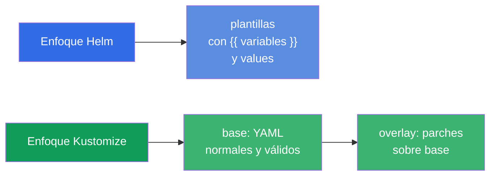
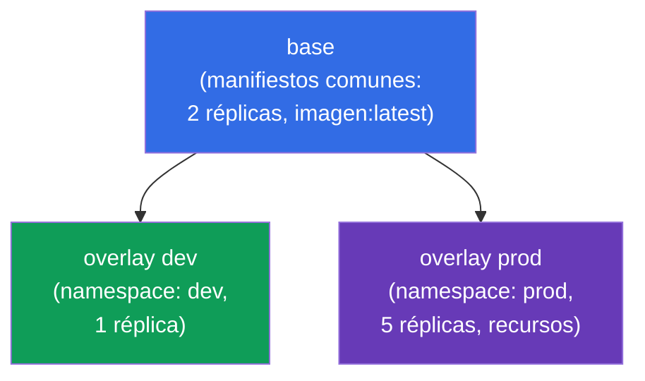
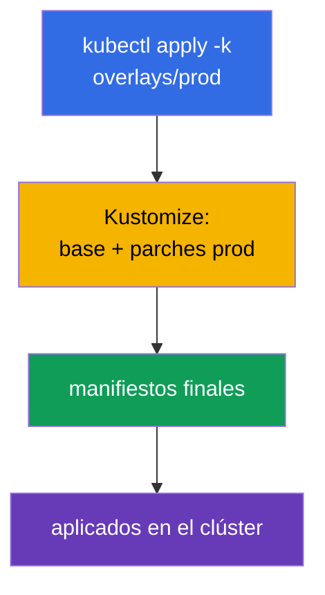
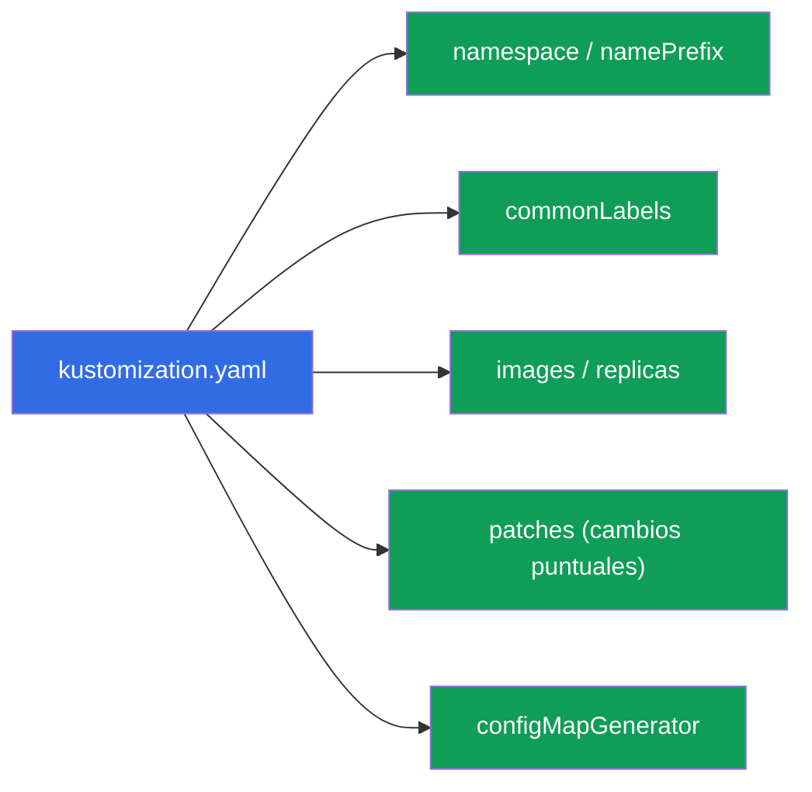
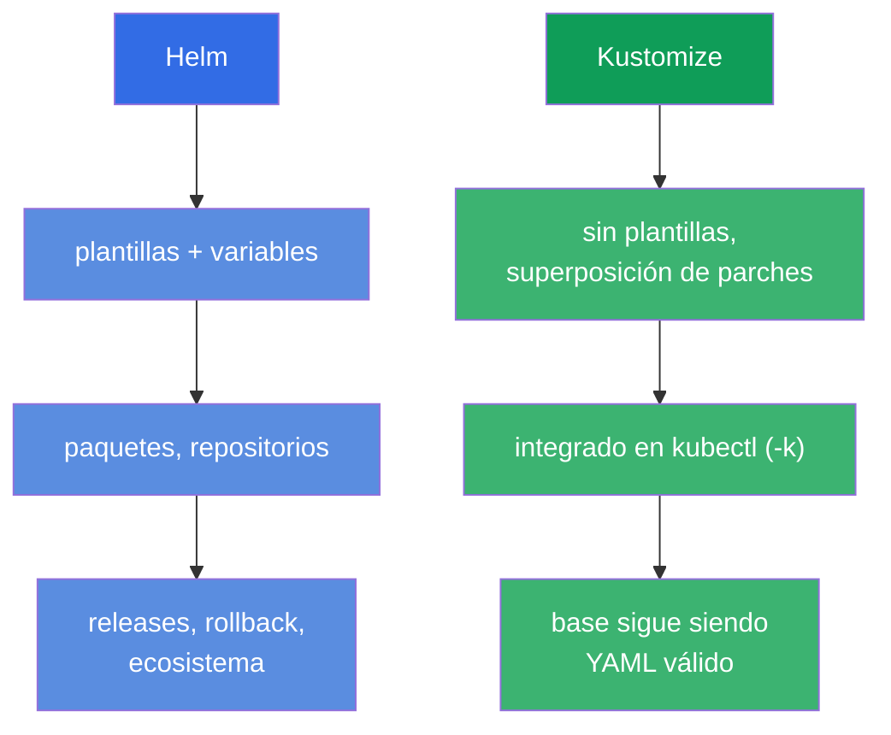

[Русская версия](ru.md) · [Eng version](README.md) · [Version française](fr.md) · [Deutsche Version](de.md) · [ქართული ვერსია](ge.md) · [繁體中文版](tw.md) · [日本語版](jp.md)

# Capítulo 43. Kustomize

> 🟦 **Capítulo para CKA** (dominio Cluster Architecture: «usar Helm y Kustomize»). El tema
> aparece también en CKAD (despliegue).
>
> **Qué viene ahora.** Helm (capítulo 42) ajusta los manifiestos mediante plantillas y variables.
> **Kustomize** resuelve la misma tarea - adaptar manifiestos a los entornos - pero **sin plantillas**:
> toma YAML normales y les superpone cambios (overlays). Kustomize está integrado directamente
> en `kubectl` (`kubectl apply -k`). Veremos el modelo básico base + overlays y lo compararemos con
> Helm - la pregunta «¿Helm o Kustomize?» es frecuente tanto en el examen como en la vida real.

## 43.1. La idea de Kustomize: sin plantillas, solo superposición

Helm usa plantillas (`{{ .Values.x }}`), mientras que Kustomize sigue otro camino: tienes manifiestos
YAML normales y válidos (**base**) y les **superpones** cambios para un entorno
concreto (**overlay**) - sin tocar los originales.



Ventaja del enfoque: los manifiestos base siguen siendo YAML de trabajo normal (se pueden aplicar incluso sin
Kustomize), y las diferencias entre entornos viven aparte, sin ensuciar los originales con inserciones de plantilla.

## 43.2. base y overlays

La estructura típica de Kustomize es **base** (manifiestos comunes) y **overlays** (carpetas para
cada entorno con parches):

```
myapp/
├── base/
│   ├── kustomization.yaml
│   ├── deployment.yaml
│   └── service.yaml
└── overlays/
    ├── dev/
    │   └── kustomization.yaml      # parches para dev
    └── prod/
        └── kustomization.yaml      # parches para prod
```



`base/kustomization.yaml` enumera los recursos:

```yaml
resources:
- deployment.yaml
- service.yaml
```

`overlays/prod/kustomization.yaml` referencia a base y añade cambios:

```yaml
resources:
- ../../base
namespace: prod
replicas:
- name: myapp
  count: 5
images:
- name: myapp
  newTag: "1.27"
```

## 43.3. Aplicación

Kustomize está integrado en kubectl - se aplica con el flag `-k` (apuntando a la carpeta con el
`kustomization.yaml`):

```bash
# Ver qué va a salir (renderizar, sin aplicar)
kubectl kustomize overlays/prod

# Aplicar el overlay
kubectl apply -k overlays/prod

# Binario kustomize aparte (las mismas posibilidades)
kustomize build overlays/prod | kubectl apply -f -
```



> **Consejo.** `kubectl kustomize <dir>` (o `kustomize build`) muestra el YAML final
> **sin aplicarlo** - como `helm template` en Helm. Útil para comprobar qué va a salir.

## 43.4. Capacidades de Kustomize

Kustomize sabe hacer las transformaciones habituales sin plantillas:

| Capacidad | Qué hace |
|-------------|-----------|
| `namespace` | poner el namespace a todos los recursos |
| `namePrefix` / `nameSuffix` | añadir prefijo/sufijo a los nombres |
| `commonLabels` / `commonAnnotations` | añadir etiquetas/anotaciones a todos |
| `images` | sustituir imagen/tag |
| `replicas` | cambiar el número de réplicas |
| `patches` (strategic/JSON6902) | cambios puntuales en cualquier campo |
| `configMapGenerator` / `secretGenerator` | generar ConfigMap/Secret desde ficheros/literales |



Aparte, son muy útiles los generadores: `configMapGenerator` crea un ConfigMap desde ficheros/literales y
añade al nombre un **hash del contenido**. Al cambiar los datos, el nombre del ConfigMap cambia → el pod
se recrea y recoge la nueva configuración (solución al problema «las env de un ConfigMap no
se actualizan», capítulo 18).

## 43.5. Helm frente a Kustomize

Pregunta de elección frecuente. Los dos resuelven la adaptación de manifiestos a los entornos, pero de forma distinta:



| | Helm | Kustomize |
|---|------|-----------|
| Enfoque | plantillas (variables) | superposición de parches (overlays) |
| Instalación | herramienta aparte | integrado en kubectl (`-k`) |
| Paquetes listos | ecosistema enorme de charts | sin paquetes, solo manifiestos propios |
| Gestión de releases | sí (install/rollback, historial) | no (simplemente apply) |
| Curva de entrada | más alta (plantillas de Go) | más baja (YAML normal) |
| Mejor para | software listo, parametrización compleja | manifiestos propios, adaptación a entornos |

En la práctica **se combinan a menudo**: el software de terceros se instala con charts de Helm, y los
manifiestos propios se adaptan con Kustomize. Muchas herramientas GitOps (Argo CD) soportan ambos.

## 43.6. Cómo se aplica esto en producción

- **Kustomize para los manifiestos y entornos propios.** En producción las aplicaciones propias suelen
  mantenerse como base + overlays (dev/stage/prod): un base común, y las diferencias (réplicas, recursos, hosts,
  namespace) - en el overlay. Ninguna plantilla, YAML puro.
- **Integración en kubectl y GitOps.** Dado que Kustomize está integrado en kubectl y lo entienden Argo
  CD/Flux, resulta cómodo usarlo en repositorios GitOps: cambias el overlay en git - GitOps
  lo aplica. Eso simplifica el pipeline.
- **configMapGenerator contra la configuración obsoleta.** El hash en el nombre del ConfigMap recrea
  automáticamente los pods al cambiar la configuración - en producción eso resuelve el problema frecuente de «cambiamos el
  ConfigMap y la aplicación no lo recogió» sin un rollout restart manual.
- **Helm + Kustomize juntos.** Patrón típico de producción: el software ajeno - Helm, el propio - Kustomize;
  a veces Kustomize «reparchea» la salida de Helm. La elección va por tarea, no es «uno u otro».
- **base como fuente de verdad.** Como base son manifiestos válidos, es fácil revisarlos y
  reutilizarlos entre equipos; los overlays mantienen lo específico del entorno aislado.

## 43.7. Mini-glosario

- **Kustomize** - herramienta de adaptación de manifiestos por superposición de parches, sin plantillas.
- **base** - manifiestos originales comunes.
- **overlay** - conjunto de cambios sobre base para un entorno concreto.
- **kustomization.yaml** - fichero que describe los recursos y las transformaciones.
- **kubectl apply -k** - aplicar un directorio de Kustomize.
- **patches** - cambios puntuales de campos (strategic merge / JSON6902).
- **configMapGenerator / secretGenerator** - generación de ConfigMap/Secret (con hash en el nombre).
- **kubectl kustomize / kustomize build** - renderizado sin aplicar.

## 43.8. Resumen del capítulo

- Kustomize adapta los manifiestos a los entornos **sin plantillas** - superponiendo parches sobre base.
- Modelo: base (YAML comunes y válidos) + overlays (parches para dev/prod); base sigue siendo
  aplicable por sí solo.
- Integrado en kubectl: `kubectl apply -k <dir>`; `kubectl kustomize <dir>` renderiza sin
  aplicar.
- Sabe hacer namespace, prefijos, etiquetas, sustitución de imágenes/réplicas, patches puntuales y generadores de
  ConfigMap/Secret (con hash en el nombre - recreación automática de los pods al cambiar la configuración).
- Helm vs Kustomize: Helm - plantillas, paquetes, releases; Kustomize - superposición, integrado en
  kubectl, más simple; a menudo se usan juntos.

## 43.9. Para qué sirve esto: en el examen y en el trabajo real

**En el examen.** El programa del CKA incluye Kustomize. Se esperan tareas del tipo «aplica un directorio
de Kustomize» (`kubectl apply -k`), «configura un overlay cambiando réplicas/imagen/namespace»,
y entender base/overlay. Es útil conocer `kubectl kustomize` para comprobar el resultado.

**En el trabajo real.** Kustomize es una forma popular de mantener los manifiestos propios para varios
entornos sin magia de plantillas, encaja muy bien en GitOps (integrado en kubectl, lo entiende Argo
CD). configMapGenerator resuelve el problema de la configuración obsoleta. Entender cuándo tomar Helm y
cuándo Kustomize (y cómo combinarlos) es una habilidad práctica de entrega.

## 43.10. Preguntas de autocomprobación

1. ¿En qué se diferencia el enfoque de Kustomize del de Helm de forma esencial?
2. ¿Qué son base y overlay? ¿Por qué base sigue siendo aplicable por sí solo?
3. ¿Cómo se aplica un directorio de Kustomize y cómo se ve el resultado sin aplicarlo?
4. ¿Qué transformaciones sabe hacer Kustomize? Da varias.
5. ¿Qué hace configMapGenerator con el nombre del ConfigMap y qué problema resuelve eso?
6. ¿En qué casos elegir Helm y en cuáles Kustomize?
7. ¿Se puede usar Helm y Kustomize juntos? ¿Cómo?

## Práctica

Con esto queda terminada la parte 8 (arquitectura, instalación y configuración). A continuación - la parte 9,
troubleshooting (CKA): análisis sistemático de fallos de aplicaciones (capítulo 44), del control plane y
de los nodos (45), de la red (46). Kustomize se practica en los laboratorios de administración.

🧪 Laboratorio 115 (Kustomize): [tasks/cka/labs/115](../../labs/115/README_ES.MD)

🎮 Killercoda (en el navegador, sin instalación): [Apply Resources with Kustomize](https://killercoda.com/chadmcrowell/course/ckad/kustomize-apply) · [Kustomize Overlays for Environments](https://killercoda.com/chadmcrowell/course/ckad/kustomize-env-overlay) · [Patch Deployment Image with Kustomize](https://killercoda.com/chadmcrowell/course/ckad/kustomize-patch-image) · [Generate ConfigMap and Secret with Kustomize](https://killercoda.com/chadmcrowell/course/ckad/kustomize-configmap-secret)

---
[Índice](../README_ES.md) · [Capítulo 42](../42/es.md) · [Capítulo 44](../44/es.md)
