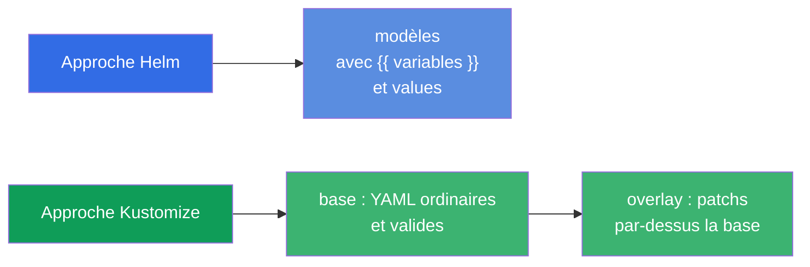
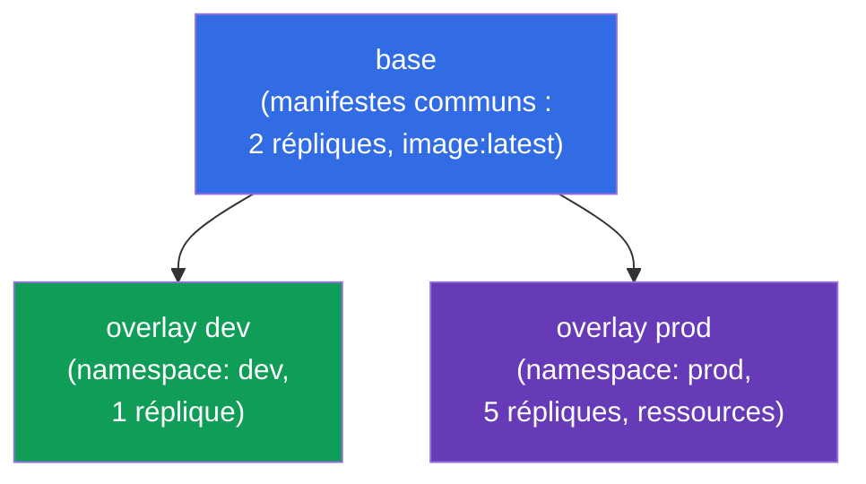
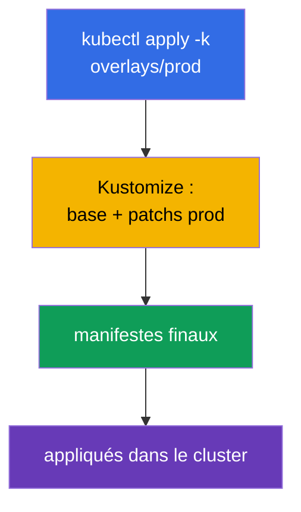
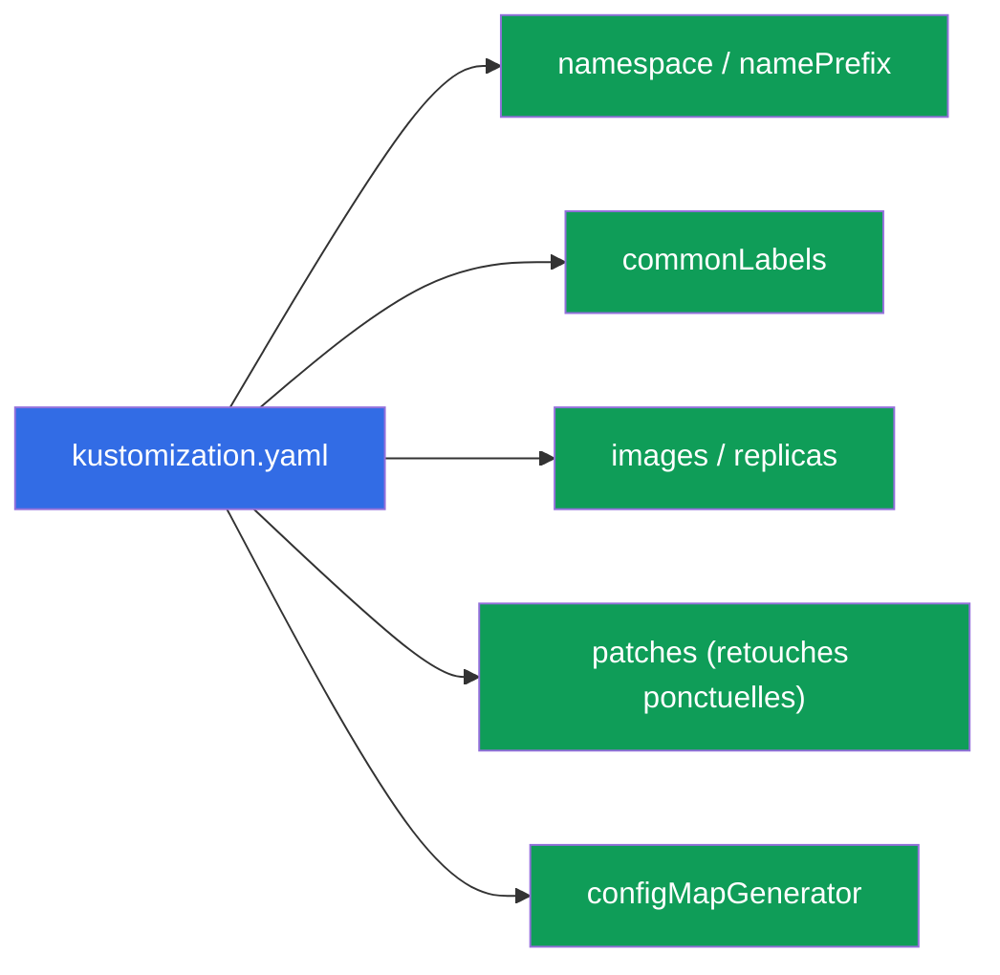
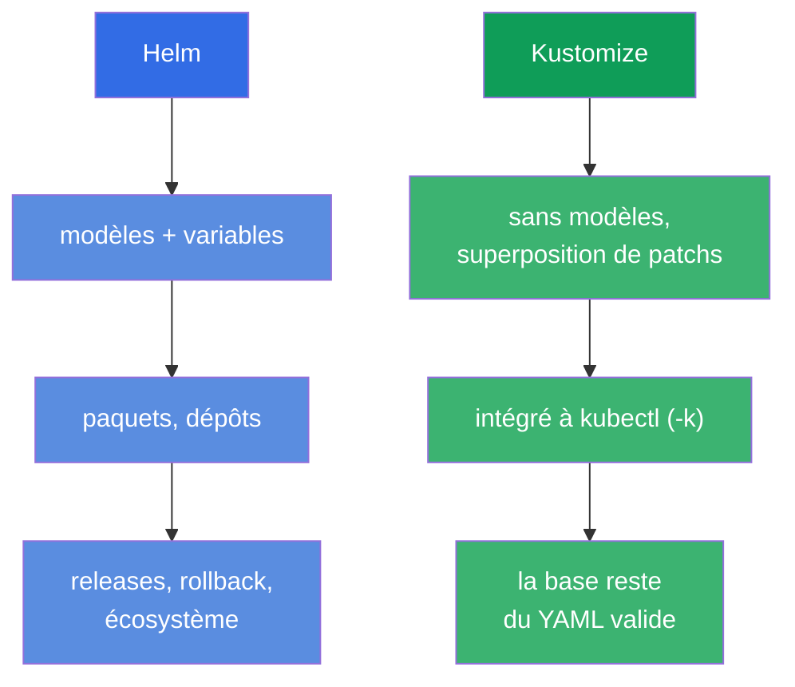

[Русская версия](ru.md) · [Eng version](README.md) · [Versión en español](es.md) · [Deutsche Version](de.md) · [ქართული ვერსია](ge.md) · [繁體中文版](tw.md) · [日本語版](jp.md)

# Chapitre 43. Kustomize

> 🟦 **Chapitre pour le CKA** (domaine Cluster Architecture : « utiliser Helm et Kustomize »). Le
> thème est aussi présent dans le CKAD (déploiement).
>
> **Ce qui suit.** Helm (chapitre 42) personnalise les manifestes via des modèles et des variables.
> **Kustomize** résout le même problème - adapter les manifestes aux environnements - mais **sans
> modèles** : il prend des YAML ordinaires et leur superpose des modifications (overlays). Kustomize
> est intégré directement dans `kubectl` (`kubectl apply -k`). Voyons le modèle base + overlays et
> comparons avec Helm - la question « Helm ou Kustomize » est fréquente à l'examen comme dans la vie.

## 43.1. L'idée de Kustomize : pas de modèles, seulement de la superposition

Helm modélise (`{{ .Values.x }}`), Kustomize prend un autre chemin : vous avez des manifestes YAML
ordinaires et valides (**base**), et vous leur **superposez** des modifications pour un environnement
donné (**overlay**) - sans toucher aux sources.



L'avantage : les manifestes de base restent du YAML de travail ordinaire (applicables même sans
Kustomize), et les différences entre environnements vivent à part, sans polluer les sources.

## 43.2. base et overlays

La structure typique de Kustomize, c'est **base** (les manifestes communs) et **overlays** (des
dossiers par environnement avec des patchs) :

```
myapp/
├── base/
│   ├── kustomization.yaml
│   ├── deployment.yaml
│   └── service.yaml
└── overlays/
    ├── dev/
    │   └── kustomization.yaml      # patchs pour dev
    └── prod/
        └── kustomization.yaml      # patchs pour prod
```



`base/kustomization.yaml` énumère les ressources :

```yaml
resources:
- deployment.yaml
- service.yaml
```

`overlays/prod/kustomization.yaml` référence la base et ajoute les modifications :

```yaml
resources:
- ../../base
namespace: prod
replicas:
- name: myapp
  count: 5
images:
- name: myapp
  newTag: "1.27"
```

## 43.3. Application

Kustomize est intégré à kubectl - on applique avec le flag `-k` (en indiquant le dossier qui
contient `kustomization.yaml`) :

```bash
# Voir ce que ça donnera (rendu, sans application)
kubectl kustomize overlays/prod

# Appliquer l'overlay
kubectl apply -k overlays/prod

# Binaire kustomize séparé (les mêmes possibilités)
kustomize build overlays/prod | kubectl apply -f -
```



> **Conseil.** `kubectl kustomize <dir>` (ou `kustomize build`) affiche le YAML final **sans
> l'appliquer** - comme `helm template` chez Helm. Pratique pour vérifier ce que ça donnera.

## 43.4. Les possibilités de Kustomize

Kustomize sait faire les transformations courantes sans modèles :

| Possibilité | Ce que ça fait |
|-------------|-----------|
| `namespace` | mettre le namespace sur toutes les ressources |
| `namePrefix` / `nameSuffix` | ajouter un préfixe/suffixe aux noms |
| `commonLabels` / `commonAnnotations` | ajouter des labels/annotations à tous |
| `images` | remplacer l'image/le tag |
| `replicas` | changer le nombre de répliques |
| `patches` (strategic/JSON6902) | modifications ponctuelles de n'importe quels champs |
| `configMapGenerator` / `secretGenerator` | générer des ConfigMap/Secret depuis des fichiers/littéraux |



Les générateurs sont particulièrement utiles : `configMapGenerator` crée un ConfigMap depuis des
fichiers/littéraux et ajoute au nom un **hash du contenu**. Quand les données changent, le nom du
ConfigMap change → le pod est recréé et prend la nouvelle configuration (solution au problème « la
variable d'env issue d'un ConfigMap ne se met pas à jour », chapitre 18).

## 43.5. Helm contre Kustomize

Question de choix fréquente. Les deux adaptent les manifestes aux environnements, différemment :



| | Helm | Kustomize |
|---|------|-----------|
| Approche | modélisation (variables) | superposition de patchs (overlays) |
| Installation | outil séparé | intégré à kubectl (`-k`) |
| Paquets prêts | énorme écosystème de charts | pas de paquets, seulement ses propres manifestes |
| Gestion des releases | oui (install/rollback, historique) | non (simple apply) |
| Courbe d'apprentissage | plus haute (modèles Go) | plus basse (YAML ordinaire) |
| Meilleur pour | logiciels prêts, paramétrage complexe | ses propres manifestes, adaptation aux environnements |

En pratique on les **combine souvent** : les logiciels tiers s'installent avec des charts Helm, ses
propres manifestes s'adaptent avec Kustomize. Beaucoup d'outils GitOps (Argo CD) gèrent les deux.

## 43.6. Comment cela s'applique en production

- **Kustomize pour ses propres manifestes et environnements.** En prod, on garde souvent ses
  applications sous forme de base + overlays (dev/stage/prod) : une base commune, et les différences
  (répliques, ressources, hôtes, namespace) dans l'overlay. Aucune modélisation, du YAML pur.
- **Intégration à kubectl et GitOps.** Puisque Kustomize est intégré à kubectl et compris par Argo
  CD/Flux, il est commode dans les dépôts GitOps : tu modifies l'overlay dans git - GitOps
  applique. Cela simplifie le pipeline.
- **configMapGenerator contre la config obsolète.** Le hash dans le nom du ConfigMap recrée
  automatiquement les pods quand la configuration change - en prod, cela résout le problème fréquent
  « on a changé le ConfigMap, mais l'application ne l'a pas pris » sans rollout restart manuel.
- **Helm + Kustomize ensemble.** Motif de prod typique : le logiciel des autres avec Helm, le sien
  avec Kustomize ; parfois Kustomize « repatche » la sortie de Helm. Le choix se fait selon la tâche.
- **La base comme source de vérité.** Comme la base est faite de manifestes valides, ils sont faciles
  à relire et à réutiliser entre équipes ; les overlays gardent la spécificité de l'environnement.

## 43.7. Mini-glossaire

- **Kustomize** - outil d'adaptation des manifestes par superposition de patchs, sans modèles.
- **base** - les manifestes sources communs.
- **overlay** - un ensemble de modifications par-dessus la base pour un environnement donné.
- **kustomization.yaml** - fichier décrivant les ressources et les transformations.
- **kubectl apply -k** - appliquer un répertoire Kustomize.
- **patches** - modifications ponctuelles de champs (strategic merge / JSON6902).
- **configMapGenerator / secretGenerator** - génération de ConfigMap/Secret (avec un hash dans le nom).
- **kubectl kustomize / kustomize build** - rendu sans application.

## 43.8. Bilan du chapitre

- Kustomize adapte les manifestes aux environnements **sans modèles** - par superposition de patchs.
- Modèle : base (YAML communs valides) + overlays (patchs pour dev/prod) ; la base reste applicable
  telle quelle.
- Intégré à kubectl : `kubectl apply -k <dir>` ; `kubectl kustomize <dir>` fait le rendu sans
  application.
- Il sait faire namespace, préfixes, labels, remplacement d'images/répliques, patches ponctuels et
  générateurs de ConfigMap/Secret (avec un hash dans le nom - recréation automatique des pods).
- Helm vs Kustomize : Helm - modèles, paquets, releases ; Kustomize - superposition, intégré à
  kubectl, plus simple ; on les utilise souvent ensemble.

## 43.9. À quoi cela sert : à l'examen et dans le travail réel

**À l'examen.** Le programme du CKA inclut Kustomize. On attend des exercices « applique un
répertoire Kustomize » (`kubectl apply -k`), « configure un overlay qui change répliques/image/
namespace », la compréhension de base/overlay. Utile de connaître `kubectl kustomize` pour vérifier.

**Dans le travail réel.** Kustomize est une façon populaire de tenir ses manifestes pour plusieurs
environnements sans magie de modèles, il s'intègre parfaitement au GitOps (intégré à kubectl,
compris par Argo CD). configMapGenerator résout le problème de la config obsolète. Savoir quand
prendre Helm et quand Kustomize (et comment les combiner) est une compétence pratique de livraison.

## 43.10. Questions d'auto-évaluation

1. En quoi l'approche de Kustomize diffère-t-elle fondamentalement de Helm ?
2. Qu'est-ce que la base et un overlay ? Pourquoi la base reste-t-elle applicable telle quelle ?
3. Comment appliquer un répertoire Kustomize et comment voir le résultat sans l'appliquer ?
4. Quelles transformations Kustomize sait-il faire ? Donnez-en quelques-unes.
5. Que fait configMapGenerator au nom du ConfigMap et quel problème cela résout-il ?
6. Dans quels cas choisir Helm, et dans quels cas Kustomize ?
7. Peut-on utiliser Helm et Kustomize ensemble ? Comment ?

## Pratique

Ici se termine la partie 8 (architecture, installation et configuration). Ensuite - la partie 9,
troubleshooting (CKA) : analyse systématique des pannes d'applications (chapitre 44), du control
plane et des nœuds (45), du réseau (46). Kustomize se travaille dans les TP d'administration.

🧪 TP 115 (Kustomize) : [tasks/cka/labs/115](../../labs/115/README_FR.MD)

---
[Sommaire](../README_FR.md) · [Chapitre 42](../42/fr.md) · [Chapitre 44](../44/fr.md)
