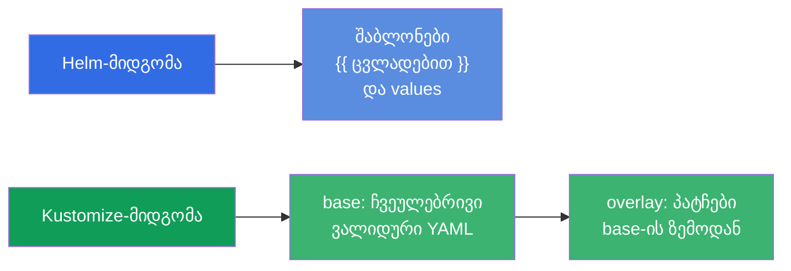
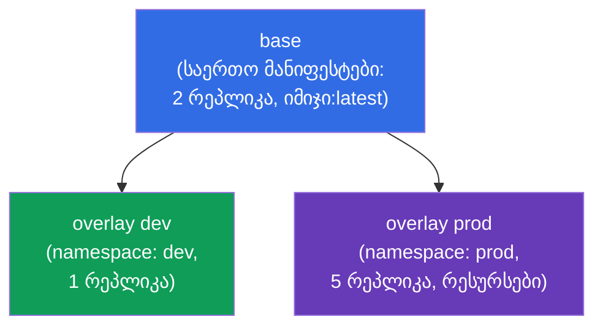
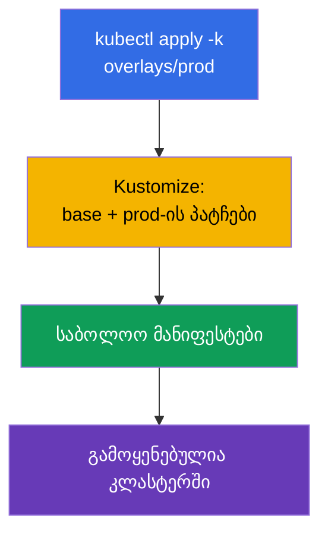
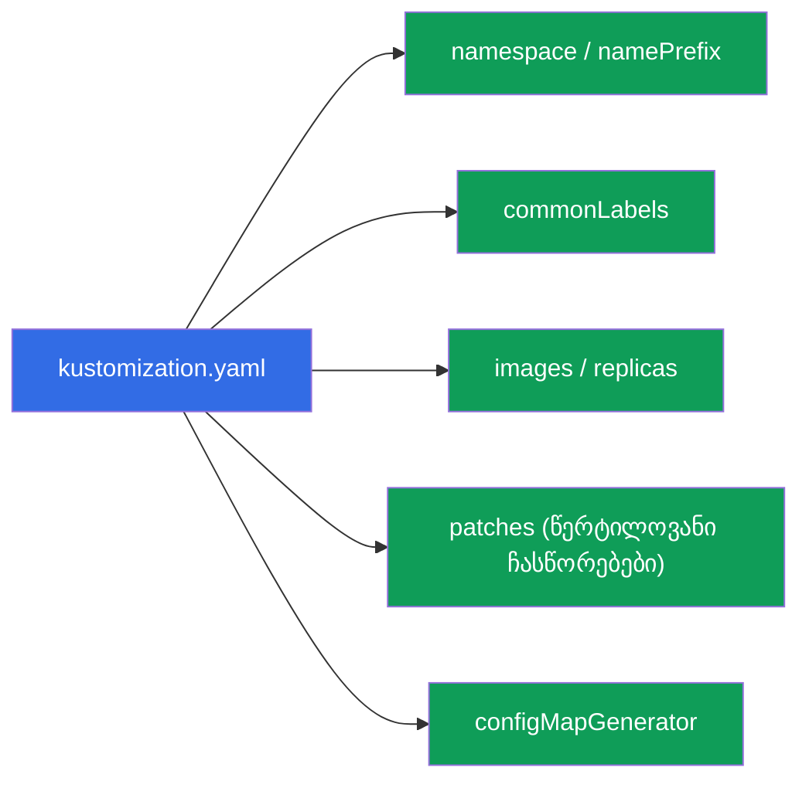
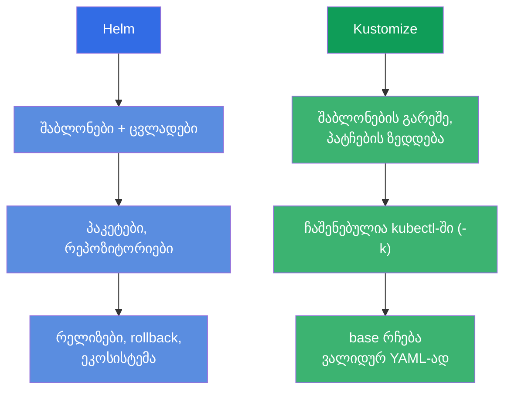

[Русская версия](ru.md) · [Eng version](README.md) · [Versión en español](es.md) · [Version française](fr.md) · [Deutsche Version](de.md)

# თავი 43. Kustomize

> 🟦 **თავი CKA-სთვის** (დომენი Cluster Architecture: „გამოიყენე Helm და Kustomize“). თემა
> CKAD-შიც არის (დეპლოი).
>
> **რა იქნება შემდეგ.** Helm (თავი 42) მანიფესტებს შაბლონებითა და ცვლადებით აკონფიგურირებს.
> **Kustomize** იმავე ამოცანას წყვეტს - მანიფესტების ადაპტაციას გარემოებზე - მაგრამ **შაბლონების
> გარეშე**: ის იღებს ჩვეულებრივ YAML-ს და მასზე ცვლილებებს ადებს (overlays). Kustomize
> ჩაშენებულია პირდაპირ `kubectl`-ში (`kubectl apply -k`). განვიხილავთ საბაზისო მოდელს base +
> overlays და შევადარებთ Helm-ს - კითხვა „Helm თუ Kustomize“ ხშირია გამოცდაზეც და ცხოვრებაშიც.

## 43.1. Kustomize-ის იდეა: შაბლონების გარეშე, მხოლოდ ზედდება

Helm შაბლონიზაციას აკეთებს (`{{ .Values.x }}`), Kustomize კი სხვა გზით მიდის: თქვენ გაქვთ
ჩვეულებრივი, ვალიდური YAML-მანიფესტები (**base**), და მათზე **ადებთ** ცვლილებებს კონკრეტული
გარემოსთვის (**overlay**) - საწყისი ფაილების შეხების გარეშე.



მიდგომის პლიუსი: base-მანიფესტები რჩება ჩვეულებრივ სამუშაო YAML-ად (მათი გამოყენება Kustomize-ის
გარეშეც შეიძლება), ხოლო გარემოების განსხვავებები ცალკე ცხოვრობს და საწყის ფაილებს შაბლონური ჩანართებით არ ანაგვიანებს.

## 43.2. base და overlays

Kustomize-ის ტიპური სტრუქტურა - **base** (საერთო მანიფესტები) და **overlays** (საქაღალდეები
ყოველი გარემოსთვის პატჩებით):

```
myapp/
├── base/
│   ├── kustomization.yaml
│   ├── deployment.yaml
│   └── service.yaml
└── overlays/
    ├── dev/
    │   └── kustomization.yaml      # პატჩები dev-ისთვის
    └── prod/
        └── kustomization.yaml      # პატჩები prod-ისთვის
```



`base/kustomization.yaml` ჩამოთვლის რესურსებს:

```yaml
resources:
- deployment.yaml
- service.yaml
```

`overlays/prod/kustomization.yaml` მიუთითებს base-ზე და ამატებს ცვლილებებს:

```yaml
resources:
- ../../base
namespace: prod
replicas:
- name: myapp
  count: 5
images:
- name: myapp
  newTag: "1.27"
```

## 43.3. გამოყენება

Kustomize ჩაშენებულია kubectl-ში - გამოიყენება დროშით `-k` (მიუთითებთ საქაღალდეს
`kustomization.yaml`-ით):

```bash
# ვნახოთ, რა გამოვა (დარენდერება, გამოყენების გარეშე)
kubectl kustomize overlays/prod

# overlay-ის გამოყენება
kubectl apply -k overlays/prod

# ცალკე ბინარნიკი kustomize (იგივე შესაძლებლობები)
kustomize build overlays/prod | kubectl apply -f -
```



> **რჩევა.** `kubectl kustomize <dir>` (ან `kustomize build`) აჩვენებს საბოლოო YAML-ს მისი
> **გამოყენების გარეშე** - როგორც `helm template` Helm-ში. სასარგებლოა შესამოწმებლად, თუ რა გამოვა.

## 43.4. Kustomize-ის შესაძლებლობები

Kustomize ტიპურ გარდაქმნებს შაბლონების გარეშე ახორციელებს:

| შესაძლებლობა | რას აკეთებს |
|-------------|-----------|
| `namespace` | დაუწესებს namespace-ს ყველა რესურსს |
| `namePrefix` / `nameSuffix` | დაამატებს პრეფიქსს/სუფიქსს სახელებს |
| `commonLabels` / `commonAnnotations` | დაამატებს ლეიბლებს/ანოტაციებს ყველას |
| `images` | შეცვლის იმიჯს/ტეგს |
| `replicas` | შეცვლის რეპლიკების რაოდენობას |
| `patches` (strategic/JSON6902) | წერტილოვანი ცვლილებები ნებისმიერ ველში |
| `configMapGenerator` / `secretGenerator` | დააგენერირებს ConfigMap/Secret-ს ფაილებიდან/ლიტერალებიდან |



განსაკუთრებით სასარგებლოა გენერატორები: `configMapGenerator` ქმნის ConfigMap-ს
ფაილებიდან/ლიტერალებიდან და სახელს ამატებს **შიგთავსის ჰეშს**. მონაცემების შეცვლისას
ConfigMap-ის სახელი იცვლება → პოდი ხელახლა იქმნება და ახალ კონფიგს იღებს (პრობლემის
„env ConfigMap-იდან არ განახლდება“ გადაწყვეტა, თავი 18).

## 43.5. Helm Kustomize-ის წინააღმდეგ

არჩევანის ხშირი კითხვა. ორივე მანიფესტების გარემოებზე ადაპტაციას წყვეტს, ოღონდ სხვადასხვაგვარად:



| | Helm | Kustomize |
|---|------|-----------|
| მიდგომა | შაბლონიზაცია (ცვლადები) | პატჩების ზედდება (overlays) |
| დაყენება | ცალკე ინსტრუმენტი | ჩაშენებულია kubectl-ში (`-k`) |
| მზა პაკეტები | ჩარტების უზარმაზარი ეკოსისტემა | პაკეტები არ არის, მხოლოდ საკუთარი მანიფესტები |
| რელიზების მართვა | კი (install/rollback, ისტორია) | არა (უბრალოდ apply) |
| შესვლის მრუდი | უფრო მაღალი (Go-შაბლონები) | უფრო დაბალი (ჩვეულებრივი YAML) |
| უფრო კარგია | მზა პროგრამული უზრუნველყოფა, რთული პარამეტრიზაცია | საკუთარი მანიფესტები, გარემოებზე ადაპტაცია |

პრაქტიკაში მათ **ხშირად აერთიანებენ**: გარეშე პროგრამულ უზრუნველყოფას Helm-ჩარტებით ყენებენ,
საკუთარ მანიფესტებს კი Kustomize-ით ადაპტირებენ. ბევრი GitOps-ინსტრუმენტი (Argo CD) ორივეს უჭერს მხარს.

## 43.6. როგორ იყენებენ ამას პროდაქშენში

- **Kustomize საკუთარი მანიფესტებისა და გარემოებისთვის.** პროდში საკუთარ აპლიკაციებს ხშირად
  ინახავენ როგორც base + overlays (dev/stage/prod): საერთო base, ხოლო განსხვავებები (რეპლიკები,
  რესურსები, ჰოსტები, namespace) - overlay-ში. არავითარი შაბლონიზაცია, სუფთა YAML.
- **ჩაშენებულობა kubectl-ში და GitOps.** რაკი Kustomize ჩაშენებულია kubectl-ში და Argo
  CD/Flux-ს ესმის, მისი გამოყენება მოსახერხებელია GitOps-რეპოზიტორიებში: შეცვალე overlay
  git-ში - GitOps გამოიყენებს. ეს პაიპლაინს ამარტივებს.
- **configMapGenerator stale-კონფიგის წინააღმდეგ.** ConfigMap-ის სახელში ჰეში ავტომატურად
  ხელახლა ქმნის პოდებს კონფიგის შეცვლისას - პროდში ეს ხშირ პრობლემას „შევცვალეთ ConfigMap,
  აპლიკაციამ კი არ აიღო“ ხელით rollout restart-ის გარეშე წყვეტს.
- **Helm + Kustomize ერთად.** ტიპური პროდ-პატერნი: სხვისი პროგრამული უზრუნველყოფა - Helm, საკუთარი -
  Kustomize; ხანდახან Kustomize „დაპატჩავს“ Helm-ის გამონატანს. არჩევანი - ამოცანის მიხედვით, და არა „ან-ან“.
- **base როგორც სიმართლის წყარო.** რაკი base - ვალიდური მანიფესტებია, მათი რევიუ და გუნდებს
  შორის ხელახალი გამოყენება მარტივია; overlays გარემოს სპეციფიკას იზოლირებულად ინახავს.

## 43.7. მინი-ლექსიკონი

- **Kustomize** - მანიფესტების ადაპტაციის ინსტრუმენტი პატჩების ზედდებით, შაბლონების გარეშე.
- **base** - საერთო საწყისი მანიფესტები.
- **overlay** - ცვლილებების ნაკრები base-ის ზემოდან კონკრეტული გარემოსთვის.
- **kustomization.yaml** - ფაილი, რომელიც აღწერს რესურსებსა და გარდაქმნებს.
- **kubectl apply -k** - Kustomize-კატალოგის გამოყენება.
- **patches** - ველების წერტილოვანი ცვლილებები (strategic merge / JSON6902).
- **configMapGenerator / secretGenerator** - ConfigMap/Secret-ის გენერაცია (სახელში ჰეშით).
- **kubectl kustomize / kustomize build** - რენდერი გამოყენების გარეშე.

## 43.8. თავის შეჯამება

- Kustomize მანიფესტებს გარემოებზე ადაპტირებს **შაბლონების გარეშე** - base-ზე პატჩების ზედდებით.
- მოდელი: base (საერთო ვალიდური YAML) + overlays (პატჩები dev/prod-ისთვის); base რჩება
  გამოსაყენებელი თავისთავადაც.
- ჩაშენებულია kubectl-ში: `kubectl apply -k <dir>`; `kubectl kustomize <dir>` არენდერებს
  გამოყენების გარეშე.
- შეუძლია namespace, პრეფიქსები, ლეიბლები, იმიჯების/რეპლიკების ჩანაცვლება, წერტილოვანი patches და
  ConfigMap/Secret-ის გენერატორები (სახელში ჰეშით - პოდების ავტოხელახალი შექმნა კონფიგის შეცვლისას).
- Helm vs Kustomize: Helm - შაბლონები, პაკეტები, რელიზები; Kustomize - ზედდება, ჩაშენებულია
  kubectl-ში, უფრო მარტივი; ხშირად ერთად იყენებენ.

## 43.9. როგორ გამოგადგებათ: გამოცდაზე და რეალურ სამუშაოში

**გამოცდაზე.** CKA-ის პროგრამა მოიცავს Kustomize-ს. მოსალოდნელია დავალებები „გამოიყენე Kustomize-
კატალოგი“ (`kubectl apply -k`), „მოაწყე overlay რეპლიკების/იმიჯის/namespace-ის შეცვლით“,
base/overlay-ის გაგება. სასარგებლოა ვიცოდეთ `kubectl kustomize` შედეგის შესამოწმებლად.

**რეალურ სამუშაოში.** Kustomize - პოპულარული ხერხია საკუთარი მანიფესტების რამდენიმე
გარემოსთვის შენახვისა შაბლონური მაგიის გარეშე, კარგად ჯდება GitOps-ში (ჩაშენებულია kubectl-ში,
Argo CD-ს ესმის). configMapGenerator stale-კონფიგის პრობლემას წყვეტს. გაგება, როდის ავიღოთ
Helm და როდის Kustomize (და როგორ ავაერთიანოთ ისინი), - მიწოდების პრაქტიკული უნარია.

## 43.10. თვითშემოწმების კითხვები

1. რით განსხვავდება Kustomize-ის მიდგომა Helm-ისგან პრინციპულად?
2. რა არის base და overlay? რატომ რჩება base თავისთავად გამოსაყენებელი?
3. როგორ გამოვიყენოთ Kustomize-კატალოგი და როგორ ვნახოთ შედეგი გამოყენების გარეშე?
4. რომელი გარდაქმნები შეუძლია Kustomize-ს? მოიყვანეთ რამდენიმე.
5. რას აკეთებს configMapGenerator ConfigMap-ის სახელთან და რომელ პრობლემას წყვეტს ეს?
6. რომელ შემთხვევებში ავირჩიოთ Helm და რომელში Kustomize?
7. შეიძლება თუ არა Helm-ისა და Kustomize-ის ერთად გამოყენება? როგორ?

## პრაქტიკა

ამით ნაწილი 8 (არქიტექტურა, დაყენება და კონფიგურაცია) დასრულებულია. შემდეგ - ნაწილი 9,
troubleshooting (CKA): აპლიკაციების ავარიების სისტემატური განხილვა (თავი 44), control plane და
ნოდები (45), ქსელი (46). Kustomize ადმინისტრირების ლაბორატორიულებში მუშავდება.

🧪 ლაბი 115 (Kustomize): [tasks/cka/labs/115](../../labs/115/README_GE.MD)

---
[სარჩევი](../README_GE.md) · [თავი 42](../42/ge.md) · [თავი 44](../44/ge.md)
