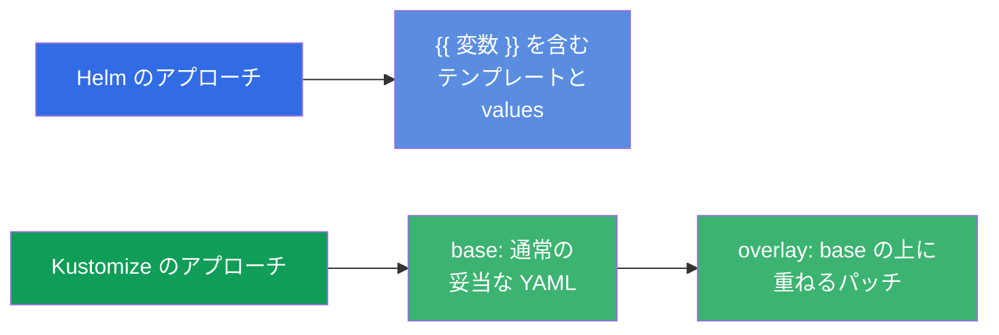
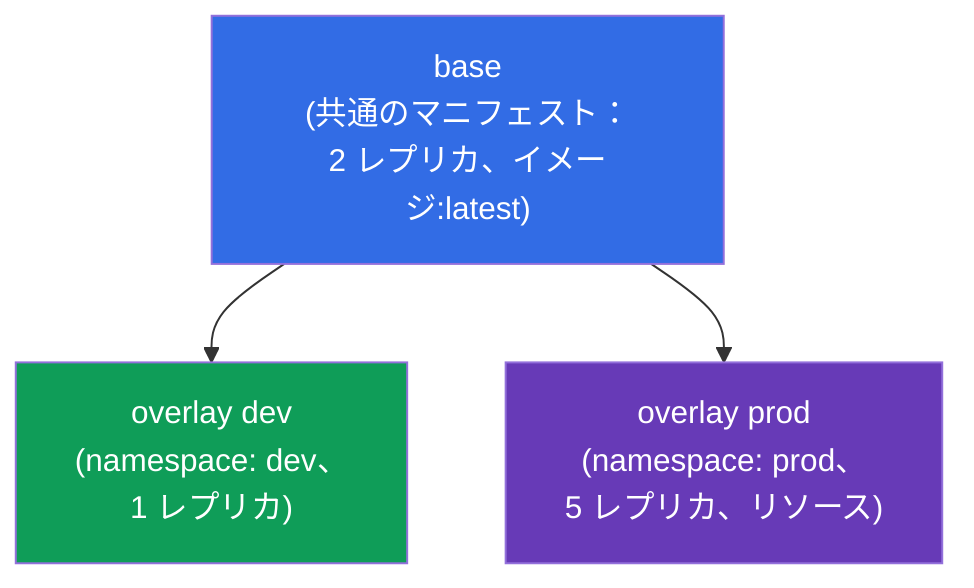
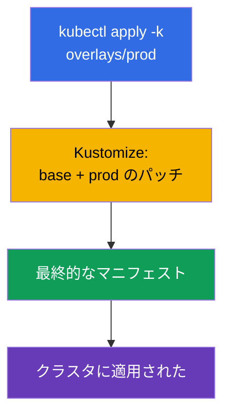
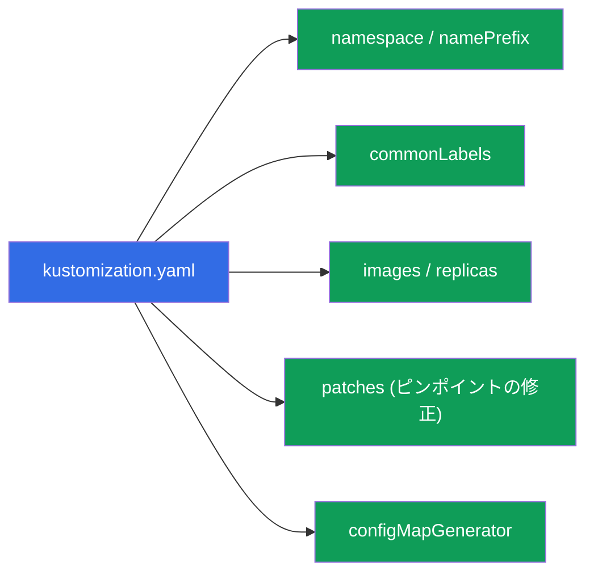
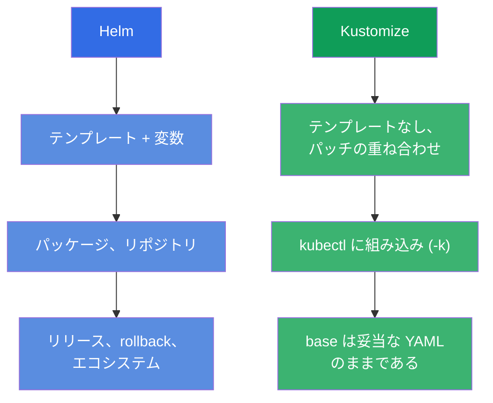

[Русская версия](ru.md) · [Eng version](README.md) · [Versión en español](es.md) · [Version française](fr.md) · [Deutsche Version](de.md) · [ქართული ვერსია](ge.md) · [繁體中文版](tw.md)

# 第 43 章。Kustomize

> 🟦 **CKA 向けの章**（Cluster Architecture 領域：「Helm と Kustomize を使う」）。このテーマは
> CKAD にもあります（デプロイ）。
>
> **次に何を学ぶか。** Helm（第 42 章）はテンプレートと変数でマニフェストを設定します。
> **Kustomize** は同じ課題 - マニフェストを環境に合わせること - を **テンプレートなしで**
> 解決します：通常の YAML を取り、その上に変更 (overlays) を重ねます。Kustomize は
> `kubectl` に直接組み込まれています (`kubectl apply -k`)。base + overlays という基本モデルを
> 分解し、Helm と比べます - 「Helm か Kustomize か」という問いは、試験でも実務でもよく出ます。

## 43.1. Kustomize の考え方：テンプレートなし、重ねるだけ

Helm はテンプレート化します (`{{ .Values.x }}`) が、Kustomize は別の道を行きます：あなたの手元には
通常の、妥当な YAML マニフェスト (**base**) があり、その上に具体的な環境向けの変更を
**重ねます** (**overlay**) - 元のファイルには手を触れずに。



このアプローチの利点：base のマニフェストは普通に動く YAML のままであり（Kustomize なしでも
適用できます）、環境ごとの差分は別に住んで、元のファイルをテンプレートの挿入で汚しません。

## 43.2. base と overlays

Kustomize の典型的な構造は **base**（共通のマニフェスト）と **overlays**（環境ごとの
パッチを置くフォルダ）です：

```
myapp/
├── base/
│   ├── kustomization.yaml
│   ├── deployment.yaml
│   └── service.yaml
└── overlays/
    ├── dev/
    │   └── kustomization.yaml      # dev 向けのパッチ
    └── prod/
        └── kustomization.yaml      # prod 向けのパッチ
```



`base/kustomization.yaml` はリソースを列挙します：

```yaml
resources:
- deployment.yaml
- service.yaml
```

`overlays/prod/kustomization.yaml` は base を参照し、変更を追加します：

```yaml
resources:
- ../../base
namespace: prod
replicas:
- name: myapp
  count: 5
images:
- name: myapp
  newTag: "1.27"
```

## 43.3. 適用

Kustomize は kubectl に組み込まれています - `-k` フラグで適用します（`kustomization.yaml` が
あるフォルダを指定します）：

```bash
# 何ができるか見る (レンダリングのみ、適用しない)
kubectl kustomize overlays/prod

# overlay を適用する
kubectl apply -k overlays/prod

# 独立した kustomize バイナリ (機能は同じ)
kustomize build overlays/prod | kubectl apply -f -
```



> **ヒント。** `kubectl kustomize <dir>`（または `kustomize build`）は最終的な YAML を
> **適用せずに** 表示します - Helm の `helm template` と同じです。何ができるかを確認するのに
> 役立ちます。

## 43.4. Kustomize の機能

Kustomize はテンプレートなしで定型的な変換をこなします：

| 機能 | 何をするか |
|-------------|-----------|
| `namespace` | すべてのリソースに namespace を設定する |
| `namePrefix` / `nameSuffix` | 名前に接頭辞/接尾辞を追加する |
| `commonLabels` / `commonAnnotations` | すべてにラベル/アノテーションを追加する |
| `images` | イメージ/タグを差し替える |
| `replicas` | レプリカ数を変更する |
| `patches` (strategic/JSON6902) | 任意のフィールドをピンポイントで変更する |
| `configMapGenerator` / `secretGenerator` | ファイル/リテラルから ConfigMap/Secret を生成する |



とくに便利なのがジェネレーターです：`configMapGenerator` はファイル/リテラルから ConfigMap を
作り、名前に **内容のハッシュ** を付けます。データを変えると ConfigMap の名前が変わり → Pod が
作り直され、新しい設定を読み込みます（「ConfigMap からの env が更新されない」問題の解決策、
第 18 章）。

## 43.5. Helm 対 Kustomize

選択でよく出る問いです。どちらもマニフェストを環境に合わせる課題を解きますが、やり方が違います：



| | Helm | Kustomize |
|---|------|-----------|
| アプローチ | テンプレート化（変数） | パッチの重ね合わせ (overlays) |
| インストール | 独立したツール | kubectl に組み込み (`-k`) |
| 既製のパッケージ | チャートの巨大なエコシステム | パッケージはなく、自分のマニフェストだけ |
| リリース管理 | あり (install/rollback、履歴) | なし（ただ apply するだけ） |
| 学習曲線 | 高い (Go テンプレート) | 低い（普通の YAML） |
| 向いている用途 | 既製のソフトウェア、複雑なパラメータ化 | 自分のマニフェスト、環境への適応 |

実務では **両方を組み合わせることがよくあります**：サードパーティのソフトは Helm チャートで入れ、
自分のマニフェストは Kustomize で合わせます。多くの GitOps ツール (Argo CD) は両方に対応しています。

## 43.6. 本番環境でこれをどう使うか

- **自分のマニフェストと環境には Kustomize。** 本番では自社のアプリケーションを
  base + overlays (dev/stage/prod) として持つことがよくあります：共通の base があり、差分
  （レプリカ、リソース、ホスト、namespace）は overlay に置きます。テンプレート化はなし、
  純粋な YAML です。
- **kubectl への組み込みと GitOps。** Kustomize は kubectl に組み込まれ、Argo CD/Flux にも
  理解されるので、GitOps リポジトリで使うのが便利です：git で overlay を変えれば - GitOps が
  適用します。これはパイプラインを簡単にします。
- **stale な設定に対する configMapGenerator。** ConfigMap の名前に入るハッシュが、設定の変更時に
  Pod を自動的に作り直します - 本番では、手動の rollout restart なしで「ConfigMap を変えたのに
  アプリケーションが読み込まない」というよくある問題を解決します。
- **Helm と Kustomize を一緒に。** 典型的な本番のパターン：他人のソフトは Helm、自分のものは
  Kustomize。ときには Kustomize が Helm の出力に「追いパッチ」をします。選択は課題に応じてで、
  「どちらか一方」ではありません。
- **真実の源としての base。** base は妥当なマニフェストなので、レビューもチーム間での再利用も
  簡単です。overlays は環境固有の部分を隔離して保ちます。

## 43.7. ミニ用語集

- **Kustomize** - テンプレートなしでパッチを重ねてマニフェストを環境に合わせるツール。
- **base** - 共通の元となるマニフェスト。
- **overlay** - 具体的な環境向けに base の上に重ねる変更のセット。
- **kustomization.yaml** - リソースと変換を記述するファイル。
- **kubectl apply -k** - Kustomize のディレクトリを適用する。
- **patches** - フィールドのピンポイントな変更 (strategic merge / JSON6902)。
- **configMapGenerator / secretGenerator** - ConfigMap/Secret の生成（名前にハッシュ付き）。
- **kubectl kustomize / kustomize build** - 適用せずにレンダリングする。

## 43.8. 本章のまとめ

- Kustomize は **テンプレートなしで** マニフェストを環境に合わせます - base にパッチを重ねることで。
- モデル：base（共通の妥当な YAML）+ overlays (dev/prod 向けのパッチ)。base はそれ自体でも
  適用可能なままです。
- kubectl に組み込み：`kubectl apply -k <dir>`。`kubectl kustomize <dir>` は適用せずに
  レンダリングします。
- namespace、接頭辞、ラベル、イメージ/レプリカの差し替え、ピンポイントの patches、そして
  ConfigMap/Secret のジェネレーター（名前にハッシュ - 設定の変更時に Pod を自動で作り直し）に対応します。
- Helm 対 Kustomize：Helm はテンプレート、パッケージ、リリース。Kustomize は重ね合わせで、kubectl に
  組み込みで、より簡単。しばしば一緒に使われます。

## 43.9. これがどう役に立つか：試験と実際の仕事で

**試験では。** CKA のプログラムには Kustomize が含まれます。「Kustomize の
ディレクトリを適用せよ」(`kubectl apply -k`)、「レプリカ/イメージ/namespace を変更する overlay を
設定せよ」といった問題や、base/overlay の理解が期待されます。結果の確認のために
`kubectl kustomize` を知っておくと役立ちます。

**実際の仕事では。** Kustomize は、テンプレートの魔法なしで自分のマニフェストを複数の環境向けに
保つ人気の方法で、GitOps によく馴染みます（kubectl に組み込みで、Argo CD にも理解されます）。
configMapGenerator は stale な設定の問題を解決します。いつ Helm を取り、いつ Kustomize を
取るか（そしてどう組み合わせるか）の理解は、デリバリーの実践的なスキルです。

## 43.10. 自己チェックの質問

1. Kustomize のアプローチは Helm と原理的にどう違いますか？
2. base と overlay とは何ですか？なぜ base はそれ自体で適用可能なままなのですか？
3. Kustomize のディレクトリはどう適用し、適用せずに結果を見るにはどうしますか？
4. Kustomize はどんな変換ができますか？いくつか挙げてください。
5. configMapGenerator は ConfigMap の名前に何をし、それはどんな問題を解決しますか？
6. どんな場合に Helm を選び、どんな場合に Kustomize を選びますか？
7. Helm と Kustomize を一緒に使えますか？どのように？

## 演習

これでパート 8（アーキテクチャ、インストールと設定）は終わりです。次は - パート 9、
troubleshooting (CKA)：アプリケーションの障害（第 44 章）、control plane とノード (45)、
ネットワーク (46) の体系的な分解です。Kustomize は管理系のラボで練習します。

🧪 ラボ 115 (Kustomize)：[tasks/cka/labs/115](../../labs/115/README_JP.MD)

🎮 Killercoda（ブラウザ内、セットアップ不要）：[Apply Resources with Kustomize](https://killercoda.com/chadmcrowell/course/ckad/kustomize-apply) · [Kustomize Overlays for Environments](https://killercoda.com/chadmcrowell/course/ckad/kustomize-env-overlay) · [Patch Deployment Image with Kustomize](https://killercoda.com/chadmcrowell/course/ckad/kustomize-patch-image) · [Generate ConfigMap and Secret with Kustomize](https://killercoda.com/chadmcrowell/course/ckad/kustomize-configmap-secret)

---
[目次](../README_JP.md) · [第 42 章](../42/jp.md) · [第 44 章](../44/jp.md)
