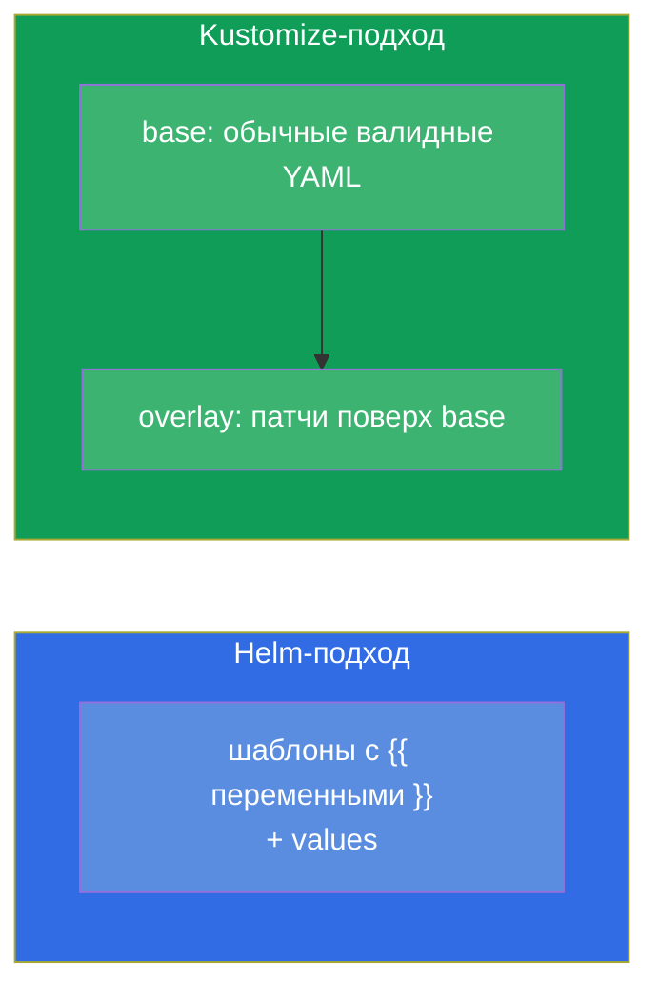
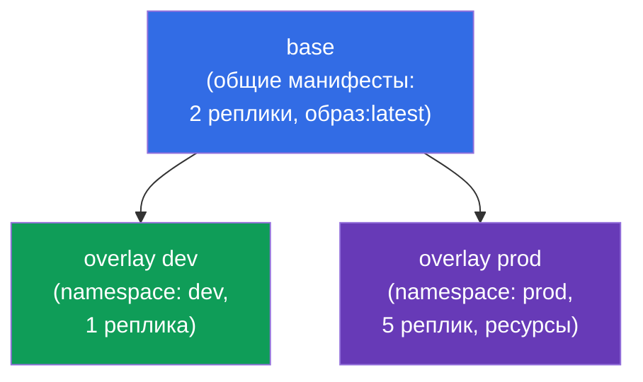
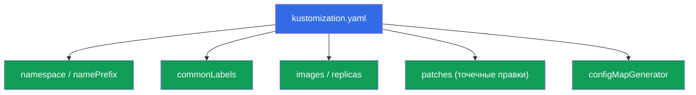
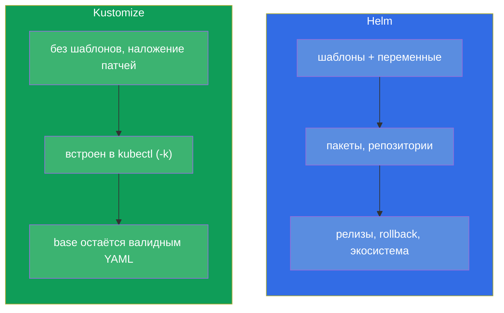

# Глава 43. Kustomize

> 🟦 **Глава для CKA** (домен Cluster Architecture: «использовать Helm и Kustomize»). Тема
> есть и в CKAD (деплой).
>
> **Что дальше.** Helm (глава 42) настраивает манифесты через шаблоны и переменные.
> **Kustomize** решает ту же задачу - адаптацию манифестов под среды - но **без шаблонов**:
> он берёт обычные YAML и накладывает на них изменения (overlays). Kustomize встроен прямо
> в `kubectl` (`kubectl apply -k`). Разберём базовую модель base + overlays и сравним с
> Helm - вопрос «Helm или Kustomize» частый и на экзамене, и в жизни.

## 43.1. Идея Kustomize: без шаблонов, только наложение

Helm шаблонизирует (`{{ .Values.x }}`), а Kustomize идёт другим путём: у вас есть обычные,
валидные YAML-манифесты (**base**), и вы **накладываете** на них изменения для конкретной
среды (**overlay**) - не трогая исходники.



Плюс подхода: base-манифесты остаются обычным рабочим YAML (их можно применить и без
Kustomize), а различия сред живут отдельно, не засоряя исходники шаблонными вставками.

## 43.2. base и overlays

Типичная структура Kustomize - **base** (общие манифесты) и **overlays** (папки под
каждую среду с патчами):

```
myapp/
├── base/
│   ├── kustomization.yaml
│   ├── deployment.yaml
│   └── service.yaml
└── overlays/
    ├── dev/
    │   └── kustomization.yaml      # патчи для dev
    └── prod/
        └── kustomization.yaml      # патчи для prod
```



`base/kustomization.yaml` перечисляет ресурсы:

```yaml
resources:
- deployment.yaml
- service.yaml
```

`overlays/prod/kustomization.yaml` ссылается на base и добавляет изменения:

```yaml
resources:
- ../../base
namespace: prod
replicas:
- name: myapp
  count: 5
images:
- name: myapp
  newTag: "1.27"
```

## 43.3. Применение

Kustomize встроен в kubectl - применяют флагом `-k` (указывая на папку с
`kustomization.yaml`):

```bash
# Посм, что получится (отрендерить)
kubectl kustomize overlays/prod

# Применить overlay
kubectl apply -k overlays/prod

# Отдельный бинарник kustomize (те же возможности)
kustomize build overlays/prod | kubectl apply -f -
```


> **Совет.** `kubectl kustomize <dir>` (или `kustomize build`) показывает итоговый YAML
> **не применяя** его - как `helm template` у Helm. Полезно проверить, что получится.

## 43.4. Возможности Kustomize

Kustomize умеет типовые преобразования без шаблонов:

| Возможность | Что делает |
|-------------|-----------|
| `namespace` | проставить namespace всем ресурсам |
| `namePrefix` / `nameSuffix` | добавить префикс/суффикс к именам |
| `commonLabels` / `commonAnnotations` | добавить метки/аннотации всем |
| `images` | заменить образ/тег |
| `replicas` | изменить число реплик |
| `patches` (strategic/JSON6902) | точечные изменения любых полей |
| `configMapGenerator` / `secretGenerator` | генерировать ConfigMap/Secret из файлов/литералов |



Отдельно полезны генераторы: `configMapGenerator` создаёт ConfigMap из файлов/литералов и
добавляет к имени **хеш содержимого**. При изменении данных имя ConfigMap меняется → под
пересоздаётся и подхватывает новый конфиг (решение проблемы «env из ConfigMap не
обновляется», глава 18).

## 43.5. Helm против Kustomize

Частый вопрос выбора. Оба решают адаптацию манифестов под среды, но по-разному:



| | Helm | Kustomize |
|---|------|-----------|
| Подход | шаблонизация (переменные) | наложение патчей (overlays) |
| Установка | отдельный инструмент | встроен в kubectl (`-k`) |
| Готовые пакеты | огромная экосистема чартов | нет пакетов, только свои манифесты |
| Управление релизами | да (install/rollback, история) | нет (просто apply) |
| Кривая входа | выше (Go-шаблоны) | ниже (обычный YAML) |
| Лучше для | готовое ПО, сложная параметризация | свои манифесты, адаптация под среды |

На практике их **часто сочетают**: сторонний софт ставят Helm-чартами, а свои манифесты
адаптируют Kustomize. Многие GitOps-инструменты (Argo CD) поддерживают оба.

## 43.6. Как это применяют в продакшене

- **Kustomize для своих манифестов и сред.** В проде свои приложения часто держат как
  base + overlays (dev/stage/prod): общий base, а различия (реплики, ресурсы, хосты,
  namespace) - в overlay. Никакой шаблонизации, чистый YAML.
- **Встроенность в kubectl и GitOps.** Раз Kustomize встроен в kubectl и понимается Argo
  CD/Flux, его удобно использовать в GitOps-репозиториях: изменил overlay в git - GitOps
  применил. Это упрощает пайплайн.
- **configMapGenerator против stale-конфига.** Хеш в имени ConfigMap автоматически
  пересоздаёт поды при изменении конфига - в проде это решает частую проблему «поменяли
  ConfigMap, а приложение не подхватило» без ручного rollout restart.
- **Helm + Kustomize вместе.** Типичный прод-паттерн: чужой софт - Helm, свой - Kustomize;
  иногда Kustomize «допатчивает» вывод Helm. Выбор - по задаче, а не «или-или».
- **base как источник правды.** Поскольку base - валидные манифесты, их легко ревьюить и
  переиспользовать между командами; overlays держат специфику среды изолированно.

## 43.7. Мини-глоссарий

- **Kustomize** - инструмент адаптации манифестов наложением патчей, без шаблонов.
- **base** - общие исходные манифесты.
- **overlay** - набор изменений поверх base для конкретной среды.
- **kustomization.yaml** - файл, описывающий ресурсы и преобразования.
- **kubectl apply -k** - применить Kustomize-каталог.
- **patches** - точечные изменения полей (strategic merge / JSON6902).
- **configMapGenerator / secretGenerator** - генерация ConfigMap/Secret (с хешем в имени).
- **kubectl kustomize / kustomize build** - рендер без применения.

## 43.8. Итоги главы

- Kustomize адаптирует манифесты под среды **без шаблонов** - наложением патчей на base.
- Модель: base (общие валидные YAML) + overlays (патчи под dev/prod); base остаётся
  применимым и сам по себе.
- Встроен в kubectl: `kubectl apply -k <dir>`; `kubectl kustomize <dir>` рендерит без
  применения.
- Умеет namespace, префиксы, метки, замену образов/реплик, точечные patches и генераторы
  ConfigMap/Secret (с хешем в имени - автопересоздание подов при изменении конфига).
- Helm vs Kustomize: Helm - шаблоны, пакеты, релизы; Kustomize - наложение, встроен в
  kubectl, проще; часто используют вместе.

## 43.9. Как это пригодится: на экзамене и в реальной работе

**На экзамене.** Программа CKA включает Kustomize. Ожидаются задания «примени Kustomize-
каталог» (`kubectl apply -k`), «настрой overlay с изменением реплик/образа/namespace»,
понимание base/overlay. Полезно знать `kubectl kustomize` для проверки результата.

**В реальной работе.** Kustomize - популярный способ держать свои манифесты под несколько
сред без шаблонной магии, отлично ложится в GitOps (встроен в kubectl, понимается Argo
CD). configMapGenerator решает проблему stale-конфига. Понимание, когда брать Helm, а
когда Kustomize (и как их сочетать), - практический навык доставки.

## 43.10. Вопросы для самопроверки

1. Чем подход Kustomize отличается от Helm принципиально?
2. Что такое base и overlay? Почему base остаётся применимым сам по себе?
3. Как применить Kustomize-каталог и как посмотреть результат без применения?
4. Какие преобразования умеет Kustomize? Приведите несколько.
5. Что делает configMapGenerator с именем ConfigMap и какую проблему это решает?
6. В каких случаях выбрать Helm, а в каких Kustomize?
7. Можно ли использовать Helm и Kustomize вместе? Как?

## Практика

На этом часть 8 (архитектура, установка и настройка) завершена. Дальше - часть 9,
troubleshooting (CKA): систематический разбор сбоев приложений (глава 44), control plane и
нод (45), сети (46). Kustomize отрабатывается в лабах по администрированию.

🧪 Лаба 115 (Kustomize): [tasks/cka/labs/115](../../labs/115/README_RU.MD)

---
[Оглавление](../README_RU.md) · [Глава 42](../42/ru.md) · [Глава 44](../44/ru.md)
