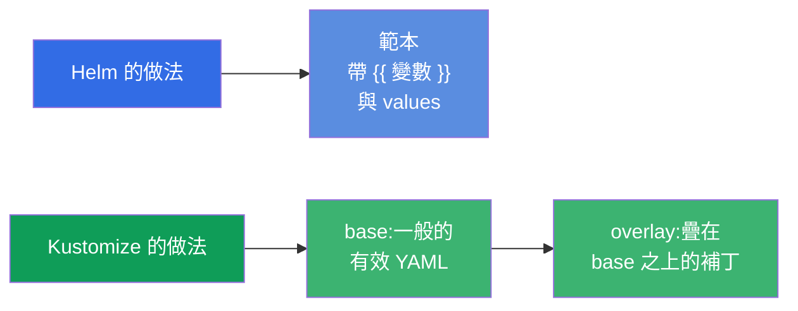
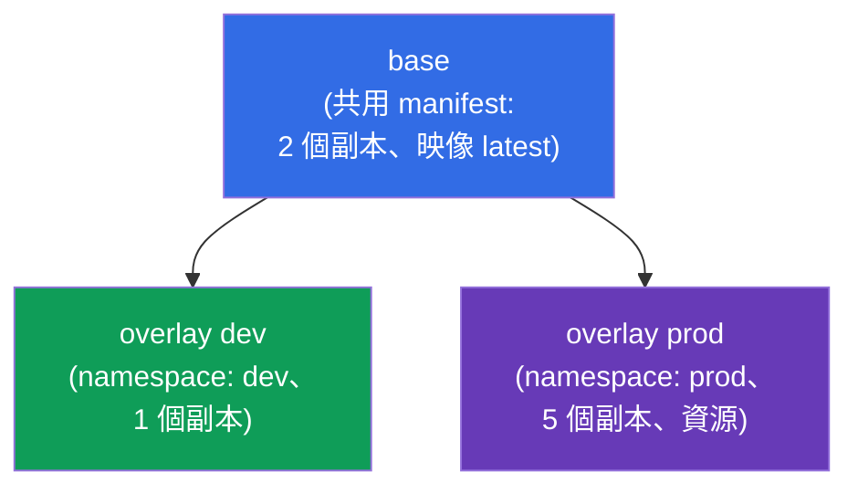
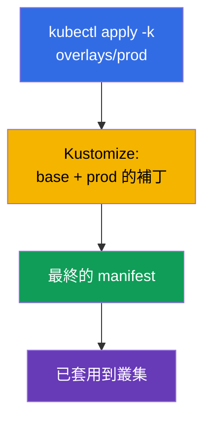
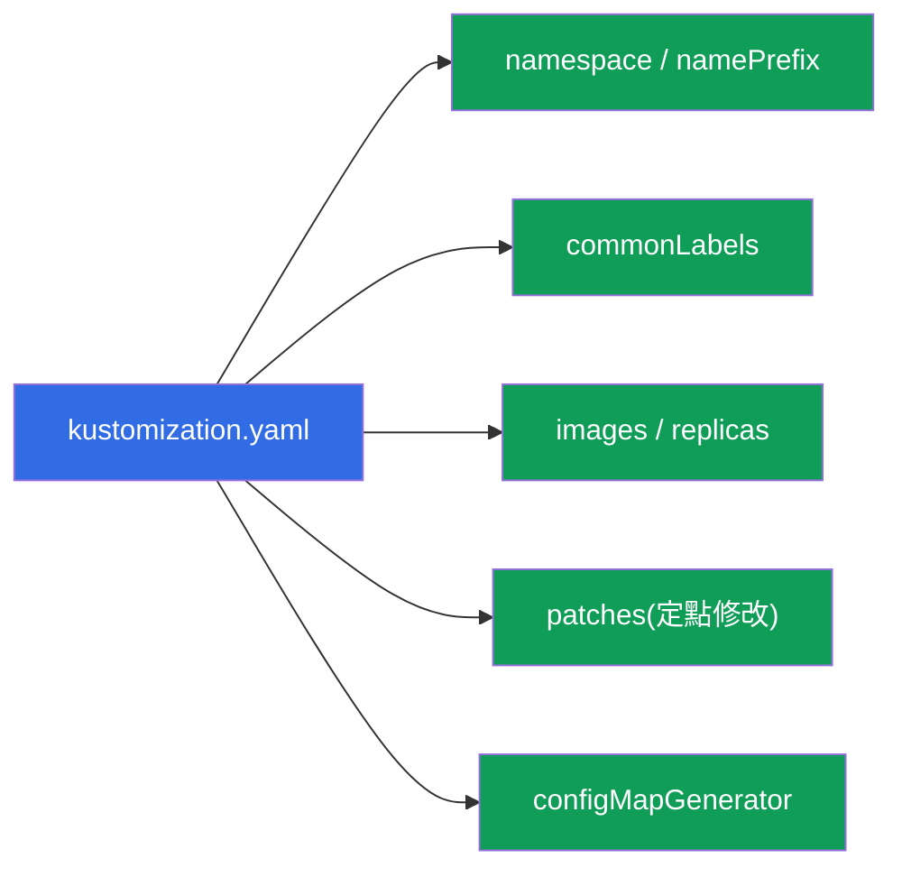
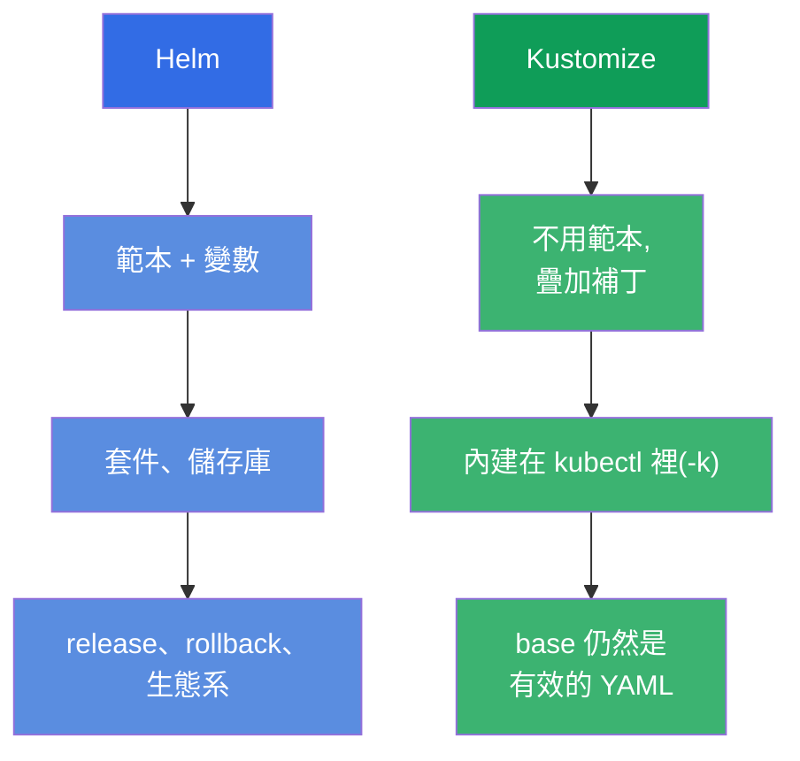

[Русская версия](ru.md) · [Eng version](README.md) · [Versión en español](es.md) · [Version française](fr.md) · [Deutsche Version](de.md) · [ქართული ვერსია](ge.md) · [日本語版](jp.md)

# 第 43 章。Kustomize

> 🟦 **CKA 章節**(領域 Cluster Architecture:「使用 Helm 與 Kustomize」)。這個主題
> 在 CKAD 也有(部署)。
>
> **接下來是什麼。** Helm(第 42 章)是用範本與變數來調整 manifest。
> **Kustomize** 解決同一個問題 - 讓 manifest 適應不同環境 - 但**不用範本**:
> 它拿一般的 YAML,然後在上面疊加變更(overlays)。Kustomize 直接內建在
> `kubectl` 裡(`kubectl apply -k`)。我們來拆解 base + overlays 的基本模型,並與
> Helm 做比較 - 「要 Helm 還是 Kustomize」這個問題在考試和實際工作中都很常見。

## 43.1. Kustomize 的理念:不用範本,只做疊加

Helm 做範本化(`{{ .Values.x }}`),而 Kustomize 走的是另一條路:你有一般的、
有效的 YAML manifest(**base**),然後針對特定環境在它們之上**疊加**變更
(**overlay**) - 完全不動原始檔。



這個做法的好處:base manifest 仍然是一般可用的 YAML(不靠 Kustomize 也能直接套用),
而各環境的差異單獨存放,不會用範本插入語法把原始檔弄得亂七八糟。

## 43.2. base 與 overlays

典型的 Kustomize 結構是 **base**(共用 manifest)與 **overlays**(每個環境一個
資料夾,裡面放補丁):

```
myapp/
├── base/
│   ├── kustomization.yaml
│   ├── deployment.yaml
│   └── service.yaml
└── overlays/
    ├── dev/
    │   └── kustomization.yaml      # dev 的補丁
    └── prod/
        └── kustomization.yaml      # prod 的補丁
```



`base/kustomization.yaml` 列出資源:

```yaml
resources:
- deployment.yaml
- service.yaml
```

`overlays/prod/kustomization.yaml` 引用 base 並加上變更:

```yaml
resources:
- ../../base
namespace: prod
replicas:
- name: myapp
  count: 5
images:
- name: myapp
  newTag: "1.27"
```

## 43.3. 套用

Kustomize 內建在 kubectl 裡 - 用 `-k` 旗標套用(指向含有
`kustomization.yaml` 的資料夾):

```bash
# 看看結果會長什麼樣(算繪出來,不套用)
kubectl kustomize overlays/prod

# 套用 overlay
kubectl apply -k overlays/prod

# 獨立的 kustomize 執行檔(功能相同)
kustomize build overlays/prod | kubectl apply -f -
```



> **提示。** `kubectl kustomize <dir>`(或 `kustomize build`)會顯示最終的 YAML
> 而**不套用**它 - 就像 Helm 的 `helm template`。用來確認結果會變成什麼樣很方便。

## 43.4. Kustomize 的能力

Kustomize 不用範本就能做各種常見的轉換:

| 能力 | 做什麼 |
|-------------|-----------|
| `namespace` | 為所有資源設定 namespace |
| `namePrefix` / `nameSuffix` | 為名稱加上前綴/後綴 |
| `commonLabels` / `commonAnnotations` | 為所有資源加上標籤/註解 |
| `images` | 替換映像/標籤 |
| `replicas` | 改變副本數 |
| `patches`(strategic/JSON6902) | 針對任意欄位做定點修改 |
| `configMapGenerator` / `secretGenerator` | 從檔案/字面值生成 ConfigMap/Secret |



生成器特別實用:`configMapGenerator` 會從檔案/字面值建立 ConfigMap,並在名稱後面
加上**內容的雜湊值**。資料一改,ConfigMap 的名稱就跟著改 → Pod 會被重新建立並
取得新的設定(這正好解決了「從 ConfigMap 來的 env 不會更新」這個問題,第 18 章)。

## 43.5. Helm 與 Kustomize 的對比

這是很常見的選擇題。兩者都在解決讓 manifest 適應不同環境的問題,但方式不同:



| | Helm | Kustomize |
|---|------|-----------|
| 做法 | 範本化(變數) | 疊加補丁(overlays) |
| 安裝 | 獨立的工具 | 內建在 kubectl 裡(`-k`) |
| 現成套件 | 龐大的 chart 生態系 | 沒有套件,只有自己的 manifest |
| release 管理 | 有(install/rollback、歷史) | 沒有(只是 apply) |
| 學習曲線 | 較高(Go 範本) | 較低(一般的 YAML) |
| 更適合 | 現成軟體、複雜的參數化 | 自己的 manifest、適應各環境 |

實務上**常常兩者並用**:第三方軟體用 Helm chart 安裝,自己的 manifest 則用
Kustomize 調整。很多 GitOps 工具(Argo CD)兩者都支援。

## 43.6. 生產環境怎麼用

- **自己的 manifest 與環境用 Kustomize。** 在生產環境中,自家應用程式常常以
  base + overlays 的形式維護(dev/stage/prod):共用的 base,差異(副本、資源、主機、
  namespace)則放在 overlay 裡。沒有任何範本化,純粹的 YAML。
- **內建在 kubectl 與 GitOps。** 既然 Kustomize 內建在 kubectl 裡,又被 Argo
  CD/Flux 認得,那在 GitOps 儲存庫裡用它就很方便:在 git 改了 overlay - GitOps
  就套用。這讓 pipeline 更簡單。
- **configMapGenerator 對付 stale 設定。** ConfigMap 名稱裡的雜湊值會在設定變更時
  自動重建 Pod - 在生產環境這解決了「改了 ConfigMap,應用程式卻沒有吃到」這個
  常見問題,而不必手動做 rollout restart。
- **Helm + Kustomize 一起用。** 典型的生產模式:別人的軟體用 Helm,自己的用 Kustomize;
  有時 Kustomize 還會對 Helm 的輸出「再補上補丁」。要選哪個看任務,而不是「非此即彼」。
- **base 作為真實來源。** 因為 base 是有效的 manifest,所以很容易 review,也容易在
  團隊之間重複使用;overlays 則把環境特有的部分隔離開來。

## 43.7. 迷你詞彙表

- **Kustomize** - 以疊加補丁的方式調整 manifest 的工具,不用範本。
- **base** - 共用的原始 manifest。
- **overlay** - 針對特定環境疊在 base 之上的一組變更。
- **kustomization.yaml** - 描述資源與轉換的檔案。
- **kubectl apply -k** - 套用一個 Kustomize 目錄。
- **patches** - 對欄位的定點修改(strategic merge / JSON6902)。
- **configMapGenerator / secretGenerator** - 生成 ConfigMap/Secret(名稱裡帶雜湊值)。
- **kubectl kustomize / kustomize build** - 算繪但不套用。

## 43.8. 本章總結

- Kustomize **不用範本**就能讓 manifest 適應各環境 - 靠的是在 base 上疊加補丁。
- 模型:base(共用且有效的 YAML)+ overlays(給 dev/prod 的補丁);base 本身
  也仍然可以直接套用。
- 內建在 kubectl 裡:`kubectl apply -k <dir>`;`kubectl kustomize <dir>` 只算繪不
  套用。
- 它會設定 namespace、前綴、標籤、替換映像/副本數、做定點 patches,以及生成
  ConfigMap/Secret(名稱帶雜湊值 - 設定變更時自動重建 Pod)。
- Helm vs Kustomize:Helm - 範本、套件、release;Kustomize - 疊加、內建在
  kubectl 裡、更簡單;常常一起用。

## 43.9. 這些在哪裡用得上:考試與實際工作

**在考試中。** CKA 的大綱包含 Kustomize。可以預期會有「套用一個 Kustomize
目錄」(`kubectl apply -k`)、「設定一個會改副本數/映像/namespace 的 overlay」這類題目,
以及對 base/overlay 的理解。知道用 `kubectl kustomize` 檢查結果也很有用。

**在實際工作中。** Kustomize 是把自己的 manifest 維護給多個環境用、又不需要範本
魔法的熱門做法,和 GitOps 非常合(內建在 kubectl,Argo CD 也認得)。
configMapGenerator 解決了 stale 設定的問題。知道什麼時候該用 Helm、什麼時候該用
Kustomize(以及怎麼搭配),是交付方面的實用技能。

## 43.10. 自我檢查問題

1. Kustomize 的做法和 Helm 在根本上有什麼不同?
2. base 和 overlay 是什麼?為什麼 base 本身仍然可以直接套用?
3. 怎麼套用一個 Kustomize 目錄,又怎麼在不套用的情況下看結果?
4. Kustomize 會做哪些轉換?舉幾個例子。
5. configMapGenerator 對 ConfigMap 的名稱做了什麼,這解決了什麼問題?
6. 什麼情況選 Helm,什麼情況選 Kustomize?
7. Helm 和 Kustomize 可以一起用嗎?怎麼用?

## 實踐

到這裡第 8 部分(架構、安裝與設定)就結束了。接下來是第 9 部分,
troubleshooting(CKA):系統性地拆解應用程式的故障(第 44 章)、control plane 與
節點(45)、網路(46)。Kustomize 會在管理相關的實驗中操練。

🧪 實驗 115(Kustomize):[tasks/cka/labs/115](../../labs/115/README_TW.MD)

🎮 Killercoda（在瀏覽器中，無需安裝）：[Apply Resources with Kustomize](https://killercoda.com/chadmcrowell/course/ckad/kustomize-apply) · [Kustomize Overlays for Environments](https://killercoda.com/chadmcrowell/course/ckad/kustomize-env-overlay) · [Patch Deployment Image with Kustomize](https://killercoda.com/chadmcrowell/course/ckad/kustomize-patch-image) · [Generate ConfigMap and Secret with Kustomize](https://killercoda.com/chadmcrowell/course/ckad/kustomize-configmap-secret)

---
[目錄](../README_TW.md) · [第 42 章](../42/tw.md) · [第 44 章](../44/tw.md)
