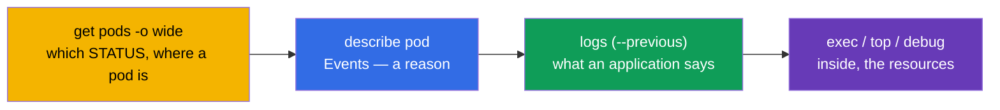
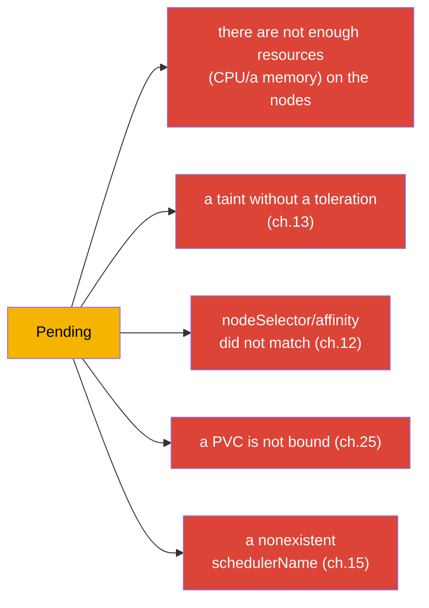
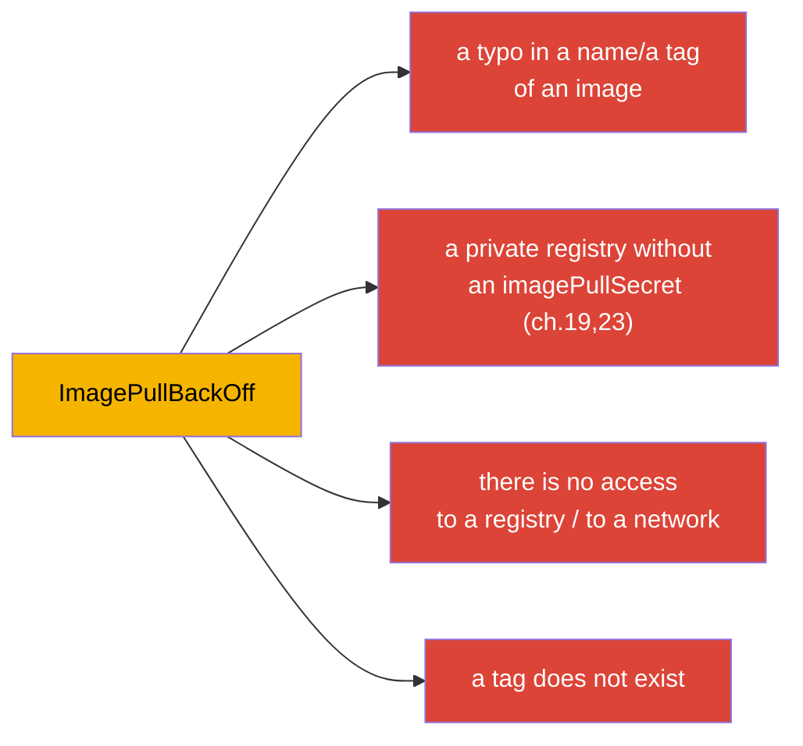
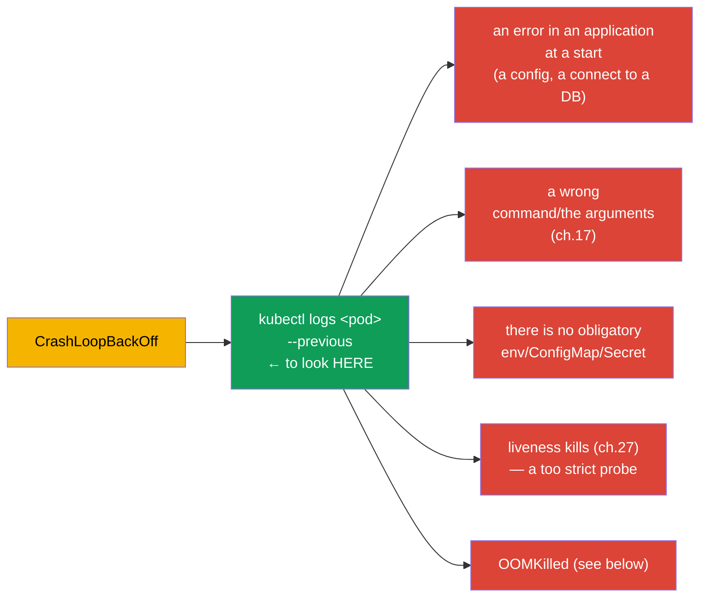
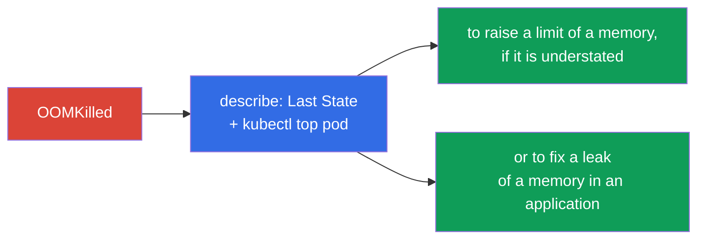
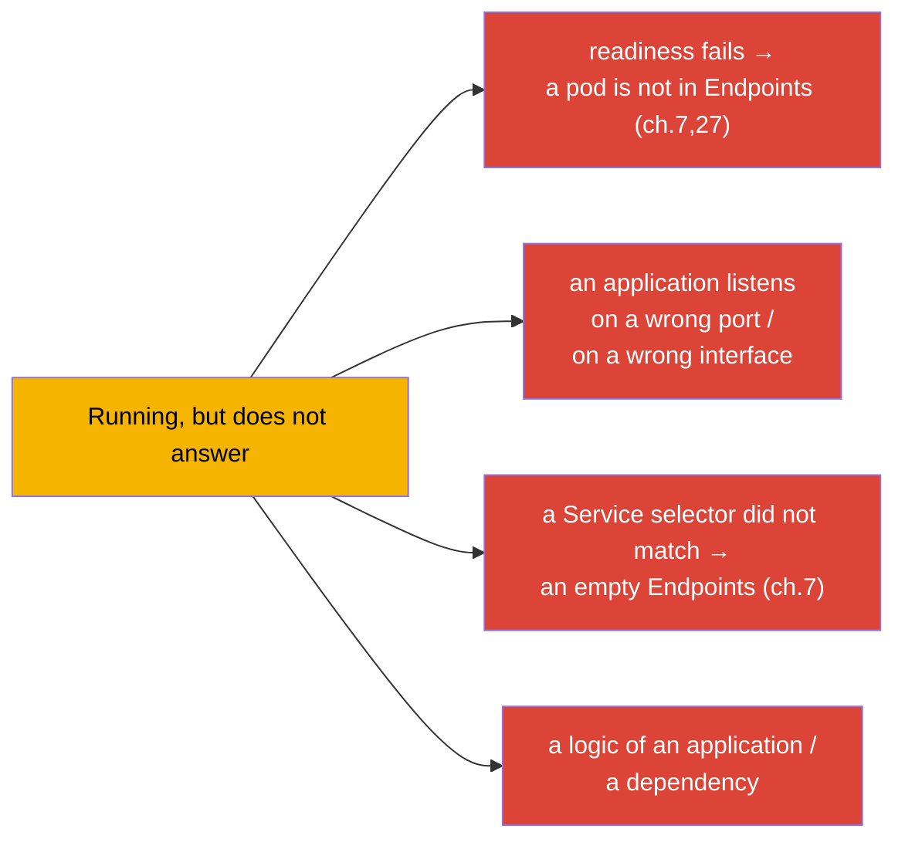
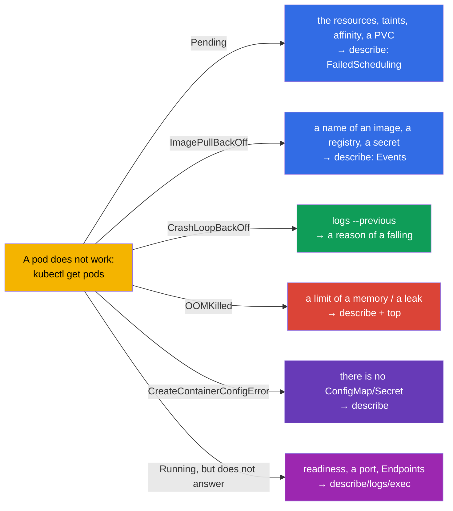

[Русская версия](ru.md) · [Versión en español](es.md) · [Version française](fr.md) · [Deutsche Version](de.md) · [ქართული ვერსია](ge.md)

# Chapter 44. A debugging of the failures of the applications

> 🟦 **A chapter for the CKA** (a domain Troubleshooting - 30%, the biggest one). The skills are useful for
> the CKAD too (Observability).
>
> **What comes next.** We begin the part 9 - a troubleshooting, the weightiest domain of the CKA. We have already
> collected the instruments (the chapters 4, 28, 29); now we systematize an analysis of the failures at a level of an
> **application**: why a pod does not start, falls, does not answer. We will give the clear decision trees
> for every typical STATUS. A debugging of a cluster (a control plane, the nodes) and of a network we
> will consider in the chapters 45-46.

## 44.1. A universal algorithm

Any analysis of a failure of an application goes by one route (let us recall the chapter 29):

STATUS at once sets a branch of an analysis. We will consider every typical one separately.

## 44.2. Pending: a pod is not scheduled

`Pending` means: a pod is accepted, but a scheduler cannot place it onto a node. We look at
`describe` → Events (`FailedScheduling`).

| A reason | How to check/to fix |
|---------|----------------------|
| there are no resources | `kubectl top nodes`, `describe node`; to lower the requests or to add the nodes |
| a taint without a toleration | `describe node` (taints); to add a toleration or to remove a taint (ch.13) |
| nodeSelector/affinity | to compare the labels of the nodes and the rules of a pod (ch.12) |
| a PVC is not bound | `kubectl get pvc` (Pending?); a StorageClass/a PV (ch.25-26) |
| there are no nodes/schedulerName | to check `schedulerName`, a presence of the Ready nodes |

## 44.3. ImagePullBackOff / ErrImagePull: an image is not pulled

A container cannot download an image. A reason is in `describe` (Events: `Failed to pull image`).

A check: an exact name of an image and a tag, a presence of an `imagePullSecret` for a private registry
(the chapter 19), an availability of a registry. Often this is simply a typo in `image:`.

## 44.4. CrashLoopBackOff: a container falls cyclically

The most frequent and important one. A container starts and at once falls, Kubernetes restarts it with
a growing delay. **A key - the logs of a fallen container** (`--previous`, the chapter 28).

An algorithm: `logs --previous` → to understand, on what it falls. The frequent reasons: an application cannot
connect to a dependency, a wrong command (the chapter 17), a ConfigMap/a Secret is absent,
a too strict liveness probe kills at a start (a startup probe is needed, the chapter 27), or
an exceeding of a memory (OOMKilled).

## 44.5. OOMKilled: an exceeding of a memory

A container is killed for an exceeding of a limit of a memory (the chapter 14). It is visible in `describe`:
`Last State: Terminated, Reason: OOMKilled`.

A solution: to compare a real consumption (`kubectl top`) with a limit - either a limit is understated
(to raise it), or there is a leak in an application (to fix a code). To remember (the chapter 14): a memory -
an incompressible resource, that is why they exactly kill, and not slow down.

## 44.6. CreateContainerConfigError and a similar one

A container is not created, because a resource, which it refers to, is not found:

| STATUS | A reason |
|--------|---------|
| `CreateContainerConfigError` | there is no ConfigMap/Secret out of `env`/`volume` (the chapters 18-19) |
| `CreateContainerError` | a problem of a configuration of a container (a command, a mounting) |
| `RunContainerError` | an error of a start (the rights, an entry point) |

A check: does a ConfigMap/a Secret, which a pod refers to, exist in the same namespace;
are the names of the keys correct. `describe` will point out, which resource is missing.

## 44.7. Running, but an application does not work

A pod is `Running` and `Ready`, but the requests do not pass. Here a problem is not in a start, but in a work
or in an access:

An order: to check readiness (`describe` - does it pass), `kubectl logs`, to get inside
(`exec`) and to check, whether an application listens on a port; to check a Service and Endpoints (the chapter 7).
`port-forward` right onto a pod helps to understand, whether a problem is in an application or in a routing
(the chapter 29). A network part in a detail - the chapter 46.

## 44.8. A summary decision tree

We collect everything into one map "STATUS → where to look":

This map is worth keeping in a head at an exam - it turns "something does not work" into a
concrete next step in seconds.

## 44.9. How this is applied in a production

- **The same route, a bigger scale.** In a prod an analysis goes the same way (STATUS → describe →
  logs → top/exec), but the data are taken from the centralized logs/metrics (the chapter 28), and not
  only out of `kubectl`. The alerts often point out a type of a problem directly (a mass
  CrashLoopBackOff, OOMKilled).
- **The frequent prod reasons by STATUS.** After a release: CrashLoopBackOff (a bug/a config),
  ImagePullBackOff (a wrong tag/there is no access to a registry), OOMKilled (a limit is understated). Pending
  often = a lack of the resources of a cluster or the wrong affinity/taints - a signal to an autoscaling
  of the nodes.
- **A fast rollback instead of a long debugging.** In a prod at a failed release they first roll back
  (`rollout undo`, the chapter 8; `helm rollback`, the chapter 42), restoring a service, and an analysis
  of a reason they do afterwards - an availability is more important.
- **The probes and the resources prevent a half of the failures.** The correct readiness/liveness (the chapter
  27) and the right-sized requests/limits (the chapter 14) remove the whole classes of the incidents (a traffic onto
  an unready pod, OOMKilled, the cascade restarts).
- **A post-mortem and the alerts.** The recurring failures are analyzed systematically (a root cause), and not
  extinguished every time - and the alerts on the early symptoms are configured (a growth of the restarts, an approach
  to a limit of a memory).

## 44.10. A mini glossary

- **Pending** - a pod is not scheduled (the resources/taints/affinity/a PVC).
- **ImagePullBackOff/ErrImagePull** - it is not possible to download an image.
- **CrashLoopBackOff** - a container falls cyclically; a key - `logs --previous`.
- **OOMKilled** - it is killed for an exceeding of a limit of a memory.
- **CreateContainerConfigError** - there is no ConfigMap/Secret, which a pod refers to.
- **FailedScheduling** - an event of a scheduler at Pending.
- **Events** - a section of `describe` with the reasons.

## 44.11. The conclusions of the chapter

- A universal route: `get pods` (STATUS) → `describe` (Events) → `logs --previous` →
  `top`/`exec`/`debug`. STATUS sets a branch of an analysis.
- Pending → describe/FailedScheduling: the resources, taints, affinity, a PVC, schedulerName.
- ImagePullBackOff → a name/a tag of an image, an imagePullSecret, an access to a registry.
- CrashLoopBackOff → `logs --previous`: an error of a start, a command, there is no env/CM/Secret,
  a strict liveness, an OOM.
- OOMKilled → describe (Last State) + top: a limit of a memory is understated or there is a leak.
- CreateContainerConfigError → a ConfigMap/a Secret is absent.
- Running, but does not answer → readiness, a port, a Service/Endpoints, a logic; `port-forward`
  localizes it.

## 44.12. How this will come in handy: at an exam and in a real work

**At an exam (CKA).** A troubleshooting - 30% of an exam, and the failures of the applications - its big
part. A tree "STATUS → a next step" saves a precious time. It is necessary to apply
get→describe→logs(--previous)→top/exec reflexively and to know the reasons of every STATUS. This is the same
core of Observability at the CKAD.

**In a real work.** A fast localization of a failure of an application - a daily skill of an on-call engineer.
A decision tree and a bundle of the logs+the events+the metrics accelerate an analysis of the incidents, and a prevention
(the probes, a right-sizing, the rollbacks) removes the whole classes of the problems. A post-mortem instead of a
firefighting distinguishes a mature operation.

## 44.13. The questions for a self-check

1. Describe a universal route of a debugging. What sets a branch of an analysis?
2. Which reasons of Pending are there and how to check every one of them?
3. Where to look at ImagePullBackOff?
4. Why at CrashLoopBackOff the main thing is `logs --previous`? Name the frequent reasons.
5. How to distinguish and to eliminate OOMKilled?
6. What causes CreateContainerConfigError?
7. A pod is Running and Ready, but does not answer - which reasons are there and how to localize them?

## Practice

We have systematized a debugging of the applications. In the chapter 45 we will rise to a level of a cluster -
an analysis of the failures of a control plane and of the worker nodes. A debugging of the applications is practised in the labs on a
troubleshooting and in the mock exams.

🧪 A lab 114 (a debugging of the broken resources): [tasks/cka/labs/114](../../labs/114/README.MD)

---
[Contents](../README.md) · [Chapter 43](../43/README.md) · [Chapter 45](../45/README.md)
