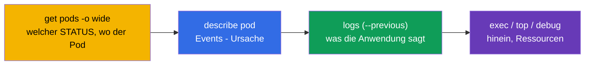
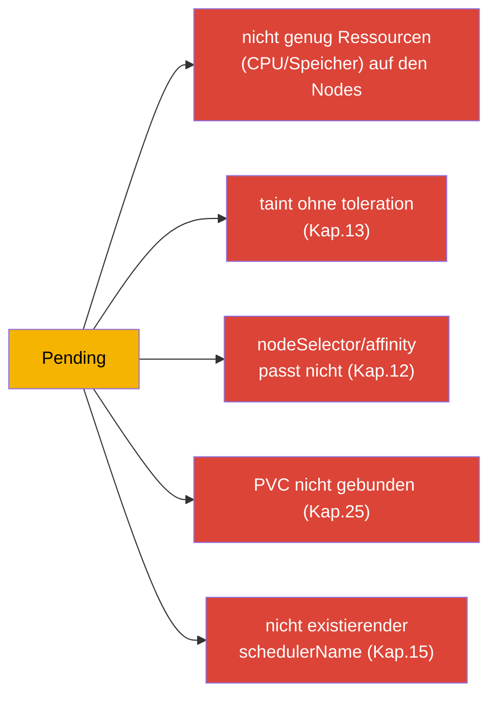
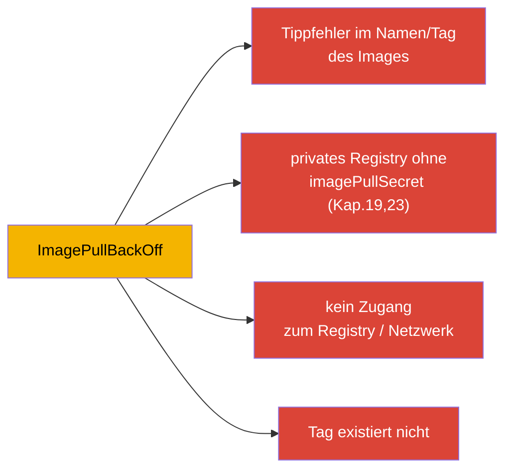
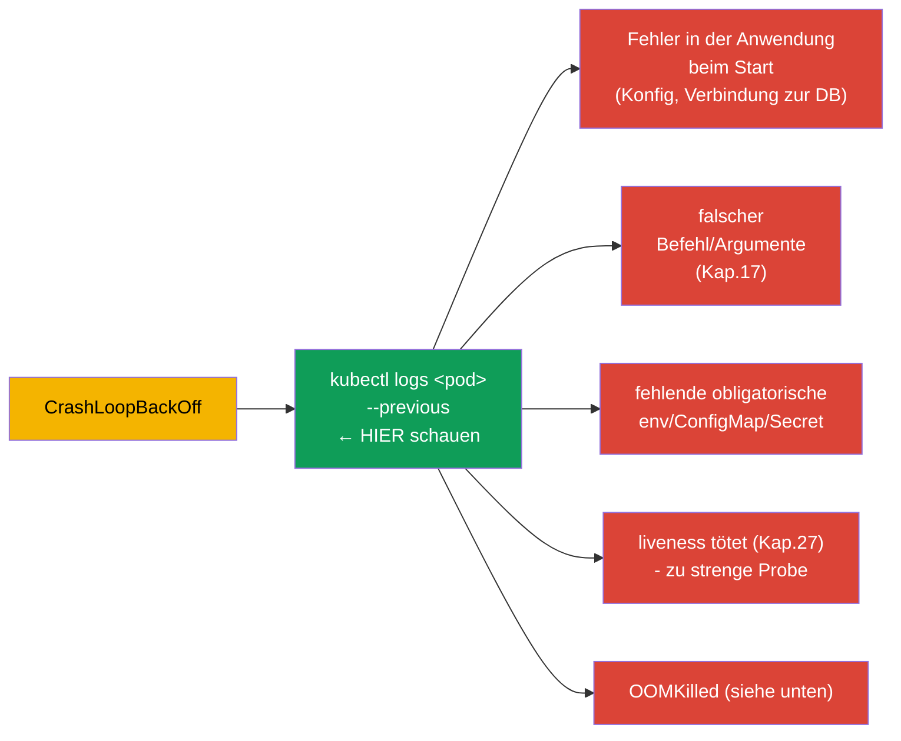
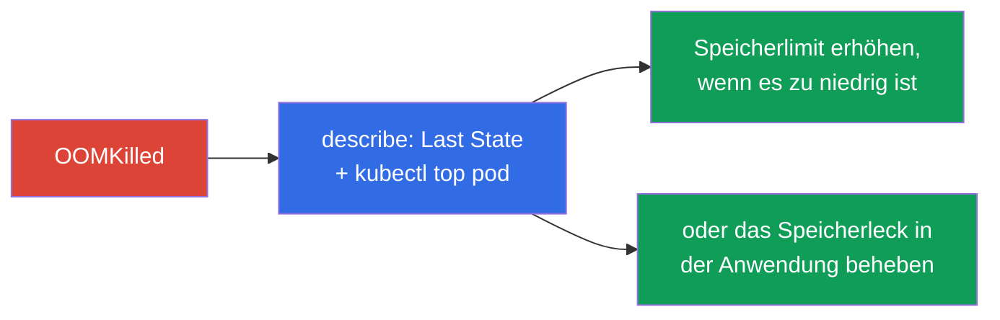
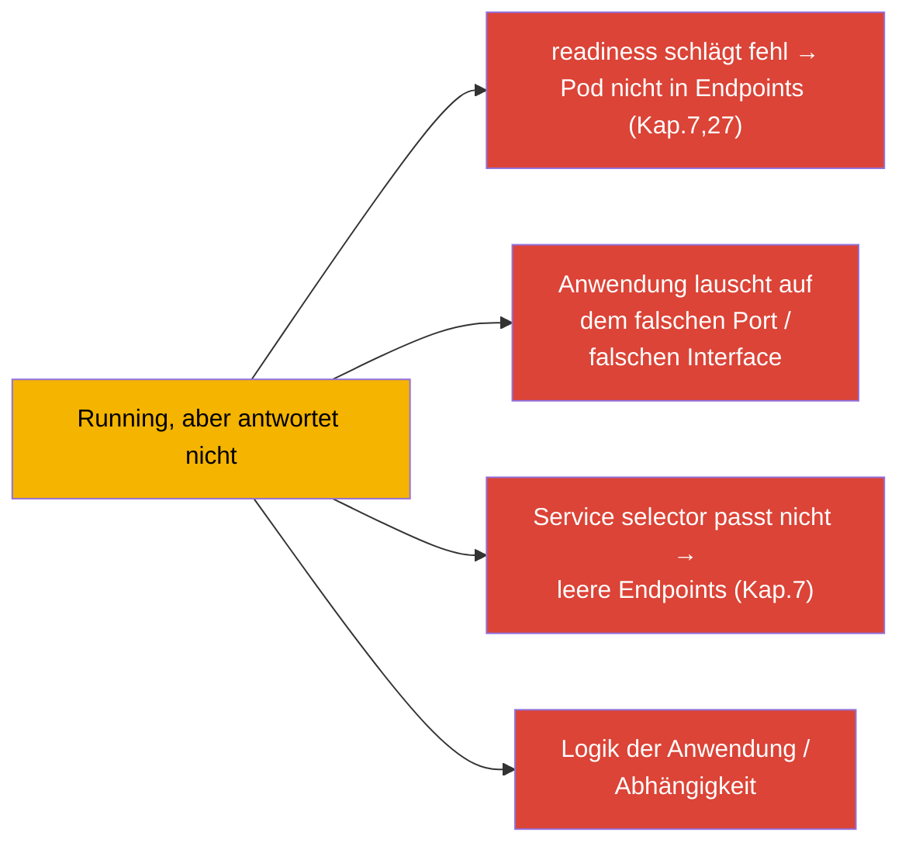
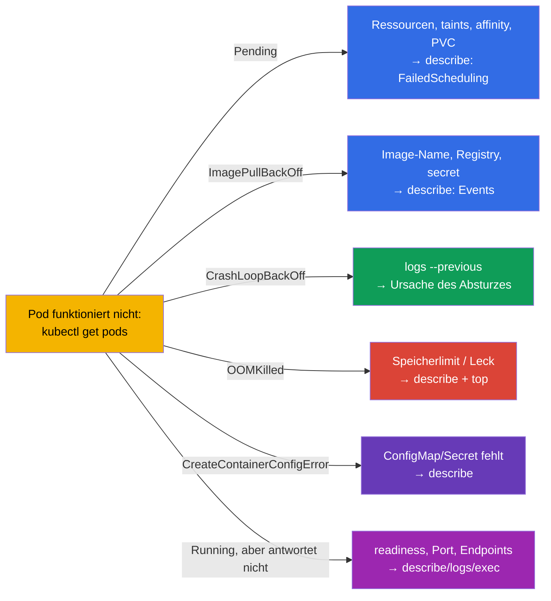

[Русская версия](ru.md) · [Eng version](README.md) · [Versión en español](es.md) · [Version française](fr.md) · [ქართული ვერსია](ge.md) · [繁體中文版](tw.md) · [日本語版](jp.md)

# Kapitel 44. Debugging von Anwendungsfehlern

> 🟦 **Kapitel für CKA** (Domäne Troubleshooting - 30%, die größte). Die Fähigkeiten sind
> auch für CKAD nützlich (Observability).
>
> **Was kommt.** Wir beginnen Teil 9 - Troubleshooting, die gewichtigste Domäne von CKA. Die
> Werkzeuge haben wir bereits (Kapitel 4, 28, 29); jetzt systematisieren wir die Analyse von
> Fehlern auf Ebene der **Anwendung**: warum ein Pod nicht startet, abstürzt, nicht antwortet.
> Wir geben klare Entscheidungsbäume für jeden typischen STATUS. Debugging des Clusters
> (Control Plane, Nodes) und des Netzwerks behandeln wir in den Kapiteln 45-46.

## 44.1. Universeller Algorithmus

Jede Analyse eines Anwendungsfehlers folgt derselben Route (erinnern wir uns an Kapitel 29):

Der STATUS gibt sofort den Analysezweig vor. Sehen wir uns jeden typischen einzeln an.

## 44.2. Pending: Pod nicht eingeplant

`Pending` bedeutet: der Pod ist angenommen, aber der Scheduler kann ihn auf keine Node
setzen. Wir schauen in `describe` → Events (`FailedScheduling`).

| Ursache | Wie prüfen/beheben |
|---------|----------------------|
| keine Ressourcen | `kubectl top nodes`, `describe node`; requests senken oder Nodes hinzufügen |
| taint ohne toleration | `describe node` (taints); toleration hinzufügen oder taint entfernen (Kap.13) |
| nodeSelector/affinity | Labels der Nodes mit den Regeln des Pods vergleichen (Kap.12) |
| PVC nicht gebunden | `kubectl get pvc` (Pending?); StorageClass/PV (Kap.25-26) |
| keine Nodes/schedulerName | `schedulerName` prüfen, Vorhandensein von Ready-Nodes |

## 44.3. ImagePullBackOff / ErrImagePull: Image wird nicht geladen

Der Container kann das Image nicht laden. Die Ursache steht in `describe` (Events: `Failed to pull image`).

Prüfung: genauer Name und Tag des Images, `imagePullSecret` für ein privates Registry
(Kapitel 19), Erreichbarkeit des Registry. Oft ist es einfach ein Tippfehler in `image:`.

## 44.4. CrashLoopBackOff: Container stürzt zyklisch ab

Der häufigste und wichtigste Fall. Der Container startet, stürzt sofort ab, Kubernetes startet
ihn mit wachsender Verzögerung neu. **Schlüssel: die Logs des abgestürzten Containers** (`--previous`, Kapitel 28).

Algorithmus: `logs --previous` → verstehen, woran es scheitert. Häufige Ursachen: die
Anwendung kann sich nicht mit einer Abhängigkeit verbinden, falscher Befehl (Kapitel 17),
ConfigMap/Secret fehlt, eine zu strenge liveness-Probe tötet beim Start (es braucht eine
startup probe, Kapitel 27), oder Überschreitung des Speichers (OOMKilled).

## 44.5. OOMKilled: Überschreitung des Speichers

Der Container wurde wegen Überschreitung des Speicherlimits getötet (Kapitel 14). Sichtbar
in `describe`: `Last State: Terminated, Reason: OOMKilled`.

Lösung: den echten Verbrauch (`kubectl top`) mit dem Limit vergleichen - entweder ist das
Limit zu niedrig (erhöhen), oder die Anwendung hat ein Leck (Code beheben). Nicht vergessen
(Kapitel 14): Speicher ist nicht komprimierbar, deshalb wird getötet, nicht gebremst.

## 44.6. CreateContainerConfigError und Ähnliches

Der Container wird nicht erstellt, weil eine Ressource fehlt, auf die er verweist:

| STATUS | Ursache |
|--------|---------|
| `CreateContainerConfigError` | ConfigMap/Secret aus `env`/`volume` fehlt (Kapitel 18-19) |
| `CreateContainerError` | Problem der Container-Konfiguration (Befehl, Mounten) |
| `RunContainerError` | Fehler beim Start (Rechte, Entrypoint) |

Prüfung: existiert die ConfigMap/das Secret, auf die der Pod verweist, im selben namespace;
sind die Namen der Keys korrekt. `describe` zeigt an, welche Ressource fehlt.

## 44.7. Running, aber die Anwendung funktioniert nicht

Der Pod ist `Running` und `Ready`, aber Anfragen kommen nicht durch. Hier liegt das Problem
nicht im Start, sondern im Betrieb oder im Zugang:

Reihenfolge: readiness prüfen (`describe` - geht sie durch), `kubectl logs`, hineingehen
(`exec`) und prüfen, ob die Anwendung den Port lauscht; Service und Endpoints prüfen
(Kapitel 7). `port-forward` direkt auf den Pod hilft zu verstehen, ob das Problem in der
Anwendung oder im Routing liegt (Kapitel 29). Den Netzwerkteil im Detail - Kapitel 46.

## 44.8. Zusammenfassender Entscheidungsbaum

Wir fassen alles in einer Karte „STATUS → wohin schauen“ zusammen:

Diese Karte sollte man in der Prüfung im Kopf haben - sie verwandelt „irgendwas funktioniert
nicht“ in Sekunden in einen konkreten nächsten Schritt.

## 44.9. Wie man das in der Produktion anwendet

- **Dieselbe Route, größerer Maßstab.** In der Produktion läuft die Analyse genauso (STATUS →
  describe → logs → top/exec), aber die Daten nimmt man aus zentralisierten Logs/Metriken
  (Kapitel 28) und nicht nur aus `kubectl`. Alerts weisen oft direkt auf den Typ des Problems
  hin (massenhaftes CrashLoopBackOff, OOMKilled).
- **Häufige Produktionsursachen je STATUS.** Nach einem Release: CrashLoopBackOff
  (Bug/Konfig), ImagePullBackOff (falscher Tag/kein Zugang zum Registry), OOMKilled (Limit zu
  niedrig). Pending ist häufig = Mangel an Cluster-Ressourcen oder falsche affinity/taints -
  ein Signal für Autoscaling der Nodes.
- **Schnelles Rollback statt langem Debugging.** In der Produktion rollt man bei einem
  fehlerhaften Release zuerst zurück (`rollout undo`, Kapitel 8; `helm rollback`, Kapitel 42)
  und stellt den Dienst wieder her; die Ursachenanalyse folgt später - Verfügbarkeit zählt mehr.
- **Proben und Ressourcen verhindern die Hälfte der Fehler.** Korrekte readiness/liveness
  (Kapitel 27) und right-sized requests/limits (Kapitel 14) beseitigen ganze Klassen von
  Vorfällen (Traffic auf einen nicht bereiten Pod, OOMKilled, kaskadierende Restarts).
- **Post-mortem und Alerts.** Wiederkehrende Fehler analysiert man systematisch (root cause)
  statt sie jedes Mal zu löschen - und richtet Alerts auf frühe Symptome ein (Anstieg der
  Restarts, Annäherung an das Speicherlimit).

## 44.10. Mini-Glossar

- **Pending** - Pod nicht eingeplant (Ressourcen/taints/affinity/PVC).
- **ImagePullBackOff/ErrImagePull** - das Image lässt sich nicht herunterladen.
- **CrashLoopBackOff** - Container stürzt zyklisch ab; der Schlüssel ist `logs --previous`.
- **OOMKilled** - getötet wegen Überschreitung des Speicherlimits.
- **CreateContainerConfigError** - ConfigMap/Secret fehlt, auf die der Pod verweist.
- **FailedScheduling** - Event des Schedulers bei Pending.
- **Events** - Abschnitt von `describe` mit den Ursachen.

## 44.11. Zusammenfassung des Kapitels

- Universelle Route: `get pods` (STATUS) → `describe` (Events) → `logs --previous` →
  `top`/`exec`/`debug`. Der STATUS gibt den Analysezweig vor.
- Pending → describe/FailedScheduling: Ressourcen, taints, affinity, PVC, schedulerName.
- ImagePullBackOff → Name/Tag des Images, imagePullSecret, Zugang zum Registry.
- CrashLoopBackOff → `logs --previous`: Startfehler, Befehl, fehlende env/CM/Secret,
  strenge liveness, OOM.
- OOMKilled → describe (Last State) + top: Speicherlimit zu niedrig oder Leck.
- CreateContainerConfigError → ConfigMap/Secret fehlt.
- Running, aber antwortet nicht → readiness, Port, Service/Endpoints, Logik;
  `port-forward` lokalisiert.

## 44.12. Wofür das nützlich ist: in der Prüfung und in der echten Arbeit

**In der Prüfung (CKA).** Troubleshooting sind 30% der Prüfung, und Anwendungsfehler sind ein
großer Teil davon. Der Baum „STATUS → nächster Schritt“ spart wertvolle Zeit. Man muss
get→describe→logs(--previous)→top/exec reflexartig anwenden und die Ursachen jedes STATUS
kennen. Das ist auch der Kern von Observability in CKAD.

**In der echten Arbeit.** Die schnelle Lokalisierung eines Anwendungsfehlers ist eine tägliche
Fähigkeit im Bereitschaftsdienst. Entscheidungsbaum und die Verbindung von Logs+Events+Metriken
beschleunigen die Analyse von Vorfällen, Prophylaxe (Proben, right-sizing, Rollbacks) beseitigt
ganze Problemklassen. Post-mortem statt Feuerlöschen unterscheidet einen reifen Betrieb.

## 44.13. Fragen zur Selbstüberprüfung

1. Beschreiben Sie die universelle Debugging-Route. Was gibt den Analysezweig vor?
2. Welche Ursachen hat Pending und wie prüft man jede davon?
3. Wohin schaut man bei ImagePullBackOff?
4. Warum ist bei CrashLoopBackOff `logs --previous` das Wichtigste? Nennen Sie häufige Ursachen.
5. Wie erkennt und beseitigt man OOMKilled?
6. Was verursacht CreateContainerConfigError?
7. Der Pod ist Running und Ready, antwortet aber nicht - welche Ursachen und wie lokalisiert man?

## Praxis

Wir haben das Debugging von Anwendungen systematisiert. In Kapitel 45 steigen wir auf die
Ebene des Clusters - die Analyse von Fehlern der Control Plane und der Worker-Nodes. Das
Debugging von Anwendungen wird in den Labs zum Troubleshooting und in Mock-Prüfungen geübt.

🧪 Lab 114 (Debugging kaputter Ressourcen): [tasks/cka/labs/114](../../labs/114/README_DE.MD)

---
[Inhalt](../README_DE.md) · [Kapitel 43](../43/de.md) · [Kapitel 45](../45/de.md)
