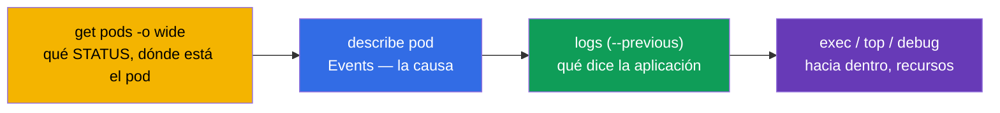
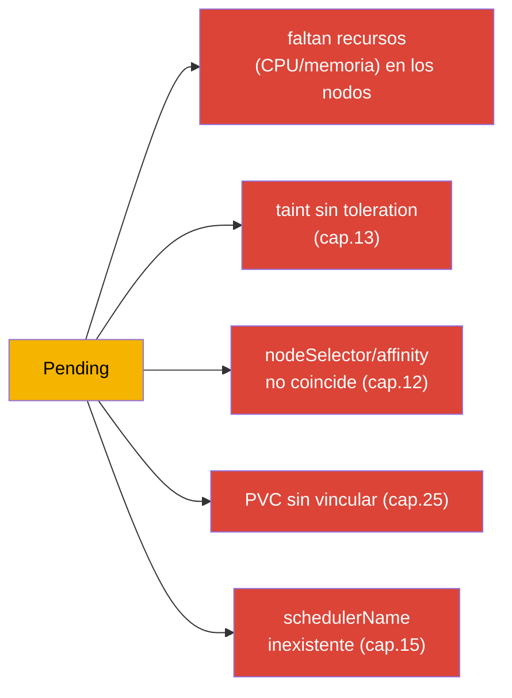
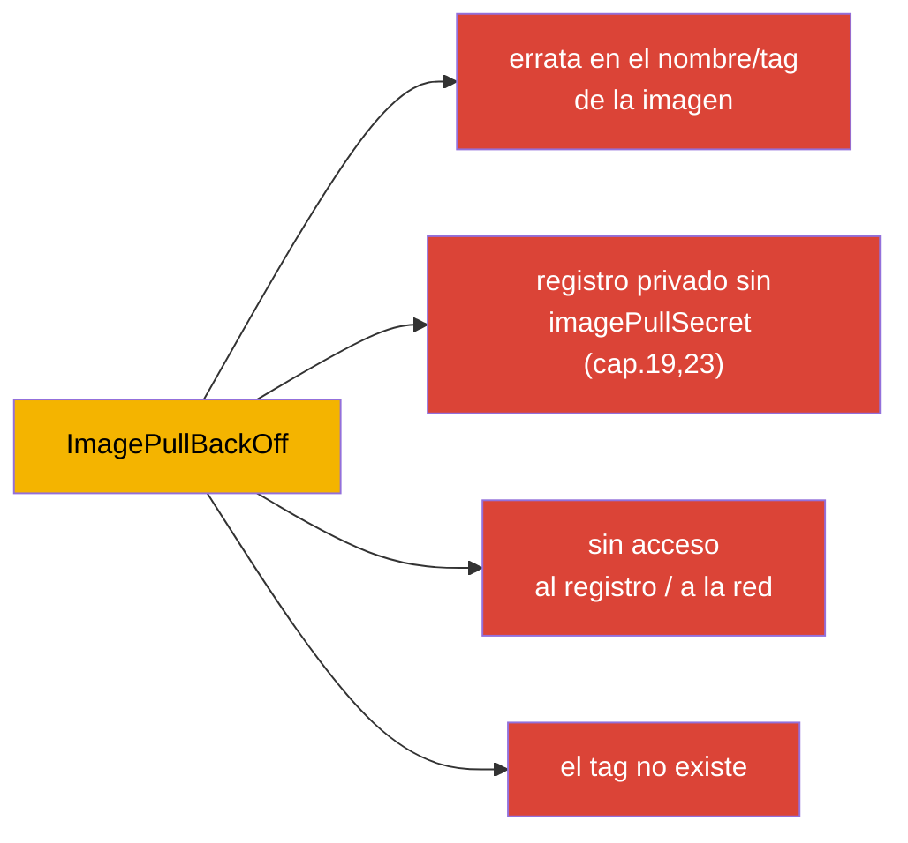
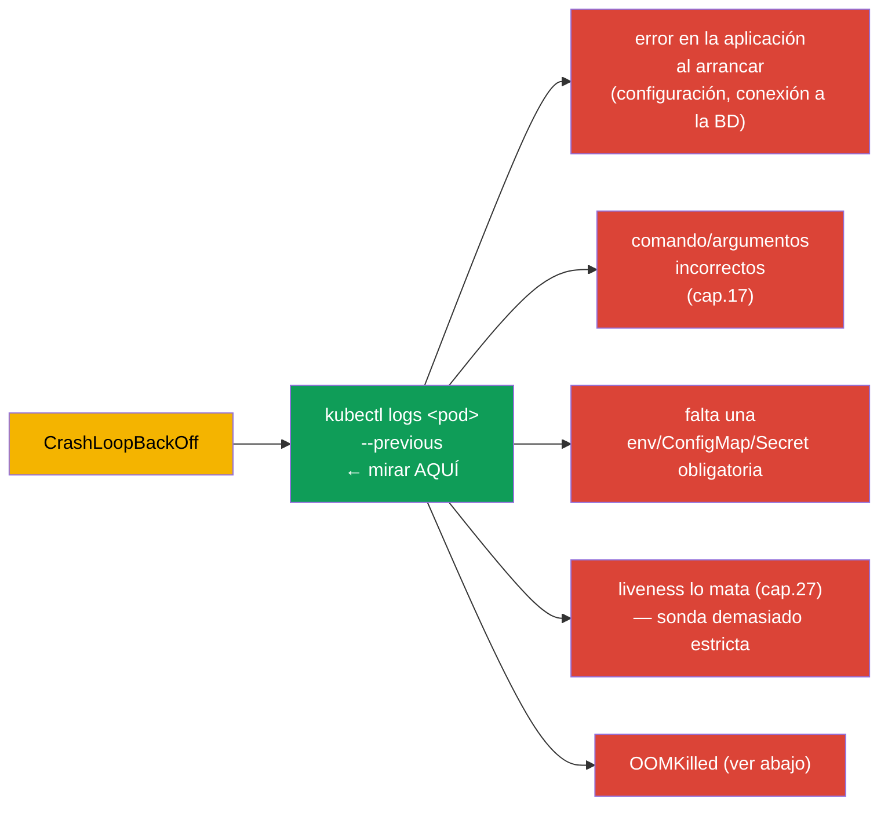
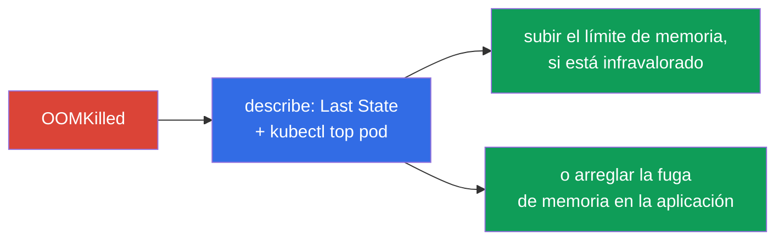
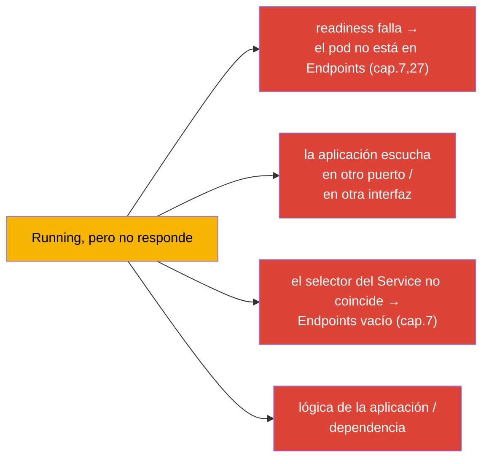
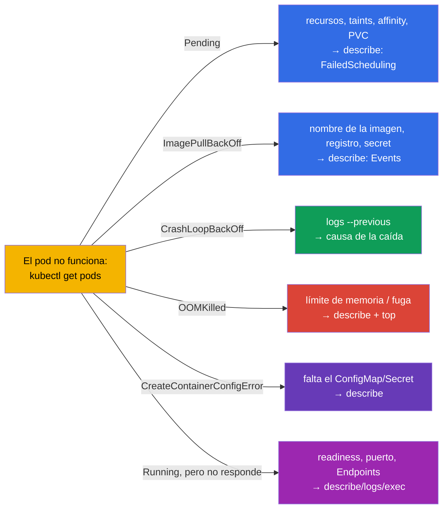

[Русская версия](ru.md) · [Eng version](README.md) · [Version française](fr.md) · [Deutsche Version](de.md) · [ქართული ვერსია](ge.md)

# Capítulo 44. Depuración de fallos de aplicaciones

> 🟦 **Capítulo para CKA** (dominio Troubleshooting - 30%, el más grande). Las habilidades sirven también para
> CKAD (Observability).
>
> **Qué viene ahora.** Empezamos la parte 9 - troubleshooting, el dominio de mayor peso del CKA. Ya
> hemos reunido las herramientas (capítulos 4, 28, 29); ahora sistematizamos el análisis de fallos a nivel de
> **aplicación**: por qué un pod no arranca, se cae o no responde. Daremos árboles de decisión claros
> para cada STATUS típico. La depuración del clúster (control plane, nodos) y de la red las
> veremos en los capítulos 45-46.

## 44.1. Algoritmo universal

Cualquier análisis de un fallo de aplicación sigue la misma ruta (recordemos el capítulo 29):

El STATUS marca de inmediato la rama del análisis. Veamos cada caso típico por separado.

## 44.2. Pending: el pod no está planificado

`Pending` significa: el pod fue aceptado, pero el planificador no puede colocarlo en un nodo. Miramos
`describe` → Events (`FailedScheduling`).

| Causa | Cómo comprobar/arreglar |
|---------|----------------------|
| sin recursos | `kubectl top nodes`, `describe node`; bajar requests o añadir nodos |
| taint sin toleration | `describe node` (taints); añadir toleration o quitar el taint (cap.13) |
| nodeSelector/affinity | comparar las etiquetas de los nodos con las reglas del pod (cap.12) |
| PVC sin vincular | `kubectl get pvc` (¿Pending?); StorageClass/PV (cap.25-26) |
| sin nodos/schedulerName | revisar `schedulerName`, la existencia de nodos Ready |

## 44.3. ImagePullBackOff / ErrImagePull: la imagen no se descarga

El contenedor no puede descargar la imagen. La causa está en `describe` (Events: `Failed to pull image`).

Comprobación: el nombre exacto de la imagen y el tag, la presencia de `imagePullSecret` para un registro privado
(capítulo 19), la accesibilidad del registro. A menudo es simplemente una errata en `image:`.

## 44.4. CrashLoopBackOff: el contenedor se cae en bucle

El más frecuente e importante. El contenedor arranca y se cae de inmediato, Kubernetes lo reinicia con
un retardo creciente. **La clave son los logs del contenedor caído** (`--previous`, capítulo 28).

Algoritmo: `logs --previous` → entender en qué falla. Causas frecuentes: la aplicación no puede
conectarse a una dependencia, comando incorrecto (capítulo 17), falta un ConfigMap/Secret,
una sonda liveness demasiado estricta lo mata al arrancar (hace falta un startup probe, capítulo 27), o
exceso de memoria (OOMKilled).

## 44.5. OOMKilled: exceso de memoria

El contenedor fue matado por superar el límite de memoria (capítulo 14). Se ve en `describe`:
`Last State: Terminated, Reason: OOMKilled`.

Solución: comparar el consumo real (`kubectl top`) con el límite - o el límite está infravalorado
(subirlo), o la aplicación tiene una fuga (arreglar el código). Recordar (capítulo 14): la memoria es
un recurso no comprimible, por eso justamente lo matan en vez de ralentizarlo.

## 44.6. CreateContainerConfigError y similares

El contenedor no se crea porque no se encuentra el recurso al que hace referencia:

| STATUS | Causa |
|--------|---------|
| `CreateContainerConfigError` | falta el ConfigMap/Secret de `env`/`volume` (capítulos 18-19) |
| `CreateContainerError` | problema de configuración del contenedor (comando, montaje) |
| `RunContainerError` | error de arranque (permisos, punto de entrada) |

Comprobación: si existe el ConfigMap/Secret al que hace referencia el pod, en el mismo namespace;
si los nombres de las claves son correctos. `describe` indicará qué recurso falta.

## 44.7. Running, pero la aplicación no funciona

El pod está `Running` y `Ready`, pero las peticiones no pasan. Aquí el problema no está en el arranque, sino en el funcionamiento
o el acceso:

Orden: comprobar readiness (`describe` - si pasa), `kubectl logs`, entrar dentro
(`exec`) y comprobar si la aplicación escucha el puerto; revisar el Service y los Endpoints (capítulo 7).
`port-forward` directamente al pod ayuda a entender si el problema está en la aplicación o en el enrutamiento
(capítulo 29). La parte de red en detalle - capítulo 46.

## 44.8. Árbol de decisión resumido

Reunimos todo en un solo mapa «STATUS → dónde mirar»:

Vale la pena tener este mapa en la cabeza durante el examen - convierte el «algo no funciona» en
un siguiente paso concreto en segundos.

## 44.9. Cómo se aplica esto en producción

- **La misma ruta, mayor escala.** En producción el análisis va igual (STATUS → describe →
  logs → top/exec), pero los datos se toman de logs/métricas centralizados (capítulo 28), y no
  solo de `kubectl`. Las alertas suelen indicar directamente el tipo de problema (CrashLoopBackOff
  masivo, OOMKilled).
- **Causas frecuentes en producción por STATUS.** Tras un release: CrashLoopBackOff (bug/configuración),
  ImagePullBackOff (tag equivocado/sin acceso al registro), OOMKilled (límite infravalorado). Pending
  a menudo = falta de recursos del clúster o affinity/taints incorrectos - señal para el autoescalado
  de nodos.
- **Rollback rápido en vez de una depuración larga.** En producción, ante un release fallido, primero se hace rollback
  (`rollout undo`, capítulo 8; `helm rollback`, capítulo 42), restaurando el servicio, y el análisis
  de la causa se hace después - la disponibilidad es más importante.
- **Las sondas y los recursos previenen la mitad de los fallos.** Unas readiness/liveness correctas (capítulo
  27) y unos requests/limits right-sized (capítulo 14) eliminan clases enteras de incidentes (tráfico a
  un pod no listo, OOMKilled, reinicios en cascada).
- **Post-mortem y alertas.** Los fallos recurrentes se analizan de forma sistemática (root cause) en vez de
  apagarlos cada vez - y se configuran alertas sobre síntomas tempranos (aumento de reinicios, acercamiento
  al límite de memoria).

## 44.10. Mini-glosario

- **Pending** - el pod no está planificado (recursos/taints/affinity/PVC).
- **ImagePullBackOff/ErrImagePull** - no se consigue descargar la imagen.
- **CrashLoopBackOff** - el contenedor se cae en bucle; la clave es `logs --previous`.
- **OOMKilled** - matado por superar el límite de memoria.
- **CreateContainerConfigError** - falta el ConfigMap/Secret al que hace referencia el pod.
- **FailedScheduling** - evento del planificador en caso de Pending.
- **Events** - sección de `describe` con las causas.

## 44.11. Resumen del capítulo

- Ruta universal: `get pods` (STATUS) → `describe` (Events) → `logs --previous` →
  `top`/`exec`/`debug`. El STATUS marca la rama del análisis.
- Pending → describe/FailedScheduling: recursos, taints, affinity, PVC, schedulerName.
- ImagePullBackOff → nombre/tag de la imagen, imagePullSecret, acceso al registro.
- CrashLoopBackOff → `logs --previous`: error de arranque, comando, falta env/CM/Secret,
  liveness estricta, OOM.
- OOMKilled → describe (Last State) + top: límite de memoria infravalorado o fuga.
- CreateContainerConfigError → falta el ConfigMap/Secret.
- Running, pero no responde → readiness, puerto, Service/Endpoints, lógica; `port-forward`
  lo localiza.

## 44.12. Para qué sirve esto: en el examen y en el trabajo real

**En el examen (CKA).** Troubleshooting es el 30% del examen, y los fallos de aplicaciones son su gran
parte. El árbol «STATUS → siguiente paso» ahorra un tiempo valioso. Hay que aplicar de forma refleja
get→describe→logs(--previous)→top/exec y conocer las causas de cada STATUS. Es también el
núcleo de Observability en CKAD.

**En el trabajo real.** Localizar rápido un fallo de aplicación es una habilidad diaria de quien está de guardia.
El árbol de decisión y la combinación logs+eventos+métricas aceleran el análisis de incidentes, y la prevención
(sondas, right-sizing, rollbacks) elimina clases enteras de problemas. El post-mortem en vez de
apagar fuegos distingue a una operación madura.

## 44.13. Preguntas de autocomprobación

1. Describe la ruta universal de depuración. ¿Qué marca la rama del análisis?
2. ¿Qué causas tiene Pending y cómo se comprueba cada una?
3. ¿Dónde mirar en caso de ImagePullBackOff?
4. ¿Por qué en CrashLoopBackOff lo principal es `logs --previous`? Nombra causas frecuentes.
5. ¿Cómo distinguir y resolver OOMKilled?
6. ¿Qué provoca CreateContainerConfigError?
7. El pod está Running y Ready, pero no responde - ¿qué causas hay y cómo localizarlas?

## Práctica

Hemos sistematizado la depuración de aplicaciones. En el capítulo 45 subiremos al nivel del clúster -
análisis de fallos del control plane y de los nodos worker. La depuración de aplicaciones se practica en los laboratorios de
troubleshooting y en los exámenes simulados.

🧪 Laboratorio 114 (depuración de recursos rotos): [tasks/cka/labs/114](../../labs/114/README_ES.MD)

---
[Índice](../README_ES.md) · [Capítulo 43](../43/es.md) · [Capítulo 45](../45/es.md)
