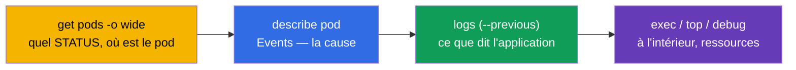
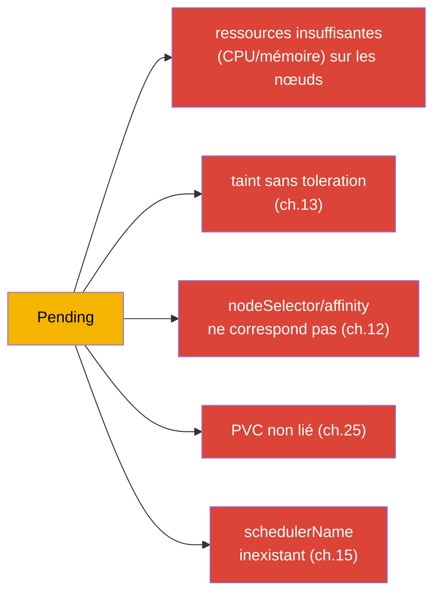
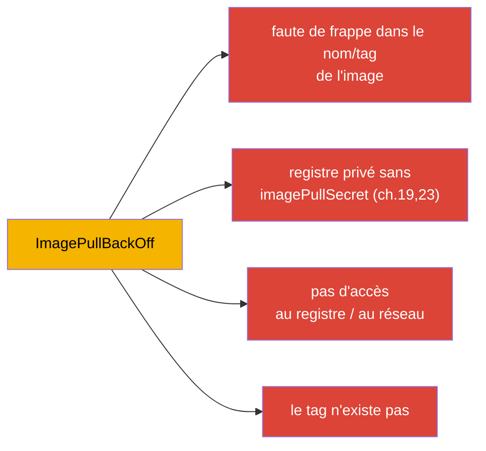
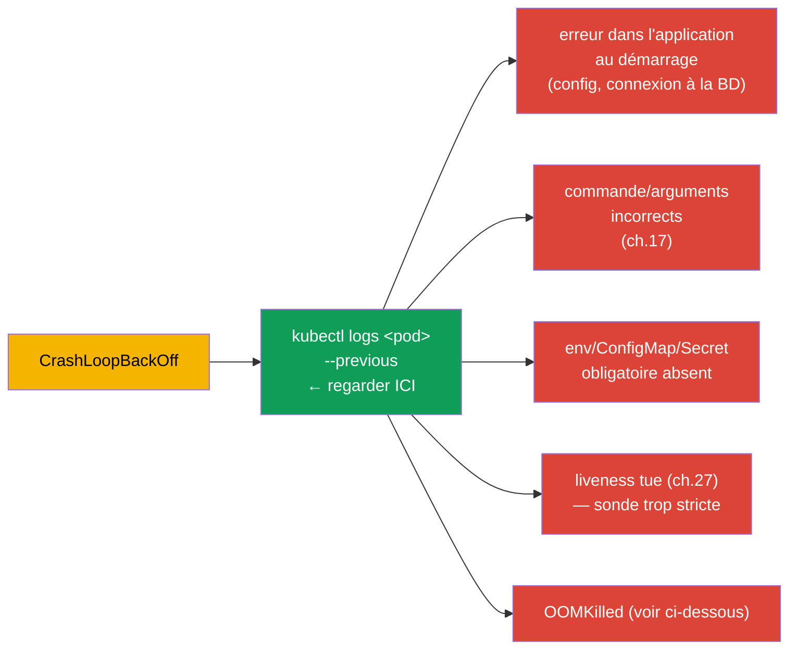
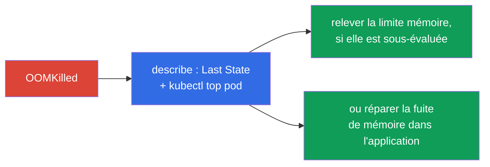
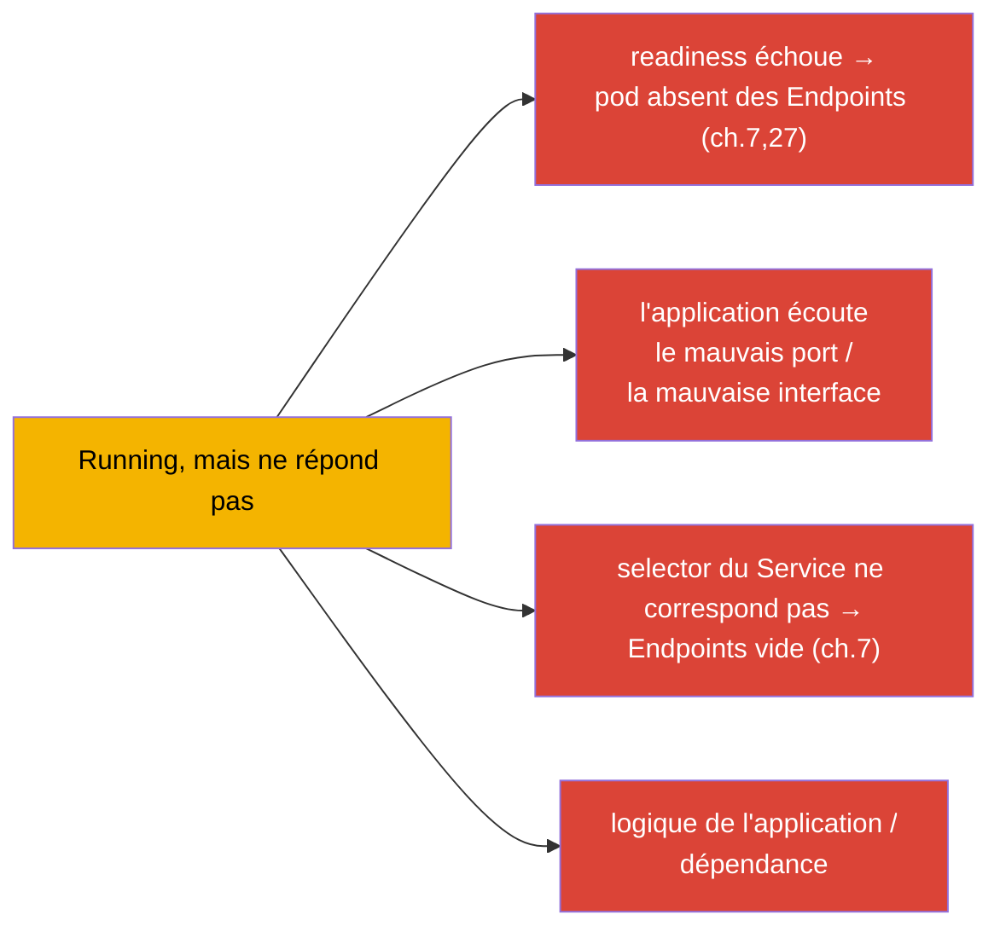
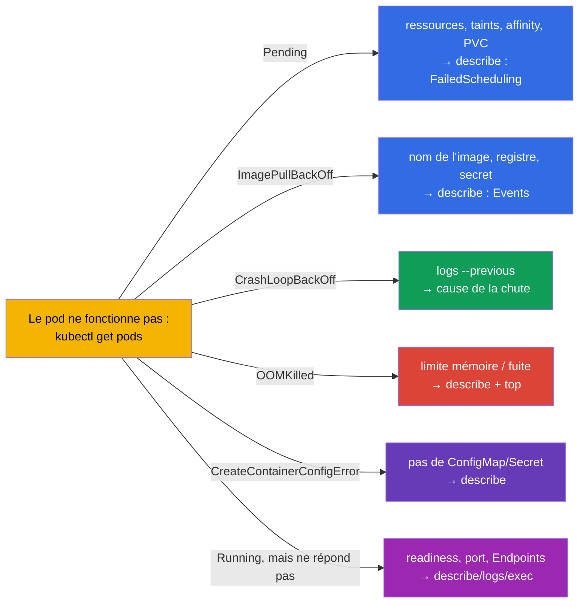

[Русская версия](ru.md) · [Eng version](README.md) · [Versión en español](es.md) · [Deutsche Version](de.md) · [ქართული ვერსია](ge.md) · [繁體中文版](tw.md) · [日本語版](jp.md)

# Chapitre 44. Déboguer les pannes d'applications

> 🟦 **Chapitre pour le CKA** (domaine Troubleshooting - 30%, le plus gros). Les compétences
> servent aussi pour le CKAD (Observability).
>
> **Ce qui suit.** On commence la partie 9 - le troubleshooting, le domaine le plus lourd du CKA.
> Nous avons déjà rassemblé les outils (chapitres 4, 28, 29) ; maintenant nous systématisons
> l'analyse des pannes au niveau de l'**application** : pourquoi un pod ne démarre pas, tombe, ne
> répond pas. Nous donnerons des arbres de décision clairs pour chaque STATUS typique. Le débogage
> du cluster (control plane, nœuds) et du réseau sera traité aux chapitres 45-46.

## 44.1. Algorithme universel

Toute analyse de panne applicative suit le même itinéraire (rappelons le chapitre 29) :

Le STATUS donne immédiatement la branche d'analyse. Voyons chaque cas typique séparément.

## 44.2. Pending : le pod n'est pas planifié

`Pending` signifie : le pod est accepté, mais le planificateur ne peut pas le placer sur un nœud. On
regarde `describe` → Events (`FailedScheduling`).

| Cause | Comment vérifier/réparer |
|---------|----------------------|
| pas de ressources | `kubectl top nodes`, `describe node` ; baisser les requests ou ajouter des nœuds |
| taint sans toleration | `describe node` (taints) ; ajouter une toleration ou retirer le taint (ch.13) |
| nodeSelector/affinity | comparer les labels des nœuds et les règles du pod (ch.12) |
| PVC non lié | `kubectl get pvc` (Pending ?) ; StorageClass/PV (ch.25-26) |
| pas de nœuds/schedulerName | vérifier `schedulerName`, la présence de nœuds Ready |

## 44.3. ImagePullBackOff / ErrImagePull : l'image ne se télécharge pas

Le conteneur ne peut pas télécharger l'image. Cause dans `describe` (Events : `Failed to pull image`).

Vérification : le nom exact de l'image et le tag, un `imagePullSecret` pour un registre privé
(chapitre 19), l'accessibilité du registre. Souvent c'est juste une faute de frappe dans `image:`.

## 44.4. CrashLoopBackOff : le conteneur tombe en boucle

Le plus fréquent et important. Le conteneur démarre et tombe aussitôt, Kubernetes le redémarre
avec un délai croissant. **La clé - les logs du conteneur tombé** (`--previous`, chapitre 28).

Algorithme : `logs --previous` → comprendre sur quoi ça tombe. Causes fréquentes : l'application
n'arrive pas à se connecter à une dépendance, commande incorrecte (chapitre 17), ConfigMap/Secret
manquant, sonde liveness trop stricte qui tue au démarrage (il faut une startup probe, chapitre 27),
ou dépassement de mémoire (OOMKilled).

## 44.5. OOMKilled : dépassement de mémoire

Le conteneur est tué pour dépassement de la limite mémoire (chapitre 14). Visible dans `describe` :
`Last State: Terminated, Reason: OOMKilled`.

Solution : comparer la consommation réelle (`kubectl top`) avec la limite - soit la limite est
sous-évaluée (la relever), soit l'application a une fuite (réparer le code). Se rappeler (chapitre
14) : la mémoire est une ressource incompressible, c'est pourquoi on tue au lieu de ralentir.

## 44.6. CreateContainerConfigError et similaires

Le conteneur n'est pas créé parce qu'une ressource qu'il référence est introuvable :

| STATUS | Cause |
|--------|---------|
| `CreateContainerConfigError` | pas de ConfigMap/Secret venant de `env`/`volume` (chapitres 18-19) |
| `CreateContainerError` | problème de configuration du conteneur (commande, montage) |
| `RunContainerError` | erreur de lancement (droits, point d'entrée) |

Vérification : le ConfigMap/Secret référencé par le pod existe-t-il, dans le même namespace ; les
noms des clés sont-ils corrects. `describe` indiquera quelle ressource manque.

## 44.7. Running, mais l'application ne fonctionne pas

Le pod est `Running` et `Ready`, mais les requêtes ne passent pas. Ici le problème n'est pas au
démarrage, mais dans le fonctionnement ou l'accès :

Ordre : vérifier la readiness (`describe` - passe-t-elle), `kubectl logs`, entrer à l'intérieur
(`exec`) et vérifier si l'application écoute le port ; vérifier le Service et les Endpoints
(chapitre 7). `port-forward` directement sur le pod aide à comprendre si le problème est dans
l'application ou dans le routage (chapitre 29). La partie réseau en détail - chapitre 46.

## 44.8. Arbre de décision récapitulatif

On rassemble tout dans une seule carte « STATUS → où regarder » :

Cette carte vaut la peine d'être gardée en tête à l'examen - elle transforme « quelque chose ne
marche pas » en une prochaine étape concrète en quelques secondes.

## 44.9. Comment cela s'applique en production

- **Le même itinéraire, à plus grande échelle.** En prod l'analyse se fait pareil (STATUS →
  describe → logs → top/exec), mais les données viennent des logs/métriques centralisés (chapitre
  28), et pas seulement de `kubectl`. Les alertes indiquent souvent directement le type de problème
  (CrashLoopBackOff massif, OOMKilled).
- **Causes de prod fréquentes par STATUS.** Après une release : CrashLoopBackOff (bug/config),
  ImagePullBackOff (mauvais tag/pas d'accès au registre), OOMKilled (limite sous-évaluée). Pending
  vaut souvent = manque de ressources du cluster ou affinity/taints incorrects - un signal pour
  l'autoscaling des nœuds.
- **Rollback rapide plutôt que long débogage.** En prod, sur une release défaillante, on fait
  d'abord un rollback (`rollout undo`, chapitre 8 ; `helm rollback`, chapitre 42) pour rétablir le
  service, et l'analyse de la cause vient après - la disponibilité passe avant.
- **Sondes et ressources évitent la moitié des pannes.** Des readiness/liveness correctes (chapitre
  27) et des requests/limits bien dimensionnés (chapitre 14) suppriment des classes entières
  d'incidents (trafic vers un pod non prêt, OOMKilled, redémarrages en cascade).
- **Post-mortem et alertes.** Les pannes récurrentes s'analysent systématiquement (root cause) au
  lieu d'être éteintes chaque fois - et on configure des alertes sur les symptômes précoces
  (hausse des redémarrages, approche de la limite mémoire).

## 44.10. Mini-glossaire

- **Pending** - le pod n'est pas planifié (ressources/taints/affinity/PVC).
- **ImagePullBackOff/ErrImagePull** - impossible de télécharger l'image.
- **CrashLoopBackOff** - le conteneur tombe en boucle ; la clé - `logs --previous`.
- **OOMKilled** - tué pour dépassement de la limite mémoire.
- **CreateContainerConfigError** - pas de ConfigMap/Secret référencé par le pod.
- **FailedScheduling** - événement du planificateur en cas de Pending.
- **Events** - section de `describe` avec les causes.

## 44.11. Bilan du chapitre

- Itinéraire universel : `get pods` (STATUS) → `describe` (Events) → `logs --previous` →
  `top`/`exec`/`debug`. Le STATUS donne la branche d'analyse.
- Pending → describe/FailedScheduling : ressources, taints, affinity, PVC, schedulerName.
- ImagePullBackOff → nom/tag de l'image, imagePullSecret, accès au registre.
- CrashLoopBackOff → `logs --previous` : erreur de démarrage, commande, pas d'env/CM/Secret,
  liveness stricte, OOM.
- OOMKilled → describe (Last State) + top : limite mémoire sous-évaluée ou fuite.
- CreateContainerConfigError → ConfigMap/Secret absent.
- Running, mais ne répond pas → readiness, port, Service/Endpoints, logique ; `port-forward`
  localise.

## 44.12. À quoi cela sert : à l'examen et dans le travail réel

**À l'examen (CKA).** Le troubleshooting - 30% de l'examen, et les pannes d'applications en sont une
grande part. L'arbre « STATUS → étape suivante » économise un temps précieux. Il faut appliquer par
réflexe get→describe→logs(--previous)→top/exec et connaître les causes de chaque STATUS. C'est aussi
le cœur de l'Observability au CKAD.

**Dans le travail réel.** La localisation rapide d'une panne applicative est une compétence
quotidienne de l'astreinte. L'arbre de décision et le trio logs+événements+métriques accélèrent
l'analyse des incidents, et la prévention (sondes, right-sizing, rollbacks) supprime des classes
entières de problèmes. Le post-mortem au lieu du pompier distingue une exploitation mature.

## 44.13. Questions d'auto-évaluation

1. Décrivez l'itinéraire universel de débogage. Qu'est-ce qui donne la branche d'analyse ?
2. Quelles sont les causes de Pending et comment vérifier chacune ?
3. Où regarder en cas d'ImagePullBackOff ?
4. Pourquoi, en cas de CrashLoopBackOff, l'essentiel est-il `logs --previous` ? Citez les causes fréquentes.
5. Comment reconnaître et corriger un OOMKilled ?
6. Qu'est-ce qui provoque CreateContainerConfigError ?
7. Un pod est Running et Ready, mais ne répond pas - quelles causes et comment localiser ?

## Pratique

Nous avons systématisé le débogage des applications. Au chapitre 45 nous monterons au niveau du
cluster - analyse des pannes du control plane et des nœuds worker. Le débogage des applications se
travaille dans les TP de troubleshooting et les examens blancs.

🧪 TP 114 (débogage de ressources cassées) : [tasks/cka/labs/114](../../labs/114/README_FR.MD)

---
[Sommaire](../README_FR.md) · [Chapitre 43](../43/fr.md) · [Chapitre 45](../45/fr.md)
