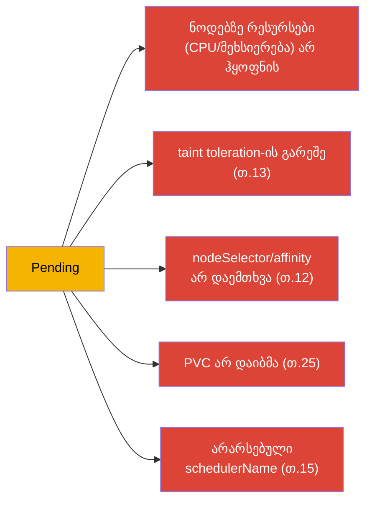
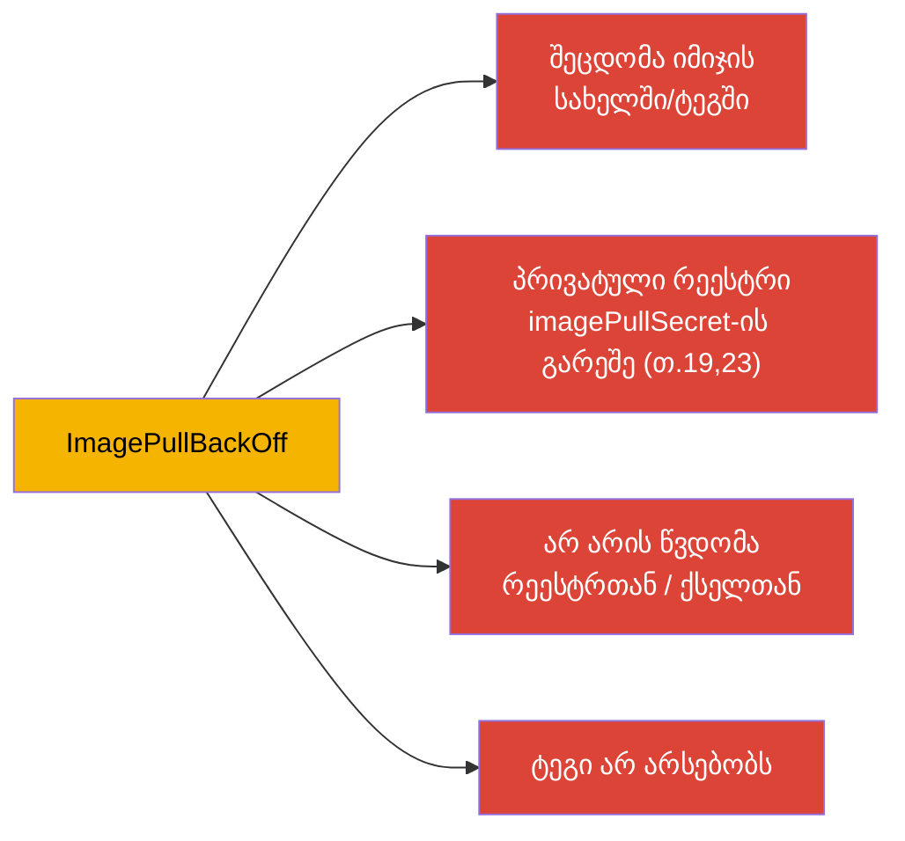
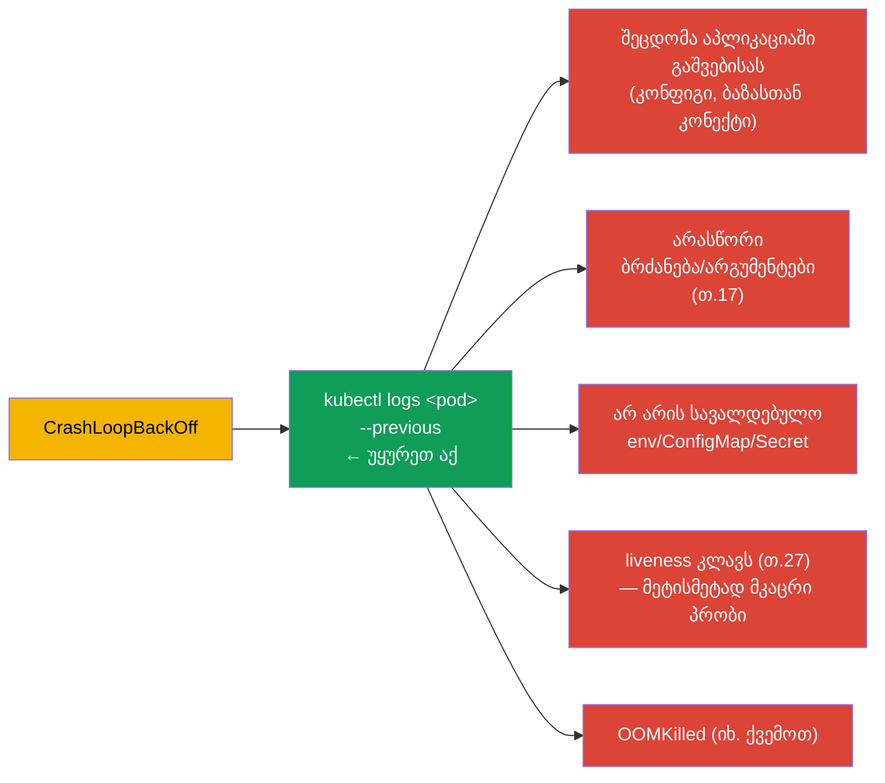
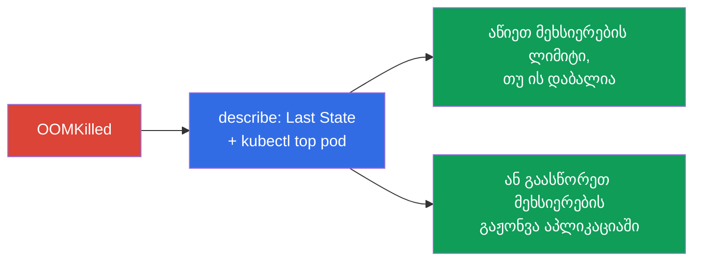
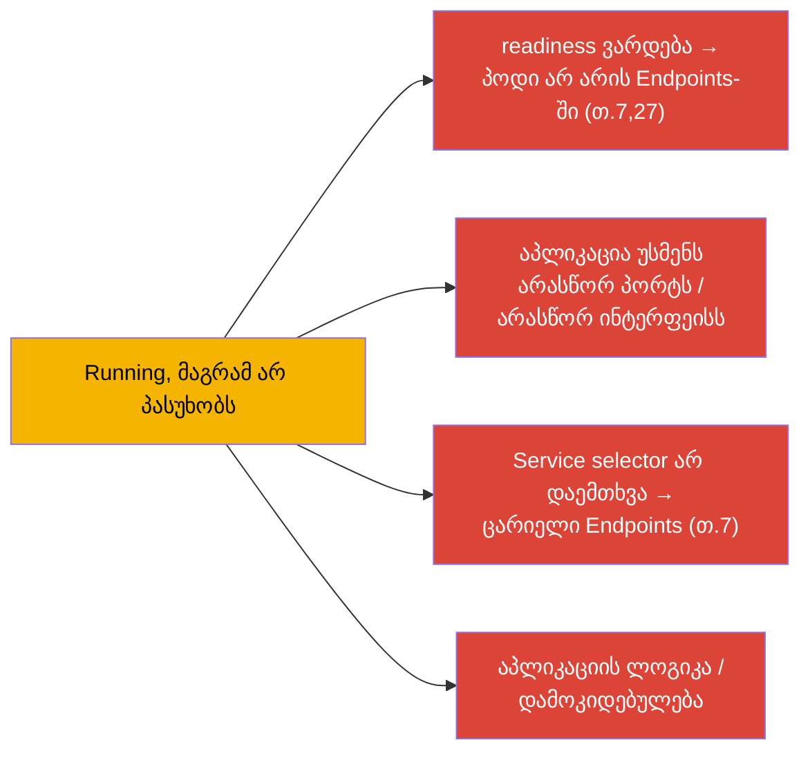
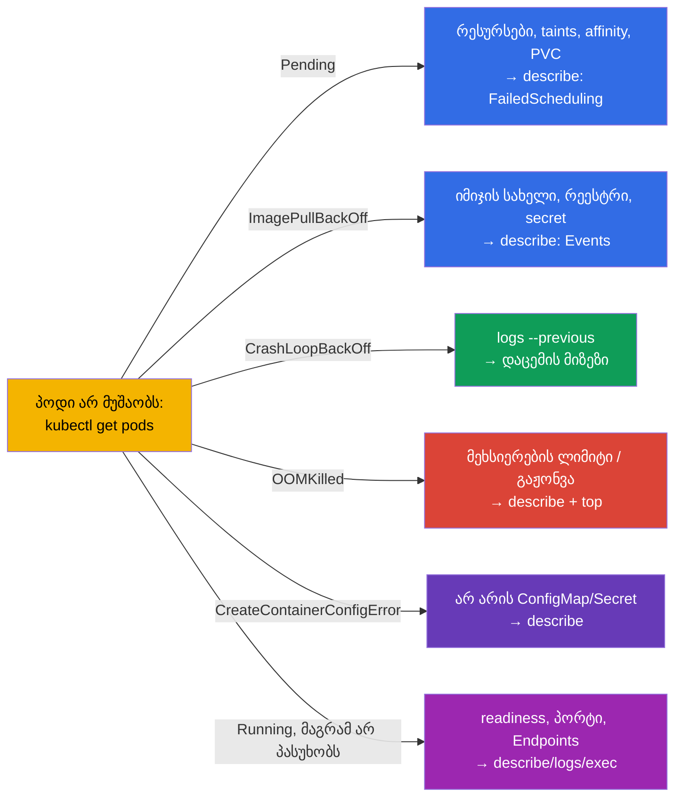

[Русская версия](ru.md) · [Eng version](README.md) · [Versión en español](es.md) · [Version française](fr.md) · [Deutsche Version](de.md)

# თავი 44. აპლიკაციების ავარიების გამართვა

> 🟦 **თავი CKA-სთვის** (დომენი Troubleshooting - 30%, ყველაზე დიდი). უნარები სასარგებლოა
> CKAD-სთვისაც (Observability).
>
> **რა იქნება შემდეგ.** ვიწყებთ ნაწილ 9-ს - troubleshooting, CKA-ის ყველაზე წონიან დომენს. ჩვენ უკვე
> შევკრიბეთ ინსტრუმენტები (თავები 4, 28, 29); ახლა სისტემატიზაციას გავუკეთებთ ავარიების განხილვას
> **აპლიკაციის** დონეზე: რატომ არ ეშვება პოდი, ვარდება, არ პასუხობს. მოვცემთ მკაფიო გადაწყვეტილებების
> ხეებს ყოველი ტიპური STATUS-ისთვის. კლასტერის (control plane, ნოდები) და ქსელის გამართვას
> თავებში 45-46 განვიხილავთ.

## 44.1. უნივერსალური ალგორითმი

აპლიკაციის ავარიის ნებისმიერი განხილვა ერთი და იმავე მარშრუტით მიდის (გავიხსენოთ თავი 29):

STATUS მაშინვე განსაზღვრავს განხილვის შტოს. თითოეულ ტიპურს ცალ-ცალკე განვიხილავთ.

## 44.2. Pending: პოდი არ დაიგეგმა

`Pending` ნიშნავს: პოდი მიღებულია, მაგრამ დამგეგმავს მისი ნოდაზე განთავსება არ შეუძლია. ვუყურებთ
`describe` → Events (`FailedScheduling`).

| მიზეზი | როგორ შევამოწმოთ/გავასწოროთ |
|---------|----------------------|
| რესურსები არ არის | `kubectl top nodes`, `describe node`; შეამცირეთ requests ან დაამატეთ ნოდები |
| taint toleration-ის გარეშე | `describe node` (taints); დაამატეთ toleration ან მოხსენით taint (თ.13) |
| nodeSelector/affinity | შეადარეთ ნოდების ლეიბლები და პოდის წესები (თ.12) |
| PVC არ დაიბმა | `kubectl get pvc` (Pending?); StorageClass/PV (თ.25-26) |
| ნოდები/schedulerName არ არის | შეამოწმეთ `schedulerName`, Ready-ნოდების არსებობა |

## 44.3. ImagePullBackOff / ErrImagePull: იმიჯი არ ჩამოიწევა

კონტეინერს იმიჯის ჩამოტვირთვა არ შეუძლია. მიზეზი - `describe`-ში (Events: `Failed to pull image`).

შემოწმება: იმიჯის ზუსტი სახელი და ტეგი, `imagePullSecret`-ის არსებობა პრივატული რეესტრისთვის
(თავი 19), რეესტრის ხელმისაწვდომობა. ხშირად ეს უბრალოდ შეცდომაა `image:`-ში.

## 44.4. CrashLoopBackOff: კონტეინერი ციკლურად ვარდება

ყველაზე ხშირი და მნიშვნელოვანი. კონტეინერი იშვება და მაშინვე ვარდება, Kubernetes კი მას ხელახლა
უშვებს მზარდი დაყოვნებით. **გასაღები - დაცემული კონტეინერის ლოგები** (`--previous`, თავი 28).

ალგორითმი: `logs --previous` → გავიგოთ, რაზე ვარდება. ხშირი მიზეზები: აპლიკაციას არ შეუძლია
დამოკიდებულებასთან დაკავშირება, არასწორი ბრძანება (თავი 17), აკლია ConfigMap/Secret,
მეტისმეტად მკაცრი liveness-პრობი კლავს გაშვებისას (საჭიროა startup probe, თავი 27), ან
მეხსიერების გადაჭარბება (OOMKilled).

## 44.5. OOMKilled: მეხსიერების გადაჭარბება

კონტეინერი მოკლულია მეხსიერების ლიმიტის გადაჭარბებისთვის (თავი 14). ჩანს `describe`-ში:
`Last State: Terminated, Reason: OOMKilled`.

გადაწყვეტა: შეადარეთ რეალური მოხმარება (`kubectl top`) ლიმიტს - ან ლიმიტი დაბალია
(ასწიეთ), ან აპლიკაციაში გაჟონვაა (გაასწორეთ კოდი). გვახსოვდეს (თავი 14): მეხსიერება -
შეუკუმშავი რესურსია, ამიტომაც კლავენ და არა ანელებენ.

## 44.6. CreateContainerConfigError და მისთანები

კონტეინერი არ იქმნება, რადგან ვერ მოიძებნა რესურსი, რომელზეც ის მიუთითებს:

| STATUS | მიზეზი |
|--------|---------|
| `CreateContainerConfigError` | არ არის ConfigMap/Secret `env`/`volume`-იდან (თავები 18-19) |
| `CreateContainerError` | კონტეინერის კონფიგურაციის პრობლემა (ბრძანება, მონტირება) |
| `RunContainerError` | გაშვების შეცდომა (უფლებები, შესვლის წერტილი) |

შემოწმება: არსებობს თუ არა ConfigMap/Secret, რომელზეც პოდი მიუთითებს, იმავე namespace-ში;
სწორია თუ არა გასაღებების სახელები. `describe` მიუთითებს, რომელი რესურსი აკლია.

## 44.7. Running, მაგრამ აპლიკაცია არ მუშაობს

პოდი `Running` და `Ready`-ა, მაგრამ მოთხოვნები არ გადის. აქ პრობლემა გაშვებაში არაა, არამედ მუშაობაში
ან წვდომაში:

რიგი: შეამოწმეთ readiness (`describe` - გადის თუ არა), `kubectl logs`, შედით შიგნით
(`exec`) და შეამოწმეთ, უსმენს თუ არა აპლიკაცია პორტს; შეამოწმეთ Service და Endpoints (თავი 7).
`port-forward` პირდაპირ პოდზე ეხმარება გავიგოთ, პრობლემა აპლიკაციაშია თუ მარშრუტიზაციაში
(თავი 29). ქსელურ ნაწილს დეტალურად - თავი 46.

## 44.8. შემაჯამებელი გადაწყვეტილებების ხე

ყველაფერს ერთ რუკაში ვკრებთ: „STATUS → სად ვუყუროთ“:

ეს რუკა ღირს გამოცდაზე თავში გვქონდეს - ის „რაღაც არ მუშაობს“-ს წამებში აქცევს
კონკრეტულ შემდეგ ნაბიჯად.

## 44.9. როგორ იყენებენ ამას პროდაქშენში

- **იგივე მარშრუტი, უფრო დიდი მასშტაბი.** პროდში განხილვა ასევე მიდის (STATUS → describe →
  logs → top/exec), მაგრამ მონაცემებს ცენტრალიზებული ლოგებიდან/მეტრიკებიდან იღებენ (თავი 28), და არა
  მხოლოდ `kubectl`-იდან. ალერტები ხშირად პირდაპირ მიუთითებენ პრობლემის ტიპს (მასობრივი
  CrashLoopBackOff, OOMKilled).
- **ხშირი პროდ-მიზეზები STATUS-ის მიხედვით.** რელიზის შემდეგ: CrashLoopBackOff (ბაგი/კონფიგი),
  ImagePullBackOff (არასწორი ტეგი/არ არის წვდომა რეესტრთან), OOMKilled (დაბალი ლიმიტი). Pending
  ხშირად = კლასტერის რესურსების უკმარისობა ან არასწორი affinity/taints - სიგნალი ნოდების
  ავტოსკეილინგისკენ.
- **სწრაფი უკან დაბრუნება ხანგრძლივი გამართვის ნაცვლად.** პროდში ავარიული რელიზისას პირველად უკან აბრუნებენ
  (`rollout undo`, თავი 8; `helm rollback`, თავი 42), სერვისს აღადგენენ, ხოლო მიზეზის განხილვას
  მერე აკეთებენ - ხელმისაწვდომობა უფრო მნიშვნელოვანია.
- **პრობები და რესურსები ავარიების ნახევარს აღკვეთს.** კორექტული readiness/liveness (თავი
  27) და right-sized requests/limits (თავი 14) ინციდენტების მთელ კლასებს აშორებს (ტრაფიკი
  მოუმზადებელ პოდზე, OOMKilled, კასკადური რესტარტები).
- **Post-mortem და ალერტები.** განმეორებადი ავარიები სისტემურად განიხილება (root cause), და არა
  ყოველ ჯერზე ქრობა - და ალერტებს ადრეულ სიმპტომებზე აწყობენ (რესტარტების ზრდა, მეხსიერების
  ლიმიტთან მიახლოება).

## 44.10. მინი-ლექსიკონი

- **Pending** - პოდი არ დაიგეგმა (რესურსები/taints/affinity/PVC).
- **ImagePullBackOff/ErrImagePull** - იმიჯის ჩამოტვირთვა ვერ ხდება.
- **CrashLoopBackOff** - კონტეინერი ციკლურად ვარდება; გასაღები - `logs --previous`.
- **OOMKilled** - მოკლულია მეხსიერების ლიმიტის გადაჭარბებისთვის.
- **CreateContainerConfigError** - არ არის ConfigMap/Secret, რომელზეც პოდი მიუთითებს.
- **FailedScheduling** - დამგეგმავის მოვლენა Pending-ისას.
- **Events** - `describe`-ის სექცია მიზეზებით.

## 44.11. თავის შეჯამება

- უნივერსალური მარშრუტი: `get pods` (STATUS) → `describe` (Events) → `logs --previous` →
  `top`/`exec`/`debug`. STATUS განსაზღვრავს განხილვის შტოს.
- Pending → describe/FailedScheduling: რესურსები, taints, affinity, PVC, schedulerName.
- ImagePullBackOff → იმიჯის სახელი/ტეგი, imagePullSecret, წვდომა რეესტრთან.
- CrashLoopBackOff → `logs --previous`: გაშვების შეცდომა, ბრძანება, არ არის env/CM/Secret,
  მკაცრი liveness, OOM.
- OOMKilled → describe (Last State) + top: დაბალი მეხსიერების ლიმიტი ან გაჟონვა.
- CreateContainerConfigError → აკლია ConfigMap/Secret.
- Running, მაგრამ არ პასუხობს → readiness, პორტი, Service/Endpoints, ლოგიკა; `port-forward`
  ალოკალიზებს.

## 44.12. როგორ გამოგადგებათ: გამოცდაზე და რეალურ სამუშაოში

**გამოცდაზე (CKA).** Troubleshooting - გამოცდის 30%, და აპლიკაციების ავარიები - მისი დიდი
ნაწილი. ხე „STATUS → შემდეგი ნაბიჯი“ ძვირფას დროს ზოგავს. საჭიროა რეფლექსურად
გამოვიყენოთ get→describe→logs(--previous)→top/exec და ვიცოდეთ ყოველი STATUS-ის მიზეზები. ეს იგივე
Observability-ის ბირთვია CKAD-ზე.

**რეალურ სამუშაოში.** აპლიკაციის ავარიის სწრაფი ლოკალიზაცია - მორიგის ყოველდღიური უნარია.
გადაწყვეტილებების ხე და კავშირი ლოგები+მოვლენები+მეტრიკები აჩქარებს ინციდენტების განხილვას, ხოლო პროფილაქტიკა
(პრობები, right-sizing, უკან დაბრუნებები) მთელ კლას პრობლემებს აშორებს. Post-mortem
ხანძრის ქრობის ნაცვლად მოწიფულ ექსპლუატაციას გამოარჩევს.

## 44.13. თვითშემოწმების კითხვები

1. აღწერეთ გამართვის უნივერსალური მარშრუტი. რა განსაზღვრავს განხილვის შტოს?
2. რომელი მიზეზები აქვს Pending-ს და როგორ შევამოწმოთ თითოეული?
3. სად ვუყუროთ ImagePullBackOff-ისას?
4. რატომ არის CrashLoopBackOff-ისას მთავარი `logs --previous`? დაასახელეთ ხშირი მიზეზები.
5. როგორ გამოვარჩიოთ და აღმოვფხვრათ OOMKilled?
6. რა იწვევს CreateContainerConfigError-ს?
7. პოდი Running და Ready-ა, მაგრამ არ პასუხობს - რომელი მიზეზებია და როგორ ავალოკალიზოთ?

## პრაქტიკა

ჩვენ სისტემატიზაცია გავუკეთეთ აპლიკაციების გამართვას. თავ 45-ში კლასტერის დონეზე ავმაღლდებით -
control plane-ისა და worker-ნოდების ავარიების განხილვა. აპლიკაციების გამართვა მუშავდება
troubleshooting-ის ლაბორატორიულებსა და მოკ-გამოცდებში.

🧪 ლაბი 114 (გატეხილი რესურსების გამართვა): [tasks/cka/labs/114](../../labs/114/README_GE.MD)

---
[სარჩევი](../README_GE.md) · [თავი 43](../43/ge.md) · [თავი 45](../45/ge.md)
