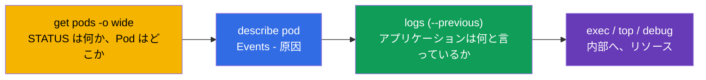
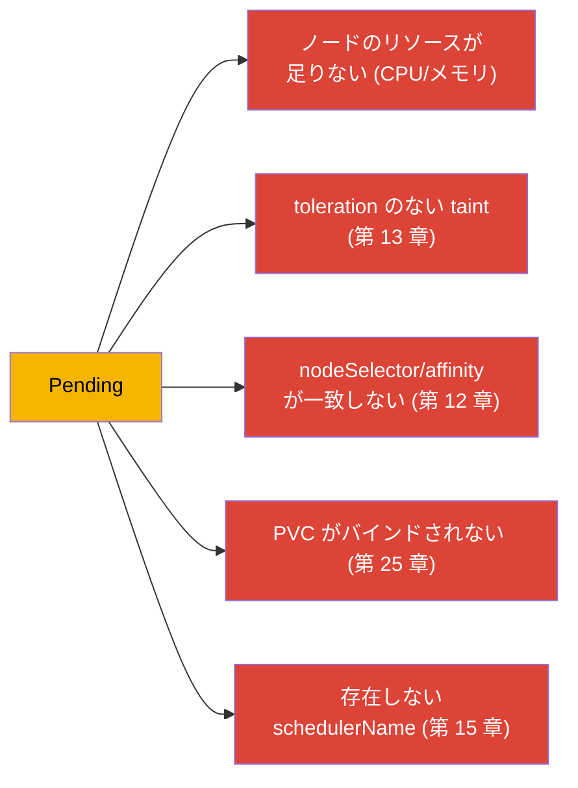
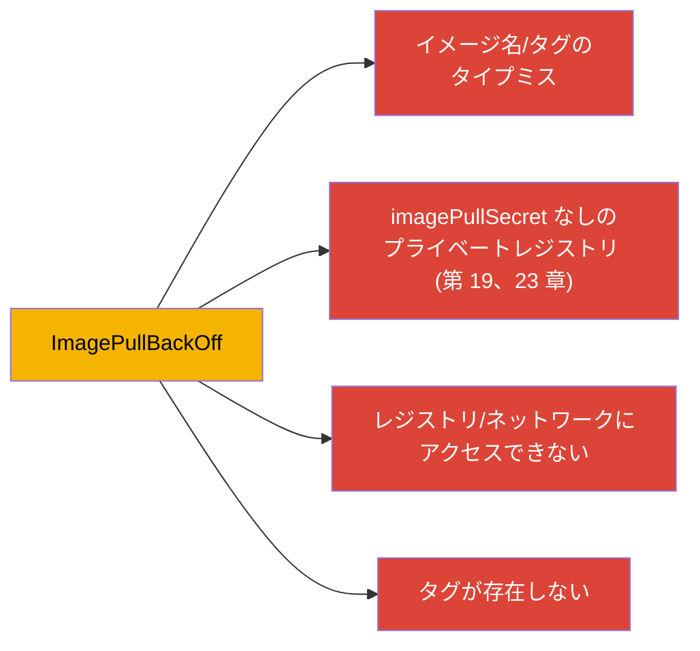
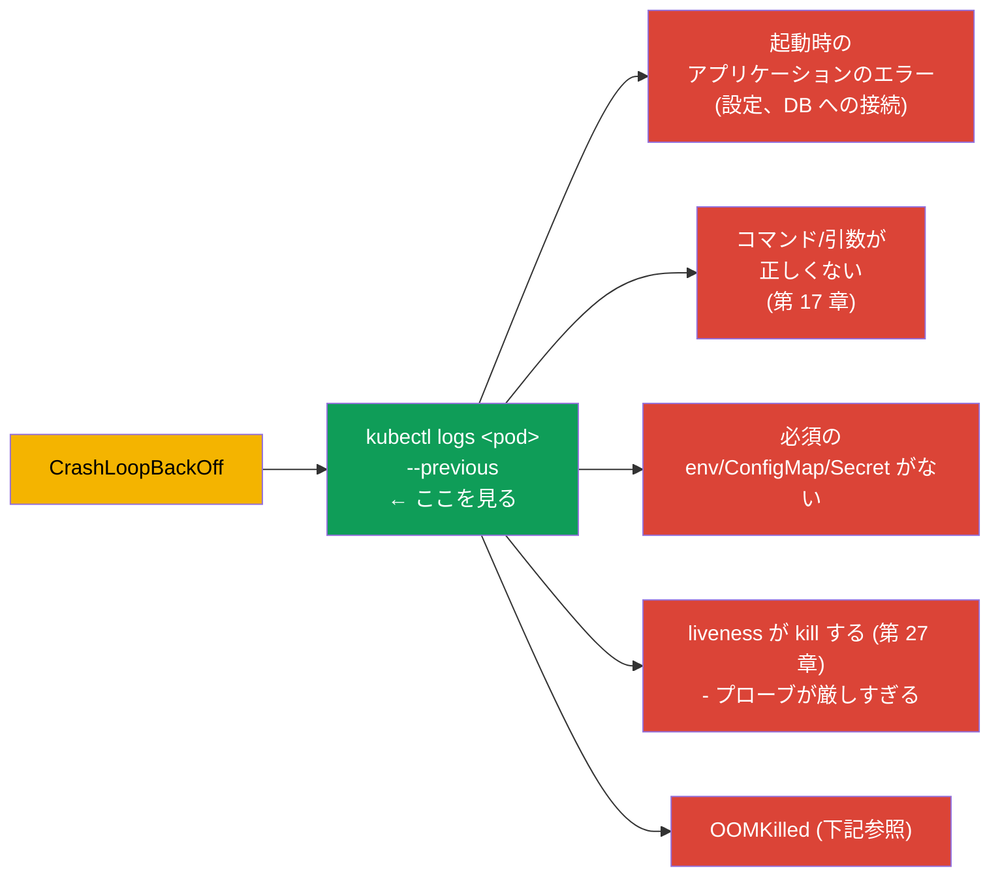
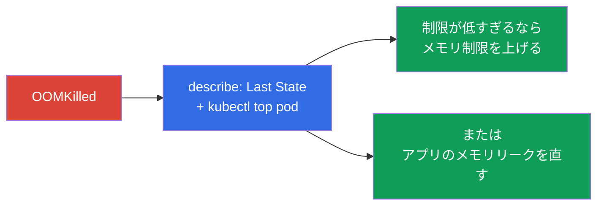
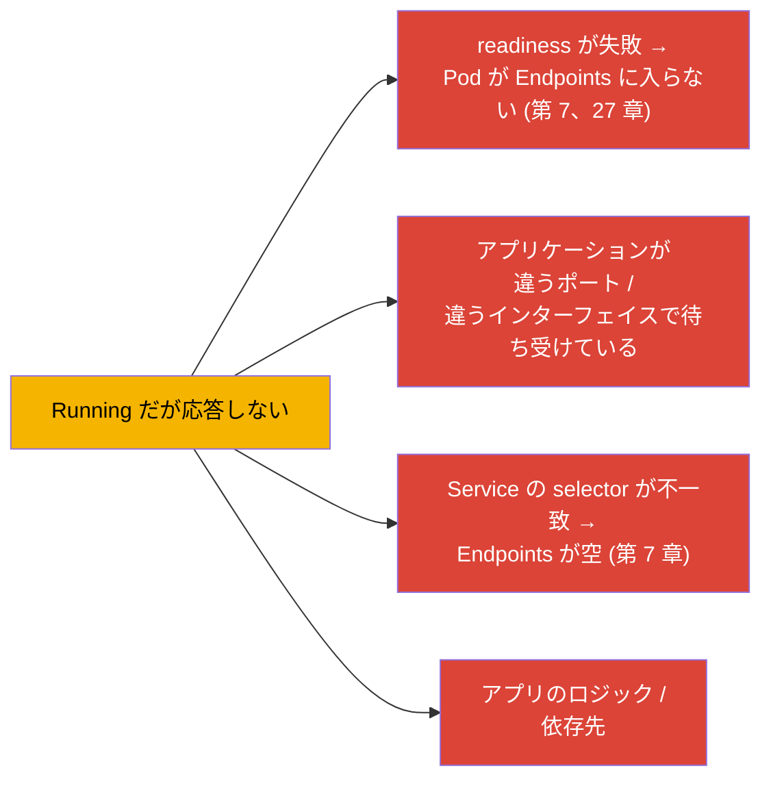
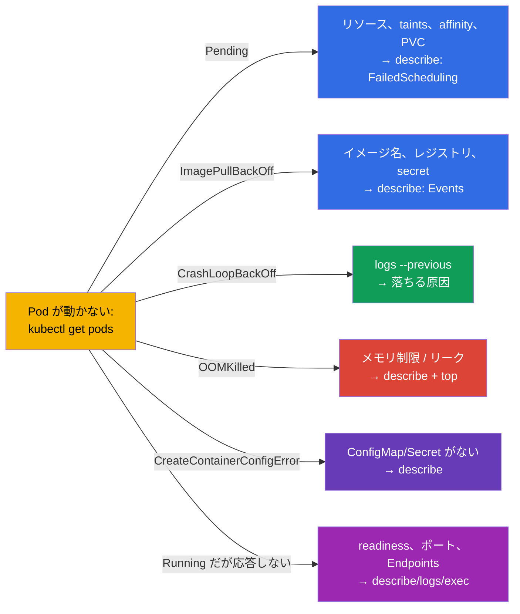

[Русская версия](ru.md) · [Eng version](README.md) · [Versión en español](es.md) · [Version française](fr.md) · [Deutsche Version](de.md) · [ქართული ვერსია](ge.md) · [繁體中文版](tw.md)

# 第 44 章。アプリケーション障害のデバッグ

> 🟦 **CKA 向けの章**（Troubleshooting 領域 - 30%、もっとも大きい）。このスキルは
> CKAD (Observability) にも役立ちます。
>
> **次に何をするか。** パート 9 を始めます - troubleshooting、CKA でもっとも比重の
> 大きい領域です。道具はすでにそろえました（第 4、28、29 章）。ここからは
> **アプリケーション** のレベルでの障害分析を体系化します：なぜ Pod が起動しないのか、
> 落ちるのか、応答しないのか。典型的な STATUS ごとに明確な決定木を示します。
> クラスタ（control plane、ノード）とネットワークのデバッグは第 45-46 章で扱います。

## 44.1. 汎用アルゴリズム

アプリケーション障害の分析は、どれも同じ道筋をたどります（第 29 章を思い出しましょう）：

STATUS がそのまま分析の分岐を決めます。典型的なものをひとつずつ見ていきます。

## 44.2. Pending：Pod がスケジュールされない

`Pending` の意味はこうです：Pod は受け付けられたが、スケジューラがそれをノードに
配置できない。`describe` → Events (`FailedScheduling`) を見ます。

| 原因 | どう確認し、どう直すか |
|---------|----------------------|
| リソース不足 | `kubectl top nodes`、`describe node`。requests を下げるかノードを追加する |
| toleration のない taint | `describe node` (taints)。toleration を追加するか taint を外す（第 13 章） |
| nodeSelector/affinity | ノードのラベルと Pod のルールを突き合わせる（第 12 章） |
| PVC がバインドされない | `kubectl get pvc`（Pending か？）、StorageClass/PV（第 25-26 章） |
| ノードなし/schedulerName | `schedulerName` と Ready なノードの有無を確認する |

## 44.3. ImagePullBackOff / ErrImagePull：イメージが取得できない

コンテナがイメージをダウンロードできません。原因は `describe` にあります
(Events: `Failed to pull image`)。

確認すること：イメージ名とタグが正確か、プライベートレジストリ用の
`imagePullSecret` があるか（第 19 章）、レジストリに到達できるか。多くの場合、
単に `image:` のタイプミスです。

## 44.4. CrashLoopBackOff：コンテナが繰り返し落ちる

もっとも頻繁で、もっとも重要なケースです。コンテナが起動してすぐ落ち、Kubernetes が
遅延を伸ばしながら再起動します。**鍵は落ちたコンテナのログ** です
(`--previous`、第 28 章)。

手順：`logs --previous` → 何で落ちているのかを把握する。よくある原因は、
アプリケーションが依存先に接続できない、コマンドが正しくない（第 17 章）、
ConfigMap/Secret が存在しない、厳しすぎる liveness プローブが起動時に kill している
（startup probe が必要、第 27 章）、あるいはメモリの超過 (OOMKilled) です。

## 44.5. OOMKilled：メモリの超過

コンテナがメモリ制限の超過で kill されました（第 14 章）。`describe` に見えます：
`Last State: Terminated, Reason: OOMKilled`。

解決策：実際の消費量 (`kubectl top`) を制限と比べます - 制限が低すぎるか（上げる）、
アプリケーションにリークがあるか（コードを直す）のどちらかです。覚えておきましょう
（第 14 章）：メモリは圧縮できないリソースなので、遅くなるのではなく kill されるのです。

## 44.6. CreateContainerConfigError とその仲間

参照しているリソースが見つからないため、コンテナが作成されません：

| STATUS | 原因 |
|--------|---------|
| `CreateContainerConfigError` | `env`/`volume` で使う ConfigMap/Secret がない（第 18-19 章） |
| `CreateContainerError` | コンテナ設定の問題（コマンド、マウント） |
| `RunContainerError` | 起動時のエラー（権限、エントリポイント） |

確認すること：Pod が参照している ConfigMap/Secret が同じ namespace に存在するか、
キーの名前が正しいか。`describe` がどのリソースが足りないのかを示してくれます。

## 44.7. Running なのにアプリケーションが動かない

Pod は `Running` かつ `Ready` なのに、リクエストが通りません。ここでの問題は起動では
なく、動作やアクセスにあります：

順番：readiness を確認し (`describe` - 通っているか)、`kubectl logs` を見て、内部に
入り (`exec`) アプリケーションがポートで待ち受けているか確かめる。そして Service と
Endpoints を確認する（第 7 章）。Pod へ直接 `port-forward` すると、問題が
アプリケーション側かルーティング側かを切り分けられます（第 29 章）。
ネットワーク部分の詳細は第 46 章です。

## 44.8. 決定木のまとめ

すべてを 1 枚の「STATUS → どこを見るか」の地図にまとめます：

この地図は試験で頭に入れておく価値があります - 「何かが動かない」を数秒で具体的な
次の一手に変えてくれます。

## 44.9. 本番環境でこれをどう使うか

- **同じ道筋、より大きな規模で。** 本番でも分析の流れは同じです (STATUS → describe →
  logs → top/exec) が、データは `kubectl` だけからではなく、集約されたログ/メトリクス
  （第 28 章）から取ります。アラートが問題の種類を直接示してくれることも多いです
  （大量の CrashLoopBackOff、OOMKilled）。
- **STATUS ごとの本番でよくある原因。** リリース後：CrashLoopBackOff（バグ/設定）、
  ImagePullBackOff（タグ違い/レジストリにアクセスできない）、OOMKilled（制限が低い）。
  Pending はしばしばクラスタのリソース不足か、affinity/taints の誤りで、ノードの
  オートスケーリングのサインです。
- **長いデバッグより素早いロールバック。** 本番で不具合のあるリリースが出たときは、
  まずロールバックして (`rollout undo`、第 8 章。`helm rollback`、第 42 章)
  サービスを復旧させ、原因の分析はあとで行います - 可用性のほうが重要です。
- **プローブとリソースが障害の半分を防ぐ。** 正しい readiness/liveness（第 27 章）と
  right-sized な requests/limits（第 14 章）は、インシデントのクラスをまるごと
  取り除きます（準備できていない Pod へのトラフィック、OOMKilled、連鎖的な再起動）。
- **ポストモーテムとアラート。** 繰り返す障害は毎回消火するのではなく体系的に
  (root cause) 分析し、早期の兆候（再起動の増加、メモリ制限への接近）にアラートを
  設定します。

## 44.10. ミニ用語集

- **Pending** - Pod がスケジュールされていない（リソース/taints/affinity/PVC）。
- **ImagePullBackOff/ErrImagePull** - イメージをダウンロードできない。
- **CrashLoopBackOff** - コンテナが繰り返し落ちる。鍵は `logs --previous`。
- **OOMKilled** - メモリ制限の超過で kill された。
- **CreateContainerConfigError** - Pod が参照する ConfigMap/Secret がない。
- **FailedScheduling** - Pending のときのスケジューラのイベント。
- **Events** - 原因が書かれている `describe` のセクション。

## 44.11. 本章のまとめ

- 汎用の道筋：`get pods` (STATUS) → `describe` (Events) → `logs --previous` →
  `top`/`exec`/`debug`。STATUS が分析の分岐を決めます。
- Pending → describe/FailedScheduling：リソース、taints、affinity、PVC、schedulerName。
- ImagePullBackOff → イメージ名/タグ、imagePullSecret、レジストリへのアクセス。
- CrashLoopBackOff → `logs --previous`：起動時のエラー、コマンド、env/CM/Secret がない、
  厳しい liveness、OOM。
- OOMKilled → describe (Last State) + top：メモリ制限が低いか、リーク。
- CreateContainerConfigError → ConfigMap/Secret が存在しない。
- Running なのに応答しない → readiness、ポート、Service/Endpoints、ロジック。
  `port-forward` で切り分けられます。

## 44.12. これがどう役に立つか：試験と実際の仕事で

**試験では (CKA)。** Troubleshooting は試験の 30% で、アプリケーション障害はその大きな
部分を占めます。「STATUS → 次の一手」の木は貴重な時間を節約します。
get→describe→logs(--previous)→top/exec を反射的に使えて、各 STATUS の原因を知っている
必要があります。これは CKAD の Observability の中核でもあります。

**実際の仕事では。** アプリケーション障害を素早く切り分けるのは、オンコール担当の
日常のスキルです。決定木と「ログ + イベント + メトリクス」の組み合わせはインシデント
分析を速め、予防（プローブ、right-sizing、ロールバック）は問題のクラスをまるごと
取り除きます。消火活動ではなくポストモーテムを行うことが、成熟した運用の証です。

## 44.13. 自己チェックの質問

1. 汎用のデバッグの道筋を説明してください。分析の分岐を決めるのは何ですか？
2. Pending の原因にはどんなものがあり、それぞれどう確認しますか？
3. ImagePullBackOff のときはどこを見ますか？
4. CrashLoopBackOff で `logs --previous` が肝心なのはなぜですか？よくある原因を挙げてください。
5. OOMKilled はどう見分け、どう解消しますか？
6. CreateContainerConfigError を引き起こすのは何ですか？
7. Pod が Running かつ Ready なのに応答しない - どんな原因があり、どう切り分けますか？

## 演習

アプリケーションのデバッグを体系化しました。第 45 章ではクラスタのレベルに上がり、
control plane と worker ノードの障害分析を行います。アプリケーションのデバッグは
troubleshooting のラボと模擬試験で練習します。

🧪 ラボ 114（壊れたリソースのデバッグ）: [tasks/cka/labs/114](../../labs/114/README_JP.MD)

---
[目次](../README_JP.md) · [第 43 章](../43/jp.md) · [第 45 章](../45/jp.md)
