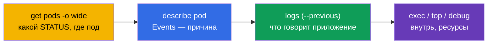
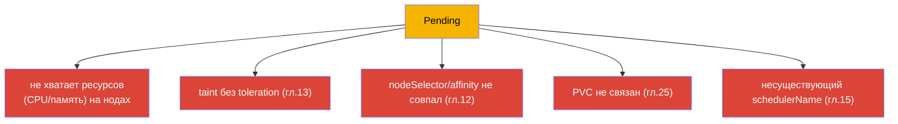
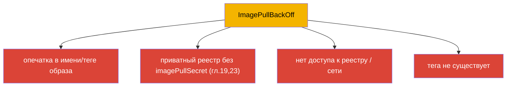
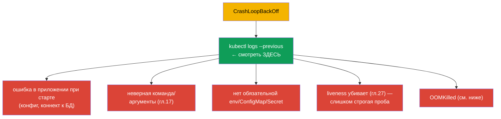
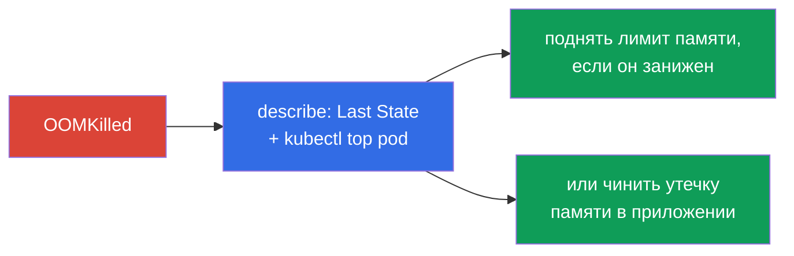
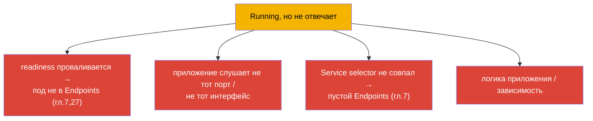
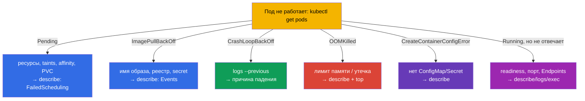

# Глава 44. Отладка сбоев приложений

> 🟦 **Глава для CKA** (домен Troubleshooting - 30%, самый большой). Навыки полезны и для
> CKAD (Observability).
>
> **Что дальше.** Начинаем часть 9 - troubleshooting, самый весомый домен CKA. Мы уже
> собрали инструменты (главы 4, 28, 29); теперь систематизируем разбор сбоев на уровне
> **приложения**: почему под не запускается, падает, не отвечает. Дадим чёткие деревья
> решений по каждому типовому STATUS. Отладку кластера (control plane, ноды) и сети
> разберём в главах 45-46.

## 44.1. Универсальный алгоритм

Любой разбор сбоя приложения идёт по одному маршруту (вспомним главу 29):

STATUS сразу задаёт ветку разбора. Разберём каждую типовую по отдельности.

## 44.2. Pending: под не запланирован

`Pending` значит: под принят, но планировщик не может поставить его на ноду. Смотрим
`describe` → Events (`FailedScheduling`).

| Причина | Как проверить/чинить |
|---------|----------------------|
| нет ресурсов | `kubectl top nodes`, `describe node`; снизить requests или добавить ноды |
| taint без toleration | `describe node` (taints); добавить toleration или снять taint (гл.13) |
| nodeSelector/affinity | сверить метки нод и правила пода (гл.12) |
| PVC не связан | `kubectl get pvc` (Pending?); StorageClass/PV (гл.25-26) |
| нет нод/schedulerName | проверить `schedulerName`, наличие Ready-нод |

## 44.3. ImagePullBackOff / ErrImagePull: образ не тянется

Контейнер не может скачать образ. Причина - в `describe` (Events: `Failed to pull image`).

Проверка: точное имя образа и тег, наличие `imagePullSecret` для приватного реестра
(глава 19), доступность реестра. Часто это просто опечатка в `image:`.

## 44.4. CrashLoopBackOff: контейнер циклически падает

Самый частый и важный. Контейнер стартует и сразу падает, Kubernetes перезапускает с
растущей задержкой. **Ключ - логи упавшего контейнера** (`--previous`, глава 28).

Алгоритм: `logs --previous` → понять, на чём падает. Частые причины: приложение не может
подключиться к зависимости, неверная команда (глава 17), отсутствует ConfigMap/Secret,
слишком строгая liveness-проба убивает при старте (нужен startup probe, глава 27), или
превышение памяти (OOMKilled).

## 44.5. OOMKilled: превышение памяти

Контейнер убит за превышение лимита памяти (глава 14). Видно в `describe`:
`Last State: Terminated, Reason: OOMKilled`.

Решение: сравнить реальное потребление (`kubectl top`) с лимитом - либо лимит занижен
(поднять), либо в приложении утечка (чинить код). Помнить (глава 14): память -
несжимаемый ресурс, поэтому именно убивают, а не тормозят.

## 44.6. CreateContainerConfigError и подобное

Контейнер не создаётся, потому что не найден ресурс, на который он ссылается:

| STATUS | Причина |
|--------|---------|
| `CreateContainerConfigError` | нет ConfigMap/Secret из `env`/`volume` (главы 18-19) |
| `CreateContainerError` | проблема конфигурации контейнера (команда, монтирование) |
| `RunContainerError` | ошибка запуска (права, точка входа) |

Проверка: существует ли ConfigMap/Secret, на который ссылается под, в том же namespace;
верны ли имена ключей. `describe` укажет, какого ресурса не хватает.

## 44.7. Running, но приложение не работает

Под `Running` и `Ready`, но запросы не проходят. Тут проблема не в запуске, а в работе
или доступе:

Порядок: проверить readiness (`describe` - проходит ли), `kubectl logs`, зайти внутрь
(`exec`) и проверить, слушает ли приложение порт; проверить Service и Endpoints (глава 7).
`port-forward` прямо на под помогает понять, в приложении проблема или в маршрутизации
(глава 29). Сетевую часть подробно - глава 46.

## 44.8. Сводное дерево решений

Собираем всё в одну карту «STATUS → куда смотреть»:

Эту карту стоит держать в голове на экзамене - она превращает «что-то не работает» в
конкретный следующий шаг за секунды.

## 44.9. Как это применяют в продакшене

- **Тот же маршрут, больший масштаб.** В проде разбор идёт так же (STATUS → describe →
  logs → top/exec), но данные берут из централизованных логов/метрик (глава 28), а не
  только из `kubectl`. Алерты часто прямо указывают тип проблемы (массовый
  CrashLoopBackOff, OOMKilled).
- **Частые прод-причины по STATUS.** После релиза: CrashLoopBackOff (баг/конфиг),
  ImagePullBackOff (не тот тег/нет доступа к реестру), OOMKilled (занижен лимит). Pending
  часто = нехватка ресурсов кластера или неверные affinity/taints - сигнал к автоскейлингу
  нод.
- **Быстрый откат вместо долгой отладки.** В проде при сбойном релизе сначала откатывают
  (`rollout undo`, глава 8; `helm rollback`, глава 42), восстанавливая сервис, а разбор
  причины делают потом - доступность важнее.
- **Пробы и ресурсы предотвращают половину сбоев.** Корректные readiness/liveness (глава
  27) и right-sized requests/limits (глава 14) убирают целые классы инцидентов (трафик на
  неготовый под, OOMKilled, каскадные рестарты).
- **Post-mortem и алерты.** Повторяющиеся сбои разбирают системно (root cause), а не
  тушат каждый раз - и настраивают алерты на ранние симптомы (рост рестартов, приближение
  к лимиту памяти).

## 44.10. Мини-глоссарий

- **Pending** - под не запланирован (ресурсы/taints/affinity/PVC).
- **ImagePullBackOff/ErrImagePull** - не удаётся скачать образ.
- **CrashLoopBackOff** - контейнер циклически падает; ключ - `logs --previous`.
- **OOMKilled** - убит за превышение лимита памяти.
- **CreateContainerConfigError** - нет ConfigMap/Secret, на который ссылается под.
- **FailedScheduling** - событие планировщика при Pending.
- **Events** - раздел `describe` с причинами.

## 44.11. Итоги главы

- Универсальный маршрут: `get pods` (STATUS) → `describe` (Events) → `logs --previous` →
  `top`/`exec`/`debug`. STATUS задаёт ветку разбора.
- Pending → describe/FailedScheduling: ресурсы, taints, affinity, PVC, schedulerName.
- ImagePullBackOff → имя/тег образа, imagePullSecret, доступ к реестру.
- CrashLoopBackOff → `logs --previous`: ошибка старта, команда, нет env/CM/Secret,
  строгая liveness, OOM.
- OOMKilled → describe (Last State) + top: занижен лимит памяти или утечка.
- CreateContainerConfigError → отсутствует ConfigMap/Secret.
- Running, но не отвечает → readiness, порт, Service/Endpoints, логика; `port-forward`
  локализует.

## 44.12. Как это пригодится: на экзамене и в реальной работе

**На экзамене (CKA).** Troubleshooting - 30% экзамена, и сбои приложений - его большая
часть. Дерево «STATUS → следующий шаг» экономит драгоценное время. Нужно рефлекторно
применять get→describe→logs(--previous)→top/exec и знать причины каждого STATUS. Это же
ядро Observability на CKAD.

**В реальной работе.** Быстрая локализация сбоя приложения - ежедневный навык дежурного.
Дерево решений и связка логи+события+метрики ускоряют разбор инцидентов, а профилактика
(пробы, right-sizing, откаты) убирает целые классы проблем. Post-mortem вместо
пожаротушения отличает зрелую эксплуатацию.

## 44.13. Вопросы для самопроверки

1. Опишите универсальный маршрут отладки. Что задаёт ветку разбора?
2. Какие причины Pending и как каждую проверить?
3. Куда смотреть при ImagePullBackOff?
4. Почему при CrashLoopBackOff главное - `logs --previous`? Назовите частые причины.
5. Как отличить и устранить OOMKilled?
6. Что вызывает CreateContainerConfigError?
7. Под Running и Ready, но не отвечает - какие причины и как локализовать?

## Практика

Мы систематизировали отладку приложений. В главе 45 поднимемся на уровень кластера -
разбор сбоев control plane и worker-нод. Отладка приложений отрабатывается в лабах по
troubleshooting и мок-экзаменах.

🧪 Лаба 01: [tasks/cka/labs/01](../../labs/01/README_RU.MD)

---
[Оглавление](../README_RU.md) · [Глава 43](../43/ru.md) · [Глава 45](../45/ru.md)
