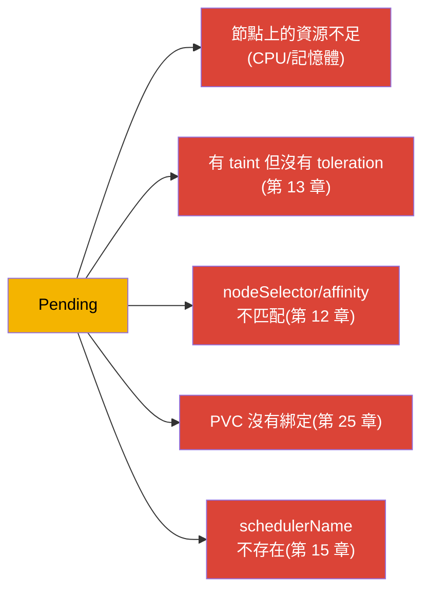
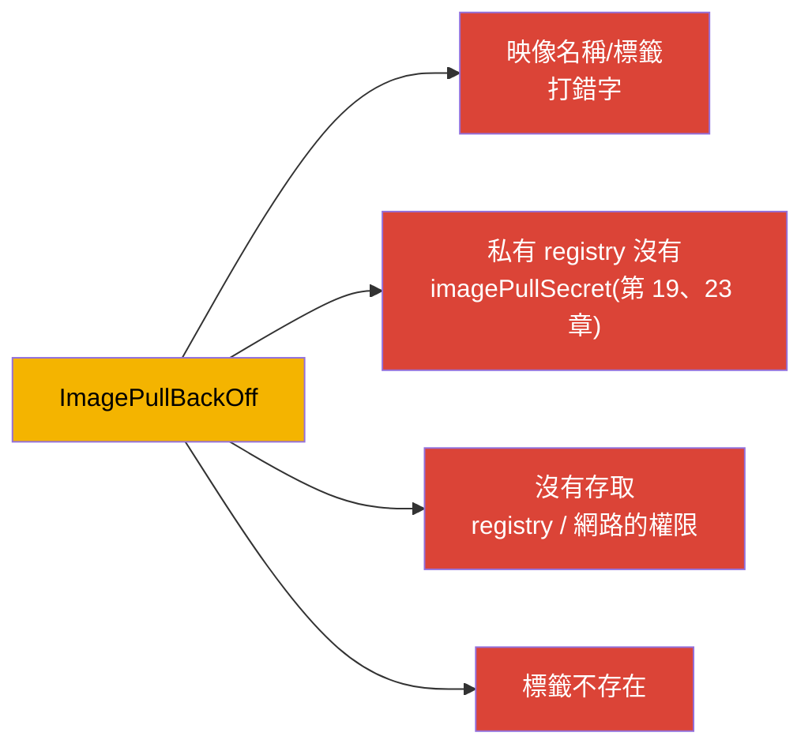
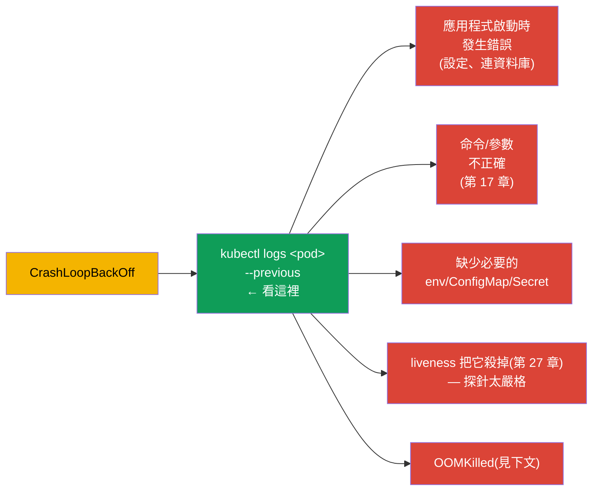
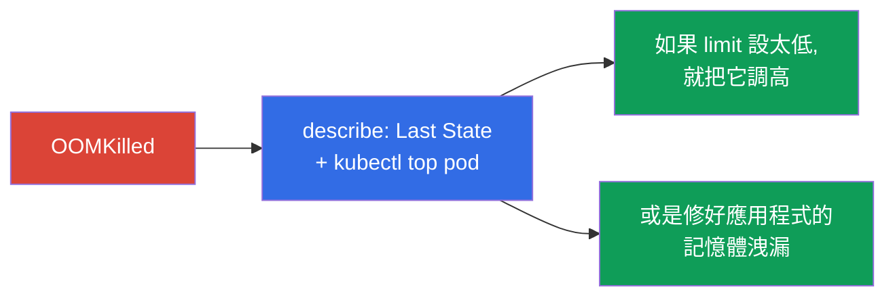
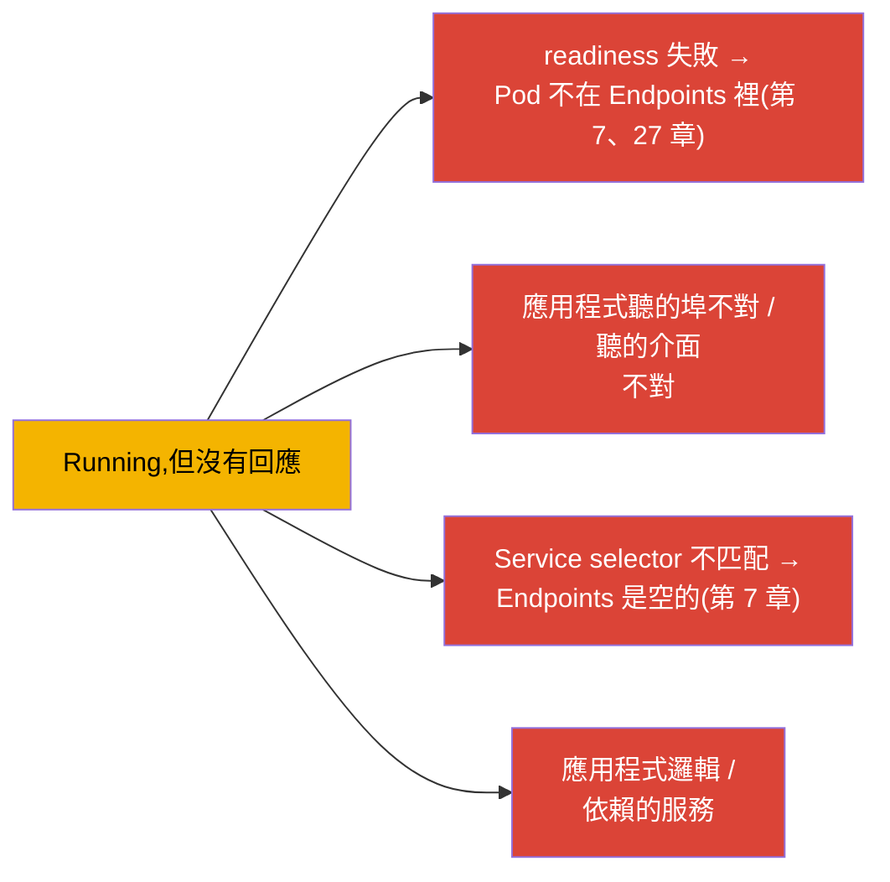
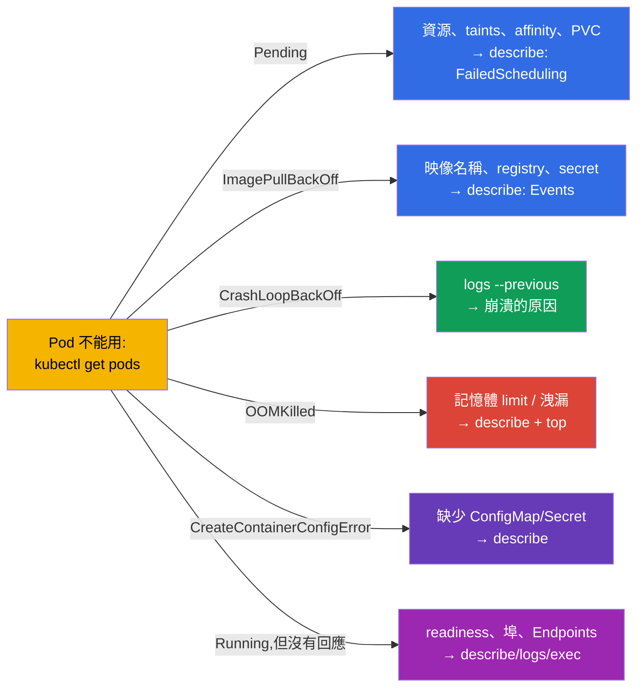

[Русская версия](ru.md) · [Eng version](README.md) · [Versión en español](es.md) · [Version française](fr.md) · [Deutsche Version](de.md) · [ქართული ვერსია](ge.md) · [日本語版](jp.md)

# 第 44 章。應用程式故障除錯

> 🟦 **CKA 章節**(Troubleshooting 領域 - 30%,最大的一塊)。這些技能對 CKAD
> (Observability)也很有用。
>
> **接下來是什麼。** 我們開始第 9 部分 - troubleshooting,CKA 裡份量最重的領域。工具
> 我們已經備齊了(第 4、28、29 章);現在把 **應用程式** 層級的故障分析系統化:為什麼
> Pod 起不來、會崩潰、沒有回應。我們會針對每一種典型的 STATUS 給出清楚的決策樹。叢集
> 除錯(control plane、節點)與網路除錯放在第 45-46 章。

## 44.1. 通用演算法

任何應用程式故障的分析都走同一條路線(回想第 29 章):

STATUS 會立刻決定分析的分支。我們一個一個看每種典型情況。

## 44.2. Pending:Pod 沒有被排程

`Pending` 的意思是:Pod 已經被接受,但排程器沒辦法把它放到節點上。看
`describe` → Events(`FailedScheduling`)。

| 原因 | 怎麼檢查/修正 |
|---------|----------------------|
| 沒有資源 | `kubectl top nodes`、`describe node`;降低 requests 或增加節點 |
| 有 taint 但沒有 toleration | `describe node`(taints);加上 toleration 或移除 taint(第 13 章) |
| nodeSelector/affinity | 比對節點標籤與 Pod 的規則(第 12 章) |
| PVC 沒有綁定 | `kubectl get pvc`(Pending?);StorageClass/PV(第 25-26 章) |
| 沒有節點/schedulerName | 檢查 `schedulerName`、有沒有 Ready 的節點 |

## 44.3. ImagePullBackOff / ErrImagePull:映像拉不下來

容器沒辦法下載映像。原因在 `describe` 裡(Events:`Failed to pull image`)。

檢查項目:映像名稱與標籤是否完全正確、私有 registry 有沒有 `imagePullSecret`
(第 19 章)、registry 是否可達。這通常只是 `image:` 裡打錯字而已。

## 44.4. CrashLoopBackOff:容器一直反覆崩潰

最常見也最重要的一種。容器啟動後立刻崩潰,Kubernetes 以逐漸增加的延遲重新啟動它。
**關鍵是崩潰容器的日誌**(`--previous`,第 28 章)。

做法:`logs --previous` → 弄清楚它掛在哪裡。常見原因:應用程式連不上依賴的服務、命令
不正確(第 17 章)、缺少 ConfigMap/Secret、太嚴格的 liveness 探針在啟動時就把它殺掉
(需要 startup probe,第 27 章),或是記憶體超量(OOMKilled)。

## 44.5. OOMKilled:記憶體超量

容器因為超過記憶體 limit 而被殺掉(第 14 章)。在 `describe` 裡看得到:
`Last State: Terminated, Reason: OOMKilled`。

解法:把實際用量(`kubectl top`)跟 limit 比較 - 要嘛是 limit 設太低(調高),要嘛是
應用程式有洩漏(改程式)。記得(第 14 章):記憶體是不可壓縮的資源,所以會直接被殺掉,
而不是被限速。

## 44.6. CreateContainerConfigError 與類似情況

容器沒有被建立,因為它引用的資源找不到:

| STATUS | 原因 |
|--------|---------|
| `CreateContainerConfigError` | `env`/`volume` 用到的 ConfigMap/Secret 不存在(第 18-19 章) |
| `CreateContainerError` | 容器設定有問題(命令、掛載) |
| `RunContainerError` | 啟動時發生錯誤(權限、進入點) |

檢查:Pod 引用的 ConfigMap/Secret 在同一個 namespace 裡是否存在;鍵的名稱是否正確。
`describe` 會告訴你缺的是哪個資源。

## 44.7. Running,但應用程式不能用

Pod 是 `Running` 而且 `Ready`,但請求進不去。問題不在啟動,而在運作或存取上:

順序:檢查 readiness(`describe` - 有沒有通過)、`kubectl logs`、進到裡面
(`exec`)確認應用程式有沒有在聽那個埠;檢查 Service 與 Endpoints(第 7 章)。
直接對 Pod 做 `port-forward` 有助於判斷問題是在應用程式還是在路由上
(第 29 章)。網路部分的細節在第 46 章。

## 44.8. 彙總決策樹

把所有東西整合成一張「STATUS → 該看哪裡」的地圖:

這張地圖值得在考試時記在腦子裡 - 它能在幾秒內把「有東西壞了」變成具體的下一步。

## 44.9. 這在生產環境中如何應用

- **同一條路線,更大的規模。** 在生產環境裡分析方式一樣(STATUS → describe →
  logs → top/exec),但資料是從集中式的日誌/指標取得(第 28 章),而不只是靠
  `kubectl`。告警常常會直接指出問題類型(大量 CrashLoopBackOff、OOMKilled)。
- **各 STATUS 常見的生產原因。** 發版之後:CrashLoopBackOff(bug/設定)、
  ImagePullBackOff(標籤不對/沒有 registry 存取權)、OOMKilled(limit 設太低)。Pending
  通常 = 叢集資源不足或 affinity/taints 設錯 - 這是該做節點自動擴容的訊號。
- **快速回滾勝過漫長除錯。** 在生產環境遇到有問題的發版,先回滾
  (`rollout undo`,第 8 章;`helm rollback`,第 42 章)把服務恢復,原因之後再查 -
  可用性比較重要。
- **探針與資源設定能預防一半的故障。** 正確的 readiness/liveness(第 27 章)與
  right-sized 的 requests/limits(第 14 章)可以消掉整類事故(流量打到還沒就緒的 Pod、
  OOMKilled、連鎖重新啟動)。
- **Post-mortem 與告警。** 重複發生的故障要系統性地追根本原因(root cause),而不是每
  次都在滅火 - 並且針對早期症狀設告警(重新啟動次數上升、記憶體接近 limit)。

## 44.10. 小詞彙表

- **Pending** - Pod 沒有被排程(資源/taints/affinity/PVC)。
- **ImagePullBackOff/ErrImagePull** - 映像下載不下來。
- **CrashLoopBackOff** - 容器反覆崩潰;關鍵是 `logs --previous`。
- **OOMKilled** - 因為超過記憶體 limit 而被殺掉。
- **CreateContainerConfigError** - Pod 引用的 ConfigMap/Secret 不存在。
- **FailedScheduling** - Pending 時排程器發出的事件。
- **Events** - `describe` 裡列出原因的區段。

## 44.11. 本章總結

- 通用路線:`get pods`(STATUS)→ `describe`(Events)→ `logs --previous` →
  `top`/`exec`/`debug`。STATUS 決定分析的分支。
- Pending → describe/FailedScheduling:資源、taints、affinity、PVC、schedulerName。
- ImagePullBackOff → 映像名稱/標籤、imagePullSecret、registry 存取權。
- CrashLoopBackOff → `logs --previous`:啟動錯誤、命令、缺少 env/CM/Secret、
  太嚴格的 liveness、OOM。
- OOMKilled → describe(Last State)+ top:記憶體 limit 設太低或有洩漏。
- CreateContainerConfigError → 缺少 ConfigMap/Secret。
- Running 但沒有回應 → readiness、埠、Service/Endpoints、程式邏輯;`port-forward`
  可以縮小範圍。

## 44.12. 這些知識用在哪:考試與實際工作

**在考試上(CKA)。** Troubleshooting 佔考試 30%,而應用程式故障是其中很大一部分。
「STATUS → 下一步」這棵決策樹能省下寶貴時間。你必須能反射性地用
get→describe→logs(--previous)→top/exec,並知道每個 STATUS 的原因。這同時也是 CKAD
Observability 的核心。

**在實際工作中。** 快速定位應用程式故障是值班人員每天都要用的技能。決策樹以及
日誌+事件+指標的組合能加快事故分析,而預防措施(探針、right-sizing、回滾)則能消掉
整類問題。用 post-mortem 取代滅火,是成熟維運與否的分界。

## 44.13. 自我檢查問題

1. 描述通用的除錯路線。是什麼決定分析的分支?
2. Pending 有哪些原因,每一個要怎麼檢查?
3. 遇到 ImagePullBackOff 該看哪裡?
4. 為什麼 CrashLoopBackOff 最重要的是 `logs --previous`?列出常見原因。
5. 怎麼辨認並解決 OOMKilled?
6. 什麼會造成 CreateContainerConfigError?
7. Pod 是 Running 而且 Ready 卻沒有回應 - 有哪些原因,要怎麼定位?

## 實踐

我們把應用程式除錯系統化了。第 45 章會上升到叢集層級 - 分析 control plane 與 worker
節點的故障。應用程式除錯會在 troubleshooting 的實驗與模擬考中練習。

🧪 實驗 114(修好壞掉的資源):[tasks/cka/labs/114](../../labs/114/README_TW.MD)

---
[目錄](../README_TW.md) · [第 43 章](../43/tw.md) · [第 45 章](../45/tw.md)
