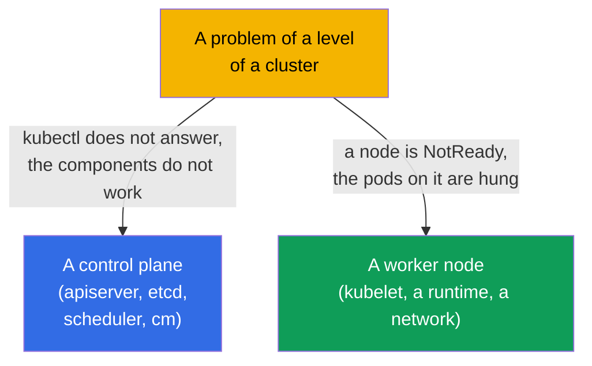
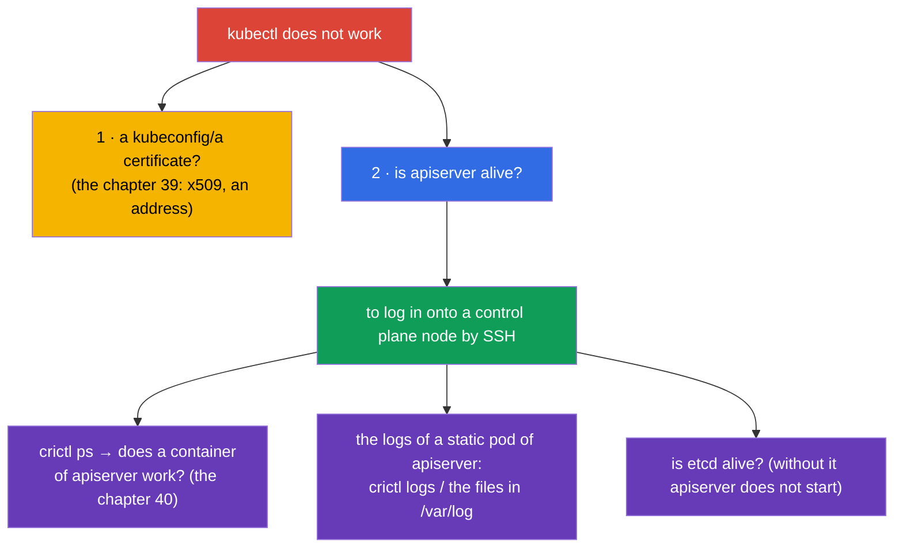
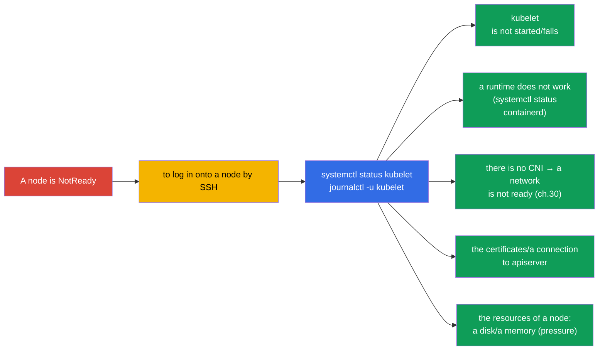
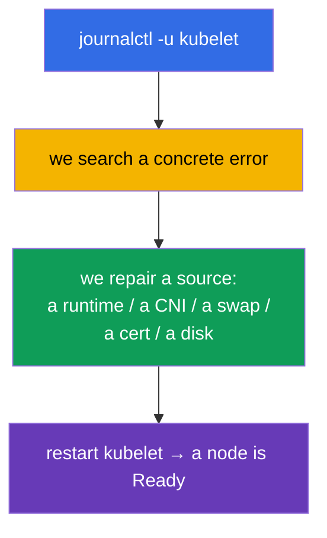
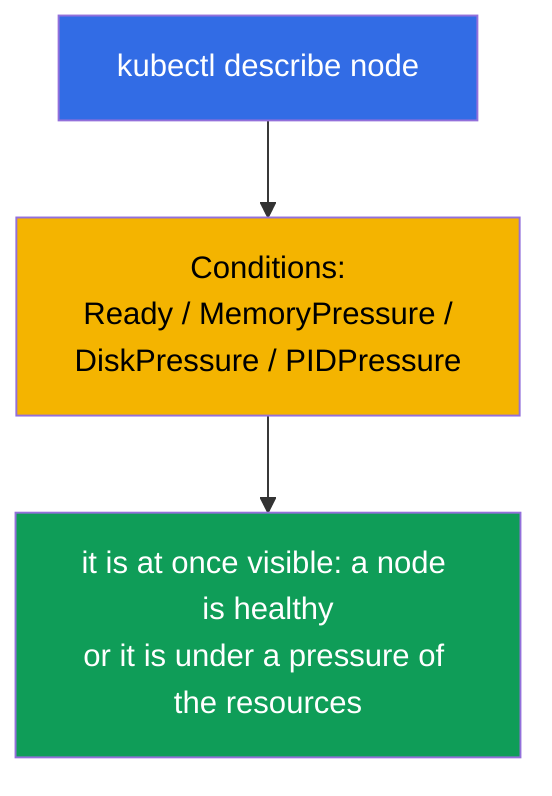

[Русская версия](ru.md) · [Versión en español](es.md) · [Version française](fr.md) · [Deutsche Version](de.md) · [ქართული ვერსია](ge.md)

# Chapter 45. A debugging of a control plane and of the worker nodes

> 🟦 **A chapter for the CKA** (a domain Troubleshooting - 30%).
>
> **What comes next.** In the past chapter we repaired the applications. Now - a level of a cluster: what to do,
> when a **control plane** is down (kubectl does not answer, the components do not work) or a **node**
> has fallen off (NotReady). Here the whole map of the components out of the chapter 2 comes alive and a knowledge, that a control
> plane - these are the static pods (the chapter 15). These are the most "terrible", but algorithmizable tasks
> of the CKA - we will consider them by the steps.

## 45.1. The two levels of the problems of a cluster

We separate a problem of a control plane from a problem of a node - an approach to them is different:



Let us recall a key thing (the chapter 2): the components of a control plane - the **static pods** in
`/etc/kubernetes/manifests/` (the chapter 15), and kubelet and a runtime - the **system services**
(`systemctl`/`journalctl`). This defines, where and how to repair them.

## 45.2. When kubectl / an API server does not answer

If `kubectl` gives out an error of a connection - the whole cluster is paralyzed (the chapter 2). But at first
let us separate a problem of a client from a problem of a server:



A key technique: if an API does not work, `kubectl` is useless - we go onto a control plane node and
look at the containers through **crictl** (the chapter 40), bypassing a cluster:

```bash
# on a control plane node
sudo crictl ps -a | grep -E 'apiserver|etcd'    # do the containers work
sudo crictl logs <id-apiserver>                  # the logs of apiserver
sudo journalctl -u kubelet                        # kubelet, which raises the static pods
```

A frequent reason of "apiserver does not rise" - **an error in its manifest**
(`/etc/kubernetes/manifests/kube-apiserver.yaml`): a wrong flag, a port, a path to
a certificate. kubelet tries to raise a pod, it falls - we look at the logs and fix a manifest.

## 45.3. A debugging of the static pod components of a control plane

The components of a control plane are repaired through their manifests. A typical cycle:


| A component has fallen | A symptom | Where to look |
|----------------|---------|--------------|
| kube-apiserver | kubectl does not answer | a manifest of apiserver, the logs through crictl, is etcd alive |
| etcd | apiserver does not start | a manifest of etcd, `/var/lib/etcd`, the certificates (the chapter 37) |
| kube-scheduler | the new pods are in Pending | a manifest of scheduler, its logs |
| kube-controller-manager | there is no self-healing (the replicas, endpoints) | a manifest of cm, its logs |

We remember (the chapter 15): an editing of a manifest in `/etc/kubernetes/manifests/` makes kubelet
recreate a static pod automatically - it is not needed to "apply" it separately.

## 45.4. A node is NotReady: where to begin

`kubectl get nodes` shows `NotReady`. A reason is almost always the **kubelet** on this node
(it reports a status) or that, on what it depends.



An order on a node:

```bash
systemctl status kubelet          # is kubelet started
journalctl -u kubelet -f          # its logs - almost always a reason is here
systemctl status containerd       # does a container runtime work (the chapter 40)
df -h                             # is a disk not full (disk-pressure)
free -m                           # a memory
```

## 45.5. The typical reasons of NotReady

| A reason | A symptom in the logs of kubelet | A solution |
|---------|-------------------------|---------|
| kubelet is not started | a service is inactive/failed | `systemctl start/restart kubelet`, to analyze a reason |
| a swap is on | kubelet refuses to start | `swapoff -a` (the chapter 35) |
| a runtime is down | the errors of the CRI | to restart containerd |
| there is no CNI | `network plugin not ready` | to install/to repair a CNI (the chapter 30) |
| a certificate/a token | the errors of an authorization to apiserver | to check kubelet.conf, the certificates (the chapter 39) |
| a disk/memory pressure | the pressure taints, an eviction | to free a disk/a memory (the chapter 13) |



The logs of kubelet (`journalctl -u kubelet`) - the main source of a truth at NotReady: there almost
always a concrete reason is written.

## 45.6. The instruments of a diagnostics of a cluster

When an API is alive, the overview commands are useful:

```bash
kubectl get nodes -o wide                         # the statuses of the nodes
kubectl describe node <node>                       # Conditions, taints, the resources, the events
kubectl get pods -n kube-system                    # the components of a control plane and CoreDNS
kubectl get componentstatuses                      # (is becoming deprecated) a status of the components
kubectl get events -A --sort-by='.lastTimestamp'   # the events of the whole cluster
kubectl cluster-info                               # the addresses of the components
```

`kubectl describe node` is especially valuable: a section **Conditions** (Ready, MemoryPressure,
DiskPressure, PIDPressure) at once shows, what is wrong with a node.



## 45.7. How this is applied in a production

- **crictl - an emergency access.** When an API/kubectl are unavailable, `crictl` and `journalctl` on
  a node - the only way to see, what is going on. This is a key skill of an on-call engineer in the
  self-managed clusters.
- **An HA saves a control plane.** In a prod a control plane - in an HA (the chapter 2), that is why a falling of
  one apiserver/etcd does not bring a cluster down, but gives a time to repair a node. One control plane -
  a single point of a failure, inadmissible in a prod.
- **etcd - in a center of an attention.** The problems of a control plane often come down to etcd (a slow
  disk, a loss of a quorum). etcd is watched especially and the backups are kept (the chapter 37) - at the worst
  scenario they restore out of a snapshot.
- **An automatic recovery of the nodes.** In a cloud the unhealthy nodes are often simply replaced
  (a node auto-repair, a recreation), and not repaired manually - for the stateless workloads this is
  faster. A manual analysis of NotReady is actual for an on-prem and for a learning.
- **A monitoring of Conditions and of the system services.** In a prod the alerts are hung onto NotReady,
  the pressure conditions, an unavailability of apiserver/etcd - in order to catch the problems of a control plane and
  of the nodes before they become an incident.

## 45.8. A mini glossary

- **a static pod** - the components of a control plane, raised by kubelet out of
  `/etc/kubernetes/manifests/` (the chapter 15).
- **crictl** - a CLI to the containers through the CRI on a node; it works without an API (the chapter 40).
- **journalctl -u kubelet** - the logs of kubelet, the main source of the reasons of NotReady.
- **NotReady** - a status of a node, when kubelet does not report a readiness.
- **Conditions** - the states of a node (Ready, MemoryPressure, DiskPressure, PIDPressure).
- **the pressure taints** - the automatic taints at a lack of the resources of a node (the chapter 13).
- **componentstatuses** - an overview status of the components (is becoming deprecated).

## 45.9. The conclusions of the chapter

- We separate the problems: a control plane (kubectl/the components) vs a node (NotReady) - an approach
  is different.
- The components of a control plane - the static pods in `/etc/kubernetes/manifests/`; they are repaired by an editing of a
  manifest (kubelet recreates a pod itself); the logs - through `crictl`, when an API is unavailable.
- If apiserver does not rise - a frequent reason is an error in its manifest; to check etcd too
  (without it apiserver does not start).
- NotReady is almost always about kubelet: `systemctl status kubelet`, `journalctl -u kubelet` -
  a reason is there (kubelet, a runtime, a CNI, a swap, the certificates, a disk/memory pressure).
- A diagnostics at an alive API: `describe node` (Conditions!), `get pods -n kube-system`,
  `get events -A`, `cluster-info`.
- crictl and journalctl on a node - an emergency access, when kubectl is useless.

## 45.10. How this will come in handy: at an exam and in a real work

**At an exam (CKA).** "Repair a control plane / a component", "a node is NotReady - analyze it" -
the classical high-score tasks of a troubleshooting (30%). It is necessary to know: the manifests in
`/etc/kubernetes/manifests/`, `crictl` for the logs at a dead API, `journalctl -u kubelet`
for NotReady and the typical reasons. This is a direct application of the chapters 2, 15, 40.

**In a real work.** An analysis of the problems of a control plane and of the nodes - a skill, which distinguishes a
confident administrator: to know, where to look, when "everything is down", to be able to work on a node
through crictl/journalctl. An HA, the backups of etcd and a monitoring of Conditions turn a potential
catastrophe into a manageable incident.

## 45.11. The questions for a self-check

1. How to distinguish a problem of a control plane from a problem of a node and why is an approach different?
2. What to do, if `kubectl` does not answer? How to look at the logs of apiserver without an API?
3. How are the components of a control plane repaired and why is it not needed to "apply" an editing of a manifest?
4. Why at a dead apiserver is it necessary to check etcd too?
5. Where to begin an analysis of a NotReady node and where to search a reason?
6. Name the typical reasons of NotReady and their solutions.
7. What does a section Conditions in `describe node` show?

## Practice

We have considered the failures of a cluster. In the chapter 46 we will close a troubleshooting with a network - the most insidious
part. A debugging of a control plane and of the nodes is practised in the labs on an administration and in the
mock exams.

🧪 A lab 117 (a troubleshooting of a control plane and of the nodes): [tasks/cka/labs/117](../../labs/117/README.MD)

---
[Contents](../README.md) · [Chapter 44](../44/README.md) · [Chapter 46](../46/README.md)
