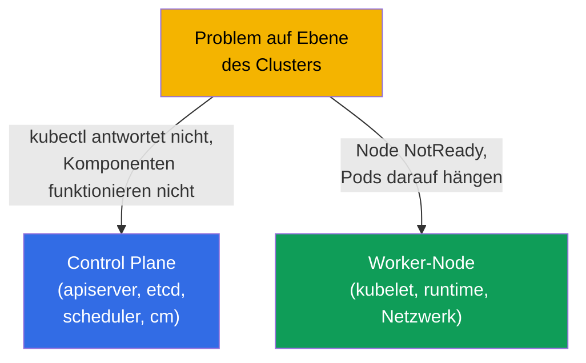
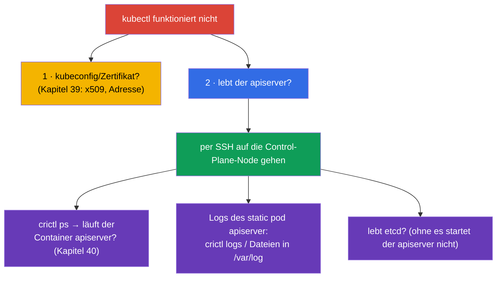
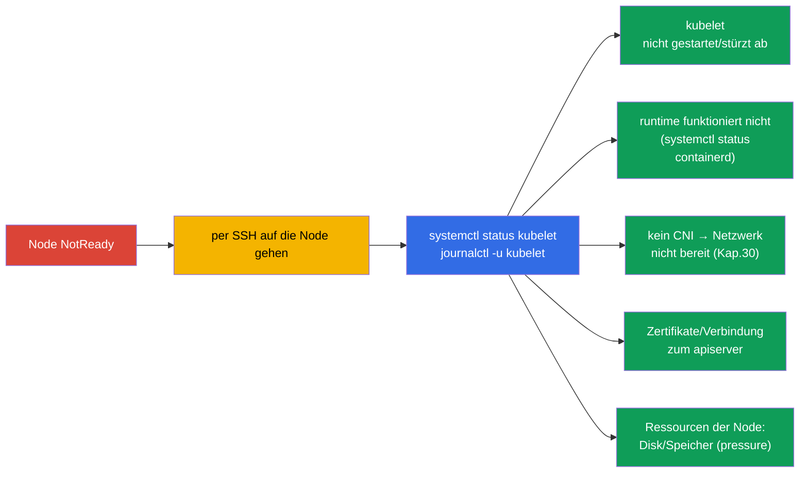
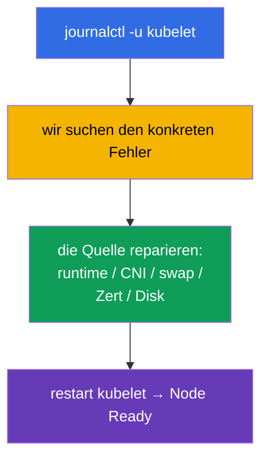
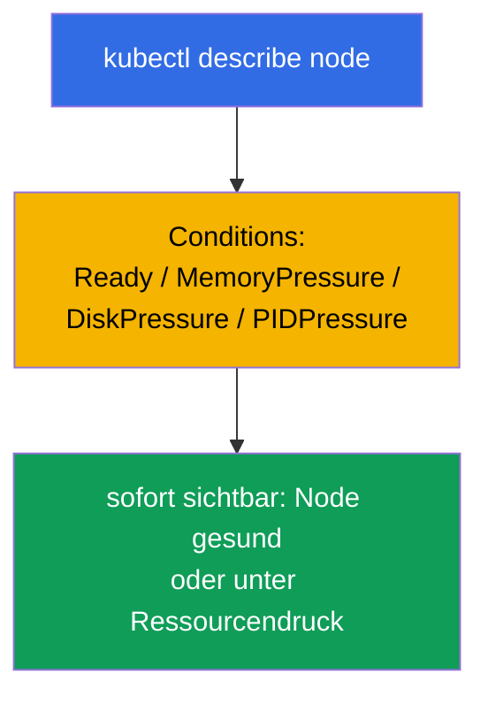

[Русская версия](ru.md) · [Eng version](README.md) · [Versión en español](es.md) · [Version française](fr.md) · [ქართული ვერსია](ge.md) · [繁體中文版](tw.md) · [日本語版](jp.md)

# Kapitel 45. Debugging der Control Plane und der Worker-Nodes

> 🟦 **Kapitel für CKA** (Domäne Troubleshooting - 30%).
>
> **Was kommt.** Im letzten Kapitel haben wir Anwendungen repariert. Jetzt - die Ebene des
> Clusters: was zu tun ist, wenn die **Control Plane** ausgefallen ist (kubectl antwortet
> nicht, Komponenten funktionieren nicht) oder eine **Node** abgefallen ist (NotReady). Hier
> lebt die ganze Karte der Komponenten aus Kapitel 2 wieder auf, und das Wissen, dass die
> Control Plane aus static pods besteht (Kapitel 15). Das sind die „schrecklichsten“, aber
> algorithmisierbaren Aufgaben von CKA - wir gehen sie Schritt für Schritt durch.

## 45.1. Zwei Ebenen von Cluster-Problemen

Wir trennen ein Problem der Control Plane von einem Problem der Node - der Zugang dazu ist unterschiedlich:



Erinnern wir uns an das Wesentliche (Kapitel 2): die Komponenten der Control Plane sind
**static pods** in `/etc/kubernetes/manifests/` (Kapitel 15), und kubelet sowie das runtime
sind **Systemdienste** (`systemctl`/`journalctl`). Das bestimmt, wo und wie man sie repariert.

## 45.2. Wenn kubectl / der API-Server nicht antwortet

Wenn `kubectl` einen Verbindungsfehler ausgibt, ist der ganze Cluster gelähmt (Kapitel 2).
Aber zuerst trennen wir das Problem des Clients von dem des Servers:



Der Schlüsselgriff: wenn die API nicht funktioniert, ist `kubectl` nutzlos - wir gehen auf die
Control-Plane-Node und schauen die Container über **crictl** an (Kapitel 40), am Cluster vorbei:

```bash
# auf der Control-Plane-Node
sudo crictl ps -a | grep -E 'apiserver|etcd'    # laufen die Container
sudo crictl logs <id-apiserver>                  # Logs des apiserver
sudo journalctl -u kubelet                        # kubelet, das die static pods startet
```

Eine häufige Ursache für „der apiserver startet nicht“ ist ein **Fehler in seinem Manifest**
(`/etc/kubernetes/manifests/kube-apiserver.yaml`): falsches Flag, falscher Port, falscher Pfad
zum Zertifikat. kubelet versucht den Pod zu starten, dieser stürzt ab - wir schauen in die Logs
und korrigieren das Manifest.

## 45.3. Debugging der static-pod-Komponenten der Control Plane

Die Komponenten der Control Plane repariert man über ihre Manifeste. Der typische Zyklus:


| Komponente ausgefallen | Symptom | Wo schauen |
|----------------|---------|--------------|
| kube-apiserver | kubectl antwortet nicht | Manifest des apiserver, Logs über crictl, lebt etcd |
| etcd | apiserver startet nicht | Manifest von etcd, `/var/lib/etcd`, Zertifikate (Kapitel 37) |
| kube-scheduler | neue Pods in Pending | Manifest des scheduler, seine Logs |
| kube-controller-manager | keine Selbstheilung (Replicas, endpoints) | Manifest des cm, seine Logs |

Wir erinnern uns (Kapitel 15): eine Änderung des Manifests in `/etc/kubernetes/manifests/`
zwingt kubelet, den static pod automatisch neu zu erstellen - ein separates „Anwenden“ ist
nicht nötig.

## 45.4. Node NotReady: womit anfangen

`kubectl get nodes` zeigt `NotReady`. Die Ursache ist fast immer das **kubelet** auf dieser
Node (es meldet den Status) oder etwas, wovon es abhängt.



Die Reihenfolge auf der Node:

```bash
systemctl status kubelet          # läuft kubelet
journalctl -u kubelet -f          # seine Logs - fast immer liegt die Ursache hier
systemctl status containerd       # funktioniert das container runtime (Kapitel 40)
df -h                             # ist die Disk voll (disk-pressure)
free -m                           # Speicher
```

## 45.5. Typische Ursachen für NotReady

| Ursache | Symptom in den Logs des kubelet | Lösung |
|---------|-------------------------|---------|
| kubelet nicht gestartet | Dienst inactive/failed | `systemctl start/restart kubelet`, Ursache klären |
| swap aktiviert | kubelet weigert sich zu starten | `swapoff -a` (Kapitel 35) |
| runtime ausgefallen | Fehler des CRI | containerd neu starten |
| kein CNI | `network plugin not ready` | CNI installieren/reparieren (Kapitel 30) |
| Zertifikat/Token | Autorisierungsfehler zum apiserver | kubelet.conf, Zertifikate prüfen (Kapitel 39) |
| disk/memory pressure | pressure-taints, Eviction | Disk/Speicher freigeben (Kapitel 13) |



Die Logs des kubelet (`journalctl -u kubelet`) sind die wichtigste Quelle der Wahrheit bei
NotReady: dort steht fast immer die konkrete Ursache.

## 45.6. Werkzeuge zur Cluster-Diagnose

Wenn die API lebt, sind Übersichtsbefehle nützlich:

```bash
kubectl get nodes -o wide                         # Status der Nodes
kubectl describe node <node>                       # Conditions, taints, Ressourcen, Events
kubectl get pods -n kube-system                    # Komponenten der Control Plane und CoreDNS
kubectl get componentstatuses                      # (veraltet) Status der Komponenten
kubectl get events -A --sort-by='.lastTimestamp'   # Events des gesamten Clusters
kubectl cluster-info                               # Adressen der Komponenten
```

`kubectl describe node` ist besonders wertvoll: der Abschnitt **Conditions** (Ready,
MemoryPressure, DiskPressure, PIDPressure) zeigt sofort, was mit der Node nicht stimmt.



## 45.7. Wie man das in der Produktion anwendet

- **crictl - der Notzugang.** Wenn API/kubectl nicht verfügbar sind, sind `crictl` und
  `journalctl` auf der Node die einzige Möglichkeit zu sehen, was passiert. Das ist eine
  Schlüsselfähigkeit im Bereitschaftsdienst in self-managed Clustern.
- **HA rettet die Control Plane.** In der Produktion läuft die Control Plane in HA (Kapitel 2),
  deshalb reißt der Ausfall eines apiserver/etcd nicht den Cluster mit, sondern gibt Zeit, den
  Knoten zu reparieren. Eine einzelne Control Plane ist ein Single Point of Failure, in der
  Produktion unzulässig.
- **etcd - im Zentrum der Aufmerksamkeit.** Probleme der Control Plane laufen oft auf etcd
  hinaus (langsame Disk, Verlust des Quorums). etcd wird besonders überwacht und man hält
  Backups (Kapitel 37) - im schlimmsten Fall stellt man aus einem Snapshot wieder her.
- **Automatische Wiederherstellung von Nodes.** In der Cloud ersetzt man ungesunde Nodes oft
  einfach (node auto-repair, Neuerstellung) statt sie manuell zu reparieren - für
  stateless-Lasten ist das schneller. Die manuelle Analyse von NotReady ist für on-prem und
  zum Lernen relevant.
- **Monitoring von Conditions und Systemdiensten.** In der Produktion hängt man Alerts an
  NotReady, pressure-Bedingungen, Nichtverfügbarkeit von apiserver/etcd - um Probleme der
  Control Plane und der Nodes zu erwischen, bevor sie zum Vorfall werden.

## 45.8. Mini-Glossar

- **static pod** - Komponenten der Control Plane, die kubelet aus
  `/etc/kubernetes/manifests/` startet (Kapitel 15).
- **crictl** - CLI zu den Containern über CRI auf der Node; funktioniert ohne API (Kapitel 40).
- **journalctl -u kubelet** - Logs des kubelet, die wichtigste Quelle der Ursachen für NotReady.
- **NotReady** - Status der Node, wenn kubelet keine Bereitschaft meldet.
- **Conditions** - Zustände der Node (Ready, MemoryPressure, DiskPressure, PIDPressure).
- **pressure-taints** - automatische taints bei Ressourcenmangel der Node (Kapitel 13).
- **componentstatuses** - Übersichtsstatus der Komponenten (veraltet).

## 45.9. Zusammenfassung des Kapitels

- Wir trennen die Probleme: Control Plane (kubectl/Komponenten) vs Node (NotReady) - der
  Zugang ist unterschiedlich.
- Die Komponenten der Control Plane sind static pods in `/etc/kubernetes/manifests/`; man
  repariert sie durch Änderung des Manifests (kubelet erstellt den Pod selbst neu); Logs -
  über `crictl`, wenn die API nicht verfügbar ist.
- Wenn der apiserver nicht startet, ist eine häufige Ursache ein Fehler in seinem Manifest;
  auch etcd prüfen (ohne es startet der apiserver nicht).
- NotReady betrifft fast immer das kubelet: `systemctl status kubelet`,
  `journalctl -u kubelet` - dort ist die Ursache (kubelet, runtime, CNI, swap, Zertifikate,
  disk/memory pressure).
- Diagnose bei lebender API: `describe node` (Conditions!), `get pods -n kube-system`,
  `get events -A`, `cluster-info`.
- crictl und journalctl auf der Node sind der Notzugang, wenn kubectl nutzlos ist.

## 45.10. Wofür das nützlich ist: in der Prüfung und in der echten Arbeit

**In der Prüfung (CKA).** „Repariere die Control Plane / eine Komponente“, „Node NotReady -
finde es heraus“ sind klassische hoch bewertete Troubleshooting-Aufgaben (30%). Man muss
wissen: die Manifeste in `/etc/kubernetes/manifests/`, `crictl` für Logs bei toter API,
`journalctl -u kubelet` für NotReady und die typischen Ursachen. Das ist die direkte Anwendung
der Kapitel 2, 15, 40.

**In der echten Arbeit.** Die Analyse von Problemen der Control Plane und der Nodes ist die
Fähigkeit, die einen souveränen Administrator auszeichnet: zu wissen, wo man schaut, wenn
„alles liegt“, und auf der Node über crictl/journalctl arbeiten zu können. HA, etcd-Backups
und das Monitoring der Conditions verwandeln eine potenzielle Katastrophe in einen
handhabbaren Vorfall.

## 45.11. Fragen zur Selbstüberprüfung

1. Wie unterscheidet man ein Problem der Control Plane von einem Problem der Node und warum ist der Zugang unterschiedlich?
2. Was tut man, wenn `kubectl` nicht antwortet? Wie schaut man die Logs des apiserver ohne API an?
3. Wie repariert man die Komponenten der Control Plane und warum muss man eine Änderung des Manifests nicht „anwenden“?
4. Warum muss man bei einem toten apiserver auch etcd prüfen?
5. Womit beginnt man die Analyse einer Node in NotReady und wo sucht man die Ursache?
6. Nennen Sie die typischen Ursachen für NotReady und ihre Lösungen.
7. Was zeigt der Abschnitt Conditions in `describe node`?

## Praxis

Wir haben Cluster-Ausfälle durchgearbeitet. In Kapitel 46 schließen wir das Troubleshooting
mit dem Netzwerk ab - dem heimtückischsten Teil. Das Debugging der Control Plane und der Nodes
wird in den Labs zur Administration und in Mock-Prüfungen geübt.

🧪 Lab 117 (Troubleshooting der Control Plane und der Nodes): [tasks/cka/labs/117](../../labs/117/README_DE.MD)

🎮 Killercoda (im Browser, ohne Installation): [Troubleshoot a NotReady Node](https://killercoda.com/chadmcrowell/course/cka/node-notready) · [Kubelet Status](https://killercoda.com/chadmcrowell/course/cka/kubelet-status) · [Cordon and Drain the Node](https://killercoda.com/chadmcrowell/course/cka/cordon-drain-node)

---
[Inhalt](../README_DE.md) · [Kapitel 44](../44/de.md) · [Kapitel 46](../46/de.md)
