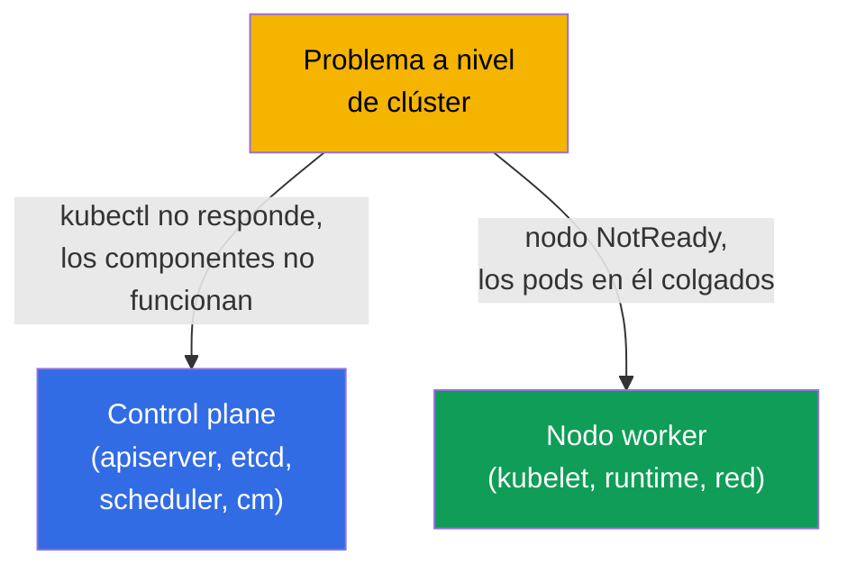
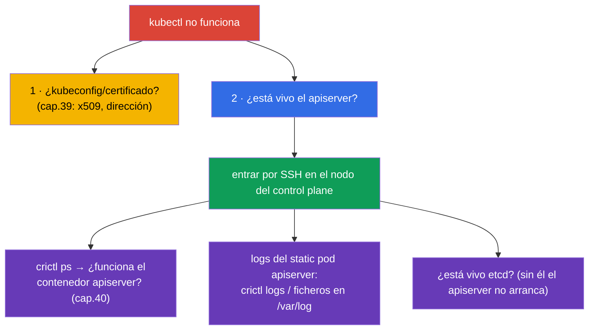
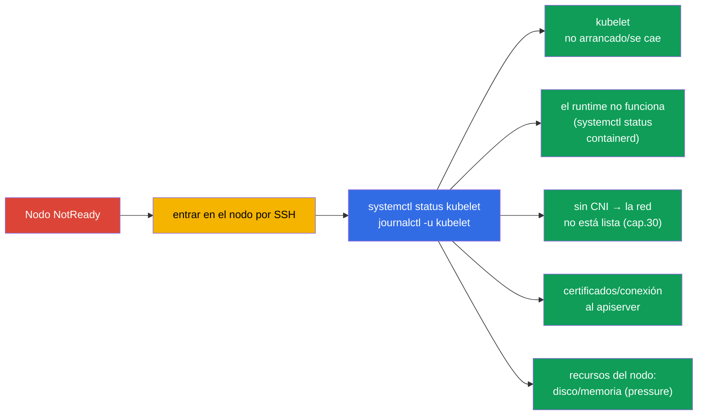
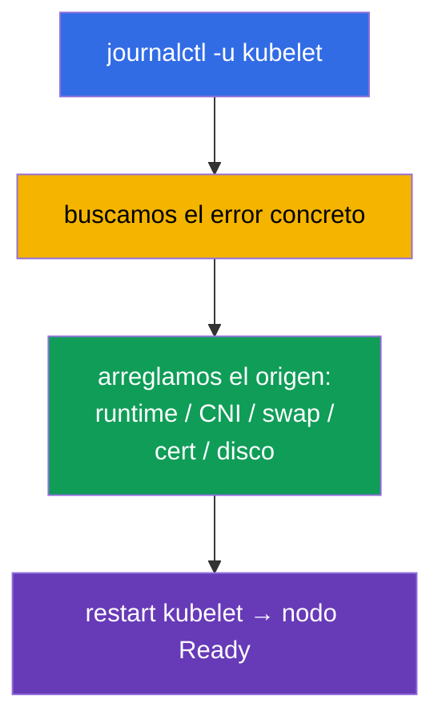
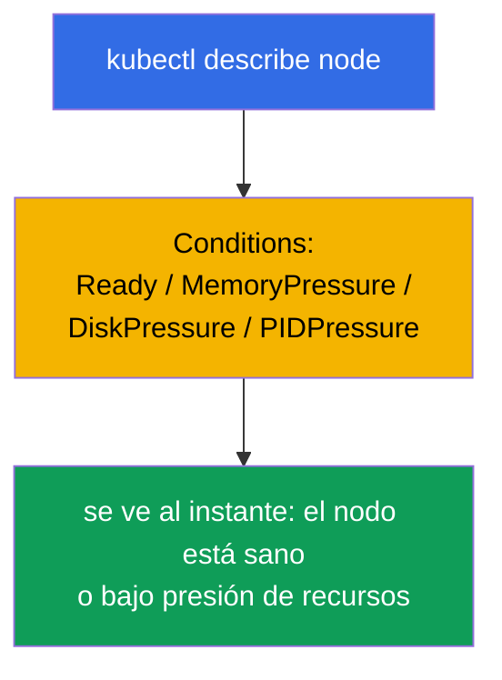

[Русская версия](ru.md) · [Eng version](README.md) · [Version française](fr.md) · [Deutsche Version](de.md) · [ქართული ვერსია](ge.md)

# Capítulo 45. Depuración del control plane y de los nodos worker

> 🟦 **Capítulo para CKA** (dominio Troubleshooting - 30%).
>
> **Qué viene ahora.** En el capítulo anterior arreglábamos aplicaciones. Ahora - el nivel del clúster: qué hacer
> cuando se cae el **control plane** (kubectl no responde, los componentes no funcionan) o se desconecta un
> **nodo** (NotReady). Aquí revive todo el mapa de componentes del capítulo 2 y el saber que el control
> plane son static pods (capítulo 15). Son las tareas más «temibles» del CKA, pero se pueden
> algoritmizar - las veremos paso a paso.

## 45.1. Dos niveles de problemas del clúster

Separamos el problema del control plane del problema de un nodo - el enfoque para cada uno es distinto:



Recordemos lo clave (capítulo 2): los componentes del control plane son **static pods** en
`/etc/kubernetes/manifests/` (capítulo 15), mientras que kubelet y el runtime son **servicios del sistema**
(`systemctl`/`journalctl`). Eso determina dónde y cómo arreglarlos.

## 45.2. Cuando kubectl / el API server no responde

Si `kubectl` devuelve un error de conexión, todo el clúster queda paralizado (capítulo 2). Pero primero
separemos el problema del cliente del problema del servidor:



Truco clave: si el API no funciona, `kubectl` es inútil - vamos al nodo del control plane y
miramos los contenedores con **crictl** (capítulo 40), sin pasar por el clúster:

```bash
# en el nodo del control plane
sudo crictl ps -a | grep -E 'apiserver|etcd'    # ¿funcionan los contenedores?
sudo crictl logs <id-apiserver>                  # logs del apiserver
sudo journalctl -u kubelet                        # kubelet, que levanta los static pods
```

Una causa frecuente de «el apiserver no arranca» es un **error en su manifiesto**
(`/etc/kubernetes/manifests/kube-apiserver.yaml`): un flag incorrecto, un puerto, la ruta a un
certificado. kubelet intenta levantar el pod, este se cae - miramos los logs y corregimos el manifiesto.

## 45.3. Depuración de los componentes static pod del control plane

Los componentes del control plane se arreglan a través de sus manifiestos. Ciclo típico:


| Componente caído | Síntoma | Dónde mirar |
|----------------|---------|--------------|
| kube-apiserver | kubectl no responde | manifiesto del apiserver, logs vía crictl, si etcd está vivo |
| etcd | el apiserver no arranca | manifiesto de etcd, `/var/lib/etcd`, certificados (cap.37) |
| kube-scheduler | los pods nuevos en Pending | manifiesto del scheduler, sus logs |
| kube-controller-manager | no hay autocorrección (réplicas, endpoints) | manifiesto del cm, sus logs |

Recordamos (capítulo 15): editar un manifiesto en `/etc/kubernetes/manifests/` hace que kubelet
recree el static pod automáticamente - no hay que «aplicar» nada aparte.

## 45.4. Nodo NotReady: por dónde empezar

`kubectl get nodes` muestra `NotReady`. La causa casi siempre es el **kubelet** de ese nodo
(es quien informa del estado) o algo de lo que depende.



Orden en el nodo:

```bash
systemctl status kubelet          # ¿está arrancado el kubelet?
journalctl -u kubelet -f          # sus logs — casi siempre la causa está aquí
systemctl status containerd       # ¿funciona el container runtime? (capítulo 40)
df -h                             # ¿está el disco lleno? (disk-pressure)
free -m                           # memoria
```

## 45.5. Causas típicas de NotReady

| Causa | Síntoma en los logs del kubelet | Solución |
|---------|-------------------------|---------|
| kubelet no arrancado | servicio inactive/failed | `systemctl start/restart kubelet`, analizar la causa |
| swap activado | el kubelet se niega a arrancar | `swapoff -a` (cap.35) |
| el runtime se cayó | errores de CRI | reiniciar containerd |
| sin CNI | `network plugin not ready` | instalar/arreglar el CNI (cap.30) |
| certificado/token | errores de autorización contra el apiserver | revisar kubelet.conf, certificados (cap.39) |
| disk/memory pressure | taints de pressure, evicción | liberar disco/memoria (cap.13) |



Los logs del kubelet (`journalctl -u kubelet`) son la principal fuente de verdad ante un NotReady: allí casi
siempre está escrita la causa concreta.

## 45.6. Herramientas de diagnóstico del clúster

Cuando el API está vivo, resultan útiles los comandos de visión general:

```bash
kubectl get nodes -o wide                         # estados de los nodos
kubectl describe node <node>                       # Conditions, taints, recursos, eventos
kubectl get pods -n kube-system                    # componentes del control plane y CoreDNS
kubectl get componentstatuses                      # (obsoleto) estado de los componentes
kubectl get events -A --sort-by='.lastTimestamp'   # eventos de todo el clúster
kubectl cluster-info                               # direcciones de los componentes
```

`kubectl describe node` es especialmente valioso: la sección **Conditions** (Ready, MemoryPressure,
DiskPressure, PIDPressure) muestra de inmediato qué le pasa al nodo.



## 45.7. Cómo se aplica esto en producción

- **crictl - acceso de emergencia.** Cuando el API/kubectl no están disponibles, `crictl` y `journalctl` en
  el nodo son la única forma de ver qué ocurre. Es una habilidad clave de quien está de guardia en
  clústeres self-managed.
- **La HA salva el control plane.** En producción el control plane está en HA (capítulo 2), por eso la caída de
  un apiserver/etcd no tumba el clúster, sino que da tiempo a arreglar el nodo. Un único control plane es
  un punto único de fallo, inadmisible en producción.
- **etcd - en el centro de la atención.** Los problemas del control plane a menudo desembocan en etcd (disco
  lento, pérdida de quórum). A etcd se le vigila de forma especial y se le mantienen backups (capítulo 37) - en el peor
  escenario se restaura desde un snapshot.
- **Recuperación automática de nodos.** En la nube los nodos enfermos a menudo simplemente se sustituyen
  (node auto-repair, recreación) en vez de arreglarlos a mano - para cargas stateless es
  más rápido. El análisis manual de NotReady es relevante en on-prem y para aprender.
- **Monitorización de Conditions y de los servicios del sistema.** En producción se ponen alertas sobre NotReady,
  las condiciones de pressure y la indisponibilidad del apiserver/etcd - para detectar los problemas del control plane y
  de los nodos antes de que se conviertan en un incidente.

## 45.8. Mini-glosario

- **static pod** - componentes del control plane, levantados por kubelet desde
  `/etc/kubernetes/manifests/` (capítulo 15).
- **crictl** - CLI a los contenedores vía CRI en el nodo; funciona sin API (capítulo 40).
- **journalctl -u kubelet** - logs del kubelet, la principal fuente de causas de NotReady.
- **NotReady** - estado del nodo cuando el kubelet no informa de su disponibilidad.
- **Conditions** - estados del nodo (Ready, MemoryPressure, DiskPressure, PIDPressure).
- **pressure-taints** - taints automáticos ante falta de recursos del nodo (capítulo 13).
- **componentstatuses** - estado general de los componentes (obsoleto).

## 45.9. Resumen del capítulo

- Separamos los problemas: control plane (kubectl/componentes) vs nodo (NotReady) - el enfoque es
  distinto.
- Los componentes del control plane son static pods en `/etc/kubernetes/manifests/`; se arreglan editando el
  manifiesto (kubelet recrea el pod solo); los logs - vía `crictl`, cuando el API no está disponible.
- Si el apiserver no arranca, la causa frecuente es un error en su manifiesto; revisar también etcd
  (sin él el apiserver no arranca).
- NotReady casi siempre va del kubelet: `systemctl status kubelet`, `journalctl -u kubelet` -
  allí está la causa (kubelet, runtime, CNI, swap, certificados, disk/memory pressure).
- Diagnóstico con el API vivo: `describe node` (¡Conditions!), `get pods -n kube-system`,
  `get events -A`, `cluster-info`.
- crictl y journalctl en el nodo son el acceso de emergencia cuando kubectl es inútil.

## 45.10. Para qué sirve esto: en el examen y en el trabajo real

**En el examen (CKA).** «Arregla el control plane / un componente», «nodo NotReady - averígualo» son
tareas clásicas de troubleshooting con mucha puntuación (30%). Hay que conocer: los manifiestos en
`/etc/kubernetes/manifests/`, `crictl` para los logs con el API muerto, `journalctl -u kubelet`
para NotReady y las causas típicas. Es aplicación directa de los capítulos 2, 15, 40.

**En el trabajo real.** Analizar problemas del control plane y de los nodos es la habilidad que distingue a un
administrador seguro: saber dónde mirar cuando «se ha caído todo», saber trabajar en el nodo
vía crictl/journalctl. La HA, los backups de etcd y la monitorización de Conditions convierten una potencial
catástrofe en un incidente manejable.

## 45.11. Preguntas de autocomprobación

1. ¿Cómo distinguir un problema del control plane de un problema de nodo y por qué el enfoque es distinto?
2. ¿Qué hacer si `kubectl` no responde? ¿Cómo ver los logs del apiserver sin API?
3. ¿Cómo se arreglan los componentes del control plane y por qué no hay que «aplicar» la edición del manifiesto?
4. ¿Por qué con el apiserver muerto hay que revisar también etcd?
5. ¿Por dónde empezar el análisis de un nodo NotReady y dónde buscar la causa?
6. Nombra las causas típicas de NotReady y sus soluciones.
7. ¿Qué muestra la sección Conditions en `describe node`?

## Práctica

Hemos visto los fallos del clúster. En el capítulo 46 cerraremos el troubleshooting con la red - la parte más
traicionera. La depuración del control plane y de los nodos se practica en los laboratorios de administración y
en los exámenes simulados.

🧪 Laboratorio 117 (troubleshooting del control plane y de los nodos): [tasks/cka/labs/117](../../labs/117/README_ES.MD)

---
[Índice](../README_ES.md) · [Capítulo 44](../44/es.md) · [Capítulo 46](../46/es.md)
