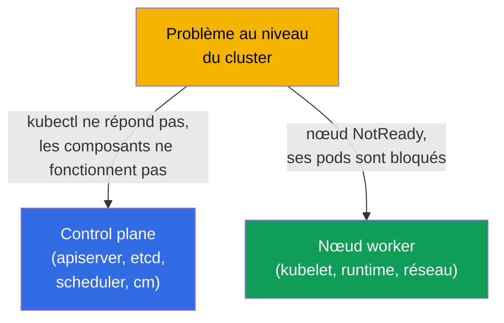
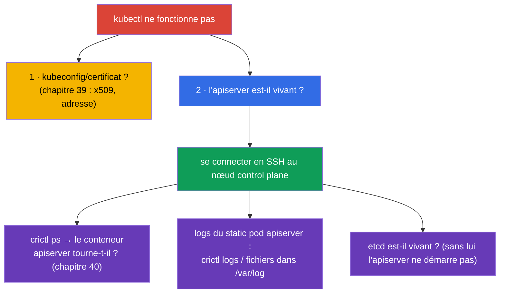
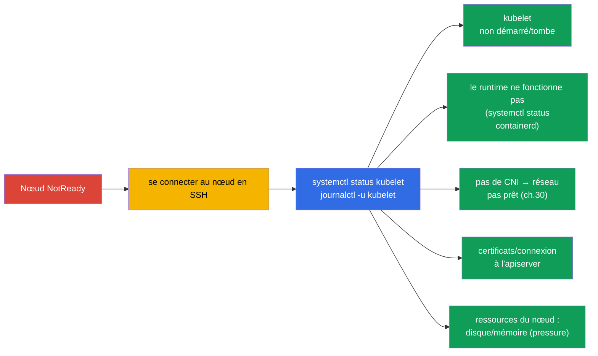
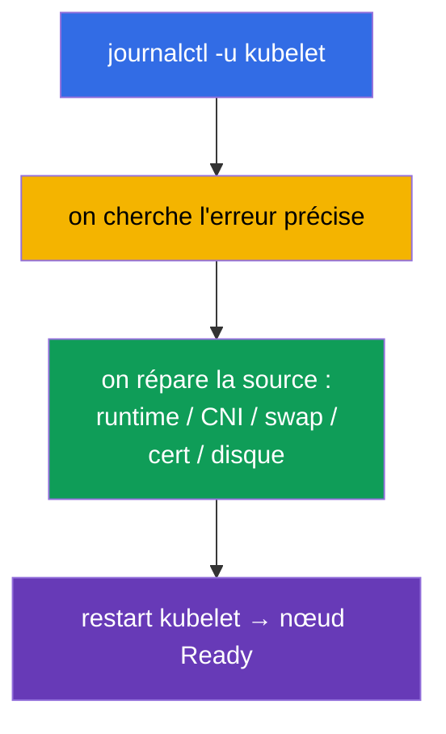
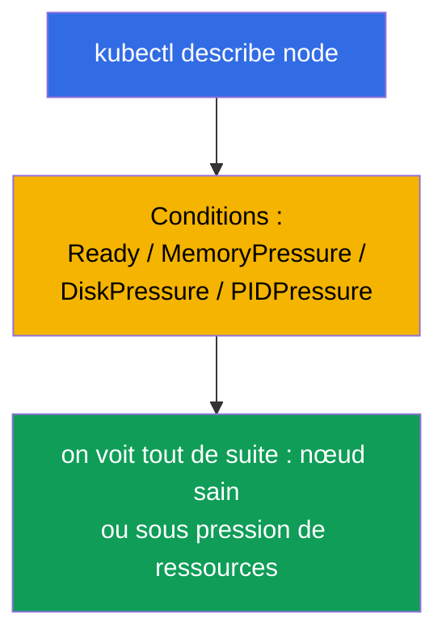

[Русская версия](ru.md) · [Eng version](README.md) · [Versión en español](es.md) · [Deutsche Version](de.md) · [ქართული ვერსია](ge.md) · [繁體中文版](tw.md) · [日本語版](jp.md)

# Chapitre 45. Déboguer le control plane et les nœuds worker

> 🟦 **Chapitre pour le CKA** (domaine Troubleshooting - 30%).
>
> **Ce qui suit.** Au chapitre précédent nous réparions les applications. Maintenant - le niveau du
> cluster : que faire quand le **control plane** est tombé (kubectl ne répond pas, les composants ne
> fonctionnent pas) ou qu'un **nœud** a décroché (NotReady). Ici reprend vie toute la carte des
> composants du chapitre 2 et le fait que le control plane, ce sont des static pods (chapitre 15). Ce
> sont les tâches les plus « effrayantes » du CKA, mais elles s'algorithmisent - étape par étape.

## 45.1. Deux niveaux de problèmes du cluster

On sépare le problème de control plane du problème de nœud - l'approche diffère :



Rappelons l'essentiel (chapitre 2) : les composants du control plane sont des **static pods** dans
`/etc/kubernetes/manifests/` (chapitre 15), tandis que kubelet et le runtime sont des **services
système** (`systemctl`/`journalctl`). Cela détermine où et comment les réparer.

## 45.2. Quand kubectl / l'API server ne répond pas

Si `kubectl` renvoie une erreur de connexion - tout le cluster est paralysé (chapitre 2). Mais
séparons d'abord le problème du client du problème du serveur :



Le réflexe clé : si l'API ne fonctionne pas, `kubectl` est inutile - on va sur le nœud control plane
et on regarde les conteneurs via **crictl** (chapitre 40), en contournant le cluster :

```bash
# sur le nœud control plane
sudo crictl ps -a | grep -E 'apiserver|etcd'    # les conteneurs tournent-ils
sudo crictl logs <id-apiserver>                  # logs de l'apiserver
sudo journalctl -u kubelet                        # kubelet, qui lance les static pods
```

Une cause fréquente de « l'apiserver ne démarre pas » - une **erreur dans son manifeste**
(`/etc/kubernetes/manifests/kube-apiserver.yaml`) : mauvais flag, port, chemin vers un certificat.
kubelet essaie de lancer le pod, celui-ci tombe - on regarde les logs et on corrige le manifeste.

## 45.3. Déboguer les composants static pod du control plane

Les composants du control plane se réparent via leurs manifestes. Cycle typique :


| Composant tombé | Symptôme | Où regarder |
|----------------|---------|--------------|
| kube-apiserver | kubectl ne répond pas | manifeste de l'apiserver, logs via crictl, etcd est-il vivant |
| etcd | l'apiserver ne démarre pas | manifeste d'etcd, `/var/lib/etcd`, certificats (chapitre 37) |
| kube-scheduler | nouveaux pods en Pending | manifeste du scheduler, ses logs |
| kube-controller-manager | pas d'auto-réparation (répliques, endpoints) | manifeste du cm, ses logs |

Rappelons-nous (chapitre 15) : modifier un manifeste dans `/etc/kubernetes/manifests/` force kubelet
à recréer le static pod automatiquement - pas besoin d'« appliquer » séparément.

## 45.4. Nœud NotReady : par où commencer

`kubectl get nodes` affiche `NotReady`. La cause est presque toujours le **kubelet** de ce nœud
(c'est lui qui rapporte l'état) ou quelque chose dont il dépend.



Ordre sur le nœud :

```bash
systemctl status kubelet          # kubelet est-il démarré
journalctl -u kubelet -f          # ses logs — la cause est presque toujours ici
systemctl status containerd       # le container runtime fonctionne-t-il (chapitre 40)
df -h                             # le disque est-il plein (disk-pressure)
free -m                           # mémoire
```

## 45.5. Causes typiques de NotReady

| Cause | Symptôme dans les logs kubelet | Solution |
|---------|-------------------------|---------|
| kubelet non démarré | service inactive/failed | `systemctl start/restart kubelet`, analyser la cause |
| swap activé | kubelet refuse de démarrer | `swapoff -a` (chapitre 35) |
| runtime tombé | erreurs CRI | redémarrer containerd |
| pas de CNI | `network plugin not ready` | installer/réparer le CNI (chapitre 30) |
| certificat/token | erreurs d'autorisation vers l'apiserver | vérifier kubelet.conf, les certificats (chapitre 39) |
| disk/memory pressure | taints pressure, éviction | libérer du disque/de la mémoire (chapitre 13) |



Les logs de kubelet (`journalctl -u kubelet`) sont la principale source de vérité en cas de
NotReady : la cause précise y est presque toujours écrite.

## 45.6. Outils de diagnostic du cluster

Quand l'API est vivante, les commandes de vue d'ensemble sont utiles :

```bash
kubectl get nodes -o wide                         # statuts des nœuds
kubectl describe node <node>                       # Conditions, taints, ressources, événements
kubectl get pods -n kube-system                    # composants du control plane et CoreDNS
kubectl get componentstatuses                      # (obsolète) statut des composants
kubectl get events -A --sort-by='.lastTimestamp'   # événements de tout le cluster
kubectl cluster-info                               # adresses des composants
```

`kubectl describe node` est particulièrement précieux : la section **Conditions** (Ready,
MemoryPressure, DiskPressure, PIDPressure) montre tout de suite ce qui ne va pas avec le nœud.



## 45.7. Comment cela s'applique en production

- **crictl - accès de secours.** Quand l'API/kubectl sont indisponibles, `crictl` et `journalctl` sur
  le nœud sont le seul moyen de voir ce qui se passe. C'est une compétence clé de l'astreinte dans
  les clusters self-managed.
- **La HA sauve le control plane.** En prod le control plane est en HA (chapitre 2), donc la chute
  d'un apiserver/etcd ne fait pas tomber le cluster mais laisse le temps de réparer le nœud. Un
  control plane unique est un point de défaillance unique, inadmissible en prod.
- **etcd - au centre de l'attention.** Les problèmes de control plane butent souvent sur etcd (disque
  lent, perte de quorum). etcd est surveillé de près et on garde des sauvegardes (chapitre 37) - au
  pire on restaure depuis un snapshot.
- **Récupération automatique des nœuds.** Dans le cloud, les nœuds en mauvaise santé sont souvent
  simplement remplacés (node auto-repair, recréation) plutôt que réparés à la main - pour du
  stateless c'est plus rapide. L'analyse manuelle d'un NotReady vaut pour l'on-prem et l'apprentissage.
- **Surveillance des Conditions et des services système.** En prod on met des alertes sur NotReady,
  les conditions pressure, l'indisponibilité de l'apiserver/etcd - pour attraper les problèmes de
  control plane et de nœuds avant qu'ils ne deviennent un incident.

## 45.8. Mini-glossaire

- **static pod** - composants du control plane lancés par kubelet depuis
  `/etc/kubernetes/manifests/` (chapitre 15).
- **crictl** - CLI vers les conteneurs via CRI sur le nœud ; fonctionne sans API (chapitre 40).
- **journalctl -u kubelet** - logs de kubelet, principale source des causes de NotReady.
- **NotReady** - statut d'un nœud quand kubelet ne rapporte pas sa disponibilité.
- **Conditions** - états du nœud (Ready, MemoryPressure, DiskPressure, PIDPressure).
- **pressure-taints** - taints automatiques en cas de manque de ressources du nœud (chapitre 13).
- **componentstatuses** - statut d'ensemble des composants (obsolète).

## 45.9. Bilan du chapitre

- On sépare les problèmes : control plane (kubectl/composants) vs nœud (NotReady) - l'approche
  diffère.
- Les composants du control plane sont des static pods dans `/etc/kubernetes/manifests/` ; on les
  répare en modifiant le manifeste (kubelet recrée le pod) ; les logs - via `crictl` sans API.
- Si l'apiserver ne démarre pas - la cause fréquente est une erreur dans son manifeste ; vérifier
  aussi etcd (sans lui l'apiserver ne démarre pas).
- NotReady concerne presque toujours kubelet : `systemctl status kubelet`, `journalctl -u kubelet` -
  la cause est là (kubelet, runtime, CNI, swap, certificats, disk/memory pressure).
- Diagnostic quand l'API est vivante : `describe node` (Conditions !), `get pods -n kube-system`,
  `get events -A`, `cluster-info`.
- crictl et journalctl sur le nœud - accès de secours, quand kubectl est inutile.

## 45.10. À quoi cela sert : à l'examen et dans le travail réel

**À l'examen (CKA).** « Répare le control plane / un composant », « nœud NotReady - débrouille-toi » -
des tâches de troubleshooting classiques et très bien notées (30%). Il faut connaître : les manifestes
dans `/etc/kubernetes/manifests/`, `crictl` pour les logs quand l'API est morte, `journalctl -u kubelet`
pour NotReady et les causes typiques. C'est l'application directe des chapitres 2, 15, 40.

**Dans le travail réel.** L'analyse des problèmes de control plane et de nœuds est la compétence qui
distingue un administrateur sûr de lui : savoir où regarder quand « tout est tombé », savoir travailler
sur le nœud via crictl/journalctl. La HA, les sauvegardes etcd et la surveillance des Conditions
transforment une catastrophe potentielle en incident maîtrisé.

## 45.11. Questions d'auto-évaluation

1. Comment distinguer un problème de control plane d'un problème de nœud et pourquoi l'approche diffère-t-elle ?
2. Que faire si `kubectl` ne répond pas ? Comment voir les logs de l'apiserver sans API ?
3. Comment répare-t-on les composants du control plane et pourquoi n'a-t-on pas besoin d'« appliquer » la modification du manifeste ?
4. Pourquoi faut-il aussi vérifier etcd quand l'apiserver est mort ?
5. Par où commencer l'analyse d'un nœud NotReady et où chercher la cause ?
6. Citez les causes typiques de NotReady et leurs solutions.
7. Que montre la section Conditions dans `describe node` ?

## Pratique

Nous avons analysé les pannes du cluster. Au chapitre 46 nous clôturerons le troubleshooting avec le
réseau - la partie la plus perfide. Le débogage du control plane et des nœuds se travaille dans les TP
d'administration et les examens blancs.

🧪 TP 117 (troubleshooting du control plane et des nœuds) : [tasks/cka/labs/117](../../labs/117/README_FR.MD)

🎮 Killercoda (dans le navigateur, sans installation) : [Troubleshoot a NotReady Node](https://killercoda.com/chadmcrowell/course/cka/node-notready) · [Kubelet Status](https://killercoda.com/chadmcrowell/course/cka/kubelet-status) · [Cordon and Drain the Node](https://killercoda.com/chadmcrowell/course/cka/cordon-drain-node)

---
[Sommaire](../README_FR.md) · [Chapitre 44](../44/fr.md) · [Chapitre 46](../46/fr.md)
