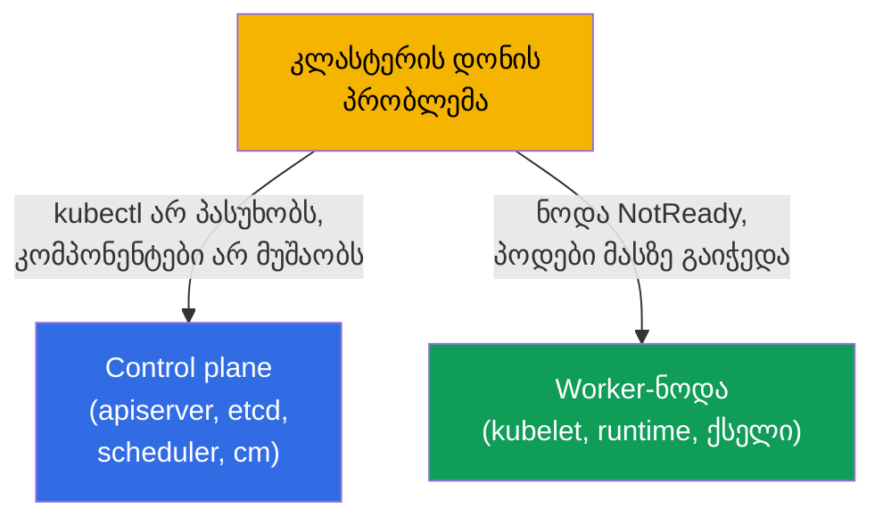
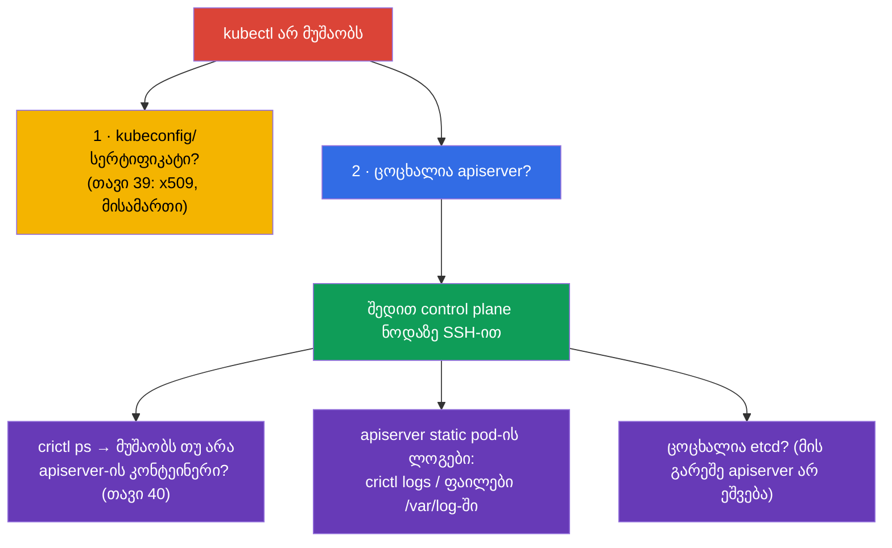
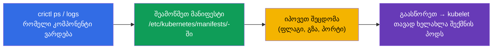
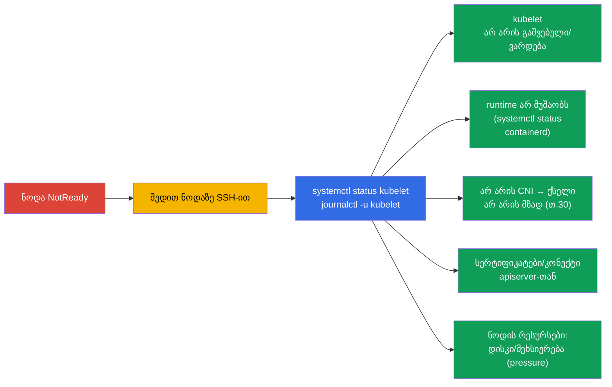
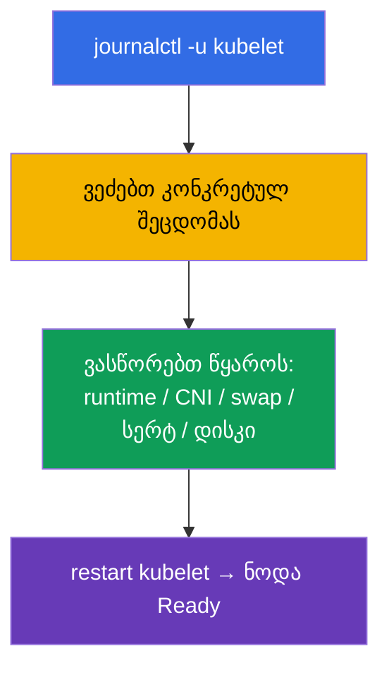
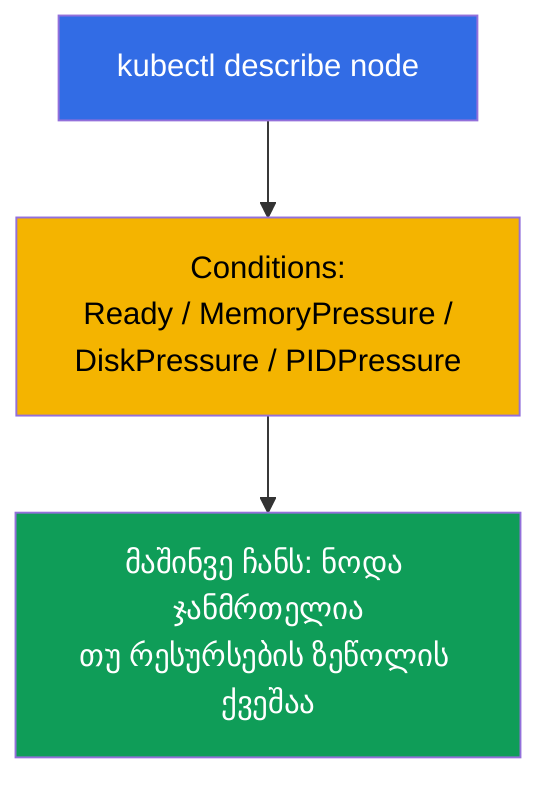

[Русская версия](ru.md) · [Eng version](README.md) · [Versión en español](es.md) · [Version française](fr.md) · [Deutsche Version](de.md) · [繁體中文版](tw.md) · [日本語版](jp.md)

# თავი 45. control plane-ისა და worker-ნოდების გამართვა

> 🟦 **თავი CKA-სთვის** (დომენი Troubleshooting - 30%).
>
> **რა იქნება შემდეგ.** წინა თავში აპლიკაციებს ვასწორებდით. ახლა - კლასტერის დონე: რა ვქნათ,
> როცა დაწვა **control plane** (kubectl არ პასუხობს, კომპონენტები არ მუშაობს) ან მოწყდა
> **ნოდა** (NotReady). აქ ცოცხლდება კომპონენტების მთელი რუკა თავი 2-იდან და ცოდნა, რომ control
> plane - ეს static pods-ია (თავი 15). ეს CKA-ის ყველაზე „საშიში“, მაგრამ ალგორითმიზებადი
> დავალებებია - ნაბიჯ-ნაბიჯ განვიხილავთ.

## 45.1. კლასტერის პრობლემების ორი დონე

გამოვარჩევთ control plane-ის პრობლემას ნოდის პრობლემისგან - მიდგომა მათთან განსხვავებულია:



გავიხსენოთ მთავარი (თავი 2): control plane-ის კომპონენტები - **static pods**
`/etc/kubernetes/manifests/`-ში (თავი 15), ხოლო kubelet და runtime - **სისტემური სერვისები**
(`systemctl`/`journalctl`). ეს განსაზღვრავს, სად და როგორ გავასწოროთ ისინი.

## 45.2. როცა kubectl / API-სერვერი არ პასუხობს

თუ `kubectl` კონექტის შეცდომას გვაძლევს - პარალიზებულია მთელი კლასტერი (თავი 2). მაგრამ პირველად
გამოვარჩიოთ კლიენტის პრობლემა სერვერის პრობლემისგან:



მთავარი ხერხი: თუ API არ მუშაობს, `kubectl` უსარგებლოა - მივდივართ control plane ნოდაზე და
ვუყურებთ კონტეინერებს **crictl**-ით (თავი 40), კლასტერის გვერდის ავლით:

```bash
# control plane ნოდაზე
sudo crictl ps -a | grep -E 'apiserver|etcd'    # მუშაობს თუ არა კონტეინერები
sudo crictl logs <id-apiserver>                  # apiserver-ის ლოგები
sudo journalctl -u kubelet                        # kubelet, რომელიც static pods-ს უშვებს
```

ხშირი მიზეზი „apiserver არ იშვება“ - **შეცდომა მის მანიფესტში**
(`/etc/kubernetes/manifests/kube-apiserver.yaml`): არასწორი ფლაგი, პორტი, სერტიფიკატის
გზა. kubelet ცდილობს პოდის აშვებას, ის ვარდება - ვუყურებთ ლოგებს და ვასწორებთ მანიფესტს.

## 45.3. control plane-ის static-pod კომპონენტების გამართვა

control plane-ის კომპონენტებს მათი მანიფესტებით ასწორებენ. ტიპური ციკლი:



| კომპონენტი დაეცა | სიმპტომი | სად ვუყუროთ |
|----------------|---------|--------------|
| kube-apiserver | kubectl არ პასუხობს | apiserver-ის მანიფესტი, ლოგები crictl-ით, ცოცხალია etcd |
| etcd | apiserver არ ეშვება | etcd-ის მანიფესტი, `/var/lib/etcd`, სერტიფიკატები (თავი 37) |
| kube-scheduler | ახალი პოდები Pending-ში | scheduler-ის მანიფესტი, მისი ლოგები |
| kube-controller-manager | არ არის თვითგამოსწორება (რეპლიკები, endpoints) | cm-ის მანიფესტი, მისი ლოგები |

გვახსოვდეს (თავი 15): მანიფესტის შესწორება `/etc/kubernetes/manifests/`-ში აიძულებს kubelet-ს
ავტომატურად ხელახლა შექმნას static pod - ცალკე „გამოყენება“ საჭირო არ არის.

## 45.4. ნოდა NotReady: საიდან დავიწყოთ

`kubectl get nodes` აჩვენებს `NotReady`. მიზეზი თითქმის ყოველთვის - **kubelet** ამ ნოდაზე
(ის აწვდის სტატუსს) ან ის, რაზეც ის არის დამოკიდებული.



რიგი ნოდაზე:

```bash
systemctl status kubelet          # გაშვებულია თუ არა kubelet
journalctl -u kubelet -f          # მისი ლოგები — თითქმის ყოველთვის მიზეზი აქ არის
systemctl status containerd       # მუშაობს თუ არა container runtime (თავი 40)
df -h                             # არ არის თუ არა დისკი გაჭედილი (disk-pressure)
free -m                           # მეხსიერება
```

## 45.5. NotReady-ის ტიპური მიზეზები

| მიზეზი | სიმპტომი kubelet-ის ლოგებში | გადაწყვეტა |
|---------|-------------------------|---------|
| kubelet არ არის გაშვებული | სერვისი inactive/failed | `systemctl start/restart kubelet`, გაარკვიეთ მიზეზი |
| swap ჩართულია | kubelet უარს ამბობს გაშვებაზე | `swapoff -a` (თავი 35) |
| runtime დაწვა | CRI-ის შეცდომები | გადატვირთეთ containerd |
| არ არის CNI | `network plugin not ready` | დააყენეთ/გაასწორეთ CNI (თავი 30) |
| სერტიფიკატი/ტოკენი | ავტორიზაციის შეცდომები apiserver-თან | შეამოწმეთ kubelet.conf, სერტიფიკატები (თავი 39) |
| disk/memory pressure | pressure taint-ები, ევიქშენი | გაათავისუფლეთ დისკი/მეხსიერება (თავი 13) |



kubelet-ის ლოგები (`journalctl -u kubelet`) - სიმართლის მთავარი წყაროა NotReady-ისას: იქ თითქმის
ყოველთვის წერია კონკრეტული მიზეზი.

## 45.6. კლასტერის დიაგნოსტიკის ინსტრუმენტები

როცა API ცოცხალია, სასარგებლოა მიმოხილვითი ბრძანებები:

```bash
kubectl get nodes -o wide                         # ნოდების სტატუსები
kubectl describe node <node>                       # Conditions, taints, რესურსები, მოვლენები
kubectl get pods -n kube-system                    # control plane-ის კომპონენტები და CoreDNS
kubectl get componentstatuses                      # (მოძველებულია) კომპონენტების სტატუსი
kubectl get events -A --sort-by='.lastTimestamp'   # მთელი კლასტერის მოვლენები
kubectl cluster-info                               # კომპონენტების მისამართები
```

`kubectl describe node` განსაკუთრებით ღირებულია: სექცია **Conditions** (Ready, MemoryPressure,
DiskPressure, PIDPressure) მაშინვე აჩვენებს, რა არ არის რიგზე ნოდასთან.



## 45.7. როგორ იყენებენ ამას პროდაქშენში

- **crictl - ავარიული წვდომა.** როცა API/kubectl ხელმისაწვდომი არაა, `crictl` და `journalctl`
  ნოდაზე - ერთადერთი გზაა დავინახოთ, რა ხდება. ეს მორიგის მთავარი უნარია
  self-managed კლასტერებში.
- **HA იხსნის control plane-ს.** პროდში control plane - HA-შია (თავი 2), ამიტომ ერთი
  apiserver/etcd-ის დაცემა კლასტერს არ ამხობს, არამედ დროს გვაძლევს კვანძის გასწორებისთვის. ერთი control plane -
  ავარიის ერთადერთი წერტილია, დაუშვებელი პროდში.
- **etcd - ყურადღების ცენტრში.** control plane-ის პრობლემები ხშირად etcd-ზე ჩერდება (ნელი
  დისკი, კვორუმის დაკარგვა). etcd-ს განსაკუთრებით აკვირდებიან და ბექაპებს ინახავენ (თავი 37) - უარეს
  სცენარში სნეპშოტიდან აღადგენენ.
- **ნოდების ავტომატური აღდგენა.** ღრუბელში არაჯანსაღ ნოდებს ხშირად უბრალოდ ცვლიან
  (node auto-repair, ხელახლა შექმნა), და არ ასწორებენ ხელით - stateless-დატვირთვებისთვის ეს
  უფრო სწრაფია. NotReady-ის ხელით განხილვა აქტუალურია on-prem-ისა და სწავლისთვის.
- **Conditions-ისა და სისტემური სერვისების მონიტორინგი.** პროდში ალერტებს ჰკიდებენ NotReady-ზე,
  pressure-პირობებზე, apiserver/etcd-ის მიუწვდომლობაზე - რომ control plane-ისა და
  ნოდების პრობლემები დავიჭიროთ მანამ, სანამ ისინი ინციდენტად იქცევა.

## 45.8. მინი-ლექსიკონი

- **static pod** - control plane-ის კომპონენტები, რომლებსაც kubelet უშვებს
  `/etc/kubernetes/manifests/`-იდან (თავი 15).
- **crictl** - CLI კონტეინერებთან CRI-ით ნოდაზე; მუშაობს API-ის გარეშე (თავი 40).
- **journalctl -u kubelet** - kubelet-ის ლოგები, NotReady-ის მიზეზების მთავარი წყარო.
- **NotReady** - ნოდის სტატუსი, როცა kubelet მზადყოფნას არ აწვდის.
- **Conditions** - ნოდის მდგომარეობები (Ready, MemoryPressure, DiskPressure, PIDPressure).
- **pressure-taints** - ავტომატური taint-ები ნოდის რესურსების უკმარისობისას (თავი 13).
- **componentstatuses** - კომპონენტების მიმოხილვითი სტატუსი (მოძველებულია).

## 45.9. თავის შეჯამება

- გამოვარჩევთ პრობლემებს: control plane (kubectl/კომპონენტები) vs ნოდა (NotReady) - მიდგომა
  განსხვავებულია.
- control plane-ის კომპონენტები - static pods `/etc/kubernetes/manifests/`-ში; ასწორებენ
  მანიფესტის შესწორებით (kubelet თავად ხელახლა შექმნის პოდს); ლოგები - `crictl`-ით, როცა API მიუწვდომელია.
- თუ apiserver არ იშვება - ხშირი მიზეზი შეცდომაა მის მანიფესტში; შეამოწმეთ etcd-იც
  (მის გარეშე apiserver არ ეშვება).
- NotReady თითქმის ყოველთვის kubelet-ზეა: `systemctl status kubelet`, `journalctl -u kubelet` -
  იქ არის მიზეზი (kubelet, runtime, CNI, swap, სერტიფიკატები, disk/memory pressure).
- დიაგნოსტიკა ცოცხალი API-ისას: `describe node` (Conditions!), `get pods -n kube-system`,
  `get events -A`, `cluster-info`.
- crictl და journalctl ნოდაზე - ავარიული წვდომა, როცა kubectl უსარგებლოა.

## 45.10. როგორ გამოგადგებათ: გამოცდაზე და რეალურ სამუშაოში

**გამოცდაზე (CKA).** „გაასწორე control plane / კომპონენტი“, „ნოდა NotReady - გაარკვიე“ -
troubleshooting-ის კლასიკური მაღალქულიანი დავალებებია (30%). საჭიროა ვიცოდეთ: მანიფესტები
`/etc/kubernetes/manifests/`-ში, `crictl` ლოგებისთვის მკვდარი API-ისას, `journalctl -u kubelet`
NotReady-ისთვის და ტიპური მიზეზები. ეს თავები 2, 15, 40-ის პირდაპირი გამოყენებაა.

**რეალურ სამუშაოში.** control plane-ისა და ნოდების პრობლემების განხილვა - უნარია, რომელიც გამოარჩევს
თავდაჯერებულ ადმინისტრატორს: ვიცოდეთ, სად ვუყუროთ, როცა „ყველაფერი დაწვა“, შეგვეძლოს ნოდაზე მუშაობა
crictl/journalctl-ით. HA, etcd-ის ბექაპები და Conditions-ის მონიტორინგი პოტენციურ
კატასტროფას მართვად ინციდენტად აქცევს.

## 45.11. თვითშემოწმების კითხვები

1. როგორ გამოვარჩიოთ control plane-ის პრობლემა ნოდის პრობლემისგან და რატომ არის მიდგომა განსხვავებული?
2. რა ვქნათ, თუ `kubectl` არ პასუხობს? როგორ ვნახოთ apiserver-ის ლოგები API-ის გარეშე?
3. როგორ ასწორებენ control plane-ის კომპონენტებს და რატომ არ არის საჭირო მანიფესტის შესწორების „გამოყენება“?
4. რატომ უნდა შევამოწმოთ etcd-იც მკვდარი apiserver-ისას?
5. საიდან დავიწყოთ NotReady ნოდის განხილვა და სად ვეძებოთ მიზეზი?
6. დაასახელეთ NotReady-ის ტიპური მიზეზები და მათი გადაწყვეტები.
7. რას აჩვენებს სექცია Conditions `describe node`-ში?

## პრაქტიკა

ჩვენ განვიხილეთ კლასტერის ავარიები. თავ 46-ში troubleshooting-ს ქსელით დავხურავთ - ყველაზე მზაკვრული
ნაწილით. control plane-ისა და ნოდების გამართვა მუშავდება ადმინისტრირების ლაბორატორიულებსა და
მოკ-გამოცდებში.

🧪 ლაბი 117 (control plane-ისა და ნოდების troubleshooting): [tasks/cka/labs/117](../../labs/117/README_GE.MD)

🎮 Killercoda (ბრაუზერში, ინსტალაციის გარეშე): [Troubleshoot a NotReady Node](https://killercoda.com/chadmcrowell/course/cka/node-notready) · [Kubelet Status](https://killercoda.com/chadmcrowell/course/cka/kubelet-status) · [Cordon and Drain the Node](https://killercoda.com/chadmcrowell/course/cka/cordon-drain-node)

---
[სარჩევი](../README_GE.md) · [თავი 44](../44/ge.md) · [თავი 46](../46/ge.md)
