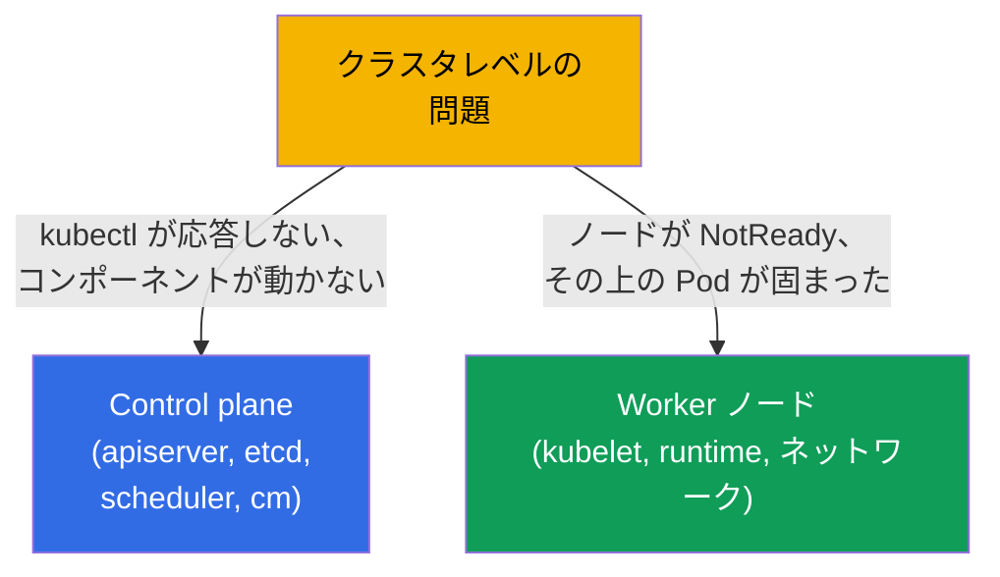
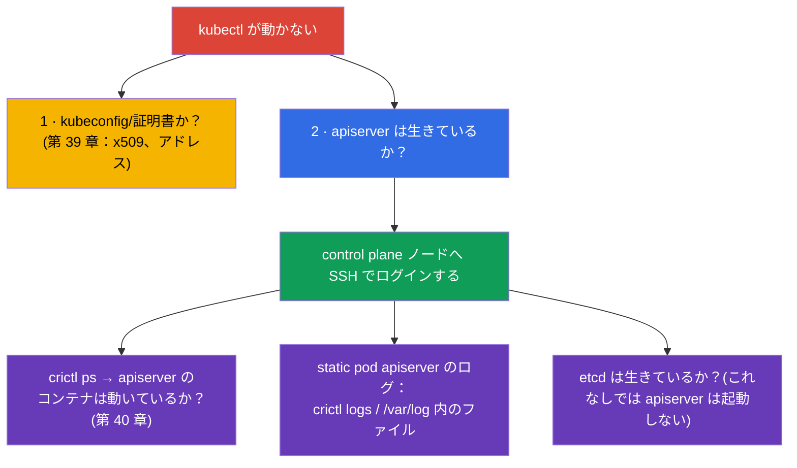
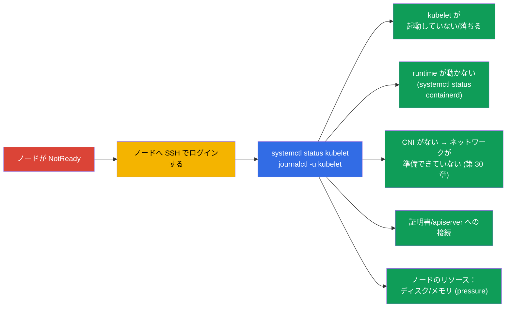
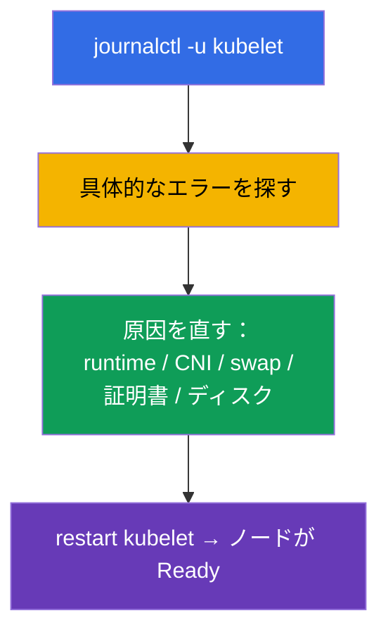
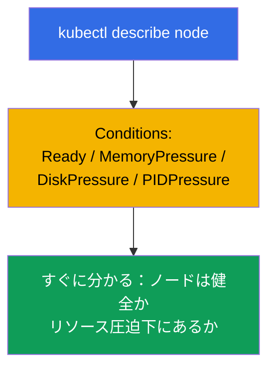

[Русская версия](ru.md) · [Eng version](README.md) · [Versión en español](es.md) · [Version française](fr.md) · [Deutsche Version](de.md) · [ქართული ვერსია](ge.md) · [繁體中文版](tw.md)

# 第 45 章。control plane と worker ノードのデバッグ

> 🟦 **CKA 向けの章**（Troubleshooting 領域 - 30%）。
>
> **次に何を学ぶか。** 前の章ではアプリケーションを直しました。今度はクラスタのレベルです：
> **control plane** が落ちたとき（kubectl が応答しない、コンポーネントが動かない）、あるいは
> **ノード** が外れたとき（NotReady）に何をするか。ここで第 2 章のコンポーネントの地図の
> すべてと、control plane は static pods である（第 15 章）という知識が生きてきます。CKA で
> もっとも「怖い」けれどもアルゴリズム化できる問題です - 手順に分けて見ていきましょう。

## 45.1. クラスタの問題の 2 つのレベル

control plane の問題とノードの問題を切り分けます - アプローチが違うからです：



重要な点を思い出しましょう（第 2 章）：control plane のコンポーネントは
`/etc/kubernetes/manifests/` にある **static pods**（第 15 章）で、kubelet と runtime は
**システムサービス**（`systemctl`/`journalctl`）です。これが、どこでどう直すかを決めます。

## 45.2. kubectl / API サーバーが応答しないとき

`kubectl` が接続エラーを出すなら、クラスタ全体が麻痺しています（第 2 章）。ただしまず
クライアント側の問題とサーバー側の問題を切り分けます：



鍵となる手法：API が動かないなら `kubectl` は役に立ちません - control plane ノードへ行き、
クラスタを経由せずに **crictl**（第 40 章）でコンテナを見ます：

```bash
# control plane ノード上で
sudo crictl ps -a | grep -E 'apiserver|etcd'    # コンテナは動いているか
sudo crictl logs <id-apiserver>                  # apiserver のログ
sudo journalctl -u kubelet                        # static pods を立ち上げる kubelet
```

「apiserver が立ち上がらない」のよくある原因は **そのマニフェストの誤り**
(`/etc/kubernetes/manifests/kube-apiserver.yaml`) です：フラグ、ポート、証明書のパスの
間違い。kubelet は Pod を立ち上げようとしますが落ちます - ログを見てマニフェストを直します。

## 45.3. control plane の static pod コンポーネントのデバッグ

control plane のコンポーネントはマニフェストを通して直します。典型的なサイクル：


| 落ちたコンポーネント | 症状 | どこを見るか |
|----------------|---------|--------------|
| kube-apiserver | kubectl が応答しない | apiserver のマニフェスト、crictl 経由のログ、etcd は生きているか |
| etcd | apiserver が起動しない | etcd のマニフェスト、`/var/lib/etcd`、証明書（第 37 章） |
| kube-scheduler | 新しい Pod が Pending のまま | scheduler のマニフェスト、そのログ |
| kube-controller-manager | 自己修復が働かない（レプリカ、endpoints） | cm のマニフェスト、そのログ |

覚えておきましょう（第 15 章）：`/etc/kubernetes/manifests/` のマニフェストを修正すると、
kubelet が static pod を自動で作り直します - 別途「適用」する必要はありません。

## 45.4. ノードが NotReady：どこから始めるか

`kubectl get nodes` が `NotReady` を示します。原因はほぼ常にそのノードの **kubelet**
（ステータスを報告しているのはこれです）か、それが依存しているものです。



ノード上での順番：

```bash
systemctl status kubelet          # kubelet は起動しているか
journalctl -u kubelet -f          # そのログ — 原因はほぼ常にここにある
systemctl status containerd       # container runtime は動いているか (第 40 章)
df -h                             # ディスクが埋まっていないか (disk-pressure)
free -m                           # メモリ
```

## 45.5. NotReady の典型的な原因

| 原因 | kubelet のログでの症状 | 解決 |
|---------|-------------------------|---------|
| kubelet が起動していない | サービスが inactive/failed | `systemctl start/restart kubelet`、原因を調べる |
| swap が有効 | kubelet が起動を拒否する | `swapoff -a`（第 35 章） |
| runtime が落ちた | CRI のエラー | containerd を再起動する |
| CNI がない | `network plugin not ready` | CNI をインストール/修復する（第 30 章） |
| 証明書/トークン | apiserver への認可エラー | kubelet.conf、証明書を確認する（第 39 章） |
| disk/memory pressure | pressure の taint、エヴィクション | ディスク/メモリを解放する（第 13 章） |



kubelet のログ (`journalctl -u kubelet`) は NotReady のときの主な真実の源です：そこには
ほぼ常に具体的な原因が書かれています。

## 45.6. クラスタ診断のツール

API が生きているときは、概観をつかむコマンドが役に立ちます：

```bash
kubectl get nodes -o wide                         # ノードのステータス
kubectl describe node <node>                       # Conditions、taints、リソース、イベント
kubectl get pods -n kube-system                    # control plane のコンポーネントと CoreDNS
kubectl get componentstatuses                      # (非推奨化) コンポーネントのステータス
kubectl get events -A --sort-by='.lastTimestamp'   # クラスタ全体のイベント
kubectl cluster-info                               # コンポーネントのアドレス
```

`kubectl describe node` はとくに価値があります：**Conditions** のセクション（Ready、
MemoryPressure、DiskPressure、PIDPressure）が、ノードの何がおかしいのかをすぐに示します。



## 45.7. 本番環境でこれをどう使うか

- **crictl は緊急時のアクセス手段。** API/kubectl が使えないとき、ノード上の `crictl` と
  `journalctl` が何が起きているかを見る唯一の方法です。self-managed のクラスタでは
  オンコール担当の中心的なスキルです。
- **HA が control plane を救う。** 本番では control plane は HA 構成にします（第 2 章）。
  だから 1 つの apiserver/etcd が落ちてもクラスタは倒れず、ノードを直す時間ができます。
  control plane が 1 台なら単一障害点であり、本番では許容できません。
- **etcd は注目の的。** control plane の問題はしばしば etcd に行き着きます（遅いディスク、
  クォーラムの喪失）。etcd はとくに注意して監視し、バックアップを保持します（第 37 章） -
  最悪のシナリオではスナップショットから復元します。
- **ノードの自動復旧。** クラウドでは不健全なノードは手作業で直すのではなく単に置き換える
  ことが多いです（node auto-repair、作り直し） - stateless なワークロードならそのほうが
  速いからです。NotReady の手作業での調査は on-prem と学習で意味があります。
- **Conditions とシステムサービスの監視。** 本番では NotReady、pressure の条件、
  apiserver/etcd の不到達にアラートを設定します - control plane とノードの問題を、
  インシデントになる前に捕まえるためです。

## 45.8. ミニ用語集

- **static pod** - kubelet が `/etc/kubernetes/manifests/` から立ち上げる control plane の
  コンポーネント（第 15 章）。
- **crictl** - ノード上で CRI を通してコンテナを扱う CLI。API なしで動きます（第 40 章）。
- **journalctl -u kubelet** - kubelet のログ。NotReady の原因を知る主な源。
- **NotReady** - kubelet が準備完了を報告していないときのノードのステータス。
- **Conditions** - ノードの状態（Ready、MemoryPressure、DiskPressure、PIDPressure）。
- **pressure-taints** - ノードのリソース不足のときに自動で付く taint（第 13 章）。
- **componentstatuses** - コンポーネントの概観ステータス（非推奨化）。

## 45.9. 本章のまとめ

- 問題を切り分けます：control plane（kubectl/コンポーネント）と ノード（NotReady） -
  アプローチは違います。
- control plane のコンポーネントは `/etc/kubernetes/manifests/` の static pods。マニフェストを
  修正して直します（kubelet が Pod を自分で作り直す）。API が使えないときのログは `crictl` 経由。
- apiserver が立ち上がらないなら、よくある原因はそのマニフェストの誤りです。etcd も確認します
  （これなしでは apiserver は起動しません）。
- NotReady はほぼ常に kubelet に関わります：`systemctl status kubelet`、`journalctl -u kubelet` -
  そこに原因があります（kubelet、runtime、CNI、swap、証明書、disk/memory pressure）。
- API が生きているときの診断：`describe node`（Conditions！）、`get pods -n kube-system`、
  `get events -A`、`cluster-info`。
- ノード上の crictl と journalctl は、kubectl が役に立たないときの緊急アクセス手段です。

## 45.10. これがどう役に立つか：試験と実際の仕事で

**試験では (CKA)。** 「control plane / コンポーネントを直せ」「ノードが NotReady - 調べろ」は
troubleshooting（30%）の古典的な高配点問題です。知っておくべきこと：
`/etc/kubernetes/manifests/` のマニフェスト、API が死んでいるときにログを見る `crictl`、
NotReady のための `journalctl -u kubelet`、そして典型的な原因。これは第 2、15、40 章の直接の応用です。

**実際の仕事では。** control plane とノードの問題の調査は、自信のある管理者を分けるスキルです：
「全部落ちた」ときにどこを見るかを知り、ノード上で crictl/journalctl を使って作業できること。
HA、etcd のバックアップ、Conditions の監視が、起こりうる大災害を管理可能なインシデントに変えます。

## 45.11. 自己チェックの質問

1. control plane の問題とノードの問題はどう区別し、なぜアプローチが違うのですか？
2. `kubectl` が応答しないときは何をしますか？API なしで apiserver のログをどう見ますか？
3. control plane のコンポーネントはどう直し、なぜマニフェストの修正を「適用」する必要がないのですか？
4. apiserver が死んでいるとき、なぜ etcd も確認すべきなのですか？
5. NotReady のノードの調査はどこから始め、原因はどこで探しますか？
6. NotReady の典型的な原因とその解決を挙げてください。
7. `describe node` の Conditions のセクションは何を示しますか？

## 演習

クラスタの障害を見てきました。第 46 章では、もっとも厄介な部分であるネットワークで
troubleshooting を締めます。control plane とノードのデバッグは、管理系のラボと
模擬試験で練習します。

🧪 ラボ 117 (control plane とノードの troubleshooting)：[tasks/cka/labs/117](../../labs/117/README_JP.MD)

---
[目次](../README_JP.md) · [第 44 章](../44/jp.md) · [第 46 章](../46/jp.md)
