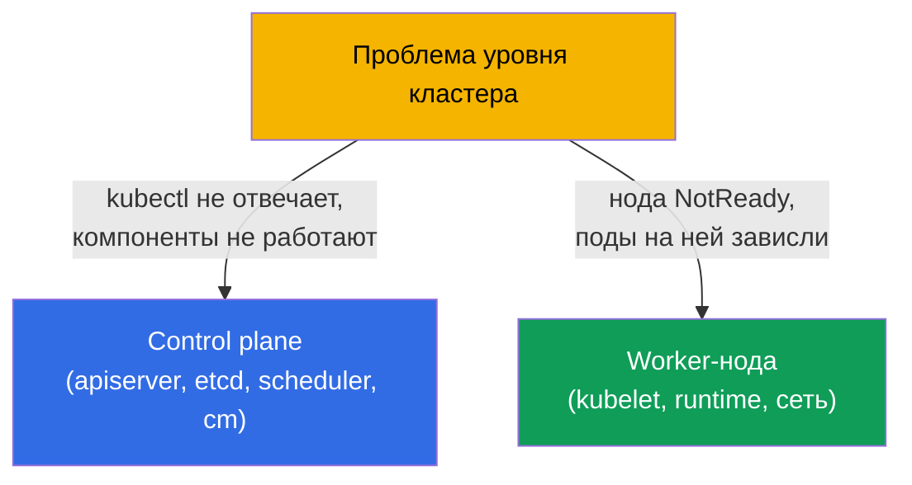
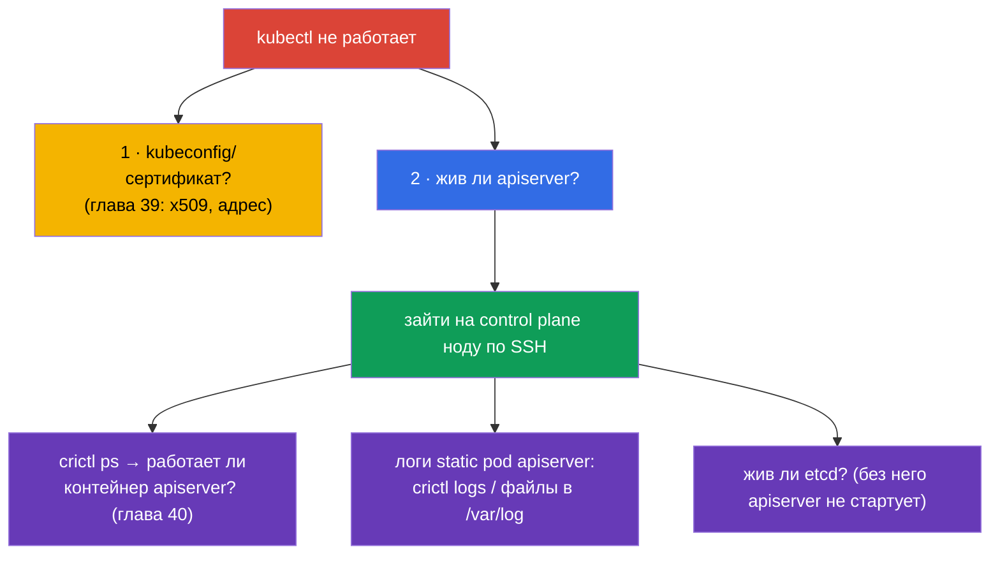
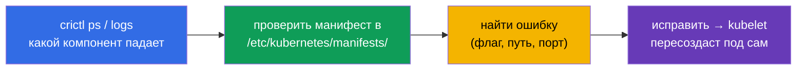
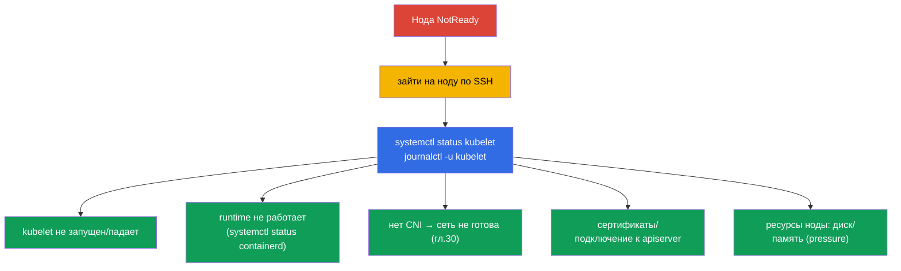
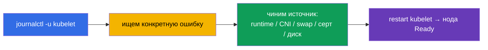
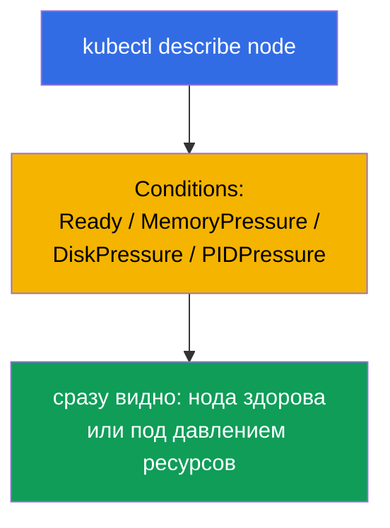

# Глава 45. Отладка control plane и worker-нод

> 🟦 **Глава для CKA** (домен Troubleshooting - 30%).
>
> **Что дальше.** В прошлой главе чинили приложения. Теперь - уровень кластера: что делать,
> когда лёг **control plane** (kubectl не отвечает, компоненты не работают) или отвалилась
> **нода** (NotReady). Здесь оживает вся карта компонентов из главы 2 и знание, что control
> plane - это static pods (глава 15). Это самые «страшные», но алгоритмизируемые задания
> CKA - разберём их по шагам.

## 45.1. Два уровня проблем кластера

Отделяем проблему control plane от проблемы ноды - подход к ним разный:



Вспомним ключевое (глава 2): компоненты control plane - **static pods** в
`/etc/kubernetes/manifests/` (глава 15), а kubelet и runtime - **системные сервисы**
(`systemctl`/`journalctl`). Это определяет, где и как их чинить.

## 45.2. Когда не отвечает kubectl / API-сервер

Если `kubectl` выдаёт ошибку соединения - парализован весь кластер (глава 2). Но сначала
отделим проблему клиента от проблемы сервера:



Ключевой приём: если API не работает, `kubectl` бесполезен - идём на control plane ноду и
смотрим контейнеры через **crictl** (глава 40), минуя кластер:

```bash
# на control plane ноде
sudo crictl ps -a | grep -E 'apiserver|etcd'    # работают ли контейнеры
sudo crictl logs <id-apiserver>                  # логи apiserver
sudo journalctl -u kubelet                        # kubelet, который поднимает static pods
```

Частая причина «apiserver не поднимается» - **ошибка в его манифесте**
(`/etc/kubernetes/manifests/kube-apiserver.yaml`): неверный флаг, порт, путь к
сертификату. kubelet пытается поднять под, тот падает - смотрим логи и правим манифест.

## 45.3. Отладка static-pod компонентов control plane

Компоненты control plane чинят через их манифесты. Типовой цикл:



| Компонент упал | Симптом | Где смотреть |
|----------------|---------|--------------|
| kube-apiserver | kubectl не отвечает | манифест apiserver, логи через crictl, жив ли etcd |
| etcd | apiserver не стартует | манифест etcd, `/var/lib/etcd`, сертификаты (глава 37) |
| kube-scheduler | новые поды в Pending | манифест scheduler, его логи |
| kube-controller-manager | нет самоисправления (реплики, endpoints) | манифест cm, его логи |

Помним (глава 15): правка манифеста в `/etc/kubernetes/manifests/` заставляет kubelet
пересоздать static pod автоматически - отдельно «применять» не нужно.

## 45.4. Нода NotReady: с чего начать

`kubectl get nodes` показывает `NotReady`. Причина почти всегда - **kubelet** на этой ноде
(он докладывает статус) или то, от чего он зависит.



Порядок на ноде:

```bash
systemctl status kubelet          # запущен ли kubelet
journalctl -u kubelet -f          # его логи — почти всегда причина здесь
systemctl status containerd       # работает ли container runtime (глава 40)
df -h                             # не забит ли диск (disk-pressure)
free -m                           # память
```

## 45.5. Типовые причины NotReady

| Причина | Симптом в логах kubelet | Решение |
|---------|-------------------------|---------|
| kubelet не запущен | сервис inactive/failed | `systemctl start/restart kubelet`, разобрать причину |
| swap включён | kubelet отказывается стартовать | `swapoff -a` (глава 35) |
| runtime лёг | ошибки CRI | перезапустить containerd |
| нет CNI | `network plugin not ready` | установить/починить CNI (глава 30) |
| сертификат/токен | ошибки авторизации к apiserver | проверить kubelet.conf, сертификаты (глава 39) |
| disk/memory pressure | таинты pressure, эвикшн | освободить диск/память (глава 13) |



Логи kubelet (`journalctl -u kubelet`) - главный источник истины при NotReady: там почти
всегда написана конкретная причина.

## 45.6. Инструменты диагностики кластера

Когда API жив, полезны обзорные команды:

```bash
kubectl get nodes -o wide                         # статусы нод
kubectl describe node <node>                       # Conditions, taints, ресурсы, события
kubectl get pods -n kube-system                    # компоненты control plane и CoreDNS
kubectl get componentstatuses                      # (устаревает) статус компонентов
kubectl get events -A --sort-by='.lastTimestamp'   # события всего кластера
kubectl cluster-info                               # адреса компонентов
```

`kubectl describe node` особенно ценен: раздел **Conditions** (Ready, MemoryPressure,
DiskPressure, PIDPressure) сразу показывает, что не так с нодой.



## 45.7. Как это применяют в продакшене

- **crictl - аварийный доступ.** Когда API/kubectl недоступны, `crictl` и `journalctl` на
  ноде - единственный способ увидеть, что происходит. Это ключевой навык дежурного в
  self-managed кластерах.
- **HA спасает control plane.** В проде control plane - в HA (глава 2), поэтому падение
  одного apiserver/etcd не роняет кластер, а даёт время починить узел. Один control plane -
  единая точка отказа, недопустимая в проде.
- **etcd - в центре внимания.** Проблемы control plane часто упираются в etcd (медленный
  диск, потеря кворума). За etcd следят особо и держат бэкапы (глава 37) - при худшем
  сценарии восстанавливают из снапшота.
- **Автоматическое восстановление нод.** В облаке нездоровые ноды часто просто заменяют
  (node auto-repair, пересоздание), а не чинят вручную - для stateless-нагрузок это
  быстрее. Ручной разбор NotReady актуален для on-prem и обучения.
- **Мониторинг Conditions и системных сервисов.** В проде алерты вешают на NotReady,
  pressure-условия, недоступность apiserver/etcd - чтобы ловить проблемы control plane и
  нод до того, как они станут инцидентом.

## 45.8. Мини-глоссарий

- **static pod** - компоненты control plane, поднимаемые kubelet из
  `/etc/kubernetes/manifests/` (глава 15).
- **crictl** - CLI к контейнерам через CRI на ноде; работает без API (глава 40).
- **journalctl -u kubelet** - логи kubelet, главный источник причин NotReady.
- **NotReady** - статус ноды, когда kubelet не докладывает готовность.
- **Conditions** - состояния ноды (Ready, MemoryPressure, DiskPressure, PIDPressure).
- **pressure-taints** - автоматические taints при нехватке ресурсов ноды (глава 13).
- **componentstatuses** - обзорный статус компонентов (устаревает).

## 45.9. Итоги главы

- Разделяем проблемы: control plane (kubectl/компоненты) vs нода (NotReady) - подход
  разный.
- Компоненты control plane - static pods в `/etc/kubernetes/manifests/`; чинят правкой
  манифеста (kubelet пересоздаёт под сам); логи - через `crictl`, когда API недоступен.
- Если apiserver не поднимается - частая причина ошибка в его манифесте; проверять и etcd
  (без него apiserver не стартует).
- NotReady почти всегда про kubelet: `systemctl status kubelet`, `journalctl -u kubelet` -
  там причина (kubelet, runtime, CNI, swap, сертификаты, disk/memory pressure).
- Диагностика при живом API: `describe node` (Conditions!), `get pods -n kube-system`,
  `get events -A`, `cluster-info`.
- crictl и journalctl на ноде - аварийный доступ, когда kubectl бесполезен.

## 45.10. Как это пригодится: на экзамене и в реальной работе

**На экзамене (CKA).** «Почини control plane / компонент», «нода NotReady - разберись» -
классические высокобалльные задания troubleshooting (30%). Нужно знать: манифесты в
`/etc/kubernetes/manifests/`, `crictl` для логов при мёртвом API, `journalctl -u kubelet`
для NotReady и типовые причины. Это прямое применение глав 2, 15, 40.

**В реальной работе.** Разбор проблем control plane и нод - навык, который отделяет
уверенного администратора: знать, где смотреть, когда «всё легло», уметь работать на ноде
через crictl/journalctl. HA, бэкапы etcd и мониторинг Conditions превращают потенциальную
катастрофу в управляемый инцидент.

## 45.11. Вопросы для самопроверки

1. Как отличить проблему control plane от проблемы ноды и почему подход разный?
2. Что делать, если `kubectl` не отвечает? Как посмотреть логи apiserver без API?
3. Как чинят компоненты control plane и почему не нужно «применять» правку манифеста?
4. Почему при мёртвом apiserver надо проверить и etcd?
5. С чего начать разбор ноды NotReady и где искать причину?
6. Назовите типовые причины NotReady и их решения.
7. Что показывает раздел Conditions в `describe node`?

## Практика

Мы разобрали сбои кластера. В главе 46 закроем troubleshooting сетью - самой коварной
частью. Отладка control plane и нод отрабатывается в лабах по администрированию и
мок-экзаменах.

🧪 Лаба 117 (troubleshooting control plane и нод): [tasks/cka/labs/117](../../labs/117/README_RU.MD)

---
[Оглавление](../README_RU.md) · [Глава 44](../44/ru.md) · [Глава 46](../46/ru.md)
