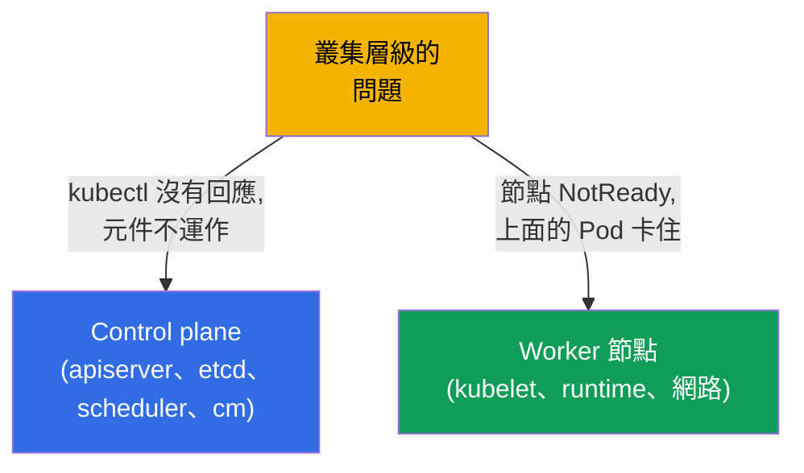
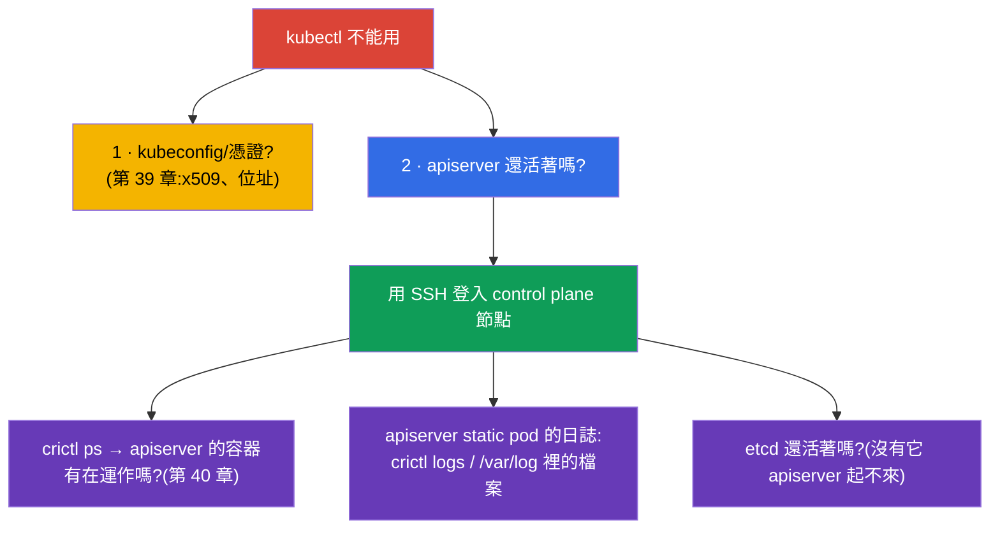
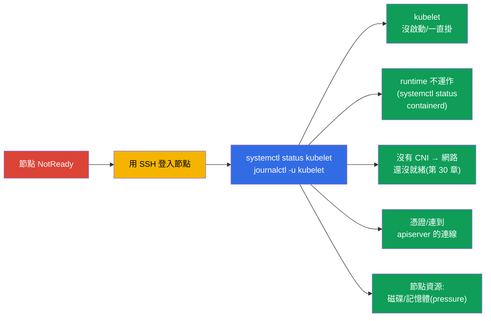
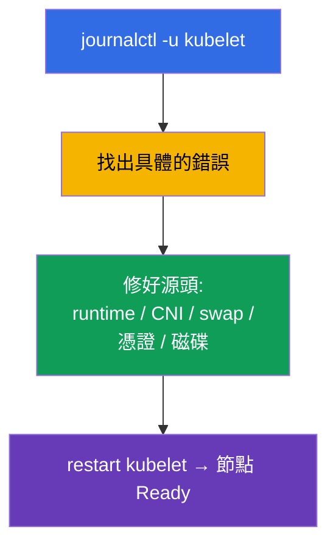
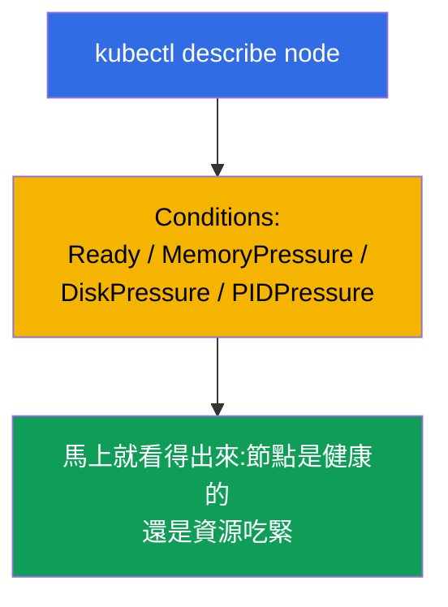

[Русская версия](ru.md) · [Eng version](README.md) · [Versión en español](es.md) · [Version française](fr.md) · [Deutsche Version](de.md) · [ქართული ვერსია](ge.md) · [日本語版](jp.md)

# 第 45 章。control plane 與 worker 節點的除錯

> 🟦 **CKA 章節**(Troubleshooting 領域 - 30%)。
>
> **接下來是什麼。** 上一章我們修的是應用程式。現在來到叢集層級:當 **control plane**
> 掛掉(kubectl 沒有回應、元件不運作)或是 **節點** 掉了(NotReady)時該怎麼做。
> 第 2 章那張元件地圖,以及 control plane 就是 static pods 這件事(第 15 章),在這裡
> 全部活了起來。這是 CKA 裡最「可怕」但其實可以照演算法處理的題目 - 我們一步一步拆解。

## 45.1. 叢集問題的兩個層級

把 control plane 的問題跟節點的問題分開 - 處理方式完全不同:



回想關鍵的一點(第 2 章):control plane 元件是 `/etc/kubernetes/manifests/` 裡的
**static pods**(第 15 章),而 kubelet 與 runtime 是 **系統服務**
(`systemctl`/`journalctl`)。這決定了要在哪裡、用什麼方式修它們。

## 45.2. 當 kubectl / API server 沒有回應時

如果 `kubectl` 回報連線錯誤 - 整個叢集就癱瘓了(第 2 章)。但先把客戶端的問題跟伺服器
的問題分開:



關鍵手法:如果 API 不能用,`kubectl` 就沒有意義 - 直接登入 control plane 節點,繞過叢集
用 **crictl**(第 40 章)看容器:

```bash
# 在 control plane 節點上
sudo crictl ps -a | grep -E 'apiserver|etcd'    # 容器有在運作嗎
sudo crictl logs <id-apiserver>                  # apiserver 的日誌
sudo journalctl -u kubelet                        # 負責拉起 static pods 的 kubelet
```

「apiserver 起不來」常見的原因是 **它的清單檔寫錯**
(`/etc/kubernetes/manifests/kube-apiserver.yaml`):旗標不對、埠不對、憑證路徑不對。
kubelet 想把 Pod 拉起來,它卻一直掛 - 那就看日誌、然後修清單檔。

## 45.3. control plane 的 static pod 元件除錯

control plane 元件是透過它們的清單檔來修的。典型的循環:


| 掛掉的元件 | 症狀 | 該看哪裡 |
|----------------|---------|--------------|
| kube-apiserver | kubectl 沒有回應 | apiserver 的清單檔、用 crictl 看日誌、etcd 還活著嗎 |
| etcd | apiserver 起不來 | etcd 的清單檔、`/var/lib/etcd`、憑證(第 37 章) |
| kube-scheduler | 新的 Pod 停在 Pending | scheduler 的清單檔、它的日誌 |
| kube-controller-manager | 沒有自我修復(副本、endpoints) | cm 的清單檔、它的日誌 |

記得(第 15 章):修改 `/etc/kubernetes/manifests/` 裡的清單檔會讓 kubelet 自動重建
static pod - 不需要另外「apply」。

## 45.4. 節點 NotReady:從哪裡開始

`kubectl get nodes` 顯示 `NotReady`。原因幾乎都是那個節點上的 **kubelet**
(狀態是它回報的),或是它所依賴的東西。



在節點上的順序:

```bash
systemctl status kubelet          # kubelet 有啟動嗎
journalctl -u kubelet -f          # 它的日誌 — 原因幾乎都在這裡
systemctl status containerd       # container runtime 有在運作嗎(第 40 章)
df -h                             # 磁碟是不是滿了(disk-pressure)
free -m                           # 記憶體
```

## 45.5. NotReady 的典型原因

| 原因 | kubelet 日誌裡的症狀 | 解法 |
|---------|-------------------------|---------|
| kubelet 沒啟動 | 服務 inactive/failed | `systemctl start/restart kubelet`,再查清楚原因 |
| swap 是開著的 | kubelet 拒絕啟動 | `swapoff -a`(第 35 章) |
| runtime 掛了 | CRI 錯誤 | 重新啟動 containerd |
| 沒有 CNI | `network plugin not ready` | 安裝/修好 CNI(第 30 章) |
| 憑證/token | 對 apiserver 的授權錯誤 | 檢查 kubelet.conf、憑證(第 39 章) |
| disk/memory pressure | pressure taints、驅逐 | 釋放磁碟/記憶體(第 13 章) |



kubelet 的日誌(`journalctl -u kubelet`)是 NotReady 時最主要的真相來源:具體原因幾乎
都寫在那裡。

## 45.6. 叢集診斷工具

當 API 還活著的時候,這些概覽用的命令很有用:

```bash
kubectl get nodes -o wide                         # 節點狀態
kubectl describe node <node>                       # Conditions、taints、資源、事件
kubectl get pods -n kube-system                    # control plane 元件與 CoreDNS
kubectl get componentstatuses                      # (即將淘汰)元件狀態
kubectl get events -A --sort-by='.lastTimestamp'   # 整個叢集的事件
kubectl cluster-info                               # 元件的位址
```

`kubectl describe node` 特別有價值:**Conditions** 區段(Ready、MemoryPressure、
DiskPressure、PIDPressure)會立刻告訴你這個節點出了什麼問題。



## 45.7. 這在生產環境中如何應用

- **crictl 是緊急通道。** 當 API/kubectl 不可用時,節點上的 `crictl` 與 `journalctl`
  是唯一能看見發生什麼事的方式。這是 self-managed 叢集值班人員的關鍵技能。
- **HA 救得了 control plane。** 生產環境的 control plane 是 HA 的(第 2 章),所以單一
  apiserver/etcd 掛掉不會弄倒叢集,而是給你時間去修那個節點。單一 control plane 是
  單點故障,在生產環境是不可接受的。
- **etcd 是關注焦點。** control plane 的問題常常最後都指向 etcd(磁碟太慢、失去
  quorum)。etcd 要特別盯著,並且保留備份(第 37 章)- 最糟的情況就從快照還原。
- **節點自動修復。** 在雲端,不健康的節點常常直接被換掉(node auto-repair、重新建立),
  而不是手動去修 - 對 stateless 的工作負載這樣更快。手動分析 NotReady 主要適用於
  on-prem 與學習。
- **監控 Conditions 與系統服務。** 生產環境會針對 NotReady、pressure 條件、
  apiserver/etcd 不可用設告警 - 目的是在 control plane 與節點的問題變成事故之前就抓到。

## 45.8. 小詞彙表

- **static pod** - 由 kubelet 從 `/etc/kubernetes/manifests/` 拉起的 control plane
  元件(第 15 章)。
- **crictl** - 節點上透過 CRI 操作容器的 CLI;不需要 API 也能用(第 40 章)。
- **journalctl -u kubelet** - kubelet 的日誌,NotReady 原因的主要來源。
- **NotReady** - kubelet 沒有回報就緒時的節點狀態。
- **Conditions** - 節點的狀態(Ready、MemoryPressure、DiskPressure、PIDPressure)。
- **pressure-taints** - 節點資源不足時自動加上的 taints(第 13 章)。
- **componentstatuses** - 元件的概覽狀態(即將淘汰)。

## 45.9. 本章總結

- 把問題分開:control plane(kubectl/元件)vs 節點(NotReady)- 處理方式不同。
- control plane 元件是 `/etc/kubernetes/manifests/` 裡的 static pods;修法是改清單檔
  (kubelet 會自己重建 Pod);API 不可用時,日誌用 `crictl` 看。
- 如果 apiserver 起不來 - 常見原因是它的清單檔有錯;也要檢查 etcd
  (沒有它 apiserver 起不來)。
- NotReady 幾乎都跟 kubelet 有關:`systemctl status kubelet`、`journalctl -u kubelet` -
  原因就在那裡(kubelet、runtime、CNI、swap、憑證、disk/memory pressure)。
- API 還活著時的診斷:`describe node`(Conditions!)、`get pods -n kube-system`、
  `get events -A`、`cluster-info`。
- 節點上的 crictl 與 journalctl 是 kubectl 沒用時的緊急通道。

## 45.10. 這些知識用在哪:考試與實際工作

**在考試上(CKA)。**「修好 control plane / 某個元件」、「節點 NotReady - 去查清楚」是
troubleshooting(30%)裡經典的高分題。你需要知道:`/etc/kubernetes/manifests/` 裡的
清單檔、API 死掉時用 `crictl` 看日誌、NotReady 時用 `journalctl -u kubelet` 以及那些
典型原因。這是第 2、15、40 章的直接應用。

**在實際工作中。** 分析 control plane 與節點的問題,是區分一個管理員夠不夠有底氣的
技能:知道「全部掛掉」時該看哪裡,能在節點上用 crictl/journalctl 工作。HA、etcd 備份
與 Conditions 監控,能把一場潛在的災難變成一個可控的事故。

## 45.11. 自我檢查問題

1. 怎麼分辨 control plane 的問題與節點的問題,為什麼處理方式不同?
2. 如果 `kubectl` 沒有回應該怎麼做?沒有 API 的情況下怎麼看 apiserver 的日誌?
3. control plane 元件怎麼修,為什麼改了清單檔不需要「apply」?
4. 為什麼 apiserver 死掉的時候也要檢查 etcd?
5. 分析 NotReady 的節點要從哪裡開始,原因要去哪裡找?
6. 列出 NotReady 的典型原因與對應的解法。
7. `describe node` 裡的 Conditions 區段會顯示什麼?

## 實踐

我們拆解了叢集的故障。第 46 章會用網路 - 最難搞的一塊 - 來收尾 troubleshooting。
control plane 與節點的除錯會在管理相關的實驗與模擬考中練習。

🧪 實驗 117(control plane 與節點的 troubleshooting):[tasks/cka/labs/117](../../labs/117/README_TW.MD)

🎮 Killercoda（在瀏覽器中，無需安裝）：[Troubleshoot a NotReady Node](https://killercoda.com/chadmcrowell/course/cka/node-notready) · [Kubelet Status](https://killercoda.com/chadmcrowell/course/cka/kubelet-status) · [Cordon and Drain the Node](https://killercoda.com/chadmcrowell/course/cka/cordon-drain-node)

---
[目錄](../README_TW.md) · [第 44 章](../44/tw.md) · [第 46 章](../46/tw.md)
