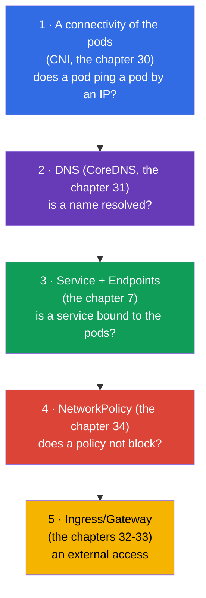
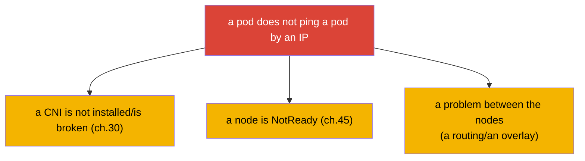
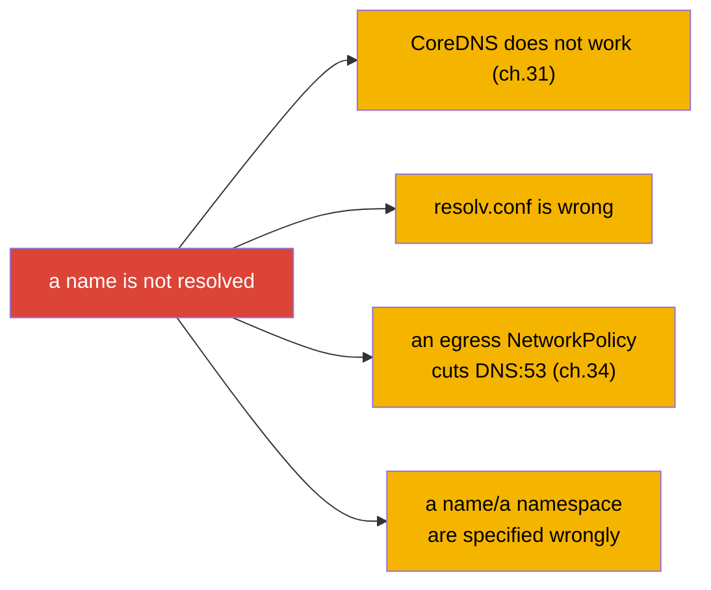
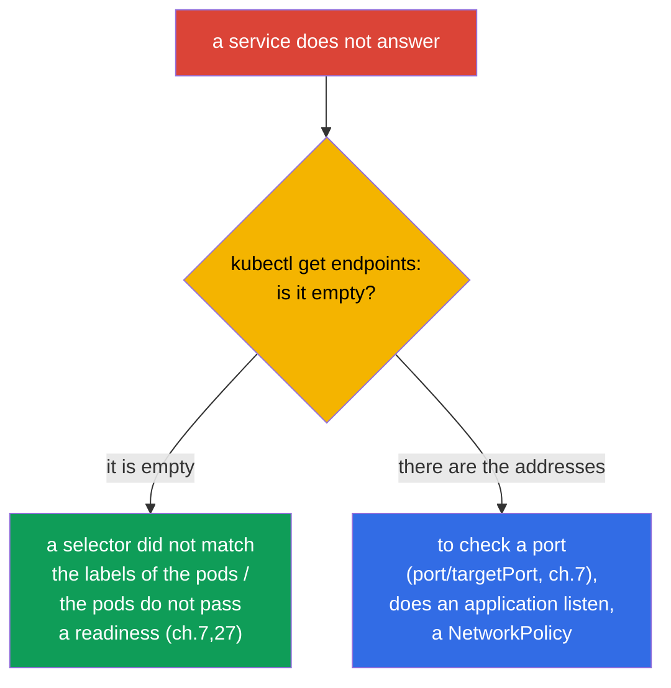
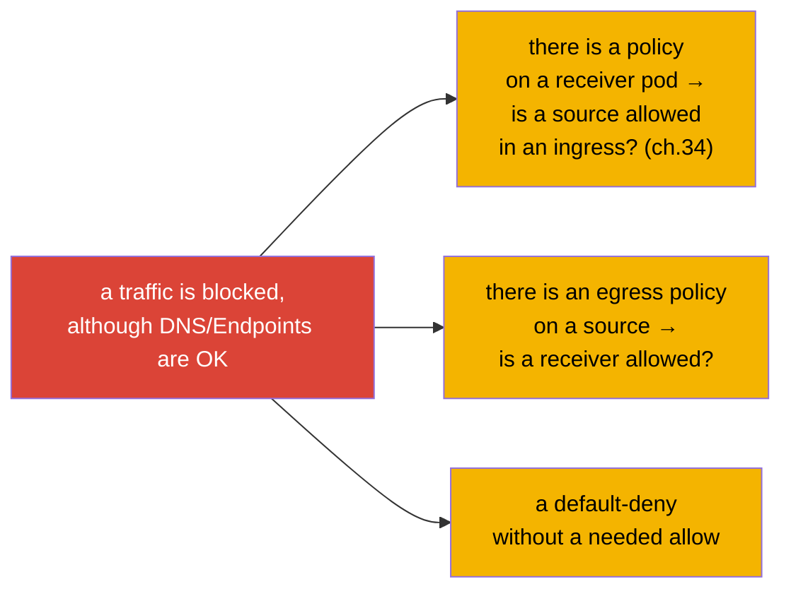
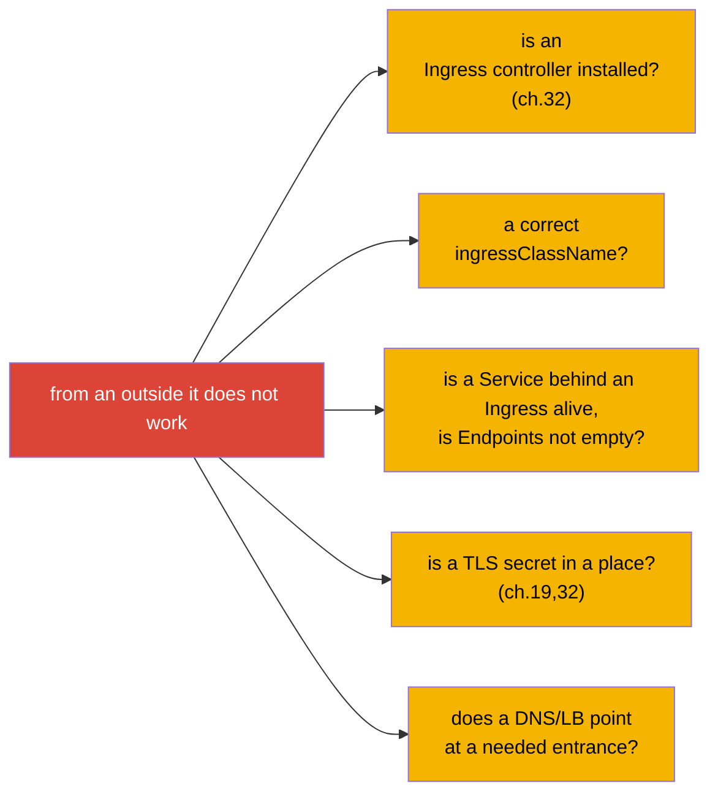
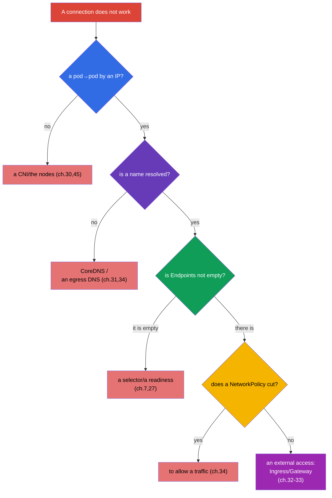

[Русская версия](ru.md) · [Versión en español](es.md) · [Version française](fr.md) · [Deutsche Version](de.md) · [ქართული ვერსია](ge.md)

# Chapter 46. A debugging of the services and of a network

> 🟦 **A chapter for the CKA** (a domain Troubleshooting - 30%). The network skills are useful for the CKAD too.
>
> **What comes next.** We finish a part 9 with the most insidious theme - a network. "A connection does not work" can
> break on any of the layers: DNS, Service, Endpoints, NetworkPolicy, kube-proxy, CNS.
> We will collect the knowledge of the chapters 7, 30, 31, 34 into a single **layer by layer algorithm** of a debugging: from "a pod does not
> resolve a name" up to "a service does not answer" and "a NetworkPolicy has blocked everything". These are the frequent and
> high-score tasks of the CKA.

## 46.1. A layer by layer model of a debugging of a network

A network has to be analyzed **by the layers from a bottom upwards** - otherwise you drown in the hypotheses. Let us recall, how everything is
put together (the chapters 30-31):



An idea: to check one layer at a time, narrowing a problem. Does an IP connectivity work? Is a
name resolved? Are there the Endpoints? Does a policy not cut? Have they got through from an outside? Every "no" points at a
layer.

## 46.2. A layer 1: a connectivity of the pods (CNI)

We begin from the very bottom: can the pods communicate by an IP at all (the chapter 30)?

```bash
# the IP of the pods
kubectl get pods -o wide
# out of one pod to reach an IP of another one
kubectl exec <pod-a> -- ping -c1 <ip-pod-b>
kubectl exec <pod-a> -- curl -s <ip-pod-b>:<port>
```

If a pod does not reach another pod **by an IP** - a problem is at a level of a CNI/of the nodes:



If there is an IP connectivity, but by a name it does not work - we go higher, to DNS.

## 46.3. A layer 2: DNS (CoreDNS)

We check a resolving of the names (the chapter 31):

```bash
kubectl exec <pod> -- nslookup backend
kubectl exec <pod> -- nslookup backend.prod.svc.cluster.local
kubectl exec <pod> -- cat /etc/resolv.conf      # which nameserver, the search domains
kubectl get pods -n kube-system -l k8s-app=kube-dns   # is CoreDNS alive
kubectl logs -n kube-system -l k8s-app=kube-dns
```



A classical trap (the chapter 34): a default-deny egress blocks DNS (a port 53), and everything
"breaks" inexplicably. If a name is not resolved - check both CoreDNS and the egress policies.

## 46.4. A layer 3: Service and Endpoints

A name is resolved, but a service does not answer - we look at a connection Service ↔ Endpoints (the chapter 7). This is
**the most frequent root** of the problems with the services.

```bash
kubectl get svc backend                 # is there a service, which ClusterIP/port
kubectl get endpoints backend           # ← A KEY THING: are there the addresses of the pods
kubectl describe svc backend            # a selector and the endpoints
```



**An empty Endpoints** - a main symptom: a service is bound to nobody. The reasons: a selector of a
service does not match the labels of the pods, or the pods are not ready (a readiness, the chapter 27). If
Endpoints is not empty, but there is no connection - we check the ports (`port`/`targetPort`, the chapter 7), does an
application listen a needed port, and the policies.

## 46.5. A layer 4: NetworkPolicy

Everything above is in an order, but a traffic does not go - possibly, a policy cuts (the chapter 34):

```bash
kubectl get networkpolicy -n <namespace>
kubectl describe networkpolicy <name> -n <namespace>
```



We remember an allow logic (the chapter 34): a policy on a pod has appeared - only an explicitly
specified thing is allowed. We check, whether a needed source is allowed (an ingress at a receiver) and a destination
(an egress at a source). A frequent error - a default-deny without an allowance of a needed traffic (and of DNS).

## 46.6. A layer 5: an external access (Ingress/Gateway)

If a problem is with an access from an **outside** (the chapters 32-33):



An external access - the most upper layer; before blaming an Ingress, make sure, that an internal
Service works (the layers 1-4). A `port-forward` onto a Service/pod (the chapter 29) helps to understand, where
it tears: if through a port-forward it works, and through an Ingress it does not - a problem is in an Ingress/an entrance.

## 46.7. A full algorithm and the instruments

Let us collect a single tree - this is a map of a network troubleshooting:



The instruments of a network debugging:

```bash
# a test pod with the instruments (for the minimal images — kubectl debug, ch.29)
kubectl run test --image=nicolaka/netshoot -it --rm -- sh
# inside: nslookup, curl, ping, dig, netstat, traceroute
kubectl exec <pod> -- nslookup <svc>
kubectl exec <pod> -- curl -sv <svc>:<port>
kubectl get endpoints <svc>
kubectl get networkpolicy -A
```

## 46.8. How this is applied in a production

- **Endpoints - a first check.** In a prod at "a service does not answer" an on-duty engineer checks first of all
  `kubectl get endpoints`: it is empty → a selector/a readiness. This saves a mass of a time, cutting off
  DNS and a network.
- **DNS - a top of the reasons.** An overloaded CoreDNS, a wrong resolv.conf, an egress policy without
  DNS - the frequent incidents. A NodeLocal DNSCache (the chapter 31) and the accurate egress policies (the chapter
  34) prevent them.
- **A layer by layer approach - against a panic.** At a network incident it is easy to "shoot at random".
  A discipline "from a bottom upwards: an IP → DNS → Endpoints → a policy → an entrance" turns a chaos into a
  fast analysis.
- **netshoot and port-forward.** In a prod for a debugging they use a pod with the network instruments
  (netshoot) or the ephemeral containers (the chapter 29), and a `port-forward` helps to separate a
  problem of an application from a problem of an entrance.
- **NetworkPolicy - a frequent "a villain to oneself".** After an introduction of the policies that thing breaks, which
  they forgot to allow (DNS, an interservice traffic). In a prod the policies are tested and rolled out
  carefully, beginning from an observation (audit), and not at once from an enforce.

## 46.9. A mini glossary

- **A layer by layer debugging** - an analysis of a network from a bottom upwards: a CNI → DNS → Endpoints → a policy →
  an entrance.
- **a connectivity of the pods** - can the pods communicate by an IP (a level of a CNI, the chapter 30).
- **Endpoints** - a list of the addresses of the pods behind a service; an empty one = it is not bound (the chapter 7).
- **nslookup/dig** - a check of a DNS resolving from an inside of a pod.
- **netshoot** - an image with the network instruments for a debugging.
- **port-forward** - a forwarding of a port for a check bypassing an entrance (the chapter 29).
- **default-deny + DNS** - a trap: an egress policy cuts a resolving (the chapter 34).

## 46.10. The conclusions of the chapter

- A network is debugged layer by layer from a bottom upwards: a connectivity of the pods (CNI) → DNS (CoreDNS) → Service/
  Endpoints → NetworkPolicy → Ingress/Gateway.
- A layer 1: a pod does not ping a pod by an IP → a CNI/the nodes (the chapters 30, 45).
- A layer 2: a name is not resolved → CoreDNS, resolv.conf, an egress policy cuts DNS:53.
- A layer 3 (the most frequent): a service does not answer → `get endpoints`; it is empty = a selector/a readiness.
- A layer 4: a NetworkPolicy cuts a traffic → to check the allow rules (and DNS).
- A layer 5: from an outside it does not work → an Ingress controller, ingressClassName, a Service behind it, TLS.
- The instruments: nslookup/curl from an inside, `get endpoints`, netshoot/ephemeral, port-forward
  for a localization.

## 46.11. How this will come in handy: at an exam and in a real work

**At an exam (CKA).** "Why does a pod not reach a service", "a service does not answer", "DNS
does not resolve" - the frequent high-score tasks of a troubleshooting (30%). A layer by layer algorithm and
a reflex `get endpoints` solve the most of them. It is necessary to check every layer confidently and to know
a trap with an egress DNS.

**In a real work.** The network incidents - some of the most frequent and confusing ones. A layer by layer
discipline and a knowledge, that Endpoints and DNS - the main suspects, radically speed up an
analysis. The instruments (netshoot, port-forward, the ephemeral containers) and a careful introduction of a
NetworkPolicy - an everyday practice of a reliable operation.

## 46.12. The questions for a self-check

1. Why is a network debugged layer by layer and in which order?
2. How to check a connectivity of the pods by an IP and at what does its absence point?
3. What to check at "a name is not resolved" and which trap is connected with an egress policy?
4. Why is `kubectl get endpoints` a first check at "a service does not answer"? What does an empty
   list mean?
5. How to understand, that a NetworkPolicy cuts a traffic, and what to check at this?
6. How to debug a problem of an external access and with what does a port-forward help?
7. Which instruments are used for a network debugging inside a cluster?

## Practice

At this a part 9 (a troubleshooting) is finished, and with it - the whole general and administrative
content of the course. A part 10 is left: a preparation for the exams - a tactics of the CKAD (the chapter 47) and of the
CKA (the chapter 48). A network troubleshooting is practised in the labs on a network and in the mock exams.

🧪 A lab 118 (a diagnostics of DNS/of a network of a cluster): [tasks/cka/labs/118](../../labs/118/README.MD)

🧪 A lab 123 (an installation of a CNI from a scratch + an analysis of netns/of the routes): [tasks/cka/labs/123](../../labs/123/README.MD)

---
[Contents](../README.md) · [Chapter 45](../45/README.md) · [Chapter 47](../47/README.md)
