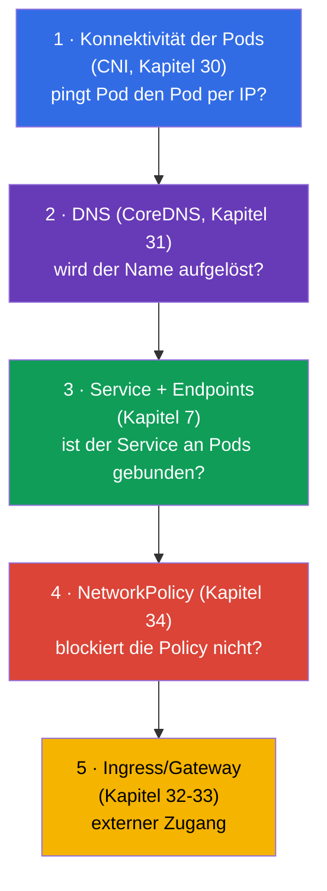
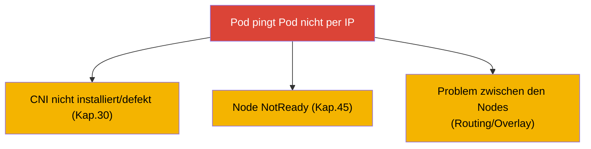
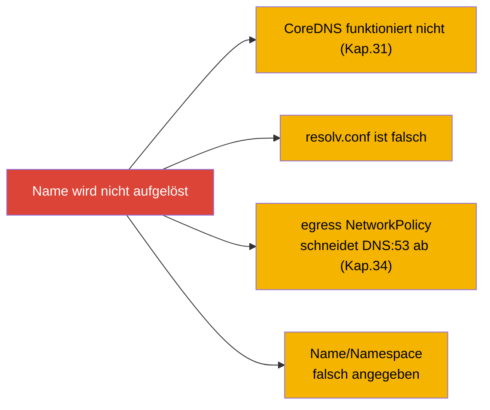
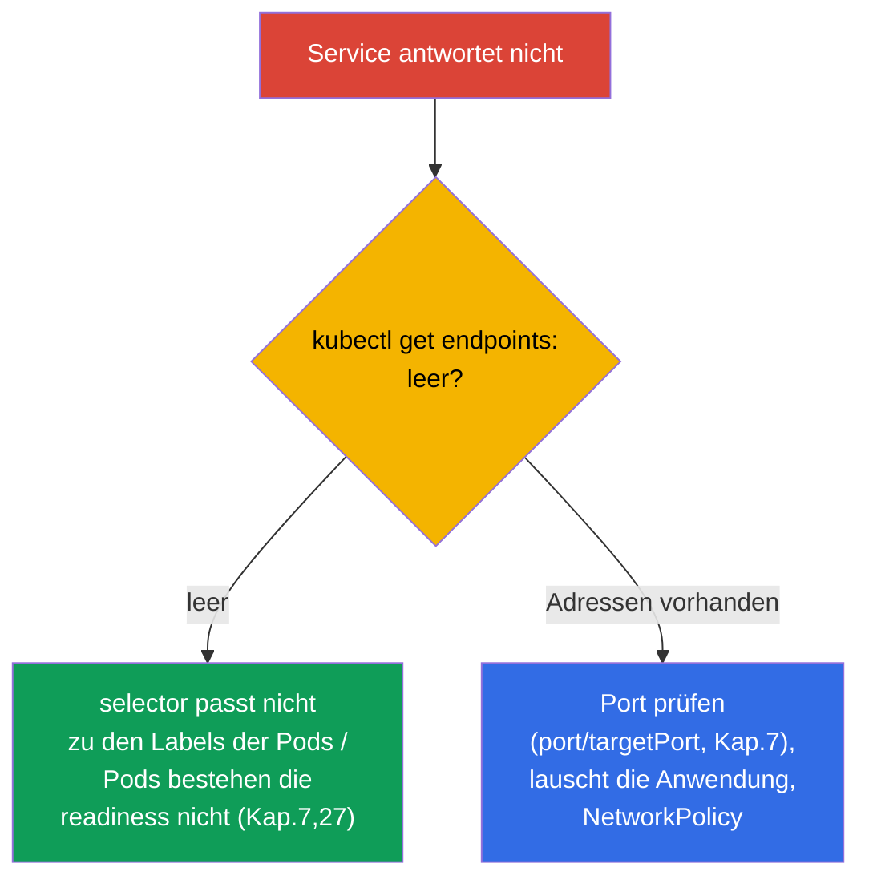
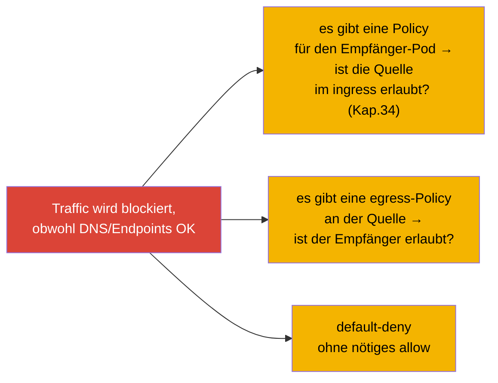
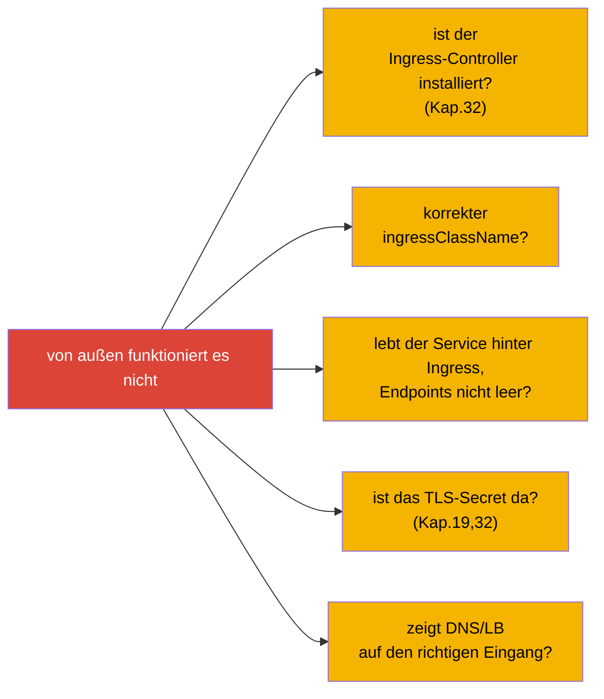
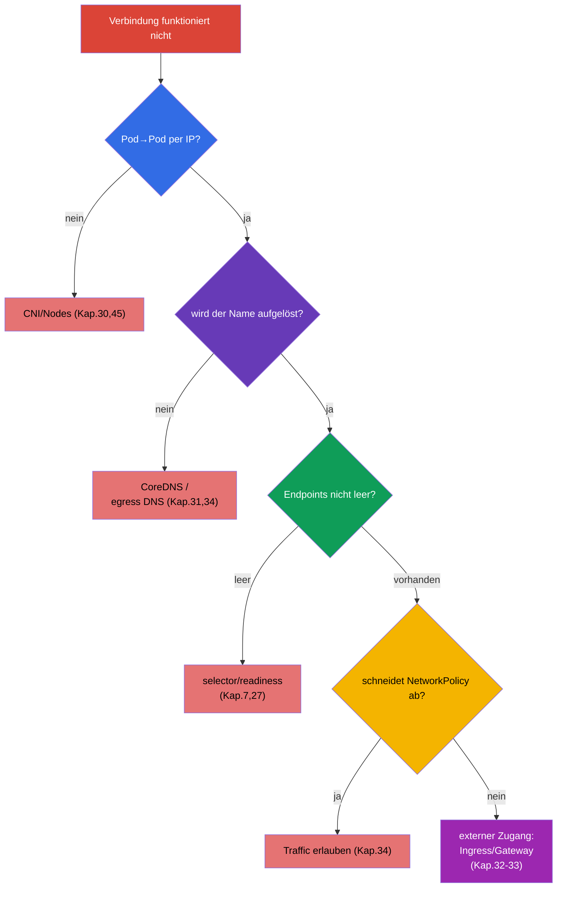

[Русская версия](ru.md) · [Eng version](README.md) · [Versión en español](es.md) · [Version française](fr.md) · [ქართული ვერსია](ge.md) · [繁體中文版](tw.md) · [日本語版](jp.md)

# Kapitel 46. Debugging von Services und Netzwerk

> 🟦 **Kapitel für CKA** (Domäne Troubleshooting - 30%). Netzwerkkenntnisse sind auch für CKAD nützlich.
>
> **Was kommt.** Wir schließen Teil 9 mit dem heimtückischsten Thema ab - dem Netzwerk. „Die
> Verbindung funktioniert nicht“ kann auf jeder der Schichten brechen: DNS, Service, Endpoints,
> NetworkPolicy, kube-proxy, CNS. Wir fassen das Wissen der Kapitel 7, 30, 31, 34 zu einem
> einheitlichen **schichtweisen Algorithmus** des Debuggings zusammen: von „der Pod löst den
> Namen nicht auf“ bis „der Service antwortet nicht“ und „die NetworkPolicy hat alles
> blockiert“. Das sind häufige und hoch bewertete CKA-Aufgaben.

## 46.1. Schichtweises Modell des Netzwerk-Debuggings

Das Netzwerk muss man **schichtweise von unten nach oben** analysieren - sonst versinkt man in
Hypothesen. Erinnern wir uns, wie alles aufgebaut ist (Kapitel 30-31):



Die Idee: eine Schicht nach der anderen prüfen und das Problem eingrenzen. Funktioniert die
IP-Konnektivität? Wird der Name aufgelöst? Gibt es Endpoints? Schneidet die Policy nicht ab?
Kommt man von außen durch? Jedes „nein“ zeigt die Schicht an.

## 46.2. Schicht 1: Konnektivität der Pods (CNI)

Wir beginnen ganz unten: können die Pods überhaupt per IP kommunizieren (Kapitel 30)?

```bash
# IP der Pods
kubectl get pods -o wide
# aus einem Pod die IP eines anderen erreichen
kubectl exec <pod-a> -- ping -c1 <ip-pod-b>
kubectl exec <pod-a> -- curl -s <ip-pod-b>:<port>
```

Wenn ein Pod einen anderen Pod **per IP** nicht erreicht - liegt das Problem auf der Ebene
CNI/Nodes:



Wenn die IP-Konnektivität da ist, aber per Name nichts funktioniert - gehen wir höher, zu DNS.

## 46.3. Schicht 2: DNS (CoreDNS)

Wir prüfen die Auflösung der Namen (Kapitel 31):

```bash
kubectl exec <pod> -- nslookup backend
kubectl exec <pod> -- nslookup backend.prod.svc.cluster.local
kubectl exec <pod> -- cat /etc/resolv.conf      # welcher nameserver, search-Domains
kubectl get pods -n kube-system -l k8s-app=kube-dns   # lebt CoreDNS
kubectl logs -n kube-system -l k8s-app=kube-dns
```



Die klassische Falle (Kapitel 34): default-deny egress blockiert DNS (Port 53), und alles
„bricht“ unerklärlich. Wenn ein Name nicht aufgelöst wird - prüfen Sie sowohl CoreDNS als auch
die egress-Policies.

## 46.4. Schicht 3: Service und Endpoints

Der Name wird aufgelöst, aber der Service antwortet nicht - wir schauen die Verbindung
Service ↔ Endpoints an (Kapitel 7). Das ist die **häufigste Wurzel** von Problemen mit Services.

```bash
kubectl get svc backend                 # gibt es den Service, welche ClusterIP/Port
kubectl get endpoints backend           # ← SCHLÜSSEL: gibt es Adressen der Pods
kubectl describe svc backend            # selector und endpoints
```



**Leere Endpoints** - das Hauptsymptom: der Service ist an niemanden gebunden. Ursachen: der
Selektor des Service passt nicht zu den Labels der Pods, oder die Pods sind nicht bereit
(readiness, Kapitel 27). Wenn Endpoints nicht leer ist, aber keine Verbindung besteht - prüfen
wir die Ports (`port`/`targetPort`, Kapitel 7), ob die Anwendung den nötigen Port lauscht, und
die Policies.

## 46.5. Schicht 4: NetworkPolicy

Alles darüber ist in Ordnung, aber der Traffic fließt nicht - möglicherweise schneidet eine
Policy ab (Kapitel 34):

```bash
kubectl get networkpolicy -n <namespace>
kubectl describe networkpolicy <name> -n <namespace>
```



Wir erinnern uns an die allow-Logik (Kapitel 34): sobald es eine Policy für einen Pod gibt, ist
nur das ausdrücklich Angegebene erlaubt. Wir prüfen, ob die nötige Quelle erlaubt ist (ingress
beim Empfänger) und das Ziel (egress bei der Quelle). Ein häufiger Fehler ist default-deny ohne
Erlaubnis des nötigen Traffics (und von DNS).

## 46.6. Schicht 5: externer Zugang (Ingress/Gateway)

Wenn das Problem beim Zugang **von außen** liegt (Kapitel 32-33):



Der externe Zugang ist die oberste Schicht; bevor Sie Ingress beschuldigen, vergewissern Sie
sich, dass der interne Service funktioniert (Schichten 1-4). `port-forward` auf Service/Pod
(Kapitel 29) hilft zu verstehen, wo es reißt: wenn es über port-forward funktioniert, über
Ingress aber nicht - liegt das Problem in Ingress/am Eingang.

## 46.7. Vollständiger Algorithmus und Werkzeuge

Fassen wir einen einheitlichen Baum zusammen - das ist die Karte des Netzwerk-Troubleshootings:



Werkzeuge des Netzwerk-Debuggings:

```bash
# Test-Pod mit Werkzeugen (für minimale Images — kubectl debug, Kap.29)
kubectl run test --image=nicolaka/netshoot -it --rm -- sh
# innen: nslookup, curl, ping, dig, netstat, traceroute
kubectl exec <pod> -- nslookup <svc>
kubectl exec <pod> -- curl -sv <svc>:<port>
kubectl get endpoints <svc>
kubectl get networkpolicy -A
```

## 46.8. Wie man das in der Produktion anwendet

- **Endpoints - der erste Check.** In der Produktion prüft der Bereitschaftsdienst bei „der
  Service antwortet nicht“ vor allem `kubectl get endpoints`: leer → Selektor/readiness. Das
  spart eine Menge Zeit und schneidet DNS und Netzwerk ab.
- **DNS - unter den Top-Ursachen.** Überlastetes CoreDNS, falsche resolv.conf, egress-Policy
  ohne DNS - häufige Vorfälle. NodeLocal DNSCache (Kapitel 31) und sorgfältige egress-Policies
  (Kapitel 34) verhindern sie.
- **Der schichtweise Ansatz - gegen die Panik.** Bei einem Netzwerkvorfall „schießt“ man leicht
  ins Blaue. Die Disziplin „von unten nach oben: IP → DNS → Endpoints → Policy → Eingang“
  verwandelt Chaos in eine schnelle Analyse.
- **netshoot und port-forward.** In der Produktion nutzt man zum Debuggen einen Pod mit
  Netzwerkwerkzeugen (netshoot) oder ephemeral-Container (Kapitel 29), und `port-forward` hilft,
  ein Problem der Anwendung von einem Problem des Eingangs zu trennen.
- **NetworkPolicy - ein häufiges „selbst verschuldetes Übel“.** Nach der Einführung von Policies
  bricht das, was man zu erlauben vergessen hat (DNS, Traffic zwischen Services). In der
  Produktion testet man Policies und rollt sie vorsichtig aus, beginnend mit Beobachtung
  (audit), nicht sofort mit enforce.

## 46.9. Mini-Glossar

- **Schichtweises Debugging** - Analyse des Netzwerks von unten nach oben: CNI → DNS →
  Endpoints → Policy → Eingang.
- **Konnektivität der Pods** - können die Pods per IP kommunizieren (Ebene CNI, Kapitel 30).
- **Endpoints** - Liste der Adressen der Pods hinter einem Service; leer = nicht gebunden (Kapitel 7).
- **nslookup/dig** - Prüfung der DNS-Auflösung von innerhalb eines Pods.
- **netshoot** - Image mit Netzwerkwerkzeugen zum Debuggen.
- **port-forward** - Weiterleitung eines Ports zur Prüfung unter Umgehung des Eingangs (Kapitel 29).
- **default-deny + DNS** - die Falle: eine egress-Policy schneidet die Auflösung ab (Kapitel 34).

## 46.10. Zusammenfassung des Kapitels

- Das Netzwerk debuggt man schichtweise von unten nach oben: Konnektivität der Pods (CNI) →
  DNS (CoreDNS) → Service/Endpoints → NetworkPolicy → Ingress/Gateway.
- Schicht 1: Pod pingt Pod nicht per IP → CNI/Nodes (Kapitel 30, 45).
- Schicht 2: Name wird nicht aufgelöst → CoreDNS, resolv.conf, egress-Policy schneidet DNS:53 ab.
- Schicht 3 (die häufigste): Service antwortet nicht → `get endpoints`; leer = Selektor/readiness.
- Schicht 4: NetworkPolicy schneidet den Traffic ab → allow-Regeln prüfen (und DNS).
- Schicht 5: von außen funktioniert es nicht → Ingress-Controller, ingressClassName, Service
  dahinter, TLS.
- Werkzeuge: nslookup/curl von innen, `get endpoints`, netshoot/ephemeral, port-forward
  zur Lokalisierung.

## 46.11. Wofür das nützlich ist: in der Prüfung und in der echten Arbeit

**In der Prüfung (CKA).** „Warum erreicht der Pod den Service nicht“, „der Service antwortet
nicht“, „DNS löst nicht auf“ sind häufige hoch bewertete Troubleshooting-Aufgaben (30%). Der
schichtweise Algorithmus und der Reflex `get endpoints` lösen die meisten davon. Man muss jede
Schicht souverän prüfen können und die Falle mit egress-DNS kennen.

**In der echten Arbeit.** Netzwerkvorfälle gehören zu den häufigsten und verworrensten. Die
schichtweise Disziplin und das Wissen, dass Endpoints und DNS die Hauptverdächtigen sind,
beschleunigen die Analyse grundlegend. Die Werkzeuge (netshoot, port-forward,
ephemeral-Container) und die vorsichtige Einführung von NetworkPolicy sind alltägliche Praxis
eines zuverlässigen Betriebs.

## 46.12. Fragen zur Selbstüberprüfung

1. Warum debuggt man das Netzwerk schichtweise und in welcher Reihenfolge?
2. Wie prüft man die Konnektivität der Pods per IP und worauf deutet ihr Fehlen hin?
3. Was prüft man bei „der Name wird nicht aufgelöst“ und welche Falle hängt mit der egress-Policy zusammen?
4. Warum ist `kubectl get endpoints` der erste Check bei „der Service antwortet nicht“? Was bedeutet eine leere
   Liste?
5. Wie erkennt man, dass NetworkPolicy den Traffic abschneidet, und was prüft man dabei?
6. Wie debuggt man ein Problem des externen Zugangs und wobei hilft port-forward?
7. Welche Werkzeuge nutzt man für das Netzwerk-Debugging innerhalb des Clusters?

## Praxis

Damit ist Teil 9 (Troubleshooting) abgeschlossen und mit ihm der ganze allgemeine und
administrative Inhalt des Kurses. Es bleibt Teil 10: die Vorbereitung auf die Prüfungen -
Taktik für CKAD (Kapitel 47) und CKA (Kapitel 48). Netzwerk-Troubleshooting wird in den Labs
zum Netzwerk und in Mock-Prüfungen geübt.

🧪 Lab 118 (Diagnose von DNS/Netzwerk des Clusters): [tasks/cka/labs/118](../../labs/118/README_DE.MD)

🧪 Lab 123 (Installation von CNI von Null + Analyse von netns/Routen): [tasks/cka/labs/123](../../labs/123/README_DE.MD)

---
[Inhalt](../README_DE.md) · [Kapitel 45](../45/de.md) · [Kapitel 47](../47/de.md)
