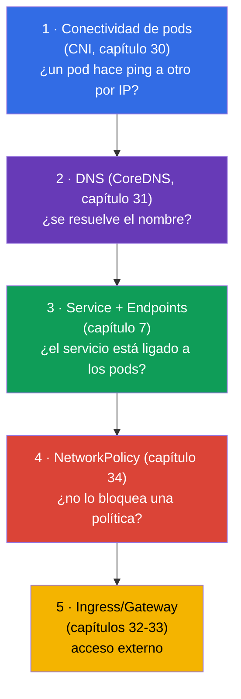
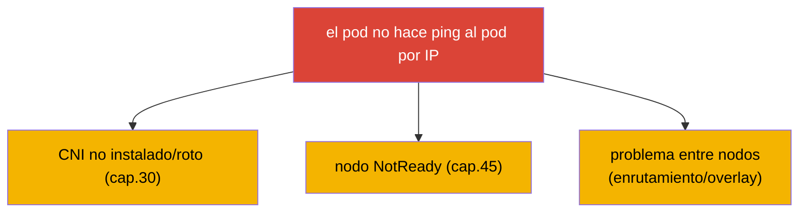
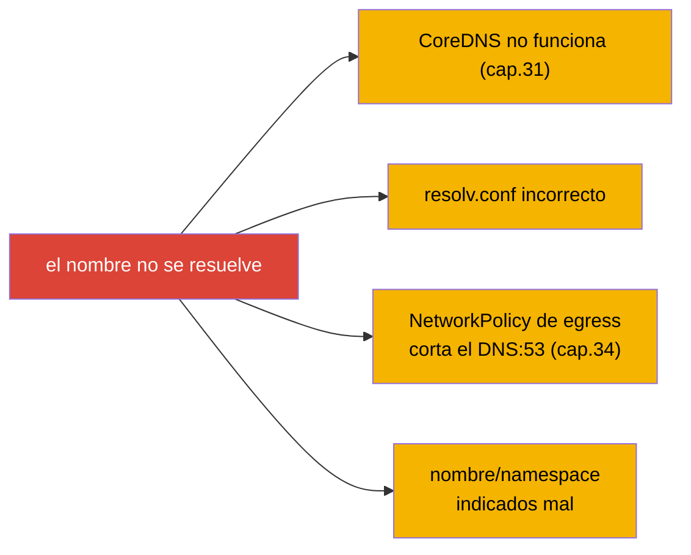
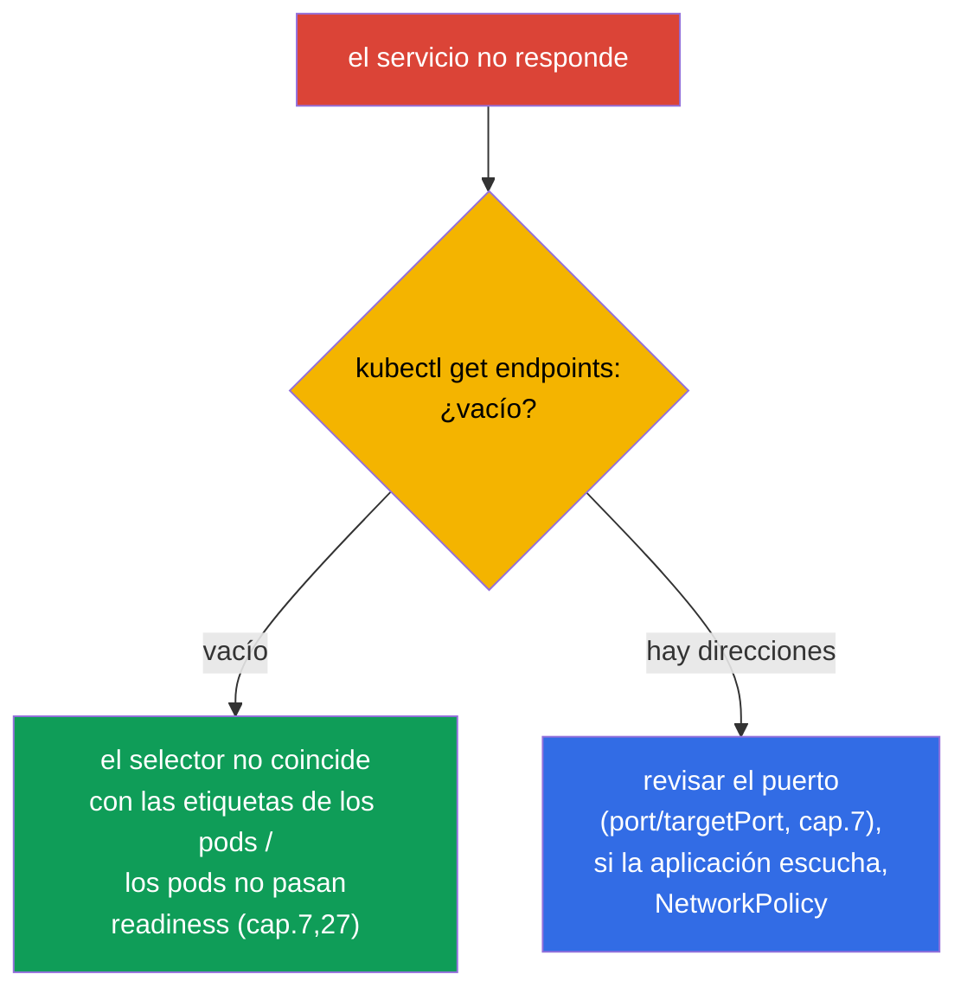
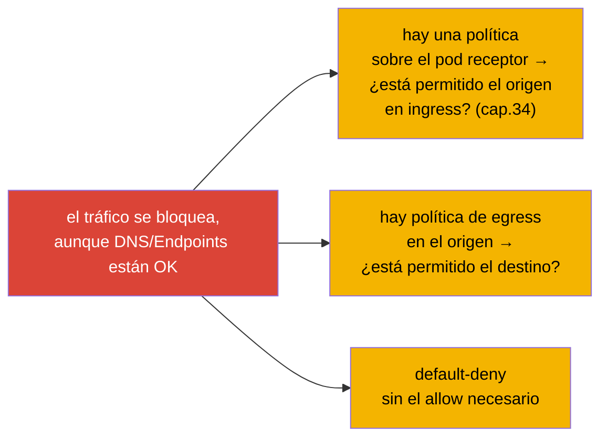
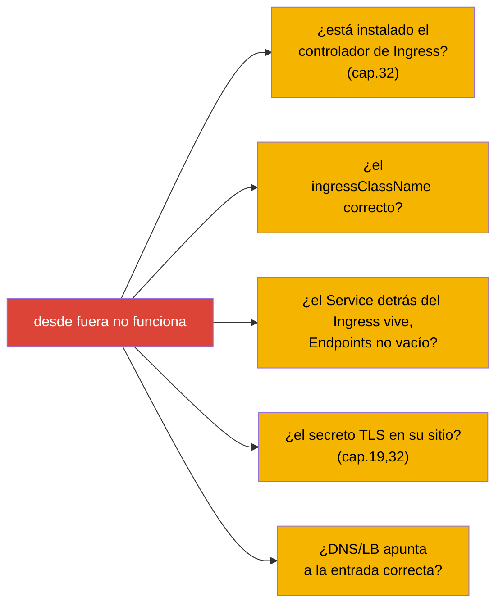
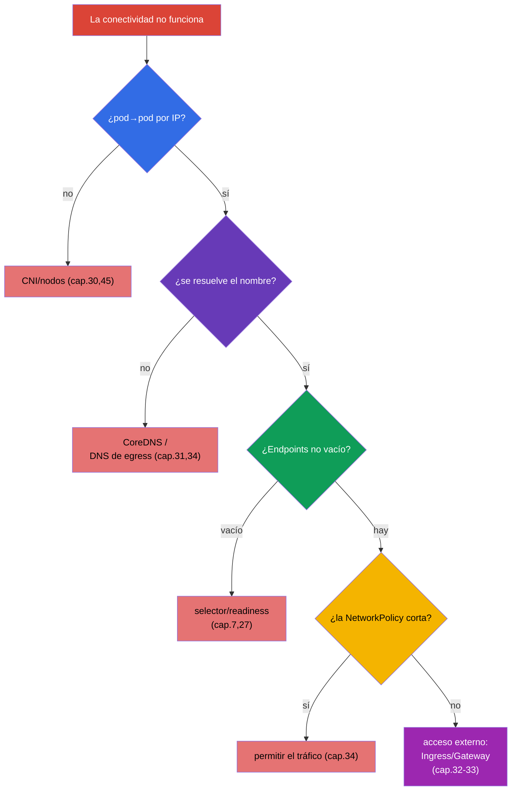

[Русская версия](ru.md) · [Eng version](README.md) · [Version française](fr.md) · [Deutsche Version](de.md) · [ქართული ვერსია](ge.md) · [繁體中文版](tw.md) · [日本語版](jp.md)

# Capítulo 46. Depuración de servicios y de la red

> 🟦 **Capítulo para CKA** (dominio Troubleshooting - 30%). Las habilidades de red también sirven para el CKAD.
>
> **Qué viene ahora.** Cerramos la parte 9 con el tema más traicionero - la red. «No hay conectividad» puede
> romperse en cualquiera de las capas: DNS, Service, Endpoints, NetworkPolicy, kube-proxy, CNS.
> Reuniremos el saber de los capítulos 7, 30, 31, 34 en un único **algoritmo por capas** de depuración: desde «el pod no
> resuelve un nombre» hasta «el servicio no responde» y «la NetworkPolicy lo ha bloqueado todo». Son tareas frecuentes y
> de mucha puntuación en el CKA.

## 46.1. Modelo por capas de la depuración de red

La red hay que analizarla **por capas de abajo arriba** - si no, te ahogas en hipótesis. Recordemos cómo está todo
montado (capítulos 30-31):



La idea: comprobar capa a capa, estrechando el problema. ¿Funciona la conectividad IP? ¿Se resuelve el
nombre? ¿Hay Endpoints? ¿No corta la política? ¿Llega el tráfico desde fuera? Cada «no» señala una
capa.

## 46.2. Capa 1: conectividad de pods (CNI)

Empezamos por lo más bajo: ¿pueden los pods comunicarse siquiera por IP (capítulo 30)?

```bash
# IP de los pods
kubectl get pods -o wide
# desde un pod alcanzar la IP de otro
kubectl exec <pod-a> -- ping -c1 <ip-pod-b>
kubectl exec <pod-a> -- curl -s <ip-pod-b>:<port>
```

Si un pod no alcanza a otro pod **por IP**, el problema está a nivel de CNI/nodos:



Si hay conectividad IP pero por nombre no funciona, subimos una capa, al DNS.

## 46.3. Capa 2: DNS (CoreDNS)

Comprobamos la resolución de nombres (capítulo 31):

```bash
kubectl exec <pod> -- nslookup backend
kubectl exec <pod> -- nslookup backend.prod.svc.cluster.local
kubectl exec <pod> -- cat /etc/resolv.conf      # qué nameserver, dominios search
kubectl get pods -n kube-system -l k8s-app=kube-dns   # ¿está vivo CoreDNS?
kubectl logs -n kube-system -l k8s-app=kube-dns
```



La trampa clásica (capítulo 34): un default-deny de egress bloquea el DNS (puerto 53) y todo
«se rompe» de forma inexplicable. Si un nombre no se resuelve, revisa tanto CoreDNS como las políticas de egress.

## 46.4. Capa 3: Service y Endpoints

El nombre se resuelve, pero el servicio no responde - miramos el enlace Service ↔ Endpoints (capítulo 7). Es
**la raíz más frecuente** de los problemas con servicios.

```bash
kubectl get svc backend                 # ¿existe el servicio, qué ClusterIP/puerto?
kubectl get endpoints backend           # ← CLAVE: ¿hay direcciones de pods?
kubectl describe svc backend            # selector y endpoints
```



**Endpoints vacío** es el síntoma principal: el servicio no está ligado a nadie. Causas: el selector del
servicio no coincide con las etiquetas de los pods, o los pods no están listos (readiness, capítulo 27). Si
Endpoints no está vacío y aun así no hay conexión, revisamos los puertos (`port`/`targetPort`, capítulo 7), si la
aplicación escucha el puerto necesario, y las políticas.

## 46.5. Capa 4: NetworkPolicy

Todo lo anterior está en orden, pero el tráfico no pasa - puede que lo corte una política (capítulo 34):

```bash
kubectl get networkpolicy -n <namespace>
kubectl describe networkpolicy <name> -n <namespace>
```



Recordamos la lógica allow (capítulo 34): en cuanto aparece una política sobre un pod, solo está permitido lo
indicado explícitamente. Comprobamos si está permitido el origen necesario (ingress en el receptor) y el destino
(egress en el origen). Un error frecuente es un default-deny sin permitir el tráfico necesario (y el DNS).

## 46.6. Capa 5: acceso externo (Ingress/Gateway)

Si el problema es de acceso **desde fuera** (capítulos 32-33):



El acceso externo es la capa más alta; antes de culpar al Ingress, asegúrate de que el Service
interno funciona (capas 1-4). `port-forward` al Service/pod (capítulo 29) ayuda a entender dónde
se rompe: si por port-forward funciona y por Ingress no, el problema está en el Ingress/la entrada.

## 46.7. Algoritmo completo y herramientas

Reunamos un único árbol - es el mapa del troubleshooting de red:



Herramientas de depuración de red:

```bash
# pod de prueba con herramientas (para imágenes mínimas — kubectl debug, cap.29)
kubectl run test --image=nicolaka/netshoot -it --rm -- sh
# dentro: nslookup, curl, ping, dig, netstat, traceroute
kubectl exec <pod> -- nslookup <svc>
kubectl exec <pod> -- curl -sv <svc>:<port>
kubectl get endpoints <svc>
kubectl get networkpolicy -A
```

## 46.8. Cómo se aplica esto en producción

- **Endpoints - el primer chequeo.** En producción, ante «el servicio no responde», quien está de guardia revisa antes que nada
  `kubectl get endpoints`: vacío → selector/readiness. Eso ahorra muchísimo tiempo, descartando
  DNS y red.
- **DNS - de las causas top.** Un CoreDNS sobrecargado, un resolv.conf incorrecto, una política de egress sin
  DNS son incidentes frecuentes. NodeLocal DNSCache (capítulo 31) y unas políticas de egress cuidadosas (capítulo
  34) los previenen.
- **El enfoque por capas - contra el pánico.** En un incidente de red es fácil «disparar a ciegas».
  La disciplina de «abajo arriba: IP → DNS → Endpoints → política → entrada» convierte el caos en un
  análisis rápido.
- **netshoot y port-forward.** En producción, para depurar se usa un pod con herramientas de red
  (netshoot) o contenedores ephemeral (capítulo 29), y `port-forward` ayuda a separar el
  problema de la aplicación del problema de la entrada.
- **NetworkPolicy - un frecuente «enemigo de uno mismo».** Tras implantar políticas se rompe lo que
  se olvidó permitir (DNS, tráfico entre servicios). En producción las políticas se prueban y se despliegan
  con cuidado, empezando por la observación (audit) y no directamente por enforce.

## 46.9. Mini-glosario

- **Depuración por capas** - análisis de la red de abajo arriba: CNI → DNS → Endpoints → política →
  entrada.
- **conectividad de pods** - si los pods pueden comunicarse por IP (nivel CNI, capítulo 30).
- **Endpoints** - lista de direcciones de pods detrás de un servicio; vacía = no está ligado (capítulo 7).
- **nslookup/dig** - comprobación de la resolución DNS desde dentro de un pod.
- **netshoot** - imagen con herramientas de red para depurar.
- **port-forward** - reenvío de puerto para comprobar sin pasar por la entrada (capítulo 29).
- **default-deny + DNS** - la trampa: una política de egress corta la resolución (capítulo 34).

## 46.10. Resumen del capítulo

- La red se depura por capas de abajo arriba: conectividad de pods (CNI) → DNS (CoreDNS) → Service/
  Endpoints → NetworkPolicy → Ingress/Gateway.
- Capa 1: el pod no hace ping al pod por IP → CNI/nodos (capítulos 30, 45).
- Capa 2: el nombre no se resuelve → CoreDNS, resolv.conf, política de egress que corta el DNS:53.
- Capa 3 (la más frecuente): el servicio no responde → `get endpoints`; vacío = selector/readiness.
- Capa 4: el tráfico lo corta una NetworkPolicy → revisar las reglas allow (y el DNS).
- Capa 5: desde fuera no funciona → controlador de Ingress, ingressClassName, el Service detrás, TLS.
- Herramientas: nslookup/curl desde dentro, `get endpoints`, netshoot/ephemeral, port-forward
  para localizar.

## 46.11. Para qué sirve esto: en el examen y en el trabajo real

**En el examen (CKA).** «Por qué un pod no alcanza un servicio», «el servicio no responde», «el DNS
no resuelve» son tareas de troubleshooting frecuentes y con mucha puntuación (30%). El algoritmo por capas y el
reflejo de `get endpoints` resuelven la mayoría. Hay que comprobar cada capa con seguridad y conocer la
trampa del DNS de egress.

**En el trabajo real.** Los incidentes de red son de los más frecuentes y liados. La disciplina por
capas y saber que Endpoints y DNS son los principales sospechosos aceleran radicalmente el
análisis. Las herramientas (netshoot, port-forward, contenedores ephemeral) y una implantación cuidadosa de
NetworkPolicy son práctica diaria de una operación fiable.

## 46.12. Preguntas de autocomprobación

1. ¿Por qué la red se depura por capas y en qué orden?
2. ¿Cómo comprobar la conectividad de pods por IP y qué indica su ausencia?
3. ¿Qué revisar ante «el nombre no se resuelve» y qué trampa está ligada a la política de egress?
4. ¿Por qué `kubectl get endpoints` es el primer chequeo ante «el servicio no responde»? ¿Qué significa una lista
   vacía?
5. ¿Cómo saber que el tráfico lo corta una NetworkPolicy y qué revisar entonces?
6. ¿Cómo depurar un problema de acceso externo y en qué ayuda port-forward?
7. ¿Qué herramientas se usan para la depuración de red dentro del clúster?

## Práctica

Con esto la parte 9 (troubleshooting) queda cerrada, y con ella todo el contenido general y de
administración del curso. Queda la parte 10: preparación para los exámenes - táctica del CKAD (capítulo 47) y del
CKA (capítulo 48). El troubleshooting de red se practica en los laboratorios de red y en los exámenes simulados.

🧪 Laboratorio 118 (diagnóstico de DNS/red del clúster): [tasks/cka/labs/118](../../labs/118/README_ES.MD)

🧪 Laboratorio 123 (instalación de CNI desde cero + análisis de netns/rutas): [tasks/cka/labs/123](../../labs/123/README_ES.MD)

🎮 Killercoda (en el navegador, sin instalación): [Troubleshoot a Broken Network Path](https://killercoda.com/chadmcrowell/course/cka/broken-path) · [Debug services in Kubernetes](https://killercoda.com/chadmcrowell/course/ckad/debug-services) · [Test Service Connectivity](https://killercoda.com/chadmcrowell/course/ckad/test-service-connectivity)

---
[Índice](../README_ES.md) · [Capítulo 45](../45/es.md) · [Capítulo 47](../47/es.md)
