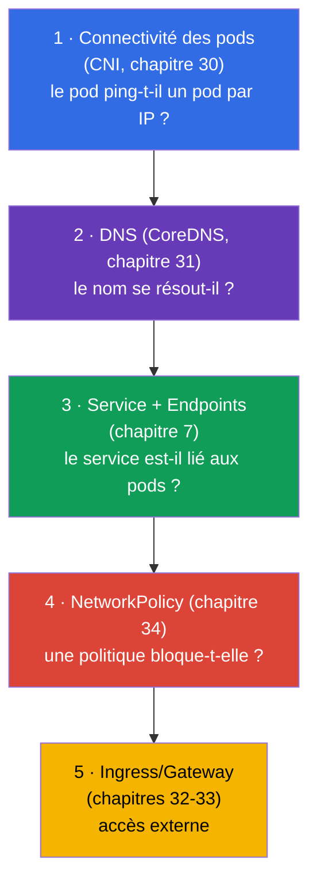
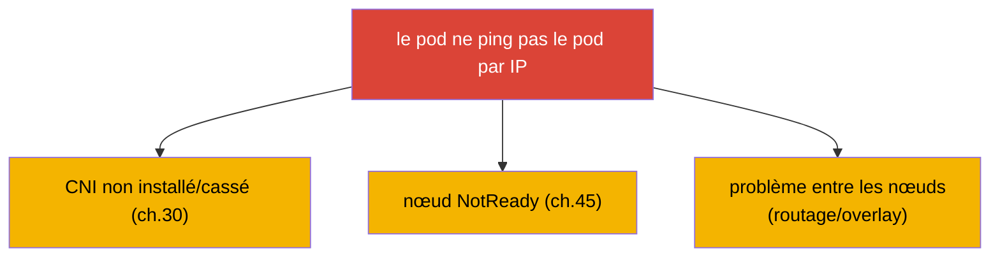
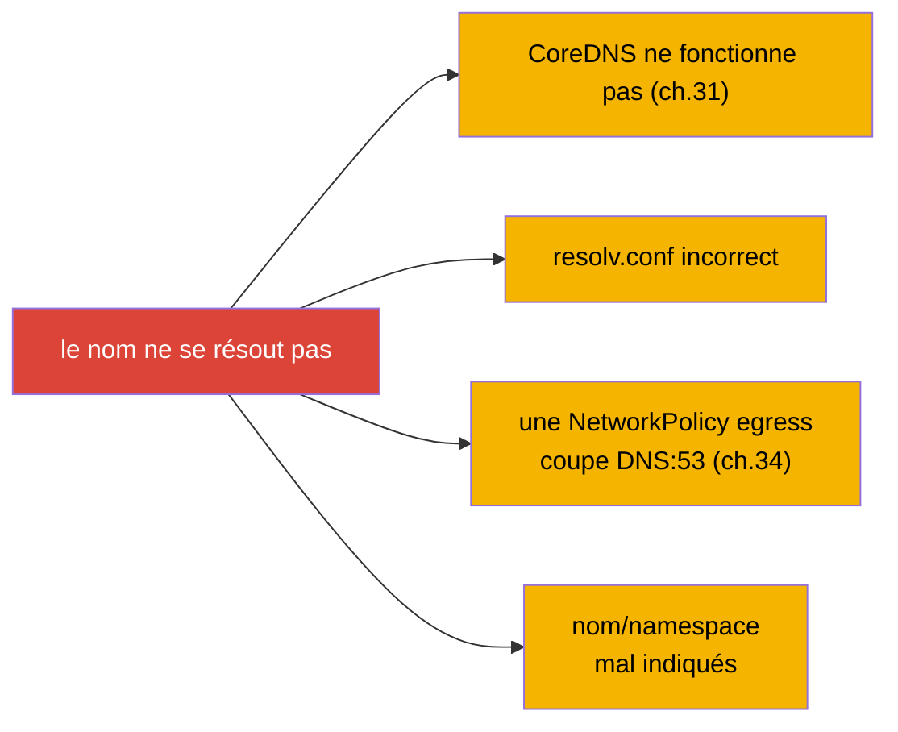
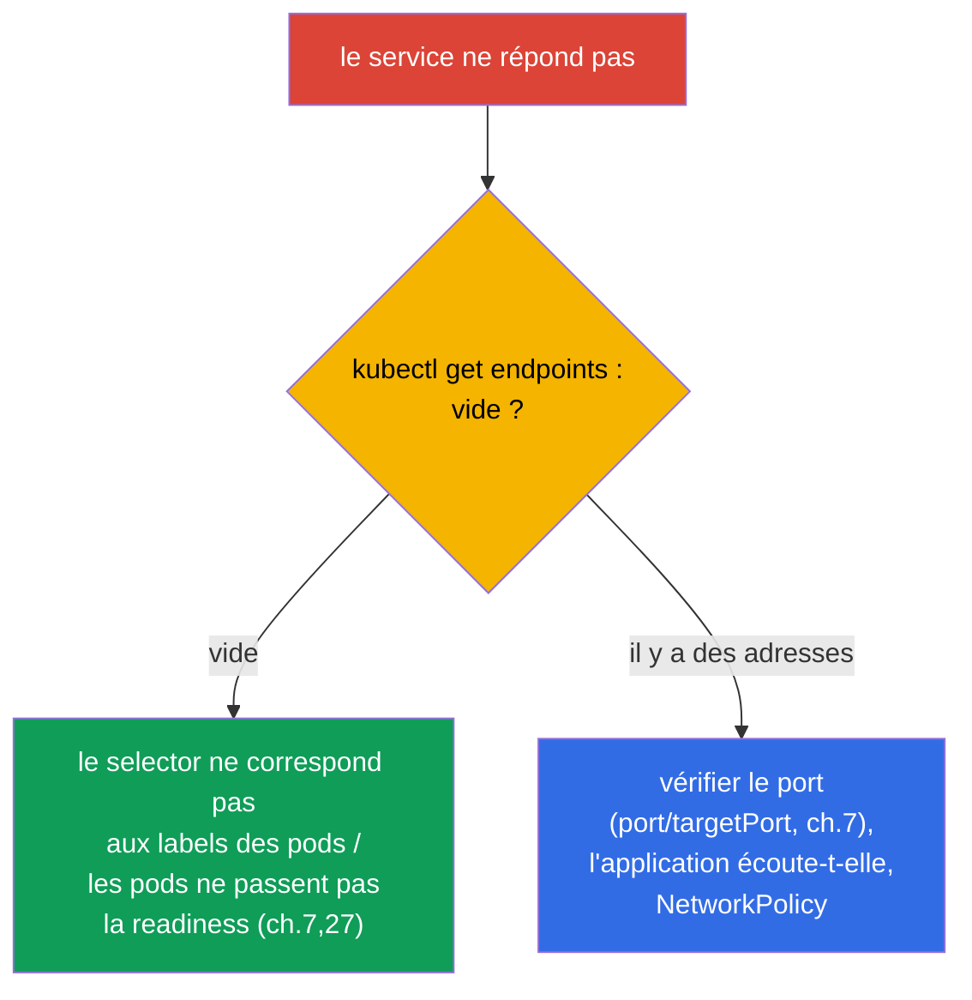
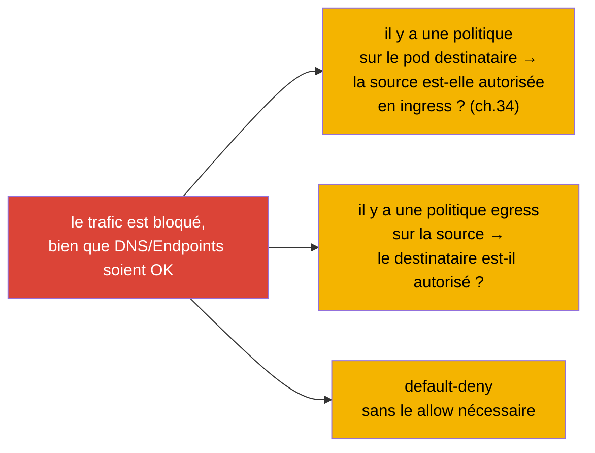
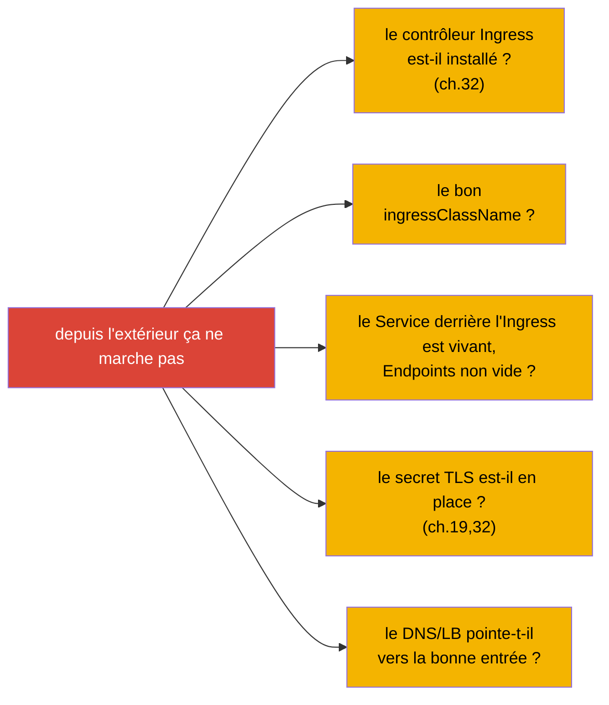
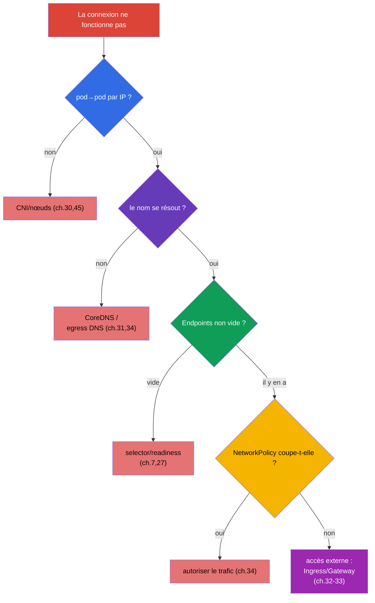

[Русская версия](ru.md) · [Eng version](README.md) · [Versión en español](es.md) · [Deutsche Version](de.md) · [ქართული ვერსია](ge.md) · [繁體中文版](tw.md) · [日本語版](jp.md)

# Chapitre 46. Déboguer les services et le réseau

> 🟦 **Chapitre pour le CKA** (domaine Troubleshooting - 30%). Les compétences réseau sont aussi utiles pour le CKAD.
>
> **Ce qui suit.** Nous terminons la partie 9 avec le sujet le plus perfide - le réseau. « La
> connexion ne fonctionne pas » peut casser à n'importe quelle couche : DNS, Service, Endpoints,
> NetworkPolicy, kube-proxy, CNS. Rassemblons les connaissances des chapitres 7, 30, 31, 34 en un
> **algorithme par couches** de débogage : de « le pod ne résout pas le nom » à « le service ne
> répond pas » et « la NetworkPolicy a tout bloqué ». Ce sont des tâches fréquentes et très bien
> notées au CKA.

## 46.1. Le modèle de débogage réseau par couches

Le réseau doit s'analyser **couche par couche, de bas en haut** - sinon on se noie dans les
hypothèses. Rappelons comment tout est empilé (chapitres 30-31) :



L'idée : vérifier une couche à la fois, en réduisant le problème. La connectivité IP fonctionne-t-elle ?
Le nom se résout-il ? Y a-t-il des Endpoints ? Une politique coupe-t-elle ? Est-on arrivé depuis
l'extérieur ? Chaque « non » désigne une couche.

## 46.2. Couche 1 : connectivité des pods (CNI)

On commence par le plus bas : les pods peuvent-ils communiquer par IP (chapitre 30) ?

```bash
# IP des pods
kubectl get pods -o wide
# depuis un pod, joindre l'IP d'un autre
kubectl exec <pod-a> -- ping -c1 <ip-pod-b>
kubectl exec <pod-a> -- curl -s <ip-pod-b>:<port>
```

Si un pod n'atteint pas un autre pod **par IP** - le problème est au niveau du CNI/des nœuds :



Si la connectivité IP existe mais que par le nom cela ne marche pas - on monte d'un cran, vers le DNS.

## 46.3. Couche 2 : DNS (CoreDNS)

On vérifie la résolution des noms (chapitre 31) :

```bash
kubectl exec <pod> -- nslookup backend
kubectl exec <pod> -- nslookup backend.prod.svc.cluster.local
kubectl exec <pod> -- cat /etc/resolv.conf      # quel nameserver, domaines search
kubectl get pods -n kube-system -l k8s-app=kube-dns   # CoreDNS est-il vivant
kubectl logs -n kube-system -l k8s-app=kube-dns
```



Le piège classique (chapitre 34) : un default-deny egress bloque le DNS (port 53), et tout « casse »
de façon inexplicable. Si un nom ne se résout pas - vérifiez à la fois CoreDNS et les politiques
egress.

## 46.4. Couche 3 : Service et Endpoints

Le nom se résout, mais le service ne répond pas - on regarde le lien Service ↔ Endpoints (chapitre 7).
C'est **la racine la plus fréquente** des problèmes de services.

```bash
kubectl get svc backend                 # le service existe-t-il, quel ClusterIP/port
kubectl get endpoints backend           # ← CLÉ : y a-t-il des adresses de pods
kubectl describe svc backend            # selector et endpoints
```



**Un Endpoints vide** - le symptôme principal : le service n'est lié à personne. Causes : le selector
du service ne correspond pas aux labels des pods, ou les pods ne sont pas prêts (readiness,
chapitre 27). Si Endpoints n'est pas vide mais qu'il n'y a pas de connexion - on vérifie les ports
(`port`/`targetPort`, chapitre 7), si l'application écoute bien le port voulu, et les politiques.

## 46.5. Couche 4 : NetworkPolicy

Tout ce qui précède est en ordre, mais le trafic ne passe pas - c'est peut-être une politique qui
coupe (chapitre 34) :

```bash
kubectl get networkpolicy -n <namespace>
kubectl describe networkpolicy <name> -n <namespace>
```



Rappelons la logique allow (chapitre 34) : dès qu'une politique s'applique à un pod - seul ce qui est
explicitement indiqué est autorisé. On vérifie si la source voulue est autorisée (ingress chez le
destinataire) et la destination (egress chez la source). Erreur fréquente - un default-deny sans
autoriser le trafic nécessaire (ni le DNS).

## 46.6. Couche 5 : accès externe (Ingress/Gateway)

Si le problème concerne l'accès **depuis l'extérieur** (chapitres 32-33) :



L'accès externe est la couche la plus haute ; avant d'accuser l'Ingress, assurez-vous que le Service
interne fonctionne (couches 1-4). Un `port-forward` sur le Service/le pod (chapitre 29) aide à
comprendre où ça rompt : si ça marche via port-forward mais pas via l'Ingress - le problème est dans
l'Ingress/l'entrée.

## 46.7. L'algorithme complet et les outils

Rassemblons un arbre unique - c'est la carte du troubleshooting réseau :



Outils de débogage réseau :

```bash
# pod de test avec des outils (pour les images minimales — kubectl debug, ch.29)
kubectl run test --image=nicolaka/netshoot -it --rm -- sh
# à l'intérieur : nslookup, curl, ping, dig, netstat, traceroute
kubectl exec <pod> -- nslookup <svc>
kubectl exec <pod> -- curl -sv <svc>:<port>
kubectl get endpoints <svc>
kubectl get networkpolicy -A
```

## 46.8. Comment cela s'applique en production

- **Endpoints - le premier check.** En prod, sur « le service ne répond pas », l'astreinte vérifie
  avant tout `kubectl get endpoints` : vide → selector/readiness. Cela économise énormément de temps
  en écartant le DNS et le réseau.
- **DNS - top des causes.** Un CoreDNS surchargé, un resolv.conf incorrect, une politique egress sans
  DNS - des incidents fréquents. NodeLocal DNSCache (chapitre 31) et des politiques egress soignées
  (chapitre 34) les évitent.
- **L'approche par couches - contre la panique.** Lors d'un incident réseau il est facile de « tirer
  au hasard ». La discipline « de bas en haut : IP → DNS → Endpoints → politique → entrée » transforme
  le chaos en analyse rapide.
- **netshoot et port-forward.** En prod on utilise pour déboguer un pod avec des outils réseau
  (netshoot) ou des conteneurs ephemeral (chapitre 29), et `port-forward` aide à séparer le problème
  de l'application du problème de l'entrée.
- **NetworkPolicy - souvent « son propre ennemi ».** Après la mise en place des politiques, ce qu'on a
  oublié d'autoriser casse (DNS, trafic entre services). En prod les politiques sont testées et
  déployées prudemment, en commençant par l'observation (audit) plutôt que directement par l'enforce.

## 46.9. Mini-glossaire

- **Débogage par couches** - analyse du réseau de bas en haut : CNI → DNS → Endpoints → politique →
  entrée.
- **connectivité des pods** - les pods peuvent-ils communiquer par IP (niveau CNI, chapitre 30).
- **Endpoints** - liste des adresses de pods derrière un service ; vide = non lié (chapitre 7).
- **nslookup/dig** - vérification de la résolution DNS depuis l'intérieur d'un pod.
- **netshoot** - image avec des outils réseau pour le débogage.
- **port-forward** - redirection de port pour tester en contournant l'entrée (chapitre 29).
- **default-deny + DNS** - le piège : une politique egress coupe la résolution (chapitre 34).

## 46.10. Bilan du chapitre

- Le réseau se débogue par couches de bas en haut : connectivité des pods (CNI) → DNS (CoreDNS) →
  Service/Endpoints → NetworkPolicy → Ingress/Gateway.
- Couche 1 : le pod ne ping pas un pod par IP → CNI/nœuds (chapitres 30, 45).
- Couche 2 : le nom ne se résout pas → CoreDNS, resolv.conf, politique egress coupant DNS:53.
- Couche 3 (la plus fréquente) : le service ne répond pas → `get endpoints` ; vide = selector/readiness.
- Couche 4 : le trafic est coupé par une NetworkPolicy → vérifier les règles allow (et le DNS).
- Couche 5 : depuis l'extérieur ça ne marche pas → contrôleur Ingress, ingressClassName, le Service
  derrière, TLS.
- Outils : nslookup/curl depuis l'intérieur, `get endpoints`, netshoot/ephemeral, port-forward pour
  localiser.

## 46.11. À quoi cela sert : à l'examen et dans le travail réel

**À l'examen (CKA).** « Pourquoi un pod n'atteint pas un service », « le service ne répond pas », « le
DNS ne résout pas » - des tâches de troubleshooting fréquentes et très bien notées (30%). L'algorithme
par couches et le réflexe `get endpoints` en résolvent la plupart. Il faut savoir vérifier chaque
couche avec assurance et connaître le piège de l'egress-DNS.

**Dans le travail réel.** Les incidents réseau sont parmi les plus fréquents et les plus embrouillés.
La discipline par couches et le fait de savoir que Endpoints et le DNS sont les principaux suspects
accélèrent radicalement l'analyse. Les outils (netshoot, port-forward, conteneurs ephemeral) et une
mise en place prudente des NetworkPolicy - c'est la pratique quotidienne d'une exploitation fiable.

## 46.12. Questions d'auto-évaluation

1. Pourquoi débogue-t-on le réseau par couches et dans quel ordre ?
2. Comment vérifier la connectivité des pods par IP et que signifie son absence ?
3. Que vérifier quand « le nom ne se résout pas » et quel piège est lié à la politique egress ?
4. Pourquoi `kubectl get endpoints` est-il le premier check sur « le service ne répond pas » ? Que
   signifie une liste vide ?
5. Comment comprendre que le trafic est coupé par une NetworkPolicy, et que vérifier alors ?
6. Comment déboguer un problème d'accès externe et en quoi port-forward aide-t-il ?
7. Quels outils utilise-t-on pour le débogage réseau à l'intérieur du cluster ?

## Pratique

La partie 9 (troubleshooting) est ainsi terminée, et avec elle tout le contenu général et
d'administration du cours. Reste la partie 10 : la préparation aux examens - tactique CKAD
(chapitre 47) et CKA (chapitre 48). Le troubleshooting réseau se travaille dans les TP réseau et les
examens blancs.

🧪 TP 118 (diagnostic DNS/réseau du cluster) : [tasks/cka/labs/118](../../labs/118/README_FR.MD)

🧪 TP 123 (installation du CNI de zéro + analyse des netns/routes) : [tasks/cka/labs/123](../../labs/123/README_FR.MD)

---
[Sommaire](../README_FR.md) · [Chapitre 45](../45/fr.md) · [Chapitre 47](../47/fr.md)
