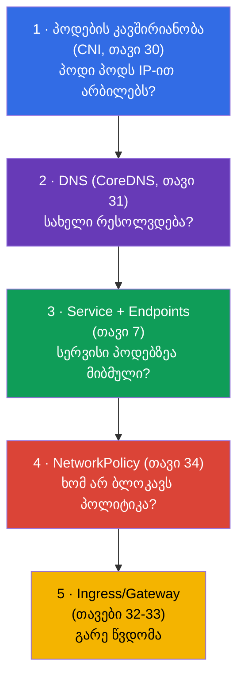
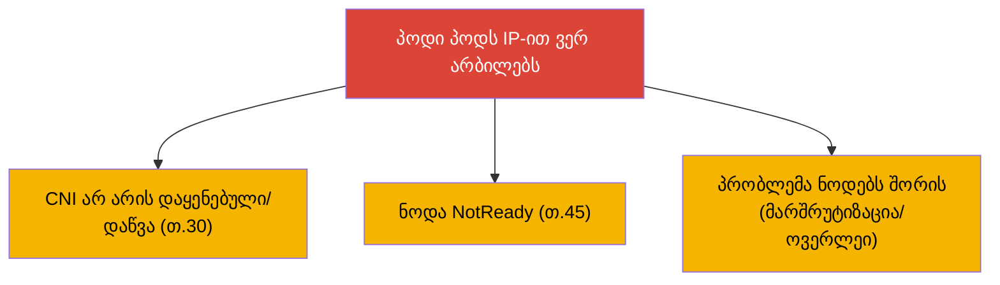
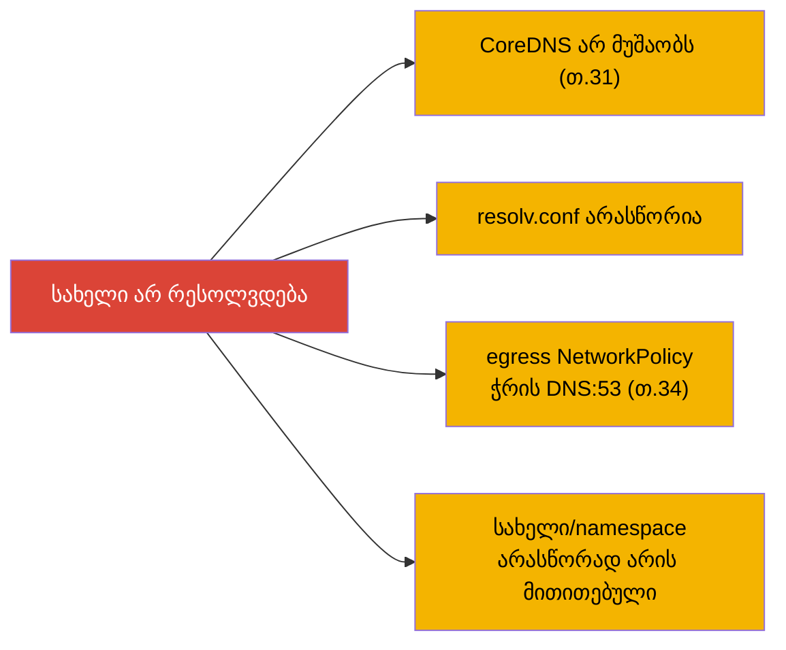
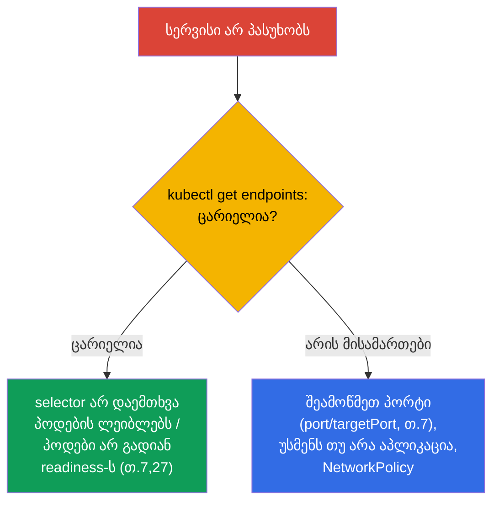
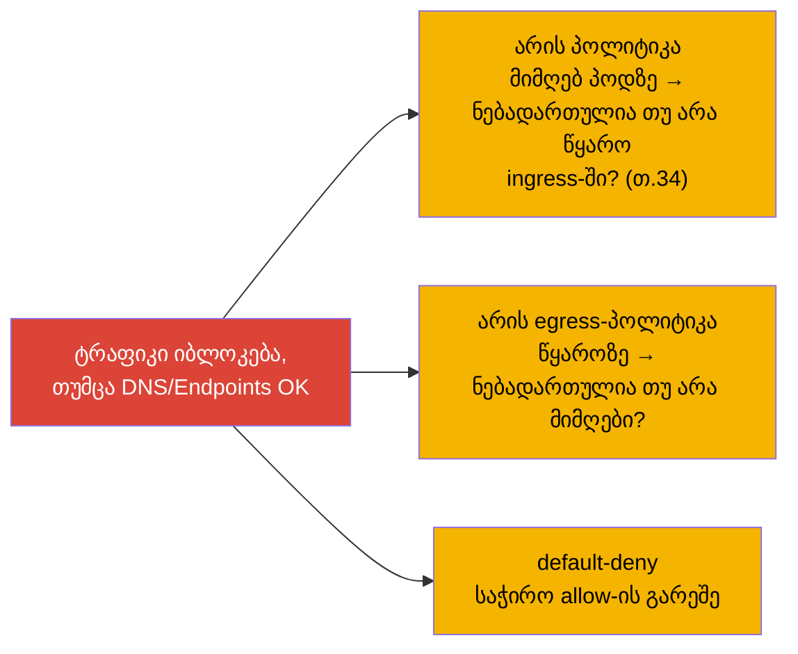
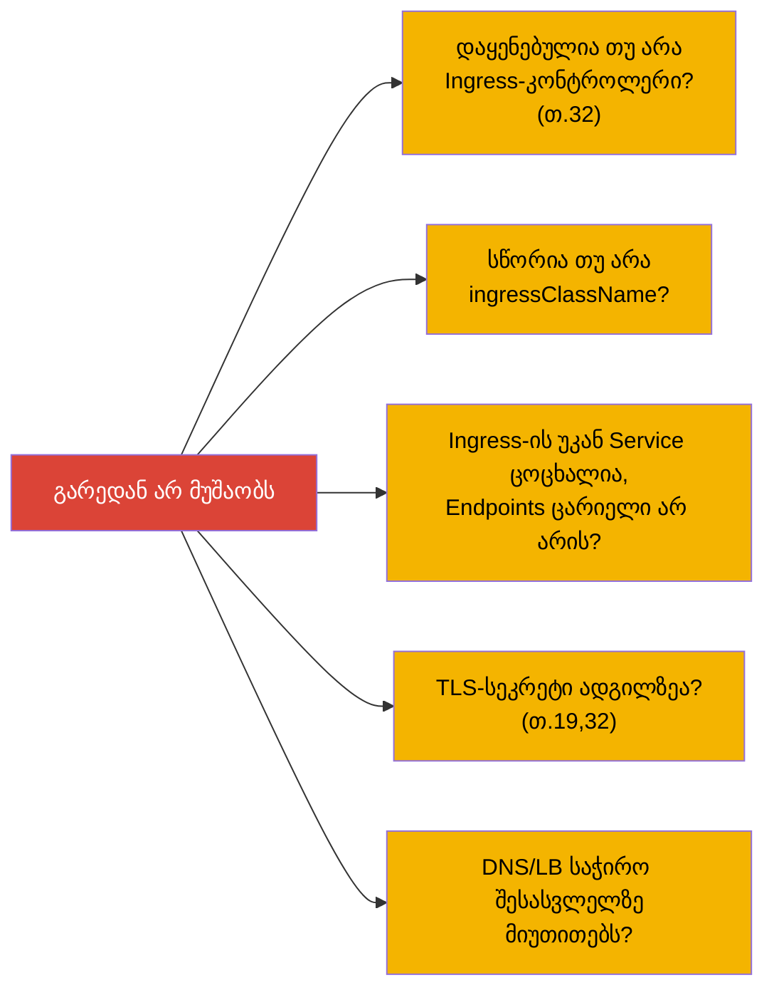
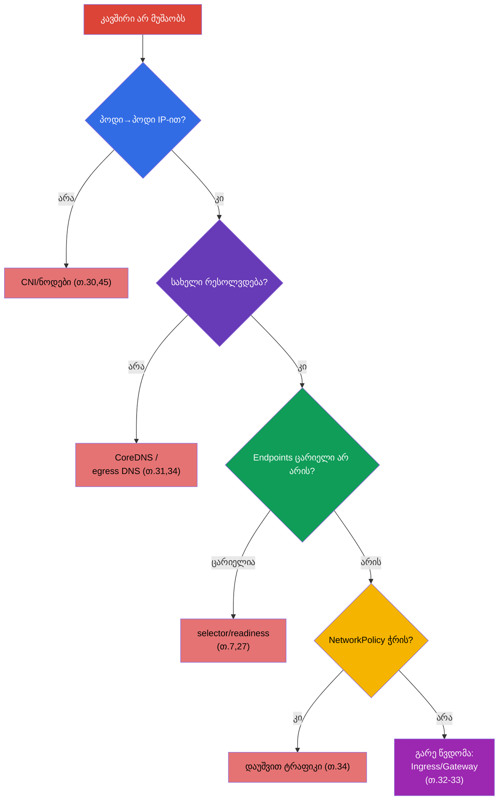

[Русская версия](ru.md) · [Eng version](README.md) · [Versión en español](es.md) · [Version française](fr.md) · [Deutsche Version](de.md) · [繁體中文版](tw.md) · [日本語版](jp.md)

# თავი 46. სერვისებისა და ქსელის გამართვა

> 🟦 **თავი CKA-სთვის** (დომენი Troubleshooting - 30%). ქსელური უნარები სასარგებლოა CKAD-ისთვისაც.
>
> **რა იქნება შემდეგ.** ნაწილ 9-ს ყველაზე მზაკვრული თემით - ქსელით - ვასრულებთ. „კავშირი არ
> მუშაობს“ შეიძლება ჩაიშალოს ნებისმიერ შრეზე: DNS, Service, Endpoints, NetworkPolicy, kube-proxy, CNS.
> თავები 7, 30, 31, 34-ის ცოდნას ერთიან **შრეობრივ ალგორითმად** ავაწყობთ: „პოდი სახელს ვერ
> არესოლვებს“-იდან „სერვისი არ პასუხობს“-მდე და „NetworkPolicy-მ ყველაფერი დაბლოკა“-მდე. ეს ხშირი და
> მაღალქულიანი CKA-ის დავალებებია.

## 46.1. ქსელის გამართვის შრეობრივი მოდელი

ქსელი უნდა განვიხილოთ **შრეების მიხედვით ქვემოდან ზემოთ** - სხვაგვარად ჰიპოთეზებში იხრჩობი. გავიხსენოთ, როგორ არის ყველაფერი
აწყობილი (თავები 30-31):



იდეა: შევამოწმოთ თითო შრე, პრობლემის არეს ავიწროებთ. მუშაობს თუ არა IP-კავშირიანობა? რესოლვდება თუ არა
სახელი? არის თუ არა Endpoints? ხომ არ ჭრის პოლიტიკა? მოვედით თუ არა გარედან? ყოველი „არა“ შრეზე
მიგვითითებს.

## 46.2. შრე 1: პოდების კავშირიანობა (CNI)

ვიწყებთ ყველაზე ქვემოდან: შეუძლიათ თუ არა პოდებს ზოგადად IP-ით ურთიერთობა (თავი 30)?

```bash
# პოდების IP
kubectl get pods -o wide
# ერთი პოდიდან მეორის IP-მდე მიწვდომა
kubectl exec <pod-a> -- ping -c1 <ip-pod-b>
kubectl exec <pod-a> -- curl -s <ip-pod-b>:<port>
```

თუ პოდი ვერ სწვდება სხვა პოდს **IP-ით** - პრობლემა CNI/ნოდების დონეზეა:



თუ IP-კავშირიანობა არის, მაგრამ სახელით არ მუშაობს - მივდივართ ზემოთ, DNS-თან.

## 46.3. შრე 2: DNS (CoreDNS)

ვამოწმებთ სახელების რესოლვინგს (თავი 31):

```bash
kubectl exec <pod> -- nslookup backend
kubectl exec <pod> -- nslookup backend.prod.svc.cluster.local
kubectl exec <pod> -- cat /etc/resolv.conf      # რომელი nameserver, search-დომენები
kubectl get pods -n kube-system -l k8s-app=kube-dns   # ცოცხალია თუ არა CoreDNS
kubectl logs -n kube-system -l k8s-app=kube-dns
```



კლასიკური ხაფანგი (თავი 34): default-deny egress ბლოკავს DNS-ს (პორტი 53), და ყველაფერი
„ინგრევა“ აუხსნელად. თუ სახელი არ რესოლვდება - შეამოწმეთ CoreDNS-იც და egress-პოლიტიკებიც.

## 46.4. შრე 3: Service და Endpoints

სახელი რესოლვდება, მაგრამ სერვისი არ პასუხობს - ვუყურებთ კავშირს Service ↔ Endpoints (თავი 7). ეს
სერვისებთან დაკავშირებული პრობლემების **ყველაზე ხშირი ფესვია**.

```bash
kubectl get svc backend                 # არის თუ არა სერვისი, რომელი ClusterIP/პორტი
kubectl get endpoints backend           # ← საკვანძო: არის თუ არა პოდების მისამართები
kubectl describe svc backend            # selector და endpoints
```



**ცარიელი Endpoints** - მთავარი სიმპტომია: სერვისი არავისზეა მიბმული. მიზეზები: სერვისის
სელექტორი არ ემთხვევა პოდების ლეიბლებს, ან პოდები არ არიან მზად (readiness, თავი 27). თუ
Endpoints ცარიელი არ არის, კავშირი კი მაინც არ არის - ვამოწმებთ პორტებს (`port`/`targetPort`, თავი 7), უსმენს თუ არა
აპლიკაცია საჭირო პორტს, და პოლიტიკებს.

## 46.5. შრე 4: NetworkPolicy

ყველაფერი ზემოთ რიგზეა, მაგრამ ტრაფიკი არ მიდის - შესაძლოა, პოლიტიკა ჭრის (თავი 34):

```bash
kubectl get networkpolicy -n <namespace>
kubectl describe networkpolicy <name> -n <namespace>
```



გვახსოვს allow-ლოგიკა (თავი 34): გამოჩნდა პოლიტიკა პოდზე - ნებადართულია მხოლოდ ცხადად
მითითებული. ვამოწმებთ, ნებადართულია თუ არა საჭირო წყარო (ingress მიმღებთან) და დანიშნულება
(egress წყაროსთან). ხშირი შეცდომაა default-deny საჭირო ტრაფიკის (და DNS-ის) ნებართვის გარეშე.

## 46.6. შრე 5: გარე წვდომა (Ingress/Gateway)

თუ პრობლემა **გარედან** წვდომაშია (თავები 32-33):



გარე წვდომა - ყველაზე ზედა შრეა; სანამ Ingress-ს დააბრალებთ, დარწმუნდით, რომ შიდა
Service მუშაობს (შრეები 1-4). `port-forward` Service/პოდზე (თავი 29) ეხმარება გავიგოთ, სად
წყდება: თუ port-forward-ით მუშაობს, Ingress-ით კი არა - პრობლემა Ingress-ში/შესასვლელშია.

## 46.7. სრული ალგორითმი და ინსტრუმენტები

ავაწყოთ ერთიანი ხე - ეს ქსელური troubleshooting-ის რუკაა:



ქსელური გამართვის ინსტრუმენტები:

```bash
# ტესტური პოდი ინსტრუმენტებით (მინიმალური იმიჯებისთვის — kubectl debug, თ.29)
kubectl run test --image=nicolaka/netshoot -it --rm -- sh
# შიგნით: nslookup, curl, ping, dig, netstat, traceroute
kubectl exec <pod> -- nslookup <svc>
kubectl exec <pod> -- curl -sv <svc>:<port>
kubectl get endpoints <svc>
kubectl get networkpolicy -A
```

## 46.8. როგორ იყენებენ ამას პროდაქშენში

- **Endpoints - პირველი ჩეკი.** პროდში „სერვისი არ პასუხობს“-ისას მორიგე უპირველესად ამოწმებს
  `kubectl get endpoints`: ცარიელია → სელექტორი/readiness. ეს დროის მასას ზოგავს, DNS-სა და
  ქსელს რომ ჩამოაჭრის.
- **DNS - მიზეზების ტოპში.** გადატვირთული CoreDNS, არასწორი resolv.conf, egress-პოლიტიკა DNS-ის
  გარეშე - ხშირი ინციდენტებია. NodeLocal DNSCache (თავი 31) და ფრთხილი egress-პოლიტიკები (თავი
  34) მათ პრევენციას ახდენს.
- **შრეობრივი მიდგომა - პანიკის საწინააღმდეგოდ.** ქსელური ინციდენტისას ადვილია „ბრმად სროლა“.
  დისციპლინა „ქვემოდან ზემოთ: IP → DNS → Endpoints → პოლიტიკა → შესასვლელი“ ქაოსს სწრაფ
  განხილვად აქცევს.
- **netshoot და port-forward.** პროდში გამართვისთვის იყენებენ pod-ს ქსელური ინსტრუმენტებით
  (netshoot) ან ephemeral-კონტეინერებს (თავი 29), ხოლო `port-forward` ეხმარება გამოვარჩიოთ
  აპლიკაციის პრობლემა შესასვლელის პრობლემისგან.
- **NetworkPolicy - ხშირი „თვითონ თავისი მტერი“.** პოლიტიკების დანერგვის შემდეგ ინგრევა ის, რაც
  დაუშვება დაავიწყდათ (DNS, სერვისებს შორის ტრაფიკი). პროდში პოლიტიკებს ტესტავენ და ფრთხილად
  ატარებენ, დაკვირვებით (audit) იწყებენ და არა მაშინვე enforce-ით.

## 46.9. მინი-ლექსიკონი

- **შრეობრივი გამართვა** - ქსელის განხილვა ქვემოდან ზემოთ: CNI → DNS → Endpoints → პოლიტიკა →
  შესასვლელი.
- **პოდების კავშირიანობა** - შეუძლიათ თუ არა პოდებს IP-ით ურთიერთობა (CNI-ის დონე, თავი 30).
- **Endpoints** - სერვისის უკან მდგომი პოდების მისამართების სია; ცარიელი = არ არის მიბმული (თავი 7).
- **nslookup/dig** - DNS-რესოლვინგის შემოწმება პოდის შიგნიდან.
- **netshoot** - იმიჯი ქსელური ინსტრუმენტებით გამართვისთვის.
- **port-forward** - პორტის გადაცემა შესასვლელის გვერდის ავლით შემოწმებისთვის (თავი 29).
- **default-deny + DNS** - ხაფანგი: egress-პოლიტიკა ჭრის რესოლვინგს (თავი 34).

## 46.10. თავის შეჯამება

- ქსელს შრეობრივად ასწორებენ ქვემოდან ზემოთ: პოდების კავშირიანობა (CNI) → DNS (CoreDNS) → Service/
  Endpoints → NetworkPolicy → Ingress/Gateway.
- შრე 1: პოდი პოდს IP-ით ვერ არბილებს → CNI/ნოდები (თავები 30, 45).
- შრე 2: სახელი არ რესოლვდება → CoreDNS, resolv.conf, egress-პოლიტიკა ჭრის DNS:53.
- შრე 3 (ყველაზე ხშირი): სერვისი არ პასუხობს → `get endpoints`; ცარიელი = სელექტორი/readiness.
- შრე 4: ტრაფიკს ჭრის NetworkPolicy → შეამოწმეთ allow-წესები (და DNS).
- შრე 5: გარედან არ მუშაობს → Ingress-კონტროლერი, ingressClassName, მის უკან Service, TLS.
- ინსტრუმენტები: nslookup/curl შიგნიდან, `get endpoints`, netshoot/ephemeral, port-forward
  ლოკალიზაციისთვის.

## 46.11. როგორ გამოგადგებათ: გამოცდაზე და რეალურ სამუშაოში

**გამოცდაზე (CKA).** „რატომ ვერ სწვდება პოდი სერვისს“, „სერვისი არ პასუხობს“, „DNS
არ არესოლვებს“ - ხშირი მაღალქულიანი troubleshooting-ის დავალებებია (30%). შრეობრივი ალგორითმი და
`get endpoints`-ის რეფლექსი უმეტესობას წყვეტს. საჭიროა თავდაჯერებულად შევამოწმოთ ყოველი შრე და ვიცოდეთ
egress-DNS-ის ხაფანგი.

**რეალურ სამუშაოში.** ქსელური ინციდენტები - ერთ-ერთი ყველაზე ხშირი და დამაბნეველია. შრეობრივი
დისციპლინა და ცოდნა, რომ Endpoints და DNS - მთავარი ეჭვმიტანილებია, განხილვას მკვეთრად აჩქარებს.
ინსტრუმენტები (netshoot, port-forward, ephemeral-კონტეინერები) და NetworkPolicy-ის ფრთხილი დანერგვა -
სანდო ექსპლუატაციის ყოველდღიური პრაქტიკაა.

## 46.12. თვითშემოწმების კითხვები

1. რატომ ასწორებენ ქსელს შრეობრივად და რა თანმიმდევრობით?
2. როგორ შევამოწმოთ პოდების კავშირიანობა IP-ით და რაზე მიუთითებს მისი არარსებობა?
3. რა შევამოწმოთ „სახელი არ რესოლვდება“-ს დროს და რომელი ხაფანგია egress-პოლიტიკასთან დაკავშირებული?
4. რატომ არის `kubectl get endpoints` პირველი ჩეკი „სერვისი არ პასუხობს“-ისას? რას ნიშნავს ცარიელი
   სია?
5. როგორ გავიგოთ, რომ ტრაფიკს ჭრის NetworkPolicy, და რა შევამოწმოთ ამ დროს?
6. როგორ გავმართოთ გარე წვდომის პრობლემა და რით გვეხმარება port-forward?
7. რომელ ინსტრუმენტებს იყენებენ ქსელური გამართვისთვის კლასტერის შიგნით?

## პრაქტიკა

ამით ნაწილი 9 (troubleshooting) დასრულებულია, და მასთან ერთად - კურსის მთელი ზოგადი და
ადმინისტრატორული შინაარსი. დარჩა ნაწილი 10: გამოცდებისთვის მომზადება - CKAD-ის ტაქტიკა (თავი 47) და
CKA (თავი 48). ქსელური troubleshooting მუშავდება ქსელის ლაბორატორიულებსა და მოკ-გამოცდებში.

🧪 ლაბი 118 (კლასტერის DNS/ქსელის დიაგნოსტიკა): [tasks/cka/labs/118](../../labs/118/README_GE.MD)

🧪 ლაბი 123 (CNI-ის დაყენება ნულიდან + netns/მარშრუტების განხილვა): [tasks/cka/labs/123](../../labs/123/README_GE.MD)

🎮 Killercoda (ბრაუზერში, ინსტალაციის გარეშე): [Troubleshoot a Broken Network Path](https://killercoda.com/chadmcrowell/course/cka/broken-path) · [Debug services in Kubernetes](https://killercoda.com/chadmcrowell/course/ckad/debug-services) · [Test Service Connectivity](https://killercoda.com/chadmcrowell/course/ckad/test-service-connectivity)

---
[სარჩევი](../README_GE.md) · [თავი 45](../45/ge.md) · [თავი 47](../47/ge.md)
